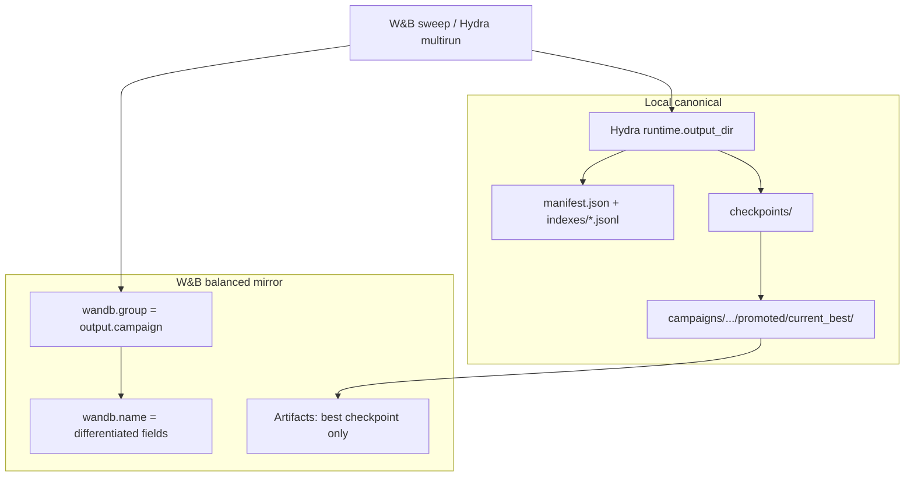

> **Cursor plan (editor):** [`~/.cursor/plans/output_storage_roadmap_e0a9000d.plan.md`](file:///home/jmduea/.cursor/plans/output_storage_roadmap_e0a9000d.plan.md)  
> **Repo mirror (this file):** [`.omg/plans/output-storage-roadmap.md`](output-storage-roadmap.md) · ROADMAP **Later**

# Output storage unification — roadmap scope

## Context: you are not starting from zero

A prior **output standardization** pass is marked complete in [`.omg/workflow-manifest.json`](../workflow-manifest.json) (2026-05-21). Core plumbing already exists:

| Layer | Status | Key files |
|-------|--------|-----------|
| Hydra run envelope | Done | [`conf/config.yaml`](../../conf/config.yaml) — `outputs/campaigns/<campaign>/runs/<run_id>/` |
| Path contract | Done | [`src/artifacts/run_paths.py`](../../src/artifacts/run_paths.py) — `RunContext`, manifests, indexes |
| Display run naming | Done | `compose_run_name()` — architecture, format mix, opponent, updates, envs, seed, job num |
| W&B local dirs | Done | Run-local `cache/wandb/`; shared `outputs/cache/wandb-{artifacts,data}/` via env in [`src/telemetry/logger.py`](../../src/telemetry/logger.py) |
| W&B artifacts | Minimal | `telemetry.wandb.log_artifacts: false`; `log_checkpoint()` exists but unused in normal training |
| Campaign “best” promotion | **Not built** | Only in [`.omg/plans/output-standardization-ralplan.md`](output-standardization-ralplan.md) target tree |
| Sweep YAML output path | **Confusing** | [`scripts/make_wandb_sweep.py`](../../scripts/make_wandb_sweep.py) writes to `artifacts/sweeps/` (config metadata, not checkpoints) |

So the roadmap item is best framed as **Output hygiene v2** — finish the mental model and “continue from best” workflow, not redo campaign folders.

---

## External best practices (condensed)

Sources: [Hydra workdir](https://hydra.cc/docs/configure_hydra/workdir/), [W&B artifacts](https://docs.wandb.ai/models/artifacts), [W&B run grouping](https://docs.wandb.ai/models/runs/grouping), [W&B run identifiers](https://docs.wandb.ai/models/runs/run-identifiers), [track external files / references](https://docs.wandb.ai/models/artifacts/track-external-files), community Hydra+W&B patterns (single physical root; `wandb.init(dir=hydra_output_dir)`).

| Practice | Rationale |
|----------|-----------|
| **One physical root per execution** | Hydra owns the immutable envelope; W&B nests under it (`WANDB_DIR`), not a second top-level `wandb/`. |
| **Campaign = experiment frame** | Groups related runs (sweep, ablation, baseline batch) — matches your existing `output.campaign` concept. |
| **Run ID ≠ display name** | Stable `run_id` / W&B run id for resume; human names encode *what differs* (params, format, opponent). |
| **Sweep subdirs from overrides** | `hydra.job.override_dirname` (exclude seed) makes multirun folders grep-friendly; W&B names can be set *after* `wandb.init()` from `wandb.config`. |
| **Manifest + index for local discovery** | JSON manifest per run; append-only JSONL indexes — survives without cloud. |
| **Artifacts for durable assets** | Versioned checkpoints with typed artifacts (`checkpoint`, `model`) and aliases (`latest`, `best`); optional **reference** artifacts to avoid duplicating large local files. |
| **Promotion is explicit** | “Current best” is a first-class folder + manifest, not “whatever checkpoint retention kept.” |
| **Retention tiers** | Compact per-run essentials; prune replays/Docker scratch; promote winners. |

---

## What still confuses today (gap analysis)

| Location | What lives there | Problem |
|----------|------------------|---------|
| `outputs/campaigns/...` | Training runs, checkpoints, logs, eval jobs | **Canonical** — good |
| `outputs/kaggle_runner/` | Kernel packages, ledgers, synced checkpoints | Parallel tree; not tied to `output.campaign` |
| `artifacts/sweeps/*.yaml` | Generated W&B sweep definitions | Name collision with “training artifacts”; docs still say `wandb sweep artifacts/sweeps/...` ([`conf/README.md`](../../conf/README.md)) |
| `artifacts/kaggle_submission/` | Docker validation default ([`scripts/validate_kaggle_docker_submission.py`](../../scripts/validate_kaggle_docker_submission.py)) | Legacy second root |
| Top-level `wandb/` | Old or misconfigured runs | Should be empty for new Hydra training |
| W&B UI | `group` often `null`; `log_artifacts: false` | Cloud shortlist code exists ([`src/orchestration/wandb_sweeps.py`](../../src/orchestration/wandb_sweeps.py)) but training does not upload checkpoints |

Your three ideas mapped to gaps:

1. **More W&B artifacts** — Infrastructure exists (`TelemetryLogger.log_checkpoint`); policy and promotion hook missing. Your choice: **upload best/promoted only** (balanced with local-first checkpoints).

2. **Run naming from differentiators** — `compose_run_name()` covers static config; **sweep-varying** params are not in the name unless you add post-init rename or fold `override_dirname` into naming. Multirun subdir uses `hydra.job.num` + `run_id`, not override slug.

3. **Continue from best in campaign** — Partial: W&B `shortlist_from_api` + checkpoint artifact parsing; local `promoted/current_best/` and a documented `ow train` resume recipe are **not implemented**.

Related Later item already queued: [brain_dump — W&B tags from Hydra config groups](../../docs/brain_dump.md#ideas) — complements naming/filtering, not a substitute for promotion paths.

---

## Recommended scope for ROADMAP **Later**

**Title (one line):** Unify experiment outputs: campaign identity, promotion, and selective W&B artifacts

**Problem statement:** Multiple roots (`outputs/`, `artifacts/`, `wandb/`, kaggle_runner) and incomplete promotion make it hard to answer: *where is the best run from campaign X, and how do I launch the next experiment from it?*

**In scope (phased)**

### Phase 1 — Contract and documentation (low risk)

- Add [`docs/architecture/output-layout.md`](../../docs/architecture/output-layout.md) (or extend onboarding): decision table “I need X → look here”.
- Rename or relocate generated sweep YAML: e.g. `outputs/_meta/sweeps/` or keep under `conf/` only — **stop using top-level `artifacts/` for non-checkpoint files**.
- Default `telemetry.wandb.group` from `output.campaign` when group is null (validation already requires campaign slug).
- Align multirun `hydra.sweep.subdir` with `${hydra.job.override_dirname}` (seed excluded per Hydra docs) for sweep browsing.

**Verify:** `make test-fast`; `uv run ow train print_resolved_config=true`; doc review.

### Phase 2 — Local promotion and “continue from best” (core value)

- Implement `campaigns/<campaign>/promoted/current_best/` + `manifest.json` (checkpoint path, metric, source `run_id`, Hydra overrides path, git, feature metadata).
- Update checkpoint retention / end-of-run hook to consider promotion (metric: existing `artifacts.checkpoint_retention.best_metric_name`).
- Append `indexes/promoted.jsonl`.
- CLI recipe (minimal): document or add `ow train resume_checkpoint=<promoted ckpt>` + `output.campaign=<same>` + copy overrides from manifest; optional helper `scripts/promote_run.py` or `ow train from_promoted=campaign_slug`.

**Verify:** unit tests on promotion manifest; smoke train 1 update → promoted path updated when metric improves.

### Phase 3 — Balanced W&B mirror (your artifact policy)

- On promotion only: `log_artifact` for best checkpoint with aliases `best`, `promoted`, plus manifest metadata (campaign, run_id, metric).
- Set `wandb.group = output.campaign` and `wandb.name = compose_run_name(cfg)` (already after resolve); for sweeps, post-init rename from swept keys in `wandb.config`.
- Optional: W&B **reference** artifact if full upload is too heavy on Kaggle paths (metadata + local path in manifest).

**Verify:** `tests/test_telemetry.py` + dry-run with `log_artifacts=true` on promotion path only.

### Phase 4 — Satellite paths (optional, separate PRs)

- Fold `outputs/kaggle_runner/` under `outputs/campaigns/<campaign>/kaggle/` or link via manifest `related_paths`.
- Move docker validation default out of `artifacts/kaggle_submission/` into run `evaluations/<job_id>/`.
- Hydra config-group → W&B tags (brain_dump idea).

**Non-goals**

- Full migration of legacy `outputs/`, `wandb/`, `artifacts/` trees.
- W&B Model Registry / automations until local promotion is trustworthy.
- Replacing Hydra as source of truth for resolved config.

---

## Pros / cons / trade-offs

| Approach | Pros | Cons |
|----------|------|------|
| **Local-first only** (no W&B artifacts) | Cheapest, WSL2-friendly | Kaggle population shortlist relies on API artifacts today; cloud-only teammates struggle |
| **Upload all checkpoints** | Complete cloud history | Disk + upload cost; duplicates local retention |
| **Best-only upload** (chosen) | Matches promotion; enables [`shortlist_from_api`](../../src/orchestration/wandb_sweeps.py) | Loses intermediate checkpoint cloud history |
| **Reference artifacts** | Cloud lineage without copy | Bucket/path discipline; W&B download semantics more complex |
| **`override_dirname` subdirs** | Instant sweep folder readability | Long paths; must exclude seed/job noise |
| **Keep `artifacts/sweeps/`** | No doc churn | Perpetuates “artifacts means two things” confusion |
| **Relocate sweep YAML under `outputs/_meta/`** | Single `outputs/` story | One-time path update in Makefile/docs |

---

## Acceptance criteria (for closing the roadmap item)

1. Documented map: training checkpoint, metrics, sweep definition, kaggle runner, docker validation — each has one canonical path pattern.
2. New runs: `wandb.group` defaults to campaign; no new top-level `wandb/` from training.
3. `promoted/current_best/` exists with manifest; documented command to resume/branch from it.
4. Promoted checkpoint uploaded to W&B when telemetry enabled (best-only).
5. Sweep multirun dirs or W&B names reflect swept parameters, not only timestamp/seed.
6. `make test-fast` green; no requirement for full JAX slow suite.

---

## Link to existing artifacts

- Spec: [`.omg/specs/deep-interview-output-standardization.md`](../specs/deep-interview-output-standardization.md)
- Plan (v1): [`.omg/plans/output-standardization-ralplan.md`](output-standardization-ralplan.md)
- For execution: re-open manifest entry or add `output-hygiene-v2` spec when moving from **Later** to **Next** (manifest currently marks v1 **complete**).

---

## Implementation touchpoints (when executed)

| Change | Files |
|--------|-------|
| Default W&B group | [`src/telemetry/logger.py`](../../src/telemetry/logger.py), [`conf/telemetry/base.yaml`](../../conf/telemetry/base.yaml) |
| Sweep subdir / naming | [`conf/config.yaml`](../../conf/config.yaml), [`src/artifacts/run_paths.py`](../../src/artifacts/run_paths.py) |
| Promotion | New helper in `src/artifacts/` + hook in [`src/jax/train.py`](../../src/jax/train.py) end-of-run / retention |
| Sweep YAML path | [`scripts/make_wandb_sweep.py`](../../scripts/make_wandb_sweep.py), [`conf/README.md`](../../conf/README.md) |
| Architecture doc | [`docs/architecture/`](../../docs/architecture/) per project rules |

**Test tier:** `make test-fast` + `make test-domain-artifacts` + `make test-domain-config`; telemetry tests for promotion upload path.

---

## Interview decisions (2026-05-30, issues #114–#117)

Round 1 deep-interview answers recorded on GitHub issue comments. Summary:

| Issue | Key decisions |
|-------|---------------|
| **#114** | First-class `ow train from_promoted=<campaign>`; campaign promotion metric **independent** of retention default; compare-and-swap on metric; standard manifest (pointer not copy); promote only when run's own best improves |
| **#115** | Move `log_checkpoint` to promotion hook only (`log_artifacts=true`); full file upload; prefer best/promoted alias; new `log_promoted_checkpoint`; group from sweep YAML → `output.campaign` → filename stem |
| **#116** | Suffix from Hydra override diff ∩ swept params; **no duplicate static fields**; compact encoding; auto when sweep/multirun + opt-out `rename_from_swept_params`; post-init via `build_sweep_run_suffix` |
| **#117** | `group:value` tags; `tags_from_config_groups` default true; allowlist default model/format/opponents/curriculum/reward; merged sorted dedupe; group tags only (scalars in #116 naming) |

**#114 promotion metric config (proposed):** new `artifacts.promotion` group — `metric_name`, `metric_mode`, `enabled`; sweep recipes inject via `wandb_sweep/fixed/` or generator from `metric:` block; `campaign_manifest.json` stores frozen metric + `current_best_value` for CAS. Retention (`checkpoint_retention.best_metric_*`) stays per-run only.
