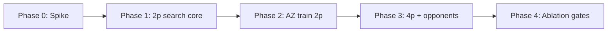

# Ralplan iter-2 (consensus): M3 — AlphaZero-Style MCTS Planning

**Source spec:** `.omg/specs/deep-interview-alphazero-mcts-planning.md`  
**Slug:** `alphazero-mcts-planning`  
**Workflow:** deep-interview → ralplan  
**Status:** planned — awaiting execution approval  
**Related active work:**
- **M1** `factored-pointer-decoder` — executing (M3 consumer; `factorized_topk` required)
- **M2** `planet-self-attention-encoder` — complete (`planet_graph_transformer` default encoder)

Planner iter-1 + architect **APPROVE-WITH-CHANGES** + critic **REVISE → approved-with-changes** after iter-2 incorporation.

---

## Context

| Surface | Current state |
|---------|---------------|
| Training | `src/jax/train.py` → `collect_rollout_jax` → `ppo_update_jax` |
| Env | JIT `step` / `step_multi_player` in `src/jax/env.py`; simultaneous moves per turn |
| Policy | `planet_graph_transformer` + `joint_flat` (default) or `factorized_topk` (M1) |
| Factorized decode | `FactorizedTopKPointerDecoder`, shielded sampling in `builders.py` |
| M1 rationale | Flat pointer deferred MCTS to M3; factorized heads map to visit counts |

### User intent (M3)

1. Neural prior + value MCTS over exact env sim
2. Policy-iteration training vs visit counts (not PPO clip on MCTS rows)
3. Consumer of M1 factorized pointer — **not** joint flat

---

## RALPLAN-DR Summary

### Mode

**DELIBERATE.** New cross-cutting search subsystem. Primary risks: throughput collapse, draft-state/value semantics, 4p opponent cost, training instability.

### Principles

1. **Exact env, no imagination** — tree edges call `step` / `step_multi_player`; no latent model.
2. **Factorized prior fidelity** — PUCT priors decompose as M1: stop × (src × tgt_slot × bucket) with shield masks before normalization.
3. **Turn vs launch-step separation** — search runs intra-turn on `TurnDraftState`; env advances once per committed macro turn.
4. **Python tree + jitted kernels** — dynamic MCTS control flow outside JIT; batch policy/value + shield + env step inside JIT.
5. **Algorithm dispatch** — `training.algorithm=ppo|alphazero`; separate collectors/updates; default remains PPO until Phase 4 gates.

### Decision Drivers

1. M1 factorized heads align 1:1 with visit-count targets at launch-step granularity.
2. Sim cost dominates — encode + shield × sims × launch steps must stay within GPU budget.
3. Simultaneous 4p moves require opponent sampling at env boundary, not full opponent search trees.

---

## ADR (Decision Record)

| Field | Content |
|-------|---------|
| **Decision** | Per-launch-step MCTS under turn-boundary macro actions; Python tree; `training.algorithm` dispatch; 2p-first |
| **Drivers** | Factorized decoder shape; M1 shield/remaining_ships loop; JAX env already exact |
| **Alternatives rejected** | Per-turn compound nodes (visit/head misalignment); monolithic JIT MCTS; MCTS inside PPO collect; joint_flat expansion; Maxⁿ 4p backup in v1 |
| **Why chosen** | Matches existing factored rollout semantics; testable phases; preserves PPO baseline |
| **Consequences** | New `src/jax/mcts/` package; `AlphaZeroConfig`; checkpoint `training.algorithm` metadata; Phase 0 spike gate before training integration |

---

## Locked Options (iter-2)

| Question | Locked choice |
|----------|---------------|
| Q1 Node granularity | **Per-launch-step** + turn-boundary commit via `build_action_from_factored_batch` |
| Q2 Draft semantics | **Frozen `TurnBatch` at turn root**; `remaining_ships` for legality; encoder ship features stale mid-turn (ADR-006, M1 parity) |
| Q3 4p backup | **Learner-root**; opponents sampled at env step only — Phase 3+ |
| Q4 Training integration | **`training.algorithm=ppo\|alphazero`**; separate `alphazero_collect` + `alphazero_update` |
| Q5 Sim budget | **800 sims/move** default; Phase 0 spike may revise with user lock |
| Q6 Opponent in tree | **Sample full opponent turn** at env boundary (2p Phase 2); no opponent launch-step tree |
| Q7 Value target | **Network leaf + terminal outcome** |
| Q8 M1 precondition | **Phase 2 E2E + smoke + Phase 3 checkpoint** — not Phase 4 cutover |
| Q9 M3 baseline pin | `planet_graph_transformer_factorized` + `pointer_decoder=factorized_topk` |
| Q10 Phase 0 start | **Parallel spike allowed**; Phase 1+ blocked until M1 Phase 2 smoke green |

---

## Import Layering

```
config → game → features → jax/mcts → jax/train
                ↑              ↑
         trajectory_shield   env, policy, action_codec, features
```

- **`src/jax/mcts/` imports:** `env`, `features`, `policy`, `action_codec`, `trajectory_shield`, `opponents/jax_actions/builders` (action build only)
- **Forbidden:** `mcts → train`, `mcts → ppo_update`, `mcts → collect`
- **Contracts:** `src/jax/mcts/contracts.py` — `TurnDraftState`, `MctsNode`, `SearchResult`, `PolicyTarget`

---

## TurnDraftState Contract

```python
@dataclass(slots=True)
class TurnDraftState:
    game: JaxGameState           # frozen until turn commit
    batch: TurnBatch               # encoded once at turn start — do NOT re-encode mid-turn
    remaining_ships: jax.Array     # (max_planets,) learner-owned ships left this turn
    step_idx: int                  # 0 .. max_moves_k-1
    source_sequence: jax.Array     # partial teacher-forcing prefix
    target_slot_sequence: jax.Array
    bucket_sequence: jax.Array
    stop_sequence: jax.Array
    step_active_mask: jax.Array
```

**Invariants:**
- Shield + bucket legality use `remaining_ships`; matches `_sample_shielded_factored_sequence_with_params`.
- Policy/value encoder reads turn-start `TurnBatch` (documented limitation; no mid-turn feature patch in v1).
- Turn commit: `build_action_from_factored_batch` → opponent sample → `step` / `step_multi_player`.

---

## Phased Implementation Plan



### Phase 0 — Spike (~3–4 days)

| Task | Path | Exit |
|------|------|------|
| ADR-006 | `docs/architecture/jax-mcts-alphazero.md` | Draft semantics + backup rules documented |
| Sim bench | `scripts/spike_mcts_2p.py` | `artifacts/m3/spike_phase0.json` |
| Expand microbench | `scripts/spike_mcts_factorized_expand.py` | Prior+shield expand timing |
| Config sketch | `src/config/schema.py` (`AlphaZeroConfig`, `MctsConfig`), `conf/training/alphazero.yaml` | `num_simulations`, `cpuct`, Dirichlet, temperature |

**Gate P0:** `mcts_simulations_per_sec` ≥ **0.5×** PPO collect step **or** user-approved budget revision.

**Scope:** 2p only, `factorized_topk`, frozen/random opponent. No training loop.

---

### Phase 1 — 2p search core (~5–7 days)

| Task | Path |
|------|------|
| Tree + PUCT | `src/jax/mcts/tree.py`, `puct.py` |
| Turn draft | `src/jax/mcts/draft.py`, `contracts.py` |
| Expand + shield | `src/jax/mcts/expand.py` |
| Simulate + backup | `src/jax/mcts/simulate.py`, `backup.py` |
| Turn commit | `src/jax/mcts/turn_builder.py` |
| Public API | `src/jax/mcts/search.py` → `mcts_search_factorized(...)` |
| Fast tests | `tests/test_mcts_factorized_2p.py` (CPU, `not slow`) |

**Gates P1–P3:** parity vs greedy sampler; 0 illegal commits; tree invariants.

**Exit:** `make test-fast` green on default PPO config.

---

### Phase 2 — AlphaZero training 2p (~4–5 days)

| Task | Path |
|------|------|
| Self-play collect | `src/jax/mcts/selfplay.py` or `src/jax/rollout/collect_alphazero.py` |
| Example batch | `src/jax/mcts/types.py` — visit targets per head |
| PI + value loss | `src/jax/mcts/update.py` |
| Train dispatch | `src/jax/train.py` — `training.algorithm` branch |
| Metrics | `src/jax/rollout/metrics.py` — `mcts_sim_count`, `pi_kl_prior`, value error |
| Checkpoint | `training.algorithm` + MCTS hyperparams in metadata |

**Hard deferrals:** no curriculum, no snapshot pool, no mixed 2p/4p, no submission MCTS.

**Gate H1:** AZ collect throughput ≥ **0.70×** PPO same preset.

**Exit:** 5-update 2p smoke (slow tier, user approval) stable; no NaN.

---

### Phase 3 — 4p + opponent priors (~4–5 days)

| Task | Path |
|------|------|
| 4p simulate | `step_multi_player` in `simulate.py` |
| Opponent prior | Reuse `_four_player_step_action` at env boundary |
| Format routing | Reuse `JaxRolloutGroup` split |
| Optional inference flag | `submission_runtime.py` (MCTS-off default) |

**Exit:** `mix_2p_4p` 50-update smoke without NaN; S1 shield diagnostic within ±5pp of PPO factorized.

---

### Phase 4 — Ablation gates

**Precondition:** M1 factorized path stable; M3 Phase 3 complete.

| Arm | Config |
|-----|--------|
| A (baseline) | `training.algorithm=ppo`, `factorized_topk` |
| B (treatment) | `training.algorithm=alphazero`, matched wall-clock budget |

**Artifacts:** `artifacts/m3/baseline_pin.json`, `scripts/run_m3_ablation.py`, `scripts/evaluate_m3_gates.py`, `docs/m3-alphazero-results.md`.

**Gate W1:** Episode reward ≥ PPO − **5%** at 500 updates, 3 seeds, matched env-steps.

---

## In-Scope / Out-of-Scope

| In scope | Out of scope |
|----------|--------------|
| `src/jax/mcts/*`, ADR-006 | MuZero / learned dynamics |
| Factorized prior + shield at expand | Dense P×P, joint_flat MCTS |
| Exact JAX env sim | Feature schema changes |
| 2p Phase 0–2; 4p Phase 3 | Curriculum/snapshot in Phase 0–2 |
| `training.algorithm` dispatch | MCTS inside `collect_rollout_jax` |
| Ablation runbook + gate scripts | Default cutover without Phase 4 |
| Fast-tier CPU MCTS tests | Full `make test` during iteration |

---

## Test Strategy

| Tier | Content |
|------|---------|
| `make test-fast` | Tree logic, UCB, backup, TurnDraftState, parity vs greedy sampler |
| `make test-domain-policy` | PI loss, rollout branch wiring |
| Slow / user-approved | JIT smoke, 5-update AZ training smoke |
| Pre-merge | `make test` with user approval |

Register new test files in `tests/conftest.py` domain map.

---

## Success Gates (full table)

| ID | Gate | Threshold | Phase |
|----|------|-----------|-------|
| P0 | Spike throughput | ≥ **0.5×** PPO collect step sim rate | 0 |
| P1 | Expansion parity | 100% match greedy sampler, ≥50 seeds | 1 |
| P2 | Legality | 0 illegal commits / 1000 steps | 1–2 |
| P3 | Tree integrity | Unit invariants | 1 |
| H1 | AZ throughput | ≥ **0.70×** PPO collect | 2 |
| W1 | Learning | Reward ≥ PPO − **5%**, 500 updates, 3 seeds | 4 |
| V1 | Stability | No NaN/inf | 2+ |
| C1 | Checkpoint | Algorithm metadata round-trip | 2 |

---

## Critic Checklist (iter-2)

- [x] M1 precondition corrected (Phase 2/3, not Phase 4 cutover)
- [x] M3 gate table with numeric thresholds
- [x] TurnDraftState + stale encoder ADR documented
- [x] AlphaZero config separate from PPO fields
- [x] Hard deferrals for 4p/curriculum/submission in Phase 0–2
- [x] Import layering explicit
- [ ] User locks Q1–Q4 at approval hook
- [ ] Phase 0 spike evidence before Phase 1
- [ ] M1 Phase 2 smoke green before Phase 2 training integration

---

## Execution Recommendation

**Start with Phase 0 spike** (can run in parallel with M1 Phase 4 ablation). **Phase 2+ blocked** until M1 Phase 2 factored smoke passes.

**Rejected:** Monolithic JIT MCTS; MCTS in PPO collect; joint_flat expansion; Maxⁿ 4p backup v1; mid-turn `encode_turn` re-encode.

**Consequences:** New training algorithm path; checkpoint metadata extension; no change to feature schema v4.

---

*Plan iter-2 — consensus reached. Awaiting execution approval.*
