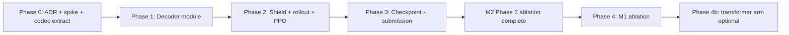

# Ralplan iter-2 (consensus, restored): M1 — Factored Pointer Decoder

**Source spec:** `.omg/specs/deep-interview-factored-pointer-decoder.md`  
**Slug:** `factored-pointer-decoder`  
**Workflow:** deep-interview → ralplan → **ralph**  
**Status:** executing — **factorized_topk** (iter-3 dense P×P override reverted at user request)  
**Execution:** `/ralph` selected at approval hook  
**Related active work:**
- **M2** `planet-self-attention-encoder` — executing (encoder-only; **Phase 4 cutover blocked until M2 Phase 3**)
- **M4** `intercept-edge-features` — complete (schema v4, E=18)
- **Deferred:** `thin-trajectory-shield`

## Iter-4 Adjustment (revert dense P×P)

User requested **adjust** after iter-3 dense P×P override. Restored **architect-recommended `factorized_topk`**:

| Aspect | iter-3 override (reverted) | **Active (iter-2 / iter-4)** |
|--------|---------------------------|------------------------------|
| Target space | P planets per source | **K slots per source (ADR-002 preserved)** |
| Shield cost | O(P²×buckets) | **O(P×K×buckets)** |
| Spike gate | ≤1.5× | **≤1.25×** |
| `action_layout_version` | `3` = dense P×P | **`2` = factorized top-K** |

---

Planner iter-1 + architect **APPROVE-WITH-CHANGES** + critic **REVISE → approved-with-changes** after incorporating:

1. **Decode semantics (C1):** `factorized_topk` — source → target **slot within top-K**, not dense P×P. **Preserve ADR-002**; amend ADR-001 only.
2. **Launch bound (C2):** Fixed `max_moves_k` loop + stop head + `step_active_mask`. **Reject** default `max_launches_per_turn=8`.
3. **Checkpoint plane (C3):** `pointer_decoder` + `action_layout_version` (not `decoder_type`). `schema_version` stays 4.
4. **Module layout (C4):** `src/jax/decoders/`, `src/jax/action_codec.py`; break shield→policy import cycle in Phase 0.
5. **Shield (C5):** Extract `evaluate_edge_pair`; reshape `(P×K×buckets)` masks — same O(P×K) cost class.
6. **Test tier map (C6):** New decoder tests → `make test-fast`; register files in `tests/conftest.py`; JIT compile → slow/jax tier only.
7. **Sequencing (C7):** Phases 0–3 ∥ M2 OK; **Phase 4 cutover blocked until M2 Phase 3 ablation completes**.
8. **Ablation (C8):** Add S1 ±5pp; pin `artifacts/m1/baseline_pin.json`; Phase 4b transformer stratification optional.

---

## Context

| Surface | Current state (joint flat pointer) |
|---------|-------------------------------------|
| Policy shell | `ComposablePlanetPolicy` — encoder → flat `(B, P×K+1, H)` + `noop_edge_embedding` → `AutoregressivePointerDecoder` |
| Encoders | `PlanetEdgeBackboneEncoder`, `PlanetGraphTransformerEncoder` — shared `PlanetEdgeEncoderOutput` |
| Action ADR | **ADR-001** flat index; **ADR-002** top-K per source; fixed `max_moves_k=3`; NO_OP at `P×K` |
| Shield | `apply_trajectory_shield_to_turn_batch_v2` — `vmap(evaluate_flat_edge)` over `P×K` |
| Import debt | `trajectory_shield.py` imports `JaxPolicyOutput`, log-prob helpers from `policy.py` |
| Checkpoints | `schema_version` 4, `encoder_backbone`; **no pointer plane** |

### User intent (M1)

1. **Factorized source → target-slot pointer** per launch (within top-K)
2. **Learned stop head** — semantic variable length inside fixed `max_moves_k` JIT loop
3. **Break ADR-001** flat joint index; **keep ADR-002** top-K layout

---

## RALPLAN-DR Summary

### Mode

**DELIBERATE.** Cross-cutting decoder/shield/rollout/PPO/submission rewrite. Primary risks: per-step shield cost in AR loop, PPO padding masks, checkpoint/submission dual paths, M2 ablation confound.

### Principles

1. **Encoder + feature contract stable** — reuse `PlanetEdgeEncoderOutput` and `TurnBatch`; no schema bump.
2. **Factorized semantics** — `log π = log π_stop + active × (log π_src + log π_tgt_slot + log π_bucket)`.
3. **JIT-safe fixed loop** — variable launches are *semantic*; implementation uses `range(max_moves_k)` + `step_active_mask`.
4. **Shield before training lift** — Phase 0 spike + `evaluate_edge_pair` extraction before decoder weights.
5. **Side-by-side until ablation** — default `pointer_decoder=joint_flat`; factored opt-in preset only until Phase 4 gate.

### Decision Drivers

1. Flat index couples source/target — poor inductive bias and awkward M3 MCTS expansion.
2. NO_OP slot conflates "pass this sub-step" with "done launching" — stop head separates semantics.
3. Top-K preserved — full P×P shield is infeasible; factorized top-K is the sweet spot.

---

## Locked Options (iter-2)

| Question | Locked choice |
|----------|---------------|
| Q1 TurnBatch edges | **Keep** as top-K target candidates (ADR-002 preserved) |
| Q2 Launch cap | **`max_moves_k` + stop mask** (default 3); cap=8 only post-spike escape |
| Q3 Shield cost | **O(P×K)** via `evaluate_edge_pair`; Phase 0 spike gate ≤1.25× |
| Q4 Config naming | **`model.pointer_decoder: joint_flat \| factorized_topk`** |
| Q5 Policy output | **`FactorizedPolicyOutput`** + `action_codec.py` adapters; extend `JaxTransitionBatch` with `source_index`, `stop_flag`, `step_mask` |
| Q6 Target storage | **`source_index` + `target_slot`** (not flat index) in rollout |
| Q7 Checkpoint | **`pointer_decoder` + `action_layout_version`**; no `schema_version` bump |
| Q8 Cutover timing | **After M2 Phase 3 + M1 Phase 4** |

---

## Milestone Boundary

### In scope

| Area | Deliverables |
|------|--------------|
| ADR | **ADR-005** in `docs/feature-encoding-v2.md`, `docs/feature-encoding-v2-pointer.md` |
| Modules | `src/jax/decoders/factorized_topk_pointer.py`, `src/jax/action_codec.py` |
| Decoder | `FactorizedTopKPointerDecoder` — GRU; per-step src/tgt/stop/bucket heads |
| Policy shell | `ComposablePlanetPolicy` dispatches on `pointer_decoder` |
| Shield | `evaluate_edge_pair`; `apply_trajectory_shield_factorized_topk`; break policy imports |
| Action / sampling | Factored builders + shielded sequence sampler |
| PPO / rollout | Masked sequence loss; transition fields |
| Config | `model.pointer_decoder`, `conf/model/gnn_pointer_factorized.yaml` |
| Checkpoints | `pointer_decoder`, `action_layout_version` metadata + validation |
| Submission | Dual decode path; Kaggle MAIN_TEMPLATE update |
| Tests | CPU fast-tier + optional slow JAX smokes |
| Ablation | Paired vs joint flat; pin `artifacts/m1/baseline_pin.json` |

### Out of scope

| Item | Owner |
|------|-------|
| Feature schema / E=18 | M4 (done) |
| Encoder swap | M2 |
| Dense P×P targets | Rejected |
| MCTS loop | M3 |
| Default cutover without gates | — |
| Joint-flat removal | M1.1 after cutover |
| Shield thinning | deferred spec |

---

## Phased Implementation Plan

### Phase 0 — Contract, codec extraction, shield spike (~2 days)

**Goal:** Lock ADR-005; prove shield budget; break import cycle.

| Task | Path | Acceptance criteria |
|------|------|---------------------|
| ADR-005 | `docs/feature-encoding-v2.md`, `docs/feature-encoding-v2-pointer.md` | Source/slot/stop semantics; log-prob factorization; `step_active_mask` rules |
| Extract codec | `src/jax/action_codec.py` | Flat ↔ (src, slot) helpers; neutral policy output types moved here |
| Break import cycle | `src/game/trajectory_shield.py` | **Zero** imports from `src/jax/policy.py` |
| Extract pair eval | `src/game/trajectory_shield.py` | `evaluate_edge_pair(src_row, slot)` shared by flat + factored paths |
| Shield spike | `scripts/spike_factored_shield.py` | Output `artifacts/m1/shield_spike.json`; pass ≤1.25× or document escape |
| Checkpoint RFC | `src/artifacts/checkpoint_compat.py` design | Fields: `pointer_decoder`, `action_layout_version` |

**Exit:** Spike pass or user-approved escape; ADR-005 merged; import audit clean.

---

### Phase 1 — Decoder module (~2–3 days)

**Goal:** Forward pass produces valid factored output; no env integration.

| Task | Path | Acceptance criteria |
|------|------|---------------------|
| `FactorizedTopKPointerDecoder` | `src/jax/decoders/factorized_topk_pointer.py` | Shapes: `source_logits (B,L,P)`, `target_logits (B,L,K)`, `stop_logits (B,L)`, `ship_logits (B,L,K,Bb)` |
| Wire shell | `src/jax/policy.py` | `pointer_decoder=factorized_topk` builds new decoder; encoder unchanged |
| Config | `src/config/schema.py`, `conf/model/gnn_pointer_factorized.yaml` | Default remains `joint_flat` |
| Fast tests | `tests/test_jax_policy_factorized_decoder.py` | CPU shape/mask contracts; register in `conftest.py` |

**Exit:** `make test-fast` green on **default joint-flat config**; new factored tests pass.

**Not in Phase 1 exit:** JIT compile (slow/jax tier, user approval).

---

### Phase 2 — Shield, action build, rollout + PPO (~4–5 days)

| Task | Path | Acceptance criteria |
|------|------|---------------------|
| Factored shield | `src/game/trajectory_shield.py` | `(P,K,buckets)` mask tensor; incremental ship depletion |
| Builders | `src/opponents/jax_actions/builders.py`, `sampling.py` | Shielded AR sampling with stop; `build_action_from_factored_batch` |
| Rollout | `src/jax/rollout/collect.py`, `types.py` | `source_index`, `target_slot`, `stop_flag`, `step_mask` stored |
| PPO | `src/jax/ppo_update.py` | Masked sequence loss per head |
| Metrics | `src/jax/rollout/metrics.py` | `stop_rate`, `mean_active_launches_per_turn` |
| Consumer audit | grep checklist | opponents, replay, metrics paths updated or dispatched |

**Tests (fast):** `tests/test_factored_action_builders.py`, `tests/test_trajectory_shield_factorized.py`

**Exit:** `make test-fast` green on default config; factored preset 5-update smoke (slow tier, user approval) completes without NaN.

---

### Phase 3 — Checkpoint + submission (~2 days)

| Task | Path | Acceptance criteria |
|------|------|---------------------|
| Metadata | `src/artifacts/checkpoint_compat.py` | Save/load `pointer_decoder`, `action_layout_version`; reject mismatch |
| Train loop | `src/jax/train.py` | Persists pointer fields |
| Submission | `src/jax/submission_runtime.py` | Dispatch by checkpoint metadata |
| Kaggle | `scripts/validate_kaggle_docker_submission.py` | MAIN_TEMPLATE factored decode; allowlist |
| Architecture doc | `docs/architecture/jax-policy-encoder.md` | Decoder dispatch Mermaid |

**Exit:** `tests/test_checkpoint_compat.py` + packager tests pass; C1 gate.

---

### Phase 4 — Ablation vs joint flat (~blocked until M2 Phase 3)

**Precondition:** M2 Phase 3 ablation complete; M4 schema v4 pinned.

| Arm | Config |
|-----|--------|
| A (baseline) | `pointer_decoder=joint_flat`, `max_moves_k=3`, GNN encoder |
| B (treatment) | `pointer_decoder=factorized_topk`, same encoder + features + curriculum |

**Controls:** 3 seeds, 500+ updates, mix_2p_4p_8env, matched compute.

**Artifacts:** `artifacts/m1/baseline_pin.json`, wandb runs.

**Phase 4b (optional):** Repeat arm B with `planet_graph_transformer` encoder.

**Exit:** Success gates S0–C1 evaluated; cutover recommendation recorded.

---

## Test Strategy

| Tier | When | Command |
|------|------|---------|
| **Default iteration** | Every phase | `make test-fast` (must stay green on default joint-flat config) |
| Domain config | Schema edits | `make test-domain-config` |
| New fast files | Phase 1–3 | Register in `tests/conftest.py` `DOMAIN_BY_FILE` |
| JAX compile / rollout smoke | Pre-merge, user approval | `make test-jax` or targeted slow tests |
| Full suite | Release | `make test` (user approval) |

---

## Success Metrics

See spec table (S0, S1, H1, H2, R1, L1, V1, C1).

---

## ADR-005 (Summary)

**Decision:** Replace ADR-001 flat joint pointer with factorized top-K pointer + stop head per launch step.

**Preserved:** ADR-002 top-K edge layout; ADR-004 symmetry frame; feature schema v4.

**Rejected:** Dense P×P target space; separate `max_launches_per_turn=8` default; renaming `gnn_pointer` to imply factored.

**Consequences:** Decoder weights incompatible across pointer types; dual submission path until M1.1 cleanup.

---

## Critic / Architect Sign-off (iter-2)

- [x] Architect locks incorporated (factorized_topk, max_moves_k+stop, pointer_decoder metadata)
- [x] Critic required edits addressed (import cycle, test tier, S1 gate, cutover sequencing)
- [x] ADR scope: amend ADR-001, preserve ADR-002
- [x] M2 non-goals respected for encoder path
- [x] Phase 0 spike evidence attached (`artifacts/m1/shield_spike.json`, ratio 1.054)
- [ ] User execution approval

---

*Plan iter-2 — ralplan consensus reached. Awaiting user execution choice.*
