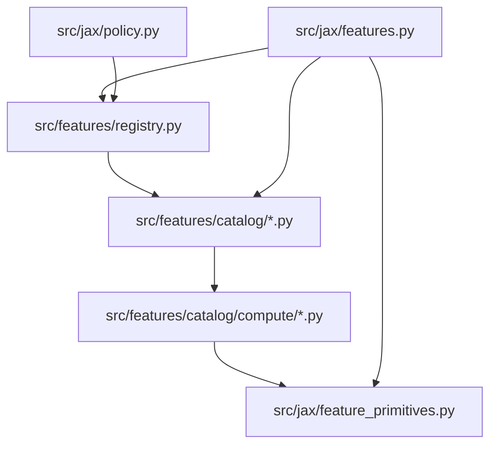

# Ralplan: Feature Registry Single-Source Refactor

Linked spec: `.omg/specs/deep-interview-feature-registry-single-source.md`  
Manifest: `feature-registry-single-source`  
Consensus iterations: 1 (planner + architect + critic)  
User direction: **Option A + hard v3 gate**

## RALPLAN-DR Summary

### Principles

1. **One tuple per group** — ordered `(name, size, compute_fn)` is the only source of feature order and width.
2. **Mechanical assembly** — encoders call `catalog.assemble(context)`; no hand-ordered `jnp.stack` for feature slots.
3. **Orchestration ≠ compute** — top-K edge ranking, history wiring, and active masking stay in `jax/features.py`; per-feature math lives in catalog compute modules.
4. **Acyclic imports** — `feature_primitives.py` is a leaf; catalog → primitives ← `jax/features.py` (never catalog → `jax/features`).
5. **Behavior frozen** — golden encode outputs unchanged; refactor is plumbing only.

### Decision Drivers

1. Eliminate registry/stack drift (evidenced in trace `feature-encoding-trace`).
2. ≤2-file add-feature UX (spec AC8).
3. Hard checkpoint boundary at `schema_version=3` (user-selected).

### Viable Options Considered

| Option | Verdict |
|--------|---------|
| **A — features catalog + compute + primitives** | **Chosen** |
| B — JAX-owned catalog with registry import | Rejected: breaks layering or reintroduces dual lists |
| Incremental (new features only) | Rejected in spec interview |

---

## ADR: Single-Source Feature Catalog

### Decision

Introduce immutable per-group catalogs under `src/features/catalog/` with colocated JAX compute functions. Build `FeatureGroupRegistry` exclusively from catalog metadata. Replace manual `BASE_*_FEATURE_DIM` constants with `catalog.base_dim`. Reject checkpoints with `schema_version < 3`.

### Drivers

- Drift between `registry.py` lists and `jax/features.py` stacks is a documented high-risk surface.
- Policy and checkpoint consumers already use registry slices in some paths (`GLOBAL_FEATURE_SCHEMA.base_slice`); extend pattern everywhere.
- User explicitly accepts retrain-only migration.

### Alternatives Rejected

| Alternative | Why rejected |
|-------------|--------------|
| Codegen/scaffold CLI | User rejected in deep-interview |
| Duplicate specs + sync test | Defeats single-source goal |
| Keep `constants.py` dims | Manual duplication persists |
| Soft v3 (metadata only) | User chose hard gate |

### Consequences

- **Positive:** Add feature = one catalog entry (+ optional unit test); drift-guard test catches order bugs.
- **Negative:** Large single PR; `features/` gains JAX dependency in catalog/compute modules (already implicit via `FeatureExtractor`).
- **Neutral:** Dims unchanged (13/12/46); weights compatible only if someone bypasses schema_version check — hard gate prevents that.

---

## Entity Design

### `FeatureDefinition` (frozen dataclass)

```python
@dataclass(frozen=True, slots=True)
class FeatureDefinition:
    name: str
    size: int = 1
    active: bool = True
```

### `FeatureCatalog` (per group)

- Module-level immutable tuple: `ENTRIES: tuple[FeatureDefinition, Callable[[Context], Array]], ...]`
- `base_dim`: sum of active entry sizes (same logic as current `FeatureGroupRegistry`)
- `assemble(context) -> Array`:
  - Fixed-order: `parts = tuple(fn(ctx) for _, fn in ACTIVE_ENTRIES)`
  - Each `fn(ctx)` returns array with **last axis == entry.size**
  - `jnp.concatenate(parts, axis=-1)` (planet/edge row) or `concatenate` flat (global)
- **Build-time assert:** `fn` output trailing dim matches `entry.size` (where statically known, document for multi-dim)

### Context dataclasses

| Context | Used by | Fields (minimum) |
|---------|---------|-------------------|
| `PlanetAssemblyContext` | planet catalog | planets, fleets, player, env_cfg, scale, theta_ref, history |
| `EdgeRowContext` | edge catalog | pre-gathered src/tgt tensors, fleets, player, env_cfg, scale, theta_ref, ordered_valid, tgt_active |
| `GlobalAssemblyContext` | global catalog | game, env_cfg, scale, history, **scratch** (owner_counts, owner_ships, owner_fleets, owner_production, previous_global, previous_present) |

### Multi-dim rule

One `FeatureDefinition` with `size=4` → one compute fn returns `(…, 4)` (e.g. owner one-hot). Do **not** split into four catalog entries.

---

## Import DAG



**Rule:** No `features/catalog → jax/features` import.

---

## Orchestration Map

| Group | Stays in `jax/features.py` | Moves to catalog compute |
|-------|----------------------------|--------------------------|
| **Planet** | `_theta_ref`, inactive masking (`jnp.where(active)`) | All 13 feature values |
| **Edge** | Top-K `lexsort`, sun-crossing filter, `k=0` branch, edge_mask, tgt_ids | 12 feature values per row |
| **Global** | History stack (`_stack_global_history`), `empty_feature_history` sizing | 46-dim frame via scratch context |

---

## File Touch Matrix

| Path | Action |
|------|--------|
| `src/features/catalog/planet.py` | **Create** — ENTRIES + assemble |
| `src/features/catalog/edge.py` | **Create** — ENTRIES + assemble_row |
| `src/features/catalog/global_.py` | **Create** — ENTRIES + assemble (scratch builder helper) |
| `src/features/catalog/compute/planet.py` | **Create** — per-feature fns |
| `src/features/catalog/compute/edge.py` | **Create** — per-feature fns |
| `src/features/catalog/compute/global_.py` | **Create** — per-feature fns |
| `src/features/catalog/_types.py` | **Create** — FeatureDefinition, contexts |
| `src/features/catalog/__init__.py` | **Create** — export catalogs |
| `src/jax/feature_primitives.py` | **Create** — extract helpers from `jax/features.py` |
| `src/features/registry.py` | **Modify** — build schemas from catalogs; remove hand lists + constants validation |
| `src/jax/features.py` | **Modify** — thin orchestration; delete manual stacks |
| `src/jax/policy.py` | **Modify** — named slices for orbit geometry |
| `src/game/constants.py` | **Modify** — remove `BASE_PLANET/EDGE/GLOBAL_V2_*` (keep legacy v1 dims for now) |
| `src/artifacts/checkpoint_compat.py` | **Modify** — `schema_version=3`; reject `<3` in validate |
| `tests/test_feature_registry.py` | **Modify** — catalog-derived dims; drop hardcoded slice(45,46) |
| `tests/test_feature_catalog_drift.py` | **Create** — drift guard (AC4) |
| `tests/test_feature_encoding_golden.py` | **Modify** — import dims from registry helpers |
| `tests/test_jax_env.py` | **Modify** — registry dims |
| `tests/test_jax_env_dispatch.py` | **Modify** — registry dims |
| `tests/test_jax_policy_gnn.py` | **Modify** — registry dims |
| `tests/test_checkpoint_compat.py` | **Modify** — v3 metadata + reject v2 |
| `tests/test_kaggle_submission_packager.py` | **Modify** — schema_version 3 if asserted |
| `docs/feature-encoding-v2.md` | **Modify** — add-feature worked example (AC8) |
| `src/features/registry.py` module docstring | **Modify** — ≤2-file workflow example |

### Grep exit criteria (post-implementation)

- No `BASE_PLANET_FEATURE_DIM` / `BASE_EDGE_FEATURE_DIM` / `BASE_GLOBAL_FEATURE_V2_DIM` outside `constants.py` legacy comment block
- No `planet_features[..., 1]` or `[..., 2]` in `src/`
- No `PLANET_FEATURE_REGISTRY = [` hand list in `registry.py`

---

## Implementation Phases

### Phase 0 — Scaffold (no behavior change)

1. Add `feature_primitives.py`; move shared helpers from `jax/features.py` (pure moves).
2. Add catalog types + empty catalog tuples mirroring current order.
3. `registry.py` builds `FeatureGroupRegistry` from catalog metadata only.

**Verify:** `make test-domain-features`

### Phase 1 — Planet catalog

1. Implement planet compute fns (extract from current `_planet_features` stack).
2. `PlanetAssemblyContext` + `assemble`.
3. Replace `_planet_features` body with context build + assemble + active mask.

**Verify:** golden shape tests; drift test for planet group.

### Phase 2 — Edge catalog

1. Implement edge compute fns.
2. `EdgeRowContext`; `_edge_features` keeps top-K, calls `assemble_row` per gathered target.
3. Preserve `k=0` zero tensor shapes using `edge_feature_dim()`.

**Verify:** `test_encode_v2_sun_crossing_targets_are_masked`; drift test for edge.

### Phase 3 — Global catalog

1. `GlobalAssemblyContext` with scratch builder (single bincount pass).
2. Migrate delta features to read scratch + `previous_global` slices via registry names.
3. Replace `_global_frame` concatenate block with `assemble`.

**Verify:** history tests in golden; drift test for global.

### Phase 4 — Consumers & checkpoint

1. `policy.py` — `planet_feature_schema().base_slice("orbit_radius"|"orbit_angle")`.
2. Remove `BASE_*_V2` from constants; fix test imports to `edge_feature_dim()` / catalog exports.
3. `checkpoint_compat`: emit `schema_version: 3`; `validate_checkpoint_feature_compatibility` raises if stored `< 3`.
4. Update submission packager tests.

**Verify:** `make test-domain-artifacts`; `make test-fast`

### Phase 5 — Docs & cleanup

1. Module docstring + `docs/feature-encoding-v2.md` worked example.
2. Delete dead code paths in `jax/features.py`.

---

## Test Plan

### Drift guard (`tests/test_feature_catalog_drift.py`)

For each group (planet, edge, global):

1. Reset env → `encode_turn`.
2. For every active catalog entry, extract `batch.*[..., schema.base_slice(name)]`.
3. Assert equals `catalog.compute_fn(isolated_context)` within `atol=1e-6` on fixed seed.

Include fixtures: 2p reset, sun-crossing edge case, `feature_history_steps=2` for global history.

### Semantic preservation

- Existing `test_feature_encoding_golden.py` cases must pass unchanged (full tensor behavior).
- Optional: store per-feature hash on one fixture (future hardening; not blocking).

### Checkpoint

- `test_checkpoint_compat.py`: metadata `schema_version == 3`.
- New test: loading v2 metadata checkpoint raises with clear message.

### Commands

| Gate | Command |
|------|---------|
| Features domain | `make test-domain-features` |
| Artifacts domain | `make test-domain-artifacts` |
| Dev loop | `make test-fast` |
| Pre-merge (user approval) | `make test` for JIT smoke |

---

## Rollback

Revert single PR. Golden vectors unchanged → safe rollback if caught before merge. If v3 checkpoints saved mid-flight, they require this branch (expected).

---

## Critic Checklist

- [x] Decision record (ADR above)
- [x] Entity design + multi-dim rule
- [x] Orchestration map (edge two-phase)
- [x] File touch matrix + grep gates
- [x] Registry single build path
- [x] Constants migration scope (v2 trio only)
- [x] Policy + builders audit (`builders.py` already uses `EDGE_FEATURE_SCHEMA.slice`; no change unless drift found)
- [x] Hard schema_version gate (user confirmed)
- [x] Test plan + verification commands
- [x] Docs / ≤2-file example
- [x] Sequencing + rollback

**Critic verdict after plan:** APPROVE for execution.

---

## Workflow Gates

- [x] Planner RALPLAN-DR
- [x] Architect review (Option A + refinements)
- [x] Critic review (plan addresses gaps)
- [x] User option selection (Option A + hard v3)
- [ ] User final execution approval
- [ ] Execution via OMG Autopilot (per deep-interview bridge)
