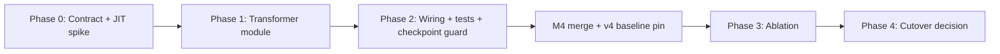

# Ralplan iter-2 (consensus): M2 — Planet Self-Attention Encoder (Graph Transformer)

**Source spec:** `.omg/specs/deep-interview-planet-self-attention-encoder.md`  
**Slug:** `planet-self-attention-encoder`  
**Workflow:** deep-interview → ralplan → omg-autopilot  
**Status:** Phase 3 ablation complete (2026-05-25); Phase 4 cutover decision pending  
**Related active work:** `intercept-edge-features` (M4, executing) — **ablation blocked until M4 merge**  
**Supersedes:** iter-1 of this plan

## Iter-2 Change Log

Architect **approved-with-changes**; critic **REVISE → approved-with-changes** after incorporating:

1. **Sequencing contract (C3):** Phase 3 ablation runs only on schema v4 / E=18 post-M4; Phases 0–2 may land pre-M4.
2. **Checkpoint architecture plane (C2):** `encoder_backbone` metadata + load-time rejection before param merge; unit test GNN→transformer mismatch.
3. **Module ownership:** new `src/jax/encoders/planet_graph_transformer.py`; `policy.py` keeps factory + decoder shell.
4. **Fast-tier tests (M1):** new `tests/test_jax_policy_encoder.py` (CPU, `not slow`); do not rely on `tests/test_jax_policy_gnn.py` (slow tier).
5. **Phase 0 JIT/VRAM spike** before locking layer count; H2 tolerance documented as ≥0.90× (not optimistic ±10% wording).
6. **GNN residual audit:** verify pre-norm wiring in existing GNN (`policy.py:399-400`) before porting patterns to transformer.
7. **Config cleanup:** wire `planet_transformer_layers` + `attention_heads`; GNN-only knobs (`gnn_k_neighbors`, `gnn_message_passing_layers`) ignored or hard-fail on transformer preset.
8. **Submission guard:** extend `scripts/validate_kaggle_docker_submission.py` allowlist for `planet_graph_transformer`.
9. **Critic checklist** embedded below (sign-off section).

## Context

| Surface | Current state |
|---------|---------------|
| Encoder | `PlanetEdgeBackboneEncoder` — k-NN spatial GNN (5 neighbors, 2 sum-aggregation MP layers), src-only edge fusion |
| Policy shell | `build_gnn_pointer_policy()` → `ComposablePlanetPolicy` + `AutoregressivePointerDecoder` + value head |
| Config | `conf/model/gnn_pointer.yaml` — `attention_heads=7` **dead** on GNN path; `normalize_observations` **dead** on JAX |
| Features | `TurnBatch` — P=13, E=12 (E=18 post-M4), G=46; `edge_tgt_ids` **unused** in fusion |
| Checkpoint gap | `validate_checkpoint_feature_compatibility` checks P/E/G dims only — **no architecture rejection** |
| Baseline | ~1298 `env_steps_per_sec` mix_2p_4p_8env (`docs/feature-encoding-v2-phase0-results.md`) |

### Milestone boundary

| In M2 | Out of M2 (explicit) |
|-------|----------------------|
| Planet self-attention replaces k-NN MP loop | Feature schema / `TurnBatch` changes (M4) |
| Spatial coordinate attention bias | Multi-relation bias (M2.1) |
| tgt-aware edge fusion on **both** encoders | Obs normalization wiring |
| `encoder_backbone` checkpoint metadata + validation | Variable-length planet attention |
| Config switch `gnn_pointer` \| `planet_graph_transformer` | Pointer multi-head attention (Tier-A bundle) |
| Ablation runbook section + `artifacts/m2/` pins | Default cutover before Phase 4 gate |

---

## RALPLAN-DR Summary

### Mode

**SHORT.** Encoder swap within `PlanetEdgeEncoderOutput` contract. Primary risks: throughput regression (dense P×P softmax), ablation confound with M4, checkpoint load without architecture guard.

### Principles

1. **Preserve encoder output contract** — decoder, shield, action space unchanged.
2. **Encoder-only** — E tracks catalog; no `src/jax/features.py` edits.
3. **Side-by-side until ablation proves lift** — GNN path retained via config.
4. **Fixed P=60 masked attention** — JIT-stable; reuse `planet_mask` outer product.
5. **Paired, pinned ablation post-M4** — same features, curriculum, shield, compute on both arms.

### Decision Drivers

1. k-NN GNN (5 neighbors × 2 layers) lacks global board context for long-range fleet play.
2. Dense O(P²) attention at P=60 must stay within **≥0.90×** GNN throughput on mix configs.
3. M4 must land first so ablation compares transformer vs GNN on **identical E=18 / schema v4** features.

---

## Viable Options per Open Question (locked choices in **bold**)

### Q1. Transformer layers

| Option | Pros | Cons |
|--------|------|------|
| **A — 2 layers (default; Phase 0 may downgrade)** | Parity with `gnn_message_passing_layers=2` | Higher FLOPs; may fail H2 |
| B: 1 layer | Best throughput | Weaker expressivity |
| C: 2 + grad checkpointing | Training memory relief | Rollout forward cost unchanged |

**Locked: A with Phase 0 spike escape hatch to B.**

### Q2. Attention bias

| Option | Pros | Cons |
|--------|------|------|
| **A — spatial only (orbit coords → pairwise bias)** | Small surface; reuses coord math from GNN | No explicit ownership graph |
| B: multi-relation | Richer bias | Scope creep → M2.1 |

**Locked: A.**

### Q3. Padding strategy

**Locked: fixed MAX_PLANETS + boolean/additive mask.** Reject variable-length bucketing.

### Q4. Rollout strategy

**Locked: config switch** — `model.architecture=gnn_pointer | planet_graph_transformer`. No silent rename of `gnn_pointer` to mean transformer.

### Q5. Observation normalization

**Locked: defer.** Both ablation arms train on raw encoded features.

### Q6. Target planet embedding in edge fusion

| Option | Pros | Cons |
|--------|------|------|
| **A — in M2, both encoders** | Fixes obvious asymmetry; required for transformer ROI | Must patch GNN too for fair ablation |
| B: defer to M2.1 | Narrower diff | Leaves known gap; wastes transformer compute |

**Locked: A (symmetric on both encoders, logged in ablation metadata).**

### Q7. Architecture naming (iter-2 resolution)

| Option | Outcome |
|--------|---------|
| A: keep `gnn_pointer` name for transformer | Rejected — misleading sweeps/history |
| B: `graph_transformer` | Shorter |
| **C: `planet_graph_transformer`** | Explicit scope; new `conf/model/planet_graph_transformer.yaml` |

**Locked: C.**

---

## Phased Implementation Plan



### Phase 0 — Contract, config, JIT spike (~1 day)

**Deliverables**

| Item | Path |
|------|------|
| Spec (this milestone) | `.omg/specs/deep-interview-planet-self-attention-encoder.md` |
| Config preset | `conf/model/planet_graph_transformer.yaml` |
| Schema fields | `src/config/schema.py` — `planet_transformer_layers: int = 2`, `spatial_attention_bias: bool = True` |
| Checkpoint metadata | `src/artifacts/checkpoint_compat.py` — add `encoder_backbone` to saved metadata + `METADATA_KEYS` |
| Architecture validator | `validate_checkpoint_encoder_compatibility(stored, cfg)` — compare `encoder_backbone` before param load; call from `src/jax/train.py` resume path |
| Submission allowlist | `scripts/validate_kaggle_docker_submission.py` |
| JIT spike | 1-update smoke: `model=planet_graph_transformer`, layers=1 vs 2, record compile time + `env_steps_per_sec` |

**Exit criteria**

- [ ] `print_resolved_config=true` resolves new model group
- [ ] Spike doc in plan notes: chosen default layer count
- [ ] `hidden_size % attention_heads == 0` assert in builder

---

### Phase 1 — `PlanetGraphTransformerEncoder` module (~2 days)

**New module:** `src/jax/encoders/planet_graph_transformer.py`

| Component | Notes |
|-----------|-------|
| Input MLPs | Mirror GNN: `planet_enc`, `global_enc`, `edge_enc` |
| Self-attention stack | Flax `nn.MultiHeadDotProductAttention` + pre-norm FFN blocks × L |
| Mask | `(B,P,P)` from `planet_mask[:,:,None] & planet_mask[:,None,:]`; row guard when all masked (mirror `safe_attention_mask` semantics) |
| Spatial bias | Additive bias from orbit coords (reuse slices `_PLANET_ORBIT_RADIUS_SLICE`, `_PLANET_ORBIT_ANGLE_SLICE`) |
| Edge fusion | `concat(src_planet, tgt_planet, edge_hidden)` via `edge_tgt_ids` gather |
| Output | `PlanetEdgeEncoderOutput` — identical shapes to GNN path |
| `edge_k=0` | Same degenerate branch as GNN |

**GNN patch (same PR series):** add tgt gather to `PlanetEdgeBackboneEncoder`; audit residual at `policy.py:399-400` (pre-norm on `current_planet_states`, not stale `planet_hidden`).

**Exit criteria**

- [ ] CPU forward smoke via `make_synthetic_turn_batch`
- [ ] All-masked planets → finite outputs (no NaN)
- [ ] Param key tree differs from GNN (for checkpoint rejection test)

---

### Phase 2 — Factory, tests, checkpoint guard (~1 day)

**Files**

| File | Change |
|------|--------|
| `src/jax/policy.py` | `build_planet_graph_transformer_policy()`, dispatch in `build_jax_policy()` |
| `src/jax/train.py` | Call encoder compatibility check on resume |
| `tests/test_jax_policy_encoder.py` | **New, CPU, `not slow`**: forward shapes, layer depth param diff, all-masked, spatial bias ordering, checkpoint mismatch |
| `tests/test_checkpoint_compat.py` | `encoder_backbone` round-trip + rejection |
| `docs/architecture/jax-policy-encoder.md` | **New** — Mermaid TurnBatch → encoder dispatch → pointer |

**Exit criteria**

- [ ] `make test-domain-policy` green
- [ ] `make test-fast` green
- [ ] Loading GNN checkpoint into transformer raises clear `ValueError` naming `encoder_backbone`
- [ ] No edits to shield / action builders / `TurnBatch`

---

### Phase 3 — Ablation (post-M4 only) (~0.5 day doc + ~3–4 h GPU)

**Prerequisite:** M4 merged; schema v4 / E=18; GNN baseline retrained on v4.

**Pin:** `artifacts/m2/baseline_pin.json` — commit SHA, feature dims, `encoder_backbone=planet_gnn`, seeds.

**Arms (scratch retrain both — no weight reuse)**

| Arm | `model` | `encoder_backbone` | Features |
|-----|---------|-------------------|----------|
| Baseline | `gnn_pointer` | `planet_gnn` | E=18, schema v4 |
| M2 | `planet_graph_transformer` | `planet_self_attention` | E=18, schema v4 |

**Anchor config**

```bash
format=mix_2p_4p_8env
training.rollout_steps=64
training.minibatch_size=256
training.rollout_microbatch_envs=8
task.candidate_count=4
task.trajectory_shield_enabled=true
```

**Runs**

1. Variance smoke: 1 seed × 100 updates × 3 RNG reps (baseline GNN, pinned commit)
2. Paired A/B: 3 seeds × 500 updates × 2 formats, same seeds both arms
3. Throughput: `scripts/benchmark_jax_rl.py --warmup 2 --updates 20` × 3 reps × 2 formats × 2 architectures
4. Submission: `scripts/validate_kaggle_docker_submission.py` on M2 checkpoint

Results doc: `docs/m2-planet-self-attention-results.md`  
Runbook: append section to `docs/feature-encoding-v2-ablation-runbook.md`

**Phase 3 completed 2026-05-25:** 6/6 paired runs (3 seeds × 2 arms), gates in `artifacts/m2/gate_evaluation.json`. W1/H2/H3 pass; H1 deferred; S1 not logged (lean telemetry).

---

### Phase 4 — Cutover decision (conditional)

| Outcome | Action |
|---------|--------|
| W1 + H1 + H2 + S1 pass | Promote `planet_graph_transformer` default or document as recommended; keep GNN one release |
| W1 pass, H2 fail | Keep GNN default; try 1-layer or grad-friendly optimizations |
| W1 fail | Keep GNN; queue M2.1 (multi-relation bias) before closing milestone |

---

## Success Gates

| ID | Gate | Threshold |
|----|------|-----------|
| **W1** | `episode_reward_mean` | ≥**+2%** vs paired GNN (updates 450–500), 3 seeds, **both 2p and 4p** |
| **H1** | Submission | Zero illegal actions, ≥100 eps/format |
| **H2** | Throughput | `median(env_steps_per_sec)_transformer ≥ **0.90×** median_GNN` per format |
| **H3** | Stability | No NaN/inf; no collapse |
| **S1** | Shield | `trajectory_shield_legal_non_noop_rate` within **±5pp** |

`overall_win_rate` is **diagnostic only** unless user adds a separate powered gate.

---

## Pre-mortem (iter-2)

| # | Scenario | Mitigation |
|---|----------|------------|
| P1 | Resume GNN ckpt into transformer | `encoder_backbone` validation + test |
| P2 | Throughput −15–25% | Phase 0 spike; H2 gate; fallback 1 layer |
| P3 | M4 lands mid-ablation | Hard sequencing: no Phase 3 until M4 complete |
| P4 | All-inactive board → attention NaN | Unit test + row mask guard |
| P5 | tgt fusion confounds ablation | Apply to **both** encoders; document in pin JSON |
| P6 | W1 noise at 3 seeds | Variance smoke; escalate to 6 seeds if borderline (1.5–2.5%) |
| P7 | Scope creep PR | Out-of-scope list enforced in review |

---

## ADR — M2 Planet Graph Transformer Encoder

**Decision:** Replace k-NN planet message passing with **2-layer masked planet self-attention** (spatial bias, wired `attention_heads`), selected via `model.architecture=planet_graph_transformer`. Apply **tgt-aware edge fusion on both encoders**. Add **`encoder_backbone` checkpoint plane** separate from feature `schema_version`. Ablation post-M4 on E=18.

**Drivers:** Global planet context; isolated encoder experiment; WSL2 throughput constraints favor fixed-P masked attention.

**Alternatives rejected:** variable-length attention; multi-relation bias in v1; hard cutover; obs norm in same milestone; tgt fusion on transformer only; keeping `gnn_pointer` name for transformer.

**Consequences:** Weight-incompatible checkpoints across backbones (explicit metadata); GNN preset retains dead `attention_heads` until removal; cutover blocked if H2 fails even when W1 passes.

---

## Critic Sign-Off Checklist

### Artifact & sequencing
- [x] Plan at `.omg/plans/ralplan-planet-self-attention-encoder.md`
- [x] Spec at `.omg/specs/deep-interview-planet-self-attention-encoder.md`
- [ ] Manifest registered; M4 sequencing rule documented
- [ ] Baseline pin JSON under `artifacts/m2/` (Phase 3)

### Scope
- [x] In scope: planet self-attention; spatial bias; tgt fusion both encoders
- [x] Out of scope listed: obs norm, multi-relation, variable-length, pointer MH

### Checkpoint & config
- [ ] `encoder_backbone` in checkpoint metadata
- [ ] Load rejects backbone mismatch
- [ ] `planet_transformer_layers`, `attention_heads` wired on transformer preset
- [x] Architecture slug: `planet_graph_transformer`

### Tests (CPU / test-fast)
- [ ] `tests/test_jax_policy_encoder.py` forward + mask + layer depth + checkpoint negative
- [ ] `tests/test_checkpoint_compat.py` backbone round-trip

### Ablation & gates
- [ ] Scratch retrain both arms post-M4
- [ ] Variance smoke before W1
- [ ] W1/H2/H1/H3/S1 evaluated
- [ ] Runbook section + results doc

### Pre-merge (user approval)
- [ ] `test_end_to_end_jax_rollout_and_update_smoke` (slow tier) once before merge

---

## Workflow Gates

- [x] Planner iter-1
- [x] Architect review (approved-with-changes)
- [x] Critic review (approved-with-changes, iter-2)
- [ ] User approval (execution mode)
- [ ] Manifest registration

---

## Plan Summary

**Scope:** 5 phases, ~8–10 files, **MEDIUM** complexity  
**Sequencing:** Implement Phases 0–2 anytime; **ablate only post-M4**  
**Key deliverables:** `PlanetGraphTransformerEncoder`, config dispatch, `encoder_backbone` guard, fast-tier tests, ablation runbook

**Recommended execution:** `/team` (parallel) or save plan and execute later.
