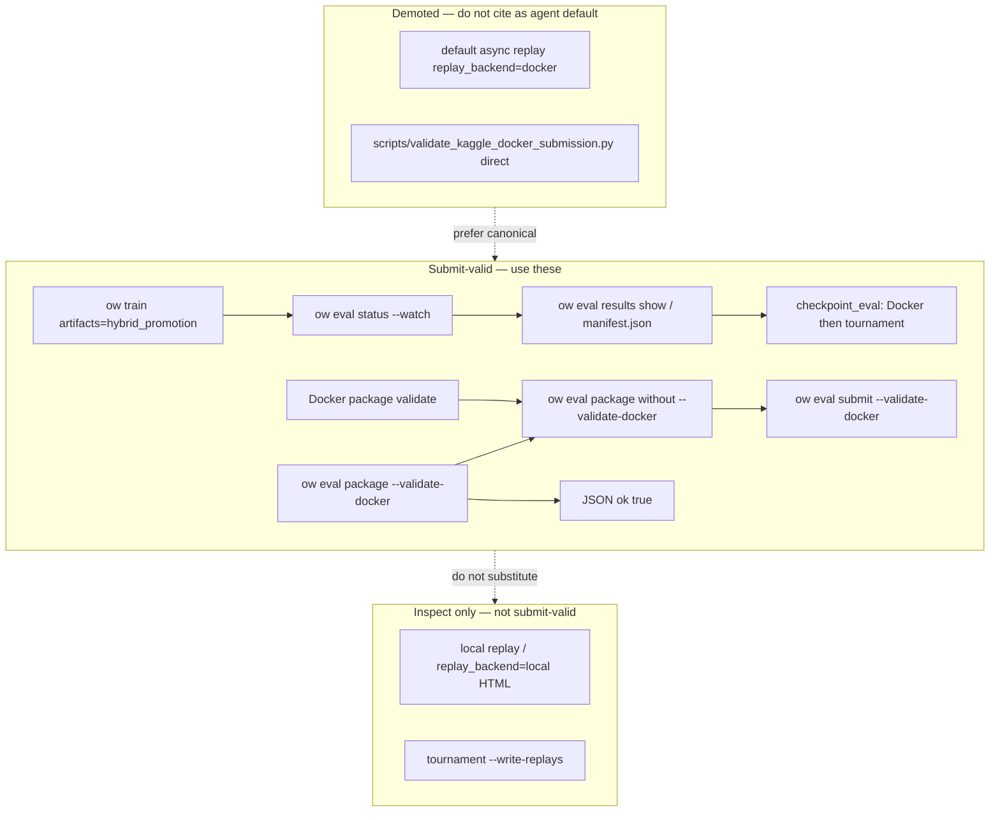

# Agent capabilities (Orbit Wars)

Task-oriented guide for coding agents. Canonical policy: `AGENTS.md`. Architecture: `docs/ONBOARDING.md`.

## Session context

```bash
make agent-context          # JSON: git branch, preflight thresholds, gate ids, GPU hint, recent runs
make agent-context RESOLVED=smoke   # also embed truncated Hydra resolved-config snapshot + hash
uv run ow train print_resolved_config=true
```

## Capability map

Operator actions agents should use (same CLI as humans). **Maintain this table when adding `ow` subcommands** — `tests/test_agent_capability_map.py` asserts each `ow` path is registered in `--help`.

| Action | Agent command |
|--------|---------------|
| Train (local Hydra) | `ow train` |
| Print resolved config | `ow train print_resolved_config=true` |
| Kaggle train lifecycle | `ow train kaggle` |
| Tournament eval | `ow eval tournament` |
| Artifact worker | `ow eval worker` |
| Eval queue status | `ow eval status` |
| Eval results list | `ow eval results list` |
| Eval result show | `ow eval results show` |
| Cancel queued jobs | `ow eval jobs cancel` |
| Package checkpoint | `ow eval package` |
| Kaggle submit | `ow eval submit` |
| List runs | `ow runs list` |
| Show run | `ow runs show` |
| Tail run logs | `ow runs logs` |
| Watch run | `ow runs watch` |
| Archive run tree | `ow runs archive` |
| Delete checkpoint file | `ow runs checkpoint delete` |
| Promotion show | `ow promote show` |
| Promotion history | `ow promote history` |
| Promotion demote | `ow promote demote` |
| Benchmark training throughput | `ow benchmark training` |
| Preflight sanity | `ow benchmark sanity` |
| Preflight gate list | `ow benchmark gate list` |
| Preflight gate run | `ow benchmark gate run` |
| Gate 5 tournament proof | `ow benchmark tournament-proof` |
| Preflight calibrate | `ow benchmark calibrate` |
| Seed-scheduler calibration | `ow benchmark calibrate-seed-scheduler` |
| Tier-1 factorized sampler bench | `ow benchmark factorized-sampler` |
| Learn-proof composer | `ow benchmark learn-proof` |
| W&B/Kaggle sweep create | `ow sweep create` |
| Sweep status | `ow sweep status` |
| Sweep list | `ow sweep list` |
| Sweep cancel | `ow sweep cancel` |
| Generate sweep YAML | `ow make` |
| Session context JSON | `make agent-context` |

## Command tiers

| Tier | Examples | Use when |
|------|----------|----------|
| **Primitive** | `ow runs list`, `ow runs watch`, `ow runs archive`, `ow runs checkpoint delete`, `ow eval status`, `ow eval results list`, `ow eval jobs cancel`, `ow promote show`, `ow promote demote`, `ow benchmark gate run beat_noop`, `ow benchmark gate run beat_random`, `ow benchmark gate run curriculum_staged`, `ow benchmark tournament-proof`, `ow benchmark factorized-sampler`, `ow sweep create --backend wandb\|kaggle`, `ow sweep cancel --backend wandb` | Inspect or mutate one artifact; compose in agent scripts |
| **Workflow** | `ow benchmark learn-proof`, `make preflight-learn-proof`, `ow train ... artifacts=hybrid_promotion` | Human/CI end-to-end gates; prefer primitives for targeted agent loops |

## Train

```bash
uv run ow train training=smoke training.total_updates=10 curriculum=off
uv run ow train print_resolved_config=true
uv run ow train kaggle preflight
```

After a run, inspect:

```bash
uv run ow runs list --limit 10
uv run ow runs show --run outputs/campaigns/<campaign>/runs/<run_id>
uv run ow runs logs --run outputs/campaigns/<campaign>/runs/<run_id> --tail 5
uv run ow runs watch --run outputs/campaigns/<campaign>/runs/<run_id> --poll-seconds 5
uv run ow runs archive --run outputs/campaigns/<campaign>/runs/<run_id> --dry-run
uv run ow runs archive --run outputs/campaigns/<campaign>/runs/<run_id> --confirm
uv run ow runs checkpoint delete --run outputs/campaigns/<campaign>/runs/<run_id> --checkpoint jax_ckpt_000100.pkl --dry-run
uv run ow runs checkpoint delete --run outputs/campaigns/<campaign>/runs/<run_id> --checkpoint jax_ckpt_000100.pkl --confirm
```

## Verify (tests)

```bash
make test-fast
make test-domain-config    # after conf/ or config schema edits
make test-domain-artifacts # after artifact / eval CLI edits
```

## Preflight / benchmarks

```bash
make preflight-sanity
make preflight-learn-proof   # GPU/time; check terminals first
make preflight-calibrate
```

**Composable gates (Phase 3 — YAML is authoritative for train overrides):**

```bash
uv run ow benchmark gate --list
uv run ow benchmark gate run beat_noop --dry-run
uv run ow benchmark gate run beat_noop --out /tmp/beat_noop.json
uv run ow benchmark gate run beat_random --dry-run
uv run ow benchmark gate run curriculum_staged --dry-run
uv run ow benchmark tournament-proof --eval-checkpoint outputs/.../jax_ckpt_last.pkl --dry-run
```

Gate recipes: `conf/benchmark/gates/*.yaml` (`beat_noop`, `beat_random`, `curriculum_staged`). **Do not edit tuple tables in `src/jax/preflight.py` for new gates** — extend YAML and `preflight_gate_loader.py`.

**Prefer primitives over `learn-proof` in agent loops:**

```bash
uv run ow benchmark learn-proof --print-primitives   # JSON command chain, no GPU
uv run ow benchmark learn-proof --steps beat_noop --dry-run
uv run ow benchmark gate run beat_noop --dry-run
uv run ow benchmark gate run beat_random --dry-run
uv run ow benchmark tournament-proof --eval-checkpoint outputs/.../jax_ckpt_last.pkl --dry-run
```

Full ladder composer (CI/human): `ow benchmark learn-proof` / `make preflight-learn-proof`.

**Sweeps (unified CLI):**

```bash
uv run ow sweep create --backend wandb --yaml outputs/_meta/sweeps/2p_only_throughput.yaml
uv run ow sweep create --backend kaggle --sweep-yaml conf/wandb_sweep/2p_only_throughput.yaml --dry-run
uv run ow sweep status --backend wandb --sweep-id <id> --project orbit_wars
uv run ow sweep cancel --backend wandb --sweep-id <id> --project orbit_wars --dry-run
```

**CRUD boundaries:** Training runs are append-only until archived — `ow runs archive` moves completed run trees to `outputs/archived/` (blocks active queue; requires `--confirm`). Checkpoint files may be removed with `ow runs checkpoint delete` (blocks current promoted incumbent). Promotion rollback: `ow promote demote`. Sweep teardown: `ow sweep cancel` (W&B active runs).

**Preflight calibrate primitive chain (prefer over monolithic sweep in agent loops):**

```bash
# Analyze existing campaigns only (no GPU train):
uv run ow benchmark calibrate --analyze-only --analyze-campaigns
uv run ow benchmark calibrate --analyze-only --analyze-jsonl path/to/log_jax.jsonl:noop_only:42:500

# Sweep then analyze (GPU; check terminals first):
uv run ow benchmark calibrate --out docs/benchmarks/preflight-calibration.json
make preflight-calibrate   # Makefile alias for sweep + refresh AGENTS thresholds
```

**Launch hygiene tier-1 (not merge throughput authority):**

```bash
uv run ow benchmark factorized-sampler --max-moves-k 5 --batch-size 32 --warmup 5 --repeats 20 --assert-max-ms 3.22
make test-launch-hygiene-throughput
```

Deprecated with one-release warnings: bare `wandb sweep`, `ow train kaggle launch --create-sweep`.

Thresholds: `docs/benchmarks/preflight-calibration.json` (never invent gate numbers).

## Eval & promotion

```bash
uv run ow eval status --run outputs/campaigns/<c>/runs/<id>
uv run ow eval status --run outputs/campaigns/<c>/runs/<id> --watch
uv run ow eval status --run outputs/campaigns/<c>/runs/<id> --watch --idle-exit-seconds 30
uv run ow eval results list --run outputs/campaigns/<c>/runs/<id>
uv run ow eval results show --run outputs/campaigns/<c>/runs/<id> --result checkpoint_eval_u000010_<id>
uv run ow eval package --checkpoint outputs/.../jax_ckpt_last.pkl --output-dir /tmp/kaggle_submit --validate-docker
uv run ow eval jobs cancel --run outputs/campaigns/<c>/runs/<id> --all-queued --dry-run
uv run ow eval jobs cancel --run outputs/campaigns/<c>/runs/<id> --job-id <uuid>
uv run ow eval worker --run outputs/campaigns/<c>/runs/<id> --verbose
uv run ow eval tournament --checkpoint outputs/.../jax_ckpt_last.pkl --baselines noop
uv run ow train ... artifacts=hybrid_promotion   # submit-valid: checkpoint_eval composite
```

### Submit-valid decision tree

Use this when the user asks whether a checkpoint is **submit-valid** (Kaggle Docker + promotion gates). Success signals are **manifest- or JSON-backed**—never local replay HTML alone.



| Goal | Command | Pass signal |
|------|---------|-------------|
| Prove during training | `ow train … artifacts=hybrid_promotion` → poll status → **results show** | `validation_ok` in `checkpoint_eval` manifest |
| Prove before upload | `ow eval package … --validate-docker` | Final JSON `"ok": true` |
| Gate 5 win proof | `ow benchmark tournament-proof --eval-checkpoint …` | Runs Docker validation first, then unified ladder; report includes `docker_validation_ok` |
| Debug policy / HTML | Local replay or `ow eval tournament --write-replays` | Inspection only; still run canonical path for submit-valid |

**Canonical submit-valid order:** Docker/packaging validate → held-out tournament ladder (Gate 5 or hybrid `checkpoint_eval`) → upload. **Manual pre-upload:** `uv run ow eval package --checkpoint <pkl> --output-dir <dir> --validate-docker` → confirm stdout JSON `"ok": true` → optional `ow benchmark tournament-proof` if win proof not already recorded → `ow eval submit … --validate-docker`.

**Inspect only (not submit-valid):** sync/async replay with `replay_backend=local`; `ow eval package` without `--validate-docker` (layout-only—stderr prints `docker_validation=skipped`); tournament `--write-replays`. After inspect, still run hybrid poll+results or `--validate-docker` before claiming submit-valid.

**Demoted paths (do not use as agent defaults):** bare `ow train` with `artifacts=default` async `replay` + `replay_backend=docker` (real Docker but wrong funnel); packaging-only; `scripts/validate_kaggle_docker_submission.py` / `scripts/run_artifact_worker.py` (prefer `ow eval package` / `ow eval worker`). Standalone `docker_validation` queue jobs are secondary to hybrid `checkpoint_eval`.

### Hybrid promotion poll contract

1. Train with `artifacts=hybrid_promotion`; note `run_dir` from `orbit_train_start`.
2. Poll: `uv run ow eval status --run <run_dir> --watch --poll-seconds 5` until queue has no `queued`/`running` jobs.
3. **Submit-valid proof:** After queue idle, read `checkpoint_evals[].validation_ok` from status JSON (or `ow eval results show --run <run_dir> --result <checkpoint_eval_id>` / `evaluations/checkpoint_eval_u*/manifest.json` for full manifest)—queue idle alone is not enough.
4. Check `promoted_manifest` in status JSON when promotion applied; worker logs under `queue/`.
5. Cancel mistaken queue entries: `ow eval jobs cancel --run <run_dir> --all-queued --dry-run` first, then without `--dry-run`.
6. Worker processing: `ow eval worker --run <run_dir> --verbose` (or rely on autostart + `queue/worker.stderr.log`).

### Promotion rollback (operator)

```bash
uv run ow promote show --campaign <c>
uv run ow promote history --campaign <c> --limit 10
uv run ow promote demote --campaign <c> --dry-run
uv run ow promote demote --campaign <c>
uv run ow promote demote --campaign <c> --to-previous
```

Clears `promoted/current_best/manifest.json` and campaign `current_best_*` fields; appends an audit row to `indexes/promoted.jsonl`. `--to-previous` restores the prior indexed promotion when its checkpoint still exists.

## Discovery

```bash
uv run ow --help
uv run ow train --help
uv run ow eval --help
uv run ow promote --help
uv run ow benchmark --help
make help
```

## Config vs code (quick boundary)

| Change via Hydra YAML / CLI only | Requires `src/` edit |
|----------------------------------|----------------------|
| Training hyperparams, opponent mix, curriculum stages | New opponent family / heuristic |
| `task=shield_*`, reward weights | New shield mode or feature schema |
| `artifacts=hybrid_promotion`, tournament baselines | PPO / rollout / env mechanics |
| Preflight threshold JSON (after calibrate) | Preflight gate recipe tuples in Python (Phase 2 YAML metadata in `conf/benchmark/gates/`) |

## Copy-paste agent prompts

**Short train smoke after CLI change**

> Run `uv run ow train training=smoke training.total_updates=5 curriculum=off task=shield_off` and confirm `orbit_train_start` / `orbit_train_complete` lines and `logs/*_jax.jsonl` under the run dir.

**Validate checkpoint for submission**

> If training: use `artifacts=hybrid_promotion`, poll `ow eval status --run <run_dir> --watch`, then `ow eval results show --run <run_dir> --result <checkpoint_eval_id>` for `validation_ok`. If one-off: `ow eval package --checkpoint <pkl> --output-dir <dir> --validate-docker` and confirm JSON `"ok": true`. Do not use local replay HTML or packaging-only as proof.

**Inspect hybrid promotion queue**

> Run `uv run ow eval status --run <run_dir> --watch --poll-seconds 5` and summarize queued/running `checkpoint_eval` jobs; when idle, read `ow eval results show` for `validation_ok`; if worker autostarted, read `queue/worker.stderr.log`.

**Cancel stale artifact jobs**

> Run `uv run ow eval jobs cancel --run <run_dir> --all-queued --dry-run`, confirm targets, then rerun without `--dry-run`.

**Rollback mistaken promotion**

> Run `uv run ow promote show --campaign <c>`, then `uv run ow promote demote --campaign <c> --dry-run` and confirm JSON action before applying without `--dry-run`.

**Preflight Gates 2–4**

> Run `uv run ow benchmark gate beat_noop --dry-run` (or `beat_random`) to verify overrides, then `make preflight-learn-proof` only if no other GPU job is active; compare report to `docs/benchmarks/preflight-calibration.json` thresholds.
