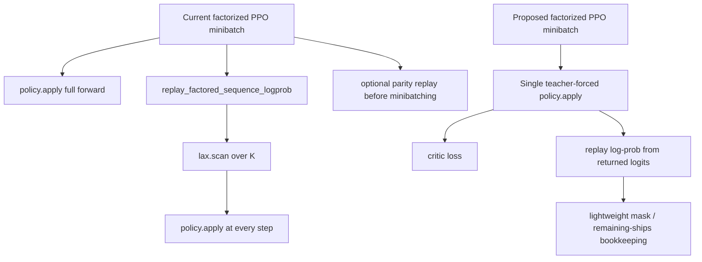

# Codex Handoff Report for the JAX PPO Codebase

## Executive summary

The highest-priority problems are the factorized PPO replay path and the continuous ship-fraction replay path. In the factorized PPO update, each minibatch currently performs one full `policy.apply(...)` for the critic path and then another replay phase that scans over sequence steps and calls `policy.apply(...)` again at every step. On top of that, a full-batch parity replay runs before minibatching. From the current control flow, that is effectively **`K + 1` full forward passes per minibatch**, plus a separate full-batch debugging replay, where `K = max_moves_k`. That is the single clearest compute bottleneck in the provided code. The good news is that the decoder already supports teacher forcing with full stored sequences, so this can be collapsed to **one forward pass per minibatch** without changing the mathematical intent of PPO replay. fileciteturn0file13 fileciteturn0file17 fileciteturn0file16 fileciteturn0file0

The continuous ship-fraction replay path is a correctness problem, not just an efficiency problem. In the factorized replay helpers, when `ship_fraction` is present, the code overwrites the current model logit with `logit_from_fraction(ship_fraction)` and then computes the “log-prob” from that action-derived value. That removes dependence on the current policy output, which makes PPO’s importance ratio mathematically wrong. Meanwhile, the joint-flat helper accepts `ship_fraction` in its signature but ignores it in the continuous branch, so the semantics are inconsistent across the two replay paths. The intended continuous-action distribution is not fully specified in the provided files, so the minimal safe patch is to centralize the continuous-action likelihood and make it explicitly parameterized by the **current** model output and the **stored** action. If that distribution is not yet fully defined, the safest interim behavior is to fail fast for continuous PPO replay rather than silently train on an invalid ratio. fileciteturn0file9 fileciteturn0file18

Several other issues are important for memory footprint and training efficiency. Returns and advantages are currently broadcast from scalar per-state values to per-sequence tensors during rollout collection, even though they can be stored once per state and broadcast only at loss time. Minibatch construction pads and materializes a full tree of minibatch tensors, which is avoidable with dynamic slicing or indexed gathering over flat arrays. The C51 value loss allocates dense two-hot targets even though each target row has only two non-zero atoms. These do not all have the same impact, but together they add avoidable memory traffic and update-time overhead. fileciteturn0file6 fileciteturn0file8 fileciteturn0file12 fileciteturn0file17

Mixed precision **can** be used in this codebase, but it should be applied selectively. The best candidates are the Dense / GRU / attention-heavy policy modules and optionally the stored feature tensors after feature construction. The worst candidates are the geometry-heavy feature computations, legality thresholds, ranking logic, softmax/log-softmax, and normalization reductions. Flax’s `dtype` and `param_dtype` controls, attention’s `force_fp32_for_softmax`, and LayerNorm’s `force_float32_reductions` are the right levers here. JAX defaults to 32-bit array creation unless configured otherwise, so any mixed-precision policy should be explicit rather than accidental. citeturn3view3turn6view0turn7view2turn8view1turn7view5

## Issue map

The table below prioritizes the requested issues for Codex implementation. File paths use the exact uploaded artifact paths, and line ranges are from local inspection of those uploaded files. Supporting file citations appear after the table.

| Issue | Primary files and local line ranges | Severity | Primary symptom | Best first fix |
|---|---|---:|---|---|
| Continuous ship-fraction log-prob bug | `src/jax/action_codec.py` 172-230, 269-338, 461-488; `src/jax/ship_action.py` 32-42 | Critical correctness | PPO ratio does not consistently depend on current policy parameters in continuous mode | Centralize continuous-action likelihood; parameterize by current logits plus stored action; fail fast if distribution is unspecified |
| Factorized PPO calling policy too many times | `src/jax/decoders/factored_sequence_scan.py` 49-228, esp. 88-109; `src/jax/ppo_update.py` 542-560, 636-672; `src/jax/policy.py` 541-565; `src/jax/decoders/factorized_topk_pointer.py` 43-177 | Critical compute | `K + 1` forward passes per minibatch plus parity replay | Single-pass teacher-forced replay using stored sequences |
| Missing value-only path | `src/jax/policy.py` 194-281, 521-578; `src/jax/ppo_update.py` 636-700 | High | Separate critic evaluation requires unnecessary decoder work | Add `value_only` / `encode_value` method if single-pass replay is not implemented first |
| Rollout tensor duplication and broadcasting | `src/jax/rollout/collect.py` 365-375; `src/jax/rollout/types.py` 13-37; `src/jax/ppo_update.py` 186-212 | High | Redundant storage; repeated per-step value loss weighting | Store scalar returns/advantages once per state; broadcast only at the policy-objective site |
| Padded minibatch materialization | `src/jax/ppo_update.py` 95-107, 271-338, 562-620 | High | Full padded minibatch trees increase memory traffic | Slice flat arrays dynamically per minibatch instead of prebuilding all minibatches |
| C51 dense target allocation | `src/jax/distributional_value.py` 27-62; `src/jax/ppo_update.py` 186-212; `src/jax/policy.py` 255-281 | Medium-high | Dense target buffer for sparse two-atom targets | Replace dense target tensor with direct two-atom cross-entropy |
| Precision-sensitive geometry computations | `src/jax/feature_primitives.py` 43-62, 85-102, 105-155; `src/jax/features.py` 160-207, 224-346; `src/jax/encoders/planet_encoder_common.py` 47-69 | High stability risk | Lower precision can flip masks, rankings, and threshold decisions | Keep geometry in fp32; cast only assembled features / network compute to bf16 |

These issues are all directly evidenced in the uploaded files. The replay and value-path findings are in the PPO and decoder code; the broadcasting and minibatch findings are in rollout collection and update code; the C51 target allocation is explicit in the value-loss helper; and the geometry sensitivity is visible in the trigonometric, square-root, distance-threshold, and edge-ranking code paths. fileciteturn0file9 fileciteturn0file13 fileciteturn0file17 fileciteturn0file6 fileciteturn0file8 fileciteturn0file12 fileciteturn0file14 fileciteturn0file15 fileciteturn0file3

The interaction between these issues matters. If Codex first rewrites factorized replay as a single full-sequence teacher-forced apply, the “missing value-only path” becomes much less urgent because the same forward pass can serve both actor replay and critic loss. If Codex also stops broadcasting returns/advantages during rollout, the C51 loss can be computed once per state rather than once per sub-action step, which compounds the memory and compute savings. That is why the recommended roadmap below groups some fixes together rather than treating them as independent patches.

## Detailed issue analyses

### Continuous ship-fraction log-prob bug

**Evidence and description.** In `src/jax/action_codec.py`, the factorized replay helper `factored_action_log_prob_and_entropy(...)` replaces `ship_logit` with `_logit_from_fraction(ship_fraction)` at lines 225-226 before calling `_continuous_fraction_log_prob(ship_logit)` at line 227. The lower-level `_factored_step_log_prob_entropy(...)` repeats the same pattern at lines 332-336. By contrast, the joint-flat helper `action_log_prob_and_entropy(...)` accepts a `ship_fraction` argument in its signature at line 465 but ignores it in the continuous branch at lines 484-487. The transformation helpers are also duplicated in `src/jax/ship_action.py` at lines 32-42, which increases the chance of semantic drift. fileciteturn0file9 fileciteturn0file18

**Root cause.** PPO requires `\log \pi_\theta(a \mid s)` under the **current** policy parameters and the **stored** action, because the clipped objective depends on the ratio between the new and old policy probabilities. The current factorized implementation instead derives a “logit” from the stored action and computes a pseudo-density from that action-derived value, which removes dependence on the current policy output. That breaks the importance ratio. The joint-flat implementation goes the other way and ignores the stored continuous action entirely in its continuous branch. Those two paths cannot both be correct. The larger architectural problem is that the actual continuous-action distribution is not fully specified in the provided files: there is a scalar head width of `1`, a sigmoid-like transform, and a replay-time “log density,” but no explicit stochastic family or scale parameter is visible in the uploaded artifacts. fileciteturn0file9 fileciteturn0file18

**Recommended code change.** The safest handoff instruction to Codex is: centralize continuous-action replay into one function that explicitly computes `log_prob(current_policy_params, stored_fraction)` and call it from both joint-flat and factorized paths. If the intended stochastic family is not already implemented elsewhere in the repo, Codex should first add a **guardrail patch** that raises on `continuous_fraction` PPO replay instead of silently computing bad ratios. If the intended family is logistic-normal or Beta-like, Codex should implement that explicitly with parameters emitted by the model. A minimal interface would look like this:

```python
def continuous_fraction_log_prob_from_action(
    policy_loc: jax.Array,
    action_fraction: jax.Array,
    *,
    log_scale: jax.Array | None = None,
) -> jax.Array:
    frac = jnp.clip(action_fraction.astype(jnp.float32), 1e-6, 1.0 - 1e-6)
    z = jnp.log(frac) - jnp.log1p(-frac)  # inverse-sigmoid
    if log_scale is None:
        raise ValueError("Continuous fraction PPO replay requires an explicit distribution.")
    inv_scale = jnp.exp(-log_scale)
    standardized = (z - policy_loc) * inv_scale
    base_log_prob = -standardized - 2.0 * jax.nn.softplus(-standardized) - log_scale
    log_abs_det_jacobian = -jnp.log(frac) - jnp.log1p(-frac)
    return base_log_prob + log_abs_det_jacobian
```

That example is illustrative rather than prescriptive; the key requirement is that the log-prob depend on **current model outputs** and the **stored action**. The current code does not satisfy that. fileciteturn0file9

**Validation tests.** Add a unit test asserting that, for fixed `ship_fraction`, changing the model’s ship head output changes the replay log-prob in continuous mode. Add a second test asserting that the factorized and joint-flat helpers agree on continuous-action semantics for equivalent logits and actions. Add a gradient test that verifies non-zero gradient of replay log-prob with respect to the current ship head parameters. If a full explicit distribution is implemented, add numerical agreement tests against a reference implementation for a few hand-picked fractions near `0`, `0.5`, and `1`. fileciteturn0file9 fileciteturn0file18

**Estimated impact and risk.** Impact is mostly on correctness, not speed. If continuous ship mode is used, this bug can invalidate PPO ratios and destabilize training. Risk is moderate because the true intended distribution is unspecified in the provided files; the guardrail patch is therefore lower risk than a guessed probabilistic implementation. PPO’s clipped objective is explicitly defined in terms of the new-to-old policy probability ratio, so getting this likelihood wrong is a first-order algorithmic error. citeturn9academia1turn10view0

### Factorized PPO calling policy too many times

**Evidence and description.** The factorized PPO path calls `factored_logprob_parity_metrics(...)` before minibatching at `src/jax/ppo_update.py` lines 542-560, which itself calls `replay_factored_sequence_logprob(...)`. Inside `replay_factored_sequence_logprob(...)`, `/mnt/data/factored_sequence_scan.py` lines 88-109 show a `lax.scan` whose body calls `policy.apply(params, batch, **apply_kwargs)` at every sequence step. Then, inside the minibatch loss, `src/jax/ppo_update.py` lines 636-672 call `policy.apply(...)` once more at line 641 and then call `replay_factored_sequence_logprob(...)` again at lines 657-672. That means each minibatch does one full forward pass for the critic output and another replay phase that does one full forward pass **per sequence step**. fileciteturn0file13 fileciteturn0file17

**Root cause.** Replay was implemented to mimic rollout’s prefix-growing decode loop exactly, but the decoder already supports teacher forcing with full stored `source_sequence` and `target_slot_sequence`. In `src/jax/decoders/factorized_topk_pointer.py`, the decoder loops over steps internally and uses the provided stored sequence values only after each step’s logits are computed, which is the standard teacher-forcing pattern. In `src/jax/policy.py`, `ComposableFactorizedPlanetPolicy.__call__` already forwards those stored sequences to the decoder and returns full-sequence logits plus the critic output in one call. So the expensive prefix-scan replay is not needed to recover step-aligned logits for the stored trajectory. fileciteturn0file0 fileciteturn0file16

**Recommended code change.** Replace the per-step replay with a single teacher-forced forward call. Concretely: inside factorized PPO loss, call `policy.apply(...)` **once** with `source_sequence=minibatch["source"]`, `target_slot_sequence=minibatch["target_slot"]`, `player_count=minibatch["player_count"]`, `deterministic=True`, and `decoder_hidden` if needed. Then compute per-step log-probs and entropies directly from the returned full-sequence logits and the stored actions, using the existing shield masks and, if necessary, a lightweight scan only to update `remaining_ships` and derive legality masks step by step.

```python
output = policy.apply(
    params,
    mb_batch,
    player_count=minibatch["player_count"],
    source_sequence=minibatch["source"],
    target_slot_sequence=minibatch["target_slot"],
    decoder_hidden=decoder_hidden_arg,
    deterministic=True,
)

replay = factored_action_log_prob_with_shield(
    output,
    source_index=minibatch["source"],
    target_slot=minibatch["target_slot"],
    ship_bucket=minibatch["bucket"],
    stop_flag=minibatch["stop_flag"],
    step_mask=minibatch["mask"],
    source_mask=source_mask_seq,          # computed from stored masks / remaining ships
    ship_bucket_mask=minibatch["ship_bucket_mask"],
    ship_fraction=fraction_arg,
)
```

As a companion patch, make parity diagnostics opt-in, for example with `cfg.training.debug_replay_parity`. The current code computes useful debug metrics, but running the full replay path on every update is expensive enough that it should not be the default training path. fileciteturn0file9 fileciteturn0file13 fileciteturn0file16 fileciteturn0file17

**Validation tests.** Add a parity test that compares the old prefix-scan replay outputs and the new single-pass teacher-forced replay outputs on fixed random inputs for `log_prob`, `entropy`, `stop_entropy`, and `move_entropy`. Add a training-step regression test ensuring the new PPO loss matches the old implementation on a small synthetic batch when continuous mode is disabled. Add a benchmark test that measures wall-clock update time for sequence lengths `K = 2, 4, 8` and asserts a meaningful reduction. Since `jax.lax.scan` is a JAX primitive lowered to a single `WhileOp`, the current code is structurally compact at compile time, but it still executes the replay body `K` times at runtime; collapsing those repeated full forward passes is therefore still valuable. citeturn3view2

**Estimated impact and risk.** If `K = 8`, the current flow performs about nine policy forwards per minibatch excluding the separate parity pass, while the proposed version performs one. That is an inference from the control flow and likely yields the biggest end-to-end training speedup in this report. Risk is moderate because the replay refactor touches the PPO hot path, but parity tests can de-risk it quickly. fileciteturn0file13 fileciteturn0file17

### Missing value-only path

**Evidence and description.** In `src/jax/policy.py`, the value heads are modular and separate from the decoder at lines 194-281, but `ComposableFactorizedPlanetPolicy.__call__` at lines 541-565 always runs the encoder, then the full decoder, and only then the critic head. There is no dedicated method to compute only the critic output from the encoded state. In the current factorized PPO loss, that means the extra `policy.apply(...)` used for value loss cannot avoid decoding work even if replay logits are computed elsewhere. fileciteturn0file16

**Root cause.** The module composition is clean, but the public apply surface is monolithic. The critic head is logically separable, yet the enclosing policy module only exposes “actor + critic together.” That is why `src/jax/ppo_update.py` line 641 currently pays for a full decoder call even though the replay step separately recomputes action log-probs. fileciteturn0file16 fileciteturn0file17

**Recommended code change.** If the single-pass replay refactor above is implemented first, this becomes optional, because one teacher-forced forward can provide both replay logits and critic outputs. If that refactor is postponed, add a `value_only` path. The cleanest way in Flax Linen is to move any default critic instantiation out of `__call__` and into `setup`, then expose helper methods:

```python
class ComposableFactorizedPlanetPolicy(nn.Module):
    encoder_module: nn.Module
    decoder_module: FactorizedTopKPointerDecoder
    value_head_module: nn.Module | None = None
    hidden_size: int = 128
    decoder_carry: bool = False

    def setup(self):
        self.value_head = self.value_head_module or SharedValueHead(hidden_size=self.hidden_size)

    def encode_only(self, batch):
        return self.encoder_module(batch)

    def value_only(self, batch, player_count=None):
        encoder_out = self.encode_only(batch)
        return self.value_head(encoder_out.value_input, player_count=player_count)

    def __call__(...):
        ...
```

Then use `policy.apply(params, mb_batch, player_count=..., method=policy.value_only)` in PPO where only critic outputs are needed. fileciteturn0file16

**Validation tests.** Add a test asserting that `value_only(...)` exactly matches the `value` and `value_logits` returned by the full `__call__(...)` path for the same batch and parameters. Add a benchmark test to quantify the standalone value path versus the full forward path. fileciteturn0file16

**Estimated impact and risk.** On its own, a value-only path saves at most one full forward per minibatch, so its impact is smaller than the replay refactor. If single-pass replay is implemented, the dedicated value-only method becomes mostly a code-quality / evaluation utility rather than a critical training optimization. Risk is low. fileciteturn0file16

### Rollout tensor duplication and broadcasting of returns and advantages

**Evidence and description.** In `/mnt/data/collect.py`, `returns_step` and `advantages_step` are generated as scalar tensors per environment step and then broadcast to `data["target_index"].shape` at lines 372-375. `JaxTransitionBatch` in `/mnt/data/types.py` stores these expanded tensors as `returns` and `advantages`. In `src/jax/ppo_update.py`, `_value_loss_per_step(...)` then expects sequence-shaped `returns` and broadcasts the scalar critic output across that axis. fileciteturn0file6 fileciteturn0file8 fileciteturn0file17

**Root cause.** The rollout schema was aligned to action-sequence tensors for convenience, so scalar state-level targets were expanded early. That simplifies masking logic later, but it stores redundant data and forces value-loss code to operate on repeated targets. There is also a subtle secondary issue on the factorized path: because value loss is averaged with `step_mask`, states with more active sub-actions can receive proportionally more critic weight than states with fewer active sub-actions. PPO’s canonical presentation fits the value function once per state, not once per decomposed sub-action. fileciteturn0file6 fileciteturn0file17 citeturn9academia1turn10view0

**Recommended code change.** Store the scalar targets once per state and broadcast late only where needed for the actor surrogate. That means changing rollout collection to keep `returns_step` and `advantages_step` in state shape, updating `JaxTransitionBatch` accordingly, and then using `advantages[:, None]` (or `advantages[..., None]`) only when multiplying by per-step policy ratios. Critic loss should be computed once per state.

```python
# collect.py
transition_kwargs["returns"] = returns_step          # shape [T, N]
transition_kwargs["advantages"] = advantages_step    # shape [T, N]

# ppo_update.py
returns = batch.returns.reshape(env_rows)            # shape [B]
advantages = batch.advantages.reshape(env_rows)      # shape [B]
policy_adv = advantages[:, None]                     # broadcast late for per-step ratio
value_error = value_loss_scalar(output.value, output.value_logits, returns)
policy_objective = jnp.minimum(policy_adv * ratio, policy_adv * clipped_ratio)
```

If backward compatibility is needed, Codex can accept either `[B]` or `[B, K]` for a transition period and normalize internally. fileciteturn0file6 fileciteturn0file8 fileciteturn0file17

**Validation tests.** Add a regression test showing that the actor loss matches the current implementation when late-broadcasting is used. Add a critic-loss test showing that two otherwise identical states with different active sequence lengths now receive equal critic weighting. Add a rollout-memory test that checks buffer sizes before and after the schema change. fileciteturn0file6 fileciteturn0file17

**Estimated impact and risk.** Memory savings for these two tensors are exactly the eliminated repetition factor: with fp32 storage, savings are `2 * T * N * (K - 1) * 4` bytes. That is usually not the dominant memory consumer compared with feature tensors, but it is easy to realize and also simplifies later value-loss fixes. The larger benefit is indirect: once returns are state-level, the critic and especially C51 value loss can be computed once per state rather than once per action step. Risk is medium because it changes the transition schema. fileciteturn0file6 fileciteturn0file8 fileciteturn0file17

### Padded minibatch materialization

**Evidence and description.** `_reshape_minibatches(...)` in `src/jax/ppo_update.py` lines 95-107 pads an entire flat array to `minibatch_count * minibatch_size` and reshapes it into a full minibatch tensor. Both the joint-flat path and the factorized path build a large `minibatches` dictionary by doing this for essentially every field of the transition batch. That happens at lines 271-338 for the joint-flat path and lines 562-620 for the factorized path. fileciteturn0file17

**Root cause.** The current implementation chooses static minibatch shapes up front and then scans over those prebuilt minibatches. That is compilation-friendly, but it means the code materializes padded arrays for the entire minibatch tree ahead of time. For large rollout buffers with heavy observation tensors, that increases update-time memory pressure and memory traffic. PPO chunk size is configured via a single Hydra key `training.update_chunk_rows` (effective rows per scan step = `min(update_chunk_rows, total_rows)`). JAX provides dynamic slicing primitives specifically for static-size slices with dynamic start indices. `jax.lax.dynamic_slice` is an XLA DynamicSlice wrapper, and `dynamic_slice_in_dim` is its one-axis convenience form with a dynamic start index and static slice size. citeturn3view0turn12view0

**Recommended code change.** Avoid padding each tensor into a full minibatch tree. A practical pattern is to pad only a single integer row-id array, slice that row-id array dynamically, and then gather the actual minibatch rows from each flat tensor. That keeps static minibatch sizes for JIT while avoiding full-tree materialization.

```python
row_ids = jnp.pad(
    jnp.arange(total_rows, dtype=jnp.int32),
    (0, minibatch_count * minibatch_size - total_rows),
    constant_values=-1,
)

def slice_minibatch(flat_tree, mb_idx):
    ids = jax.lax.dynamic_slice_in_dim(
        row_ids, mb_idx * minibatch_size, minibatch_size, axis=0
    )
    valid = (ids >= 0).astype(jnp.float32)
    safe_ids = jnp.clip(ids, 0, jnp.maximum(total_rows - 1, 0))
    mb_tree = jax.tree.map(lambda x: x[safe_ids], flat_tree)
    return mb_tree, valid
```

That is the best “low complexity, real savings” patch here. If Codex wants the absolute lowest memory footprint, it can go one step further and use a per-field gather without any padded row-id array at all, but the row-id pattern is the cleanest first patch. citeturn12view0turn12view1

**Validation tests.** Add a test asserting that every original row appears exactly once and padded rows are fully masked. Add a numerical regression test comparing losses and gradients against the current `_reshape_minibatches(...)` implementation for a few non-divisible batch sizes. Use JAX device memory profiling during a representative update step to verify lower live-buffer pressure. JAX’s device memory profiling tools are explicitly intended for diagnosing large GPU/TPU memory use and OOMs. citeturn20view1turn20view2

**Estimated impact and risk.** Expected benefit is medium-to-high on larger observation batches because this change reduces padded intermediate storage in the PPO update step. Risk is medium: dynamic slicing and indexed gathers interact with JIT shape constraints, so tail handling must be tested carefully.

### C51 dense target allocation

**Evidence and description.** In `/mnt/data/distributional_value.py`, `project_returns_to_two_hot(...)` at lines 27-50 allocates a dense `targets` tensor of shape `[rows, value_bins]`, then writes only two non-zero entries per row. `categorical_value_cross_entropy(...)` at lines 53-62 then multiplies that dense tensor by `log_softmax(logits)`. In `src/jax/ppo_update.py`, `_value_loss_per_step(...)` lines 186-212 broadcasts the same `value_logits` along the sequence axis when the distributional head is enabled. fileciteturn0file12 fileciteturn0file17

**Root cause.** The code is implementing the standard C51 two-neighbor projection, but it materializes the sparse target in dense form. Because each projected return lies between two adjacent atoms on an evenly spaced support, each target row contains only two non-zero weights. The current helper therefore allocates and touches a lot of zeros unnecessarily. The original C51 paper motivates the categorical support representation; the two-neighbor projection is also exactly what the current code already computes internally before densifying it. fileciteturn0file12 citeturn9academia0

**Recommended code change.** Replace dense target construction with direct two-atom cross-entropy. This avoids the dense target tensor entirely and still uses the same projected indices and weights.

```python
def categorical_value_cross_entropy_sparse(
    logits: jax.Array,
    returns: jax.Array,
    support: jax.Array,
) -> jax.Array:
    returns = returns.astype(jnp.float32)
    vmin = support[0]
    delta = support[1] - support[0]
    clipped = jnp.clip(returns, vmin, support[-1])
    position = (clipped - vmin) / delta
    lower = jnp.floor(position).astype(jnp.int32)
    lower = jnp.clip(lower, 0, support.shape[0] - 2)
    upper = lower + 1
    upper_w = position - lower.astype(jnp.float32)
    lower_w = 1.0 - upper_w

    log_probs = jax.nn.log_softmax(logits.astype(jnp.float32), axis=-1)
    lp_lower = jnp.take_along_axis(log_probs, lower[..., None], axis=-1).squeeze(-1)
    lp_upper = jnp.take_along_axis(log_probs, upper[..., None], axis=-1).squeeze(-1)
    return -(lower_w * lp_lower + upper_w * lp_upper)
```

If the rollout target patch above is applied, compute this loss once per state rather than once per sequence step. That compounds the savings. fileciteturn0file12 fileciteturn0file17

**Validation tests.** Add an exact-equivalence test comparing the dense and sparse cross-entropy implementations across random logits and returns. Add shape tests for both scalar and batched inputs. Add a benchmark test to compare peak memory and runtime when `value_bins=51`. fileciteturn0file12

**Estimated impact and risk.** Compute for `log_softmax` remains `O(B * Z)` because normalization still spans all atoms, but the target allocation and the dense multiply-sum over mostly zeros disappear. With `Z = 51`, the scratch target buffer can be reduced from dense `[B, 51]` storage to just a few `[B]` index/weight vectors. Risk is low. fileciteturn0file12

### Precision-sensitive geometry computations

**Evidence and description.** The feature code performs many precision-sensitive operations before forming masks and edge orderings: square roots, trigonometric transforms, inverse trig, point-to-segment distances, threshold comparisons, rotation into a learner frame, and lexicographic ranking by geometric scores. Examples include `incoming_fleet_pressure(...)` at `/mnt/data/feature_primitives.py` lines 43-62, `shot_crosses_sun_xy(...)` at lines 85-93, `point_to_segment_distance_xy(...)` at lines 96-102, `rotate_to_learner_frame(...)` and `theta_ref(...)` later in that file, and the intercept-distance and edge-ranking logic in `/mnt/data/features.py` lines 160-207 and 224-346. The encoder side also derives orbit coordinates and spatial attention biases from geometry-like feature channels in `/mnt/data/planet_encoder_common.py` lines 47-69. fileciteturn0file14 fileciteturn0file15 fileciteturn0file3

**Root cause.** These computations are not just continuous feature transforms; they drive **discrete decisions**: legal-vs-illegal masks, sun-crossing booleans, rotation-region checks, top-K target ordering, and potentially attention biases. Lower precision can therefore do more than add small noise. It can flip a threshold, alter the neighbor order, or change a legality mask. Those are not graceful numeric degradations; they can alter the sampled action space itself. That makes geometry the wrong place to apply bf16/fp16 aggressively. fileciteturn0file14 fileciteturn0file15

**Recommended code change.** Keep all feature-construction geometry in fp32. Only cast to bf16 after the discrete decisions are fixed and the final dense feature tensors are assembled. Concretely, keep fp32 for `theta_ref`, all trigonometric and distance calculations, intercept ranking, `crosses_now`, `edge_mask`, and any attention bias built from coordinates. If rollout memory is a problem, cast only the final `planet_features`, `edge_features`, and `global_features` arrays before storage, while keeping masks as bool and IDs as int32. On the model side, use mixed precision in the Dense / GRU / attention stack, but keep layernorm reductions and attention softmax in fp32. Flax explicitly supports compute `dtype`, parameter `param_dtype`, fp32 softmax in attention, and fp32 reductions in normalization. citeturn6view0turn7view2turn8view1turn7view5

**Validation tests.** Add a deterministic feature-parity test comparing a pure-fp32 feature build and a “cast-after-assembly” feature build. Require exact equality for masks and index orderings (`edge_mask`, chosen edge order, `crosses_now`) and bounded tolerance only for the final continuous feature values after casting. Add training smoke tests checking for finite losses and stable early rollout metrics under bf16 network compute. fileciteturn0file14 fileciteturn0file15

**Estimated impact and risk.** Keeping geometry in fp32 does not prevent meaningful memory savings, because the heavier memory consumers are usually the network activations and stored rollout features. Casting the assembled feature tensors to bf16 approximately halves their storage cost. Risk is low if the cast happens only after masks and rankings are finalized. fileciteturn0file15

## Mixed precision strategy

Yes: mixed precision can be used profitably in this codebase, but it should be **selective** rather than global. The best candidates are the learned network modules: the shared MLP helper in `/mnt/data/planet_encoder_common.py`, the transformer attention and feed-forward blocks in `/mnt/data/planet_graph_transformer.py`, the factorized pointer decoder in `src/jax/decoders/factorized_topk_pointer.py`, and the value heads in `src/jax/policy.py`. Those are exactly the kinds of layers for which Flax exposes `dtype` and `param_dtype`. By default, JAX array creation is 32-bit, so reducing memory footprint here requires explicit dtype choices. fileciteturn0file3 fileciteturn0file4 fileciteturn0file0 fileciteturn0file16 citeturn3view3turn6view0

A good default is **bf16 compute, fp32 parameters** for Dense / GRU / attention / FFN modules. Flax’s Dense docs state that `dtype` controls compute dtype while `param_dtype` controls the dtype passed to parameter initializers, with float32 as the default parameter dtype. Multi-head attention similarly exposes `dtype`, `param_dtype`, and `force_fp32_for_softmax`, and LayerNorm exposes `force_float32_reductions`. Those are exactly the numerically safe mixed-precision hooks this code should use. citeturn6view0turn7view2turn8view1turn7view5

```python
COMPUTE_DTYPE = jnp.bfloat16
PARAM_DTYPE = jnp.float32

def mp_dense(features, *, name):
    return nn.Dense(
        features,
        name=name,
        dtype=COMPUTE_DTYPE,
        param_dtype=PARAM_DTYPE,
    )

attn = nn.MultiHeadDotProductAttention(
    num_heads=self.attention_heads,
    qkv_features=self.hidden_size,
    out_features=self.hidden_size,
    dtype=COMPUTE_DTYPE,
    param_dtype=PARAM_DTYPE,
    force_fp32_for_softmax=True,
    name=f"planet_tx_attn_{self.layer_idx}",
)

norm = nn.LayerNorm(
    dtype=COMPUTE_DTYPE,
    param_dtype=PARAM_DTYPE,
    force_float32_reductions=True,
    name=f"planet_tx_norm_attn_{self.layer_idx}",
)

gru = nn.GRUCell(
    features=self.hidden_size,
    dtype=COMPUTE_DTYPE,
    param_dtype=PARAM_DTYPE,
    name="factorized_dec_gru",
)
```

That pattern is aligned with Flax’s documented module dtype controls. citeturn6view0turn8view2turn7view2turn7view5

For probability math, always upcast to fp32 before `softmax` / `log_softmax` / entropy calculations. Flax’s attention docs explicitly note that fp32 softmax is useful for mixed-precision numerical stability, and JAX exposes explicit casting via `Array.astype(...)`. citeturn8view1turn12view2

```python
def stable_log_softmax(logits: jax.Array) -> jax.Array:
    return jax.nn.log_softmax(logits.astype(jnp.float32), axis=-1)

def stable_entropy_from_logits(logits: jax.Array) -> jax.Array:
    logits32 = logits.astype(jnp.float32)
    log_probs = jax.nn.log_softmax(logits32, axis=-1)
    probs = jax.nn.softmax(logits32, axis=-1)
    return -(probs * log_probs).sum(axis=-1)
```

The one place *not* to apply low precision early is the geometry and ranking pipeline discussed above. A practical deployment rule is: **fp32 for geometry, masks, normalization reductions, support construction, advantages/returns, and log-prob math; bf16 for learned matrix-heavy compute and optionally final stored feature tensors after assembly.** fileciteturn0file14 fileciteturn0file15 citeturn6view0turn8view1turn7view5

## Validation and rollout plan

The implementation order below is designed to maximize benefit quickly while limiting rollback risk.



The current path duplicates work structurally; the proposed path uses the decoder exactly once in the form it was already designed to support. fileciteturn0file13 fileciteturn0file16 fileciteturn0file17

| Priority | Patch | Dev effort | Testing time | Expected benefit | Risk mitigation |
|---|---|---|---|---|---|
| Highest | Single-pass factorized replay; gate parity diagnostics | Medium | Medium | Largest compute win; major wall-clock reduction | Keep old replay behind a feature flag and parity-test both paths |
| Highest | Continuous ship replay guardrail or explicit distribution | Medium to High | Medium | Fixes invalid PPO ratio in continuous mode | Start with fail-fast guard if full distribution semantics are uncertain |
| High | Store scalar returns/advantages; compute critic loss once per state | Medium | Medium | Moderate memory win; cleaner value loss semantics | Backward-compatible transition schema adapter |
| High | Sparse two-atom C51 cross-entropy | Low | Low | Low-risk memory and compute reduction | Compare exact outputs against dense version |
| High | Replace padded minibatch trees with row-id dynamic slicing / gather | Medium | Medium | Lower update-time memory pressure | Regression tests on divisible and non-divisible batch sizes |
| Medium | Selective mixed precision in network modules | Medium | Medium | Lower activation/feature memory; possibly higher throughput | Keep fp32 “islands” for geometry, softmax, and reductions |
| Optional | Dedicated `value_only` apply path | Low | Low | Useful only if single-pass replay is delayed | Verify exact match to full-path value output |

For performance validation, use JAX’s device memory profiling around one PPO update step and compare before/after peak memory profiles. JAX recommends XProf for device memory analysis and also documents `jax.profiler.save_device_memory_profile()` for investigating GPU/TPU memory use and OOMs. Because memory use inside a `jit`-compiled function is attributed at function granularity, measure the update step as a whole and compare representative profiles rather than chasing individual allocations too literally. citeturn20view1turn20view2

A minimal acceptance gate for Codex should be: exact replay-parity on fixed seeds for discrete modes, finite losses under mixed precision, unchanged legal-action masks and edge ordering under the “cast-after-assembly” feature path, dense-vs-sparse C51 equivalence within floating-point tolerance, and update-step memory profiles that clearly move in the right direction. The PPO paper and OpenAI Spinning Up reference both emphasize that PPO’s clipped ratio objective depends on stable log-prob computations, and Spinning Up also calls out KL-based early stopping as a standard guardrail. The current code already computes approximate KL diagnostics, so adding an optional early-stop threshold would be a sensible follow-on once the hot-path refactors above are landed. citeturn9academia1turn10view0

## Authoritative references and open questions

The references most directly relevant to the requested fixes are listed below.

| Topic | Why it matters here | Source |
|---|---|---|
| PPO clipped objective and value fitting | Confirms actor ratio semantics and separate value fitting | citeturn9academia1turn10view0 |
| C51 distributional value | Grounds the categorical value head and support representation | citeturn9academia0 |
| JAX `scan` | Explains that `scan` is a primitive lowered to a single `WhileOp` | citeturn3view2 |
| JAX `dynamic_slice` / `dynamic_slice_in_dim` | Supports dynamic minibatch slicing without prebuilding full minibatch trees | citeturn3view0turn12view0 |
| JAX default dtypes and explicit casts | Supports explicit mixed-precision policy rather than relying on defaults | citeturn3view3turn12view2 |
| JAX gradient checkpointing | Relevant to existing remat use and memory/compute tradeoffs | citeturn3view5turn3view6 |
| Flax Dense `dtype` / `param_dtype` / `promote_dtype` | Supports bf16 compute with fp32 parameters | citeturn6view0 |
| Flax MultiHeadDotProductAttention `force_fp32_for_softmax` | Supports safe mixed-precision attention | citeturn7view2turn8view1 |
| Flax LayerNorm `force_float32_reductions` | Supports safe mixed-precision normalization | citeturn7view5turn6view2 |
| JAX device memory profiling | Supports before/after update-step memory validation | citeturn20view1turn20view2 |

Two limitations should be called out clearly for Codex. First, the full intended semantics of continuous ship-fraction sampling are **not fully specified in the provided files**. The replay helpers and transform functions are present, but the stochastic family that would make PPO replay mathematically well-defined is not explicit in the uploaded artifacts, so that fix may require checking non-uploaded sampler code before finalizing the full implementation. Second, the report is based on the uploaded file artifacts at `src/jax/...`; if the actual repo paths differ, Codex should map these findings onto the corresponding in-repo modules before patching. fileciteturn0file9 fileciteturn0file18

## Resolved

### `deterministic_eval` forced all `max_moves_k` launch slots in docker/tournament/submission eval

- **Symptom:** Docker replays showed most turns emitting exactly `max_moves_k` moves (often duplicate 1-ship rows), unlike training rollouts where the learner uses stochastic sampling and the stop head can end the scan early.
- **Root cause:** `_sample_factored_step_from_logits` in `src/jax/action_sampling.py` set `stop=0` when `deterministic & deterministic_eval & can_launch`. Submission, tournament checkpoint agents, and the docker `MAIN_TEMPLATE` compiled with `deterministic_eval=True` while training rollouts never set that flag.
- **Fix (2026-06-01):** Removed `deterministic_eval` and the stop override; deleted joint-flat eval-only NOOP/bucket helpers. Eval/submission now use `deterministic=True` with the same stop threshold (`stop_prob >= 0.5`) as frozen self-play opponents. Learner rollouts remain `deterministic=False`.
- **Verification:** `tests/test_submission_eval_deterministic.py` (stop respected under deterministic sampling), updated factorized replay parity tests, `make test-fast`.
