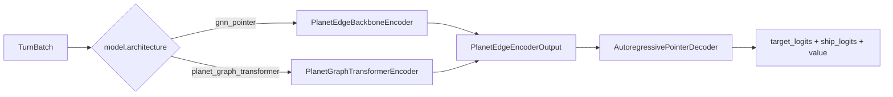

# JAX policy encoder stage

Planet-edge policies share a composable shell: a backbone encoder maps `TurnBatch`
to per-edge candidate embeddings, then an autoregressive pointer decoder selects
up to `max_moves_k` launches per turn.

## Encoder dispatch

## Modules

| Module | Path | Role |
|--------|------|------|
| Shared contracts/helpers | `src/jax/encoders/planet_encoder_common.py` | `PlanetEdgeEncoderOutput`, tgt-aware edge fusion, pooling |
| GNN backbone | `src/jax/policy.py` (`PlanetEdgeBackboneEncoder`) | k-NN spatial message passing |
| Transformer backbone | `src/jax/encoders/planet_graph_transformer.py` | Masked planet self-attention + spatial bias |
| Policy factory | `src/jax/policy.py` (`build_jax_policy`) | Architecture dispatch |
| Remat helper | `src/jax/encoders/remat.py` | Optional `nn.remat` wrapper for encoder blocks |
| Checkpoint guard | `src/artifacts/checkpoint_compat.py` | `encoder_backbone` metadata plane |

## Gradient checkpointing

When `training.enable_gradient_checkpointing=true`, GNN message-passing blocks
(`PlanetGnnMessageLayer`) and transformer blocks (`PlanetTransformerBlock`) are
wrapped with Flax `nn.remat` during the encoder forward pass. Parameter names and
output shapes are unchanged; only activation memory / backward recompute behavior
differs. Decoder and value heads are not checkpointed in v1.

## Checkpoint compatibility

Feature schema (`schema_version`, P/E/G dims) and encoder topology
(`encoder_backbone`) are validated independently on resume.
