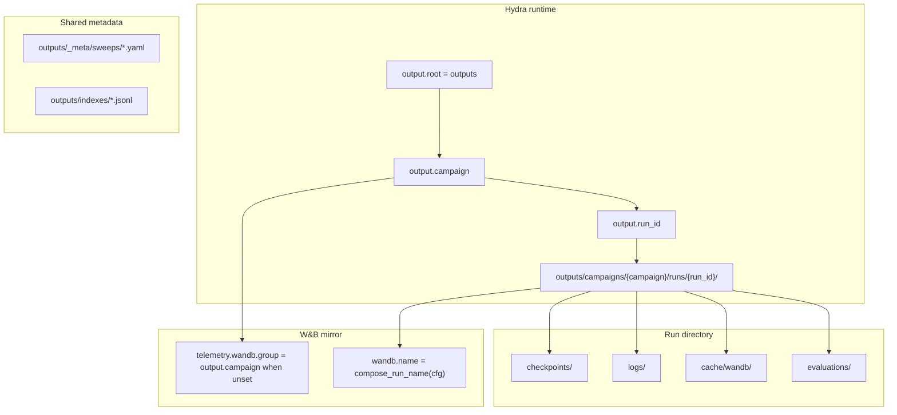

# Output layout contract

Canonical paths for training runs, telemetry, sweeps, and satellite workflows.
Hydra owns the per-run envelope under `outputs/`; W&B nests inside each run via
`output.wandb_dir` (not a separate top-level `wandb/` tree).

## Decision table

| I need… | Look here | Owner |
| --- | --- | --- |
| Training checkpoint (`.pkl`) | `outputs/campaigns/<campaign>/runs/<run_id>/checkpoints/` | `src/artifacts/run_paths.py` |
| Run manifest + Hydra snapshot | `outputs/campaigns/<campaign>/runs/<run_id>/manifest.json`, `.hydra/` | Hydra + `RunContext` |
| Campaign index (JSONL) | `outputs/indexes/` | `src/artifacts/run_paths.py` |
| W&B run files (local) | `outputs/campaigns/<campaign>/runs/<run_id>/cache/wandb/` | `src/telemetry/logger.py` |
| Shared W&B artifact/data cache | `outputs/cache/wandb-artifacts/`, `outputs/cache/wandb-data/` | `output.wandb_*_dir` in schema |
| Scalar metrics log | `outputs/campaigns/<campaign>/runs/<run_id>/logs/` | `RunContext.log_path` |
| Generated W&B sweep YAML | `outputs/_meta/sweeps/<name>.yaml` | `scripts/make_wandb_sweep.py` |
| Sweep source recipes (Hydra) | `conf/wandb_sweep/fixed/`, `conf/wandb_sweep/space/` | `conf/sweep_gen.yaml` |
| Kaggle kernel packages | `outputs/kaggle_runner/` | `src/orchestration/kaggle_runner.py` |
| Docker validation tarball | `outputs/campaigns/<campaign>/runs/<run_id>/evaluations/<job_id>/docker_validation/` | artifact pipeline |
| Replay HTML | `outputs/campaigns/<campaign>/runs/<run_id>/replays/` | `artifacts.replay` config |

## Campaign identity



- **`output.campaign`** groups related runs (baseline batch, ablation, sweep) in
  both the filesystem and W&B (`telemetry.wandb.group` defaults to the campaign
  slug when left null in YAML).
- **`output.run_id`** is the stable directory slug; display naming uses
  `compose_run_name()` and may differ from the folder name.

## Sweep YAML relocation

Generated sweep definitions are **config metadata**, not training checkpoints.
They live under `outputs/_meta/sweeps/` so top-level `artifacts/` is reserved for
checkpoint-adjacent pipeline paths inside a run directory.

```bash
uv run ow make wandb_sweep=2p_only_throughput
uv run wandb sweep outputs/_meta/sweeps/2p_only_throughput.yaml
```

## Primary entrypoints

| Stage | Module |
| --- | --- |
| Path contract | `src/artifacts/run_paths.py` |
| Hydra composition | `src/config/runtime.py` |
| W&B init | `src/telemetry/logger.py` |
| Sweep YAML generation | `scripts/make_wandb_sweep.py` |
| Training loop | `src/jax/train.py` via `src/train.py` |

## Related docs

- [Configuration guide](../../conf/README.md)
- [Kaggle submission packaging](../competition/COMPETITION_SUBMISSION.md)
- Output hygiene v2 roadmap: `.omg/plans/output-storage-roadmap.md`
