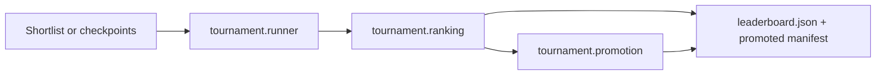

# Tournament evaluation

Local Kaggle-env tournament harness for ranking checkpoints and gating campaign
promotion.

## Flow



## Owners

| Component | Module |
| --- | --- |
| Match execution | `src/artifacts/tournament/runner.py` |
| Leaderboard + gates | `src/artifacts/tournament/ranking.py` |
| Agent resolution | `src/artifacts/tournament/resolve.py` |
| CLI orchestration | `src/artifacts/tournament/eval.py`, `src/cli/eval.py` |
| Promotion writes | `src/artifacts/tournament/promotion.py`, `src/artifacts/promotion.py` |
| Async worker jobs | `src/artifacts/tournament/worker.py`, `src/artifacts/checkpoint_eval.py`, `scripts/run_artifact_worker.py` |
| Config | `conf/artifacts/base.yaml`, `src/config/schema.py` |

## CLI

```bash
uv run ow eval tournament \
  --checkpoint outputs/campaigns/my_campaign/runs/run_a/checkpoints/jax_ckpt_000100.pkl \
  --campaign my_campaign \
  --vs-promoted \
  --promote
```

Hybrid training promotion enqueues `checkpoint_eval` optional jobs (Docker validation
then tournament) when `artifact_pipeline.checkpoint_eval_async=true` and scalar metrics
improve with `artifacts.promotion.strategy` in `hybrid` or `tournament`. Standalone
`tournament` jobs remain when `checkpoint_eval_async=false`.

Use `artifacts=hybrid_promotion` for the composite eval profile.

`4p_free_for_all` runs only when at least four unique candidates are present.

Shortlist resolution uses local `checkpoint_path` when present, otherwise attempts
W&B checkpoint artifact download into `outputs/cache/wandb-artifacts/`.

## Baselines

Phase 1 treats Python runtime opponent `sniper` as the curriculum
`nearest_sniper` / spec `scripted_nearest` baseline.
