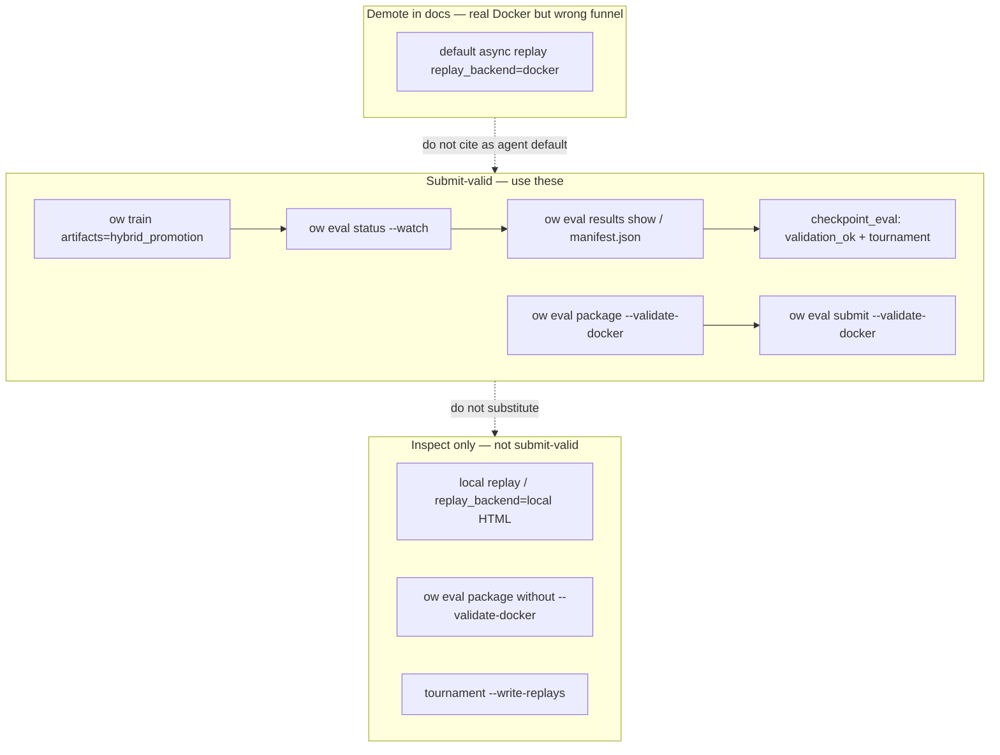

# Requirements: CLI Hardening (Submit-Valid Path Funnel)

## Summary

Converge agents and operators onto one **submit-valid validation funnel**—async Docker validation and tournament promotion via `ow eval` primitives and `artifacts=hybrid_promotion`—and shrink or deprecate parallel paths that look like validation (inline checkpoint replays, packaging-only flows, direct script entrypoints, replay HTML as proof). Deliver guardrails from [#160](https://github.com/jmduea/orbit_wars/issues/160) and [#161](https://github.com/jmduea/orbit_wars/issues/161) plus an explicit **agent decision tree** in `docs/AGENT_CAPABILITIES.md` so coding agents cannot “validate” a checkpoint without hitting real Kaggle Docker probes.

**Option 3 honesty (this track):** “Enforcement” here means agent-facing docs, CLI help/messaging, and CI contracts (#160/#161)—not deleting every alternate code path in `src/`. Runtime demotion (warnings, Hydra profile steering) is in scope where low-risk; wholesale removal of replay/docker worker kinds or script entrypoints is out of scope unless a follow-on plan explicitly schedules it.

## Problem Frame

The repo’s **Now** roadmap centers submit-valid work: package checkpoints, prove competition compatibility in Kaggle Docker, and gate promotion on tournament wins (`docs/ROADMAP.md`). The intended production path is documented: `ow eval package --validate-docker`, hybrid training with `artifacts=hybrid_promotion`, polling `ow eval status --watch`, and `checkpoint_eval` jobs that chain Docker → tournament → promote (`docs/kaggle_submission.md`, `docs/AGENT_CAPABILITIES.md`).

In practice, agents still reach “validation” through **alternate coded paths**:

- **Local HTML replay** — synchronous `maybe_write_jax_checkpoint_replay` (when `replay_async` is false) or worker `replay` jobs with `replay_backend=local` produce HTML/JSON under `evaluations/replay_u*/` or `replays/`; these are inspection-only, not Docker import/episode probes.
- **Default async `replay` jobs with `replay_backend=docker`** — under `conf/artifacts/base.yaml` the artifact pipeline defaults to `replay_async: true` and `replay_backend: docker`; the worker routes those jobs through the same Docker validation subprocess as `docker_validation` / `checkpoint_eval` and writes `validation_ok` in the job manifest. Agents on bare `ow train` (Hydra `artifacts=default`) can hit this path without opting into hybrid; it is easy to confuse with “replay HTML proof” unless docs name the alias explicitly.
- **Packaging without Docker** (`ow eval package` without `--validate-docker`)—layout-only checks that are easy to mistake for submit-valid proof.
- **Direct script invocation** (`scripts/validate_kaggle_docker_submission.py`, `scripts/run_artifact_worker.py`)—same underlying machinery as `ow eval` but bypasses CLI guardrails, help text, and agent-facing discovery.
- **Tournament / eval with `--write-replays`**—useful for debugging, not a substitute for `validation_ok` in docker / checkpoint_eval manifests.
- **Standalone `docker_validation` queue jobs** (when enabled) vs the **hybrid `checkpoint_eval`** composite—two mental models for the same outcome.

Evidence: an agent session generated and treated replay output as validation while **not** running async Docker eval through the eval worker queue. That failure mode is structural (too many plausible “validate” surfaces), not a one-off typo.

## Key Decisions

- **Path funnel (Option 3).** Scope includes **deprecating, hiding, or demoting** alternate validation surfaces in docs and CLI discovery, plus #160/#161 tests—not a guarantee that every legacy worker kind disappears in this track.

- **Two replay surfaces.** (1) **Inspect:** `replay_backend=local`, sync `maybe_write_jax_checkpoint_replay`, tournament `--write-replays` → HTML/metadata only. (2) **Docker alias:** async worker `replay` with `replay_backend=docker` (default under `artifacts=default`) → real Kaggle Docker probes and `validation_ok`; document as a parallel validation surface to demote/retarget in the funnel, not as “inspect-only.”

- **Docker validation is the compatibility gate.** Flows that run Kaggle Docker import probes and seeded 2p/4p episodes count as “validated for submission.” Packaging-only and **local** replay-only outcomes are explicitly **non-validating**.

- **Hybrid promotion is the agent default for strict promote—not the Hydra default.** Root `conf/config.yaml` selects `artifacts=default` (metric promotion, replay enabled per `conf/artifacts/base.yaml`). Agents proving submit-valid during training must pass `artifacts=hybrid_promotion` (`conf/artifacts/hybrid_promotion.yaml`: `promotion.strategy=hybrid`, `checkpoint_eval_async=true`, `replay.enabled=false`, `replay_async=false`) and poll `checkpoint_eval`—not scalar metric promotion alone and not ad-hoc local replay HTML.

- **Status vs manifest fields (today).** `ow eval status` (`src/cli/run_status.py`) returns queue job rows (`kind`, `status`, `update`, `error`), `promoted_manifest`, and log markers—it does **not** currently surface `validation_ok`. Agents read `validation_ok` from `ow eval results show --run <run_dir> --result <checkpoint_eval_id>` or `evaluations/checkpoint_eval_u*/manifest.json`. Extending status JSON is optional follow-on work, not a blocker for this requirements doc.

- **Primitives over scripts for agents.** `ow eval package`, `ow eval submit`, `ow eval worker`, `ow eval status`, `ow eval results list|show` are the supported agent entrypoints; script paths are operator/advanced, hidden from agent docs, and optionally warned at runtime (warnings alone do not replace doc demotion).

---

## Actors

- **A1. Coding agent** — Runs train/eval/package flows from `docs/AGENT_CAPABILITIES.md`; highest risk of choosing replay or packaging-only as validation.
- **A2. Operator / maintainer** — Needs script escape hatches for debugging; accepts deprecation warnings and migration period.
- **A3. CI** — Must exercise replay caller paths (#160) and CLI validate invariants (#161) so signature/help drift cannot silently drop Docker probes.

---

## Requirements

### Canonical submit-valid funnel

- R1. **Single documented agent path for “is this checkpoint submit-valid?”** — Manual: `uv run ow eval package --checkpoint <pkl> --output-dir <dir> --validate-docker` and confirm final JSON `"ok": true`. Training: `uv run ow train ... artifacts=hybrid_promotion`, poll `uv run ow eval status --run <run_dir> --watch` until queue jobs are idle (`kind=checkpoint_eval`, `status=completed`), then `uv run ow eval results show --run <run_dir> --result <checkpoint_eval_relative_path>` (or read `evaluations/checkpoint_eval_u*/manifest.json`) for `validation_ok` and tournament/promotion fields. `docs/AGENT_CAPABILITIES.md` must state this two-step poll contract; replay-only steps stay under a separate “inspect” branch.

- R2. **Decision tree in agent capabilities** — Add a compact flowchart (mermaid or numbered branches) to `docs/AGENT_CAPABILITIES.md`: goal → command → success signal → what **does not** count (local replay HTML, packaging-only stdout, `overall_win_rate` from self-play training logs). Include copy-paste prompts for hybrid poll + results show, manual docker package, and Gate 5 `ow benchmark tournament-proof` **after** Docker validation (Gate 5 semantics unchanged; tree must not imply tournament-proof replaces Docker). AE5 covers tree routing only; Gate 5 proof is not an acceptance example in this doc.

- R3. **Success signals are manifest- and JSON-backed** — Pass signals: `checkpoint_eval` / `docker_validation` manifest `validation_ok`, `docker_manifest.json`, `"ok": true` from `--validate-docker`, and `promoted_manifest` updates when promotion applies—not presence of `replays/*.html` or `evaluations/replay_u*/` HTML alone. Async `replay` jobs with `replay_backend=docker` also emit `validation_ok` but are **out of funnel** for agent submit-valid claims unless explicitly migrating off the alias.

### Path funnel (shrink alternates)

- R4. **Deprecate or hide replay-as-validation** — Agent docs must not imply that local HTML replay (`replay_backend=local`, sync `maybe_write_jax_checkpoint_replay`) substitutes for Docker validation. Document that default-profile async `replay` with `replay_backend=docker` already runs Docker probes; funnel work demotes that alias (docs, examples, optional warnings) rather than mislabeling it inspect-only. `hybrid_promotion` already disables replay (`replay.enabled: false`, `replay_async: false`); whether bare `artifacts=default` should auto-steer replay off is an open product call (see Open Questions).

- R5. **Packaging-only is explicitly non-validating** — `ow eval package` without `--validate-docker` prints a stable, grep-friendly line (already partially present) and agent docs label it “layout only.” Agent prompts must not use packaging-only as a learn-proof or submit-valid step.

- R6. **Demote direct script entrypoints for agents** — `scripts/validate_kaggle_docker_submission.py` and `scripts/run_artifact_worker.py` remain for maintainers but are removed from agent-oriented discovery (`docs/AGENT_CAPABILITIES.md`, `docs/kaggle_submission.md` agent sections). Optional stderr warning when invoked outside `ow eval` is secondary to hiding from agent docs—not sufficient on its own to close the funnel.

- R7. **Converge async validation on `checkpoint_eval` under hybrid** — Document that standalone `docker_validation` queue jobs are legacy/secondary to `checkpoint_eval` when `artifacts=hybrid_promotion` is active (`checkpoint_eval_async: true`, standalone `docker_validation_async: false` in `conf/artifacts/hybrid_promotion.yaml`). Examples steer new agent runs to hybrid composite jobs; doc-only steering for `artifacts=default` replay/docker alias is explicitly bounded (no requirement in this track to change root Hydra defaults).

- R8. **Tournament `--write-replays` is opt-in inspection** — Help text and agent tree classify tournament replays as debug artifacts; default agent flows for submit-valid do not require `--write-replays`.

### Guardrails (#160, #161)

- R9. **#160 — Replay integration coverage** — CI exercises `maybe_write_jax_checkpoint_replay` → `run_match` (or equivalent artifact smoke) so return-arity changes cannot pass `make test-fast` while breaking replay callers. Align with issue body: extend `tests/test_replay.py` or artifact-domain smoke.

- R10. **#161 — Validate subcommand invariant** — Test or contract that user-facing “validate” paths (`ow eval package --validate-docker`, `ow eval submit --validate-docker`, worker docker phase inside `checkpoint_eval`) invoke real Docker validation entrypoints—not tarball layout only. Internal `--skip-docker` (or equivalent) stays non-user-facing per issue intent.

### CLI UX and invariants

- R11. **Help and `--help` examples** — `ow eval package`, `ow eval submit`, and `ow eval worker` help strings distinguish **validate** (Docker) vs **package** (layout) vs **replay** (local HTML inspect vs docker-backend alias). Examples show `--validate-docker` on the submit-valid path.

- R12. **No new workflow wrappers for agents** — Hardening extends primitives and docs; does not add monolithic `ow benchmark validate-submission` wrappers (consistent with agent-native Phase 3 policy).

---

## Key Flows

- F1. **Agent proves checkpoint during training (recommended)**
  - **Trigger:** User asks for submit-valid or hybrid promotion proof.
  - **Actors:** A1, artifact worker.
  - **Steps:** `ow train ... artifacts=hybrid_promotion` → note `run_dir` → `ow eval status --run <run_dir> --watch` until no `queued`/`running` jobs → `ow eval results show --run <run_dir> --result <checkpoint_eval_id>` (or open `evaluations/checkpoint_eval_u*/manifest.json`) → confirm `validation_ok` and tournament/promotion fields → read `promoted_manifest` from status JSON if promoted.
  - **Outcome:** Docker and tournament evidence under `evaluations/checkpoint_eval_u*/`; no reliance on local replay HTML or default-profile docker-backend replay alias.

- F2. **Agent proves checkpoint manually (pre-upload)**
  - **Trigger:** One-off package before `ow eval submit`.
  - **Actors:** A1.
  - **Steps:** `ow eval package --checkpoint <pkl> --output-dir <dir> --validate-docker` → confirm JSON `"ok": true` → optional `ow eval submit ... --validate-docker`.
  - **Outcome:** Submit-valid proof without replay-only detour.

- F3. **Agent inspects behavior (non-validating)**
  - **Trigger:** Debug action quality or regression after mask/compiler change.
  - **Actors:** A1.
  - **Steps:** Enable **local** replay (`replay_backend=local`, async job or sync config) or `ow eval tournament --write-replays` → read HTML/metadata.
  - **Outcome:** Inspection only; doc tree states Docker validation still required for submit-valid.

- F4. **CI prevents validate/replay drift**
  - **Trigger:** PR touches `src/artifacts/replay.py`, `run_match` signatures, or eval CLI docker flags.
  - **Actors:** A3.
  - **Steps:** #160 and #161 tests run in `make test-domain-artifacts` (or fast tier where appropriate).
  - **Outcome:** Merge blocked on caller or validate-entrypoint regression.

- F5. **Docker unavailable (environment failure)**
  - **Trigger:** `--validate-docker` or `checkpoint_eval` worker cannot reach Docker.
  - **Actors:** A1.
  - **Steps:** Read `docker_unavailable` / error fields in package JSON or job `error`; do not substitute replay HTML or packaging-only success.
  - **Outcome:** Agent reports environment blocker; operator fixes Docker per `docs/kaggle_submission.md`.

---

## Acceptance Examples

- AE1. **Covers R1, R3, F1**
  - **Given:** A hybrid promotion train run with queued `checkpoint_eval`.
  - **When:** An agent polls `ow eval status` until idle, then `ow eval results show` (or reads `evaluations/checkpoint_eval_u*/manifest.json`).
  - **Then:** The agent cites `validation_ok` and tournament results from the checkpoint_eval manifest; it does not claim submit-valid from local `replays/replay_u*.html` alone.

- AE2. **Covers R5; negative path before F2**
  - **Given:** An agent asked to validate a checkpoint before upload.
  - **When:** It runs `ow eval package` without `--validate-docker`.
  - **Then:** That run is classified as layout-only; the agent follows up with `--validate-docker` or hybrid queue proof before reporting success (F2 Steps).

- AE3. **Covers R9**
  - **Given:** `run_match` return arity changes in tournament/replay code.
  - **When:** CI runs artifact/replay tests (#160).
  - **Then:** The build fails until `maybe_write_jax_checkpoint_replay` callers are updated.

- AE4. **Covers R10**
  - **Given:** A refactor renames or bypasses Docker validation in an eval subcommand.
  - **When:** CI runs validate invariant test (#161).
  - **Then:** The build fails if user-facing validate paths no longer invoke Docker probes.

- AE5. **Covers R2, R6**
  - **Given:** A new agent session with only `docs/AGENT_CAPABILITIES.md`.
  - **When:** The user asks “validate my checkpoint.”
  - **Then:** The agent selects F1 or F2 from the decision tree and does not start from `scripts/validate_kaggle_docker_submission.py` or local replay generation unless explicitly asked to inspect.

- AE6. **Covers F3, R4, R8**
  - **Given:** An agent asked to inspect policy behavior after a mask change.
  - **When:** It enables local replay or `ow eval tournament --write-replays` and reads HTML.
  - **Then:** It does not report submit-valid; documentation still requires F1 or F2 for submission proof.

---

## Success Criteria

- Agents following `docs/AGENT_CAPABILITIES.md` default to hybrid poll + results manifest read or `ow eval package --validate-docker` for submit-valid questions; local replay and packaging-only paths are labeled non-validating in the same doc.
- #160 and #161 closed with tests merged; `make test-domain-artifacts` (and relevant fast tests) cover replay caller and validate-entrypoint invariants (**objective** merge gate).
- No new agent-facing docs recommend `scripts/validate_kaggle_docker_submission.py` or local replay HTML as validation; operator docs may keep advanced script references in architecture/onboarding only with a “non-agent” label.
- **Subjective (non-merge):** qualitative review on a future agent session that replay-only prompts are contradicted by the decision tree and CLI help—tracked manually, not a CI gate.

---

## Scope Boundaries

**In scope**

- Path funnel documentation and CLI messaging (`docs/AGENT_CAPABILITIES.md`, `docs/kaggle_submission.md`, eval CLI help).
- **AGENTS.md** hybrid / submit-valid pointers aligned with R1 status+results contract (minimal factual sync, not a full rewrite).
- Deprecation/demotion of alternate validation surfaces in **agent discovery** (replay-as-validation wording, packaging-only confusion, script-first discovery).
- Tests and guardrails for #160 and #161.
- Config/doc defaults steering hybrid `checkpoint_eval` over standalone `docker_validation` where applicable.

**Deferred for later**

- Full removal of `scripts/validate_kaggle_docker_submission.py` (may remain as implementation detail behind `ow eval` indefinitely).
- Extending `ow eval status` JSON to inline `validation_ok` from latest `checkpoint_eval` manifest.
- Automated agent linter that blocks replay paths in prompts (documentation + tests only in this track).
- Cursor session-start hook (roadmap Later item).
- Changing root Hydra `artifacts=default` replay defaults (see Open Questions).

**Outside this product's identity (non-goals)**

- **Planet Flow proof pipeline (#166–#170)** — reachability, sweep, decoder replay contracts, compiler-control tests; separate brainstorm/plan track.
- **Gate 5 / `ow benchmark tournament-proof` semantics change** — thresholds, baseline opponents, and tournament-proof CLI behavior stay as calibrated today; this track only clarifies how tournament-proof fits **after** Docker validation in the agent tree, not redefine Gate 5.
- Rewriting the artifact worker architecture or async pipeline design (behavioral funnel only).

---

## Dependencies and Assumptions

- Hybrid promotion profile (`artifacts=hybrid_promotion`) and `checkpoint_eval` worker path are implemented and remain the strict promotion mechanism on `main`.
- Docker is available on the machine when agents run `--validate-docker` (WSL/Desktop documented in `docs/kaggle_submission.md`); `docker_unavailable` is an environment failure surfaced in package JSON or job errors—not bypassed by replay HTML (F5).
- `scripts/validate_kaggle_docker_submission.py` continues to implement Docker probes invoked from `src/artifacts/docker_validation.py` and kaggle packager code paths.
- Solo-operator repo: deprecation can use warnings and doc changes without multi-release coordination beyond a short migration note in `docs/kaggle_submission.md`.

---

## Open Questions

**Product / config (need explicit call before implementation)**

- **Warn-only vs auto-disable replay under hybrid and default profiles** — `hybrid_promotion` already sets `replay.enabled: false` and `replay_async: false`; should `artifacts=default` also disable or demote `replay_backend=docker` async jobs, or is warn-only + doc demotion enough? *Deferred: changes root training defaults and affects non-agent local experiments.*

- **Funnel treatment of `replay_backend=docker` alias** — Retarget worker kind naming, block agent docs only, or runtime warn when replay job runs without `checkpoint_eval`? *Deferred: behavioral change beyond doc/help scope.*

- **Exact deprecation mechanism for direct script invocation** — stderr warning only vs `OW_ALLOW_SCRIPT_VALIDATE=1`. *Deferred: operator ergonomics vs strict gate.*

- **#161 Docker in tests** — mock Docker vs stubs in `tests/test_kaggle_submission_packager.py` / `tests/test_checkpoint_eval.py`. *Deferred: plan-owned test design.*

**Implementation nice-to-have (non-blocking)**

- Inline `validation_ok` (and latest `checkpoint_eval` summary) in `ow eval status` output to match agent mental model—today agents must use `ow eval results show` per R1.

**Resolved for planning**

- Requirements capture Option 3 as docs + tests + bounded runtime messaging; full code-path removal is not implied.
- Hydra default remains `artifacts=default`; agents opt into `artifacts=hybrid_promotion` for strict promote.
