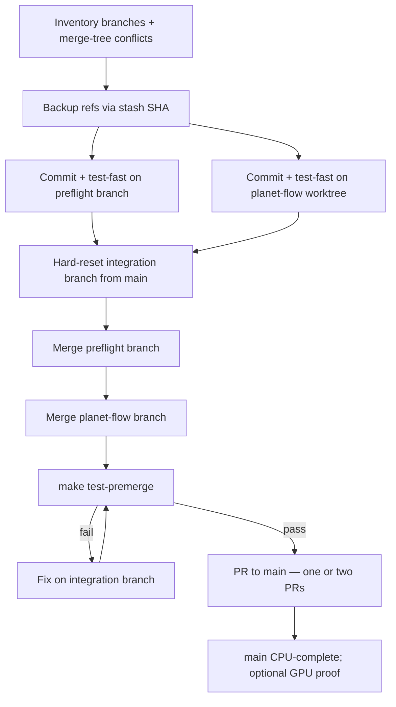

# Requirements: Multi-Branch Merge Orchestration

## Summary

Orchestrate landing work from parallel agent sessions (`feat/preflight-training-profiles`, `feat/planet-flow-policy`, and related uncommitted artifacts) onto `main` without losing intended changes before the **2026-06-20** Kaggle submission milestone. Use an **integration branch first** (hard-reset `merge-sim/planet-flow-preflight` to the current `main` tip, then re-merge both feature branches after Phase 1 commits), commit dirty state on each feature branch before merging, verify with `make test-premerge`, then open one or two PRs to `main` until `main` is clean and holds all merged code.

## Problem Frame

Three Cursor sessions produced overlapping repo state:

| Stream | Branch | Committed intent | Risk |
|--------|--------|------------------|------|
| Preflight PPO profiles + win-rate fixes | `feat/preflight-training-profiles` | Per-model `preflight-profiles.json`, calibrate/learn-proof wiring, rollout win-rate fixes, `max_moves_k` default | Uncommitted `AGENTS.md`, docs, `preflight-calibration.json` |
| Planet Flow proof pipeline | `feat/planet-flow-policy` (worktree) | Planet Flow policy, reachability, sweep/score, proof CLI | Uncommitted yaml, calibration, `AGENTS.md`, plus modified `src/` / `tests/` / `conf/` not yet committed |
| Strategy / tooling brainstorms | Untracked on main checkout | compare-runs, calibration-hybrid, metrics-literacy docs | Doc-only; must not block code merge |

Five files overlap both code branches vs `main` (`src/jax/preflight.py`, `src/jax/preflight_calibration.py`, `src/cli/benchmark.py`, `src/jax/rollout/metrics.py`, `src/jax/train/metrics.py`). A **feature-branch merge** (`git merge-tree` at post-R4/R5 SHAs) typically surfaces **more** paths — run R1 inventory, do not rely on the five-file list alone. A prior simulated merge exists at `merge-sim/planet-flow-preflight` but may be stale relative to latest commits.

**Goal:** `main` clean with all intended code merged — not rollback of Planet Flow, preflight profiles, or calibration work.

**Constraint:** Orchestration optimizes git/test hygiene first (**CPU-complete**). GPU learn-proof / go/no-go evidence is **proof-complete** and tracked separately (see R19).

## Key Decisions

- **Integration branch before main (mandatory for conflict resolution).** Resolve overlapping files once on an integration branch; do not merge both feature branches directly to `main` in parallel without a green checkpoint.

- **Commit on-branch before merge.** Each feature branch commits its uncommitted work first so merges start from known SHAs. No merge from dirty working trees. Phase 1 exit requires `make test-fast` (or domain preflight tests) green on each branch before R6 SHAs are recorded.

- **Calibration commits must match profiles.** Do not commit `preflight-calibration.json` unless it matches that branch's `preflight-profiles.json` (or omit calibration from the branch commit and regenerate on the integration branch after R8–R9).

- **Docs decouple from code PRs.** Brainstorm, plan, ideation, and `STRATEGY.md` may land in separate commits or PRs; they do not gate code merge verification.

- **Hard-reset integration branch from `main`.** Reuse the name `merge-sim/planet-flow-preflight` only after `git reset --hard` to current `main` tip — never incremental update-in-place on a stale sim branch.

- **Optional 2-PR split after green (review granularity only).** If review size warrants it, land preflight profiles first, then Planet Flow — **not** an alternative to the integration branch; integration remains the verification sandbox.

- **Calibration JSON is merge-sensitive.** Both branches touch `docs/benchmarks/preflight-calibration.json`; expect manual resolution or post-merge `make preflight-calibrate` refresh tied to merged profiles.

## Requirements

### Preconditions

R1. Inventory before any merge: list branch tips, uncommitted files per checkout (main, `.worktrees/feat/planet-flow-policy`), worktree paths (`git worktree list`), and **merge-tree conflict paths** at post-R4/R5 SHAs (`git merge-tree $(git merge-base A B) A B | rg 'changed in both'`).

R2. Create a recoverable snapshot before destructive steps on each dirty checkout:

```bash
SHA=$(git stash create -u "pre-merge-backup")
if [ -n "$SHA" ]; then
  git update-ref "refs/backup/pre-merge-$(date +%s)" "$SHA"
fi
```

Or equivalent named backup branch. Do not call `git stash create` without capturing its printed SHA.

R3. No destructive git without explicit operator approval: no `reset --hard`, `clean -fdx`, force-push, or branch deletion as part of default orchestration — **except** R7's mandatory hard-reset of the integration branch to `main` (operator-approved by this playbook).

### Phase 1 — Stabilize feature branches

R4. On `feat/preflight-training-profiles`: stage and commit uncommitted work (`AGENTS.md`, docs, etc.) with a message that states intent. For `preflight-calibration.json`: commit only if regenerated on this branch with matching `preflight-profiles.json`, otherwise leave uncommitted until integration refresh.

R5. On `feat/planet-flow-policy` (worktree): commit **all** modified and new code paths from R1 inventory (yaml, sweep config, `src/`, `tests/`, `conf/`, `AGENTS.md`, etc.) — not only the Problem Frame table rows. Apply the same calibration rule as R4.

R6. Record post-commit SHAs for both branches in the integration run log only after each branch passes `make test-fast` (or `make test-domain-config` + `make test-domain-policy` if faster smoke suffices).

### Phase 2 — Integration branch

R7. **Checkout:** use existing worktree at `/tmp/merge-sim-planet-flow` on branch `merge-sim/planet-flow-preflight`, **or** create a new worktree under `.worktrees/merge-integration`. Hard-reset that branch to current `main` tip before R8. (R18 excludes hygiene baseline clones like `orbit_wars-pre-hygiene`, not this active integration worktree.)

R8. Merge `feat/preflight-training-profiles` into integration branch first. Resolve conflicts using the **conflict playbook** (below) plus any paths from R1 merge-tree output — at minimum the five shared code files, `AGENTS.md`, and `preflight-calibration.json`.

R9. Merge `feat/planet-flow-policy` into integration branch second; resolve remaining conflicts per the same playbook.

**Conflict playbook (R8–R9):**

| Area | Resolution rule |
|------|-----------------|
| `docs/benchmarks/preflight-profiles.json` | Preflight branch wins (PPO pin source of truth) |
| `docs/benchmarks/preflight-calibration.json` | Merge keys from both branches; if ambiguous, run `make preflight-calibrate` on integration after merge and commit result |
| `src/jax/preflight*.py`, `src/cli/benchmark.py` | Keep preflight profile wiring **and** planet-flow CLI subcommands — integrate both sides, do not drop proof paths |
| `src/jax/rollout/metrics.py`, `src/jax/train/metrics.py` | Keep win-rate fixes from preflight branch; layer planet-flow metric additions without reverting binary_win semantics |
| `AGENTS.md` | Merge both sections; dedupe duplicated guidance manually |

R10. After merge, run `make test-premerge` on integration branch. Check terminals folder for competing pytest/GPU jobs (`test-daily` runs fast and jax tiers in parallel — not a single serial pytest invocation).

R11. If tests fail, fix on integration branch only — do not force-push to `main` until green.

### Phase 3 — Land on main

R12. End state: `main` contains all merged code; no required work remains only on feature branches.

R13. **Default:** one PR from integration branch → `main` after R10 passes. Use R14 only when review size warrants splitting — Key Decision 2-PR path is for review granularity, not conflict avoidance.

R14. **Optional split (after green integration):** open PR1 with integration history **up to and including** the preflight merge commit (or equivalent commit range), merge to `main`, run `make test-premerge` on `main`, then open PR2 with remaining planet-flow commits onto updated `main`. Do not re-merge feature branches independently to `main` without repeating integration conflict work.

R15. After merge to `main`, delete or archive integration branch and feature branches only when operator confirms; remote cleanup is optional and explicit.

### Artifacts and docs

R16. Untracked brainstorm/plan/ideation docs may commit to `main` in a follow-up docs-only PR or alongside code at operator discretion; they must not alter merge conflict resolution for code paths.

R17. GPU proof outputs under `outputs/` stay local; orchestration does not require copying proof JSON between worktrees into the merge.

R18. `orbit_wars-pre-hygiene` and prunable `/tmp/*` hygiene test clones are out of scope — baseline clones only. The active integration worktree at `/tmp/merge-sim-planet-flow` is in scope per R7.

### Verification

R19. **CPU-complete** success criteria (orchestration done for git merge purposes):

- `main` at integration tip (or sequential PR tips per R14) includes both feature streams' committed code.
- `make test-premerge` passes on the branch merged to `main` (and on `main` after PR2 when using R14).
- `docs/benchmarks/preflight-calibration.json` is either conflict-resolved with documented provenance tied to merged `preflight-profiles.json`, or regenerated via `make preflight-calibrate` on integration/`main` before PR merge.
- No uncommitted code changes required on `main` post-merge (docs-only follow-ups allowed).
- Feature branch tips are either merged or explicitly abandoned with backup refs retained.

R19b. **Proof-complete** (separate from R19; does not block CPU-complete): sequential GPU learn-proof / Planet Flow proof runs recorded when go/no-go evidence is needed — see Deferred.

R20. Post-merge operator checklist (non-blocking unless operator requires proof-complete):

- Confirm calibration JSON matches merged profiles (same bar as R19 third bullet).
- Schedule GPU proof runs when architecture go/no-go is still open.

## Scope Boundaries

**Deferred for later**

- Merging `issue/*` src-audit branches.
- Cleaning `.worktrees/`, pre-hygiene clone, or prunable worktrees under `/tmp` (except active integration worktree lifecycle per R7).
- Implementing compare-runs, strategy scorecard, or calibration-hybrid bundles (requirements exist; code does not).
- Automated merge orchestration CLI or Makefile target (this doc is the playbook; tooling is a follow-on).
- GPU learn-proof / Planet Flow go/no-go reruns (proof-complete tier; operator schedules after CPU-complete).

**Outside this product's identity**

- Rewriting git history (squash/rebase entire feature stacks) unless operator explicitly requests for PR hygiene.
- Discarding uncommitted work without review — backup refs are mandatory first.

## Dependencies and Assumptions

- `merge-sim/planet-flow-preflight` exists but may lag branch tips; R7 hard-reset from `main` is mandatory after R4–R5.
- Feature-branch merge conflicts exceed the five vs-main paths; R1 merge-tree inventory is authoritative.
- Solo operator with one GPU; no parallel proof runs during merge verification.
- `docs/benchmarks/preflight-profiles.json` on `feat/preflight-training-profiles` is the intended source of truth for per-model PPO pins after merge.

## Orchestration Sequence (operator reference)


