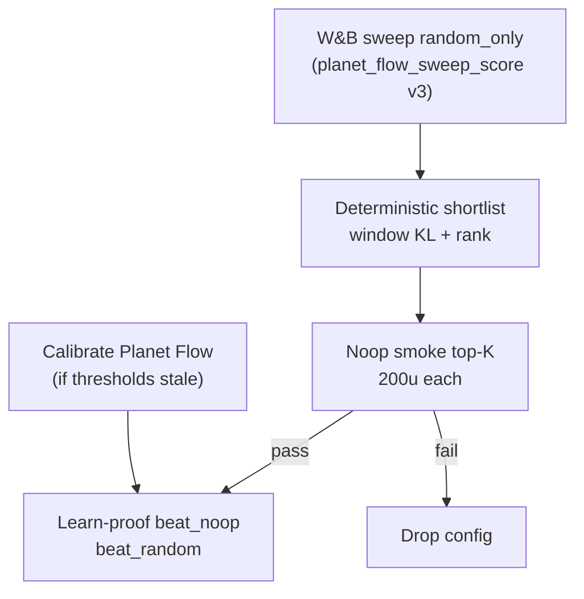

# Planet Flow End-to-End Proof Pipeline (Gates 2–3)

## Summary

Define a reliable **sweep → calibrate → shortlist → learn-proof (Gates 2–3)** pipeline for Planet Flow PPO. Reachability masking (P0 v2) is working; the gap is **objective misalignment**: random-only sweep scores do not predict noop learn-proof pass rates. Combine **sweep_score v3 guardrails** (window stability) with a **deterministic shortlist + noop smoke filter** before expensive learn-proof runs.

## Problem Frame

Sweep `j0epauu2` (24 runs, reachability-masked) produced eligible configs with strong **random_only** trends but learn-proof on **noop_only** exposed a tradeoff:

| Candidate | Sweep (random) | Learn-proof (noop) | Failure mode |
|-----------|----------------|-------------------|--------------|
| Winner (`a11wzcni`) | +0.17 trend, low point KL | +0.07 trend | **KL window mean 1.5 » 0.15** |
| Runner-up (`vhx6tk4r`) | stable KL, healthy entropy | flat learning | **trend +0.006 < 0.05** |

Post-mask `planet_flow_unreachable_demand_rate` is **0** on all paths — not the blocker.

**Calibration role:** `docs/benchmarks/preflight-calibration.json` sets durable pass bars (`min_win_rate_delta`, `max_approx_kl`, etc.) from measured Planet Flow runs. It does **not** rank sweep candidates; it defines what learn-proof enforces. Current bars are legitimate but strict relative to Planet Flow calibration median trend (~−0.02).

W&B end-of-run scalars understate instability (winner sweep run had **KL p95 ≈ 13** on random despite logged `approx_kl ≈ 0.001` at a single step).

## Key Decisions

**KD1 — Proof bar is Gates 2–3 only.** Pipeline must reliably deliver **beat_noop** + **beat_random** trend/stability passes. Curriculum (Gate 4) and tournament (Gate 5) are out of scope for this pipeline version but must not be blocked by design choices.

**KD2 — Combo lever: sweep_score v3 + shortlist hardening.** Do not rely on either alone. Sweep continues to explore on `random_only`; shortlist adds noop verification before learn-proof.

**KD3 — Calibration precedes learn-proof; thresholds are not sweep-tuned.** Re-run `ow benchmark calibrate` with `model=planet_flow_target_heatmap` when the training profile changes. Do not relax thresholds to make a sweep winner pass.

**KD4 — Window metrics, not point samples.** Eligibility and shortlist use **last-10-update window means** (and optionally p95) for `approx_kl`, matching preflight gate evaluation — not final-log scalars or W&B summary fields alone.

**KD5 — Reachability gates stay inherited.** Post-mask unreachable ceiling and June 1 stability floors remain; this brainstorm adds **cross-opponent predictability**, not new reachability work.

## Requirements

### Calibration and learn-proof contract

**R1.** Operators run Planet Flow calibration (`ow benchmark calibrate --model planet_flow_target_heatmap`) before learn-proof; `planet_flow_learning_signal` must exist in `docs/benchmarks/preflight-calibration.json` or gates return INCONCLUSIVE.

**R2.** Learn-proof for finalists uses `--train-overrides` from the shortlist artifact; thresholds come only from the calibrated JSON.

**R3.** Success for this pipeline version means **VERIFIED** on **beat_noop** and **beat_random** with the same PPO override set (single config promoted to proof).

### Sweep score v3 (eligibility)

**R4.** `planet_flow_sweep_score` eligibility rejects configs when **last-10 window mean** `approx_kl` exceeds `max_approx_kl` (0.15 unless calibrated elsewhere).

**R5.** Eligibility rejects configs when **last-10 window mean** `entropy` falls below `min_entropy` (aligned with preflight / sweep floors).

**R6.** Eligibility continues to require activity floors (launches, demand mass, emitted launches) and post-mask unreachable ceiling — unchanged semantics.

**R7.** W&B logged `planet_flow_sweep_score` reflects the same window-based eligibility rules used offline (no divergence between sweep objective and shortlist script).

### Shortlist and noop smoke

**R8.** Provide a **deterministic** shortlist command (addresses GitHub #166) for sweep `j0epauu2`-style runs: input sweep id → JSON artifact with ranked eligible configs, guardrail diagnostics, and Hydra `train_overrides`.

**R9.** Shortlist ranking: primary key = window-based eligible `win_rate_delta_10`; tie-break toward **lower window-mean KL**, then **higher entropy**, then higher launch activity.

**R10.** Before full learn-proof, run a **noop smoke** (200 updates, same PPO overrides, `opponents=noop_only`, Planet Flow proof profile) on the **top K** shortlist entries (default K=3). Only smokes passing Gates 2–3 metrics proceed to full learn-proof ladder.

**R11.** Smoke pass criteria mirror beat_noop gate checks (trend, KL window mean, entropy, unreachable, control metrics) using calibrated thresholds — not ad-hoc bars.

### Operator visibility

**R12.** Shortlist and smoke artifacts record **why** configs were rejected (guardrail keys + measured values) so winner/runner-up pathology is visible without re-querying W&B.

**R13.** Document the end-to-end command sequence in operator docs (sweep id → shortlist path → smoke campaign → calibrate if stale → learn-proof with overrides).

## Key Flows

1. Complete reachability-masked sweep (24×200u random).
2. Run shortlist on sweep id → `outputs/_meta/sweeps/<sweep>_shortlist.json`.
3. Run noop smokes for top 3; inspect diagnostics JSON.
4. Ensure `docs/benchmarks/preflight-calibration.json` includes `planet_flow_learning_signal` (refresh calibrate if needed).
5. Run learn-proof `--through beat_random` with `--train-overrides` from first smoke-passing config.
6. Archive report + checkpoint path for optional Gate 5 later.

## Scope Boundaries

**In scope:** sweep_score v3 window guardrails, shortlist CLI/script, noop smoke gate, operator docs, tests on eligibility ranking logic.

**Out of scope:** Gate 4 curriculum, Gate 5 tournament, hybrid promotion manifests, compiler rewrite (P1), changing calibrated thresholds without new measurement runs, multi-config ensembles (single proof config only).

**Deferred:** Gate 5 path after a Gates 2–3 VERIFIED config exists; sweep v4 with inline noop runs (full dual-opponent sweep doubles GPU cost).

## Acceptance Examples

**AE1.** A config with strong random trend but last-10 KL mean 0.5 is **ineligible** in sweep score and never appears in shortlist top tier.

**AE2.** Runner-up-like config (stable KL, weak random trend) ranks below winner on random sweep but may **pass noop smoke** while winner fails — shortlist + smoke prevents promoting winner to learn-proof.

**AE3.** A config passing noop smoke and learn-proof beat_noop shows `planet_flow_unreachable_demand_rate ≈ 0` and KL window mean ≤ 0.15.

**AE4.** Operator can reproduce shortlist from sweep id alone without manual W&B UI inspection.

## Open Questions

**OQ1.** Default top-K for noop smoke (3 vs 5) given ~45 min GPU per run.

**OQ2.** Whether to add a **small random smoke** in shortlist (cheap re-verify) or trust sweep window metrics for random surface.

**OQ3.** If no config passes noop smoke, accept **sweep v4** (narrower search space around stable-KL region) vs expand PPO search space — decision after first shortlist+smoke cycle on `j0epauu2` post-mortem.

## Evidence (2026-06-02 runs)

- Sweep: `j0epauu2`, 24/24 complete, 22 eligible under v2 floors.
- Calibrate: 8-run Planet Flow grid → `docs/benchmarks/preflight-calibration.json` with `planet_flow_learning_signal`.
- Learn-proof winner PPO: NOT_VERIFIED beat_noop (`approx_kl` 1.52).
- Learn-proof runner-up PPO: NOT_VERIFIED beat_noop (`win_rate_delta` 0.006).
