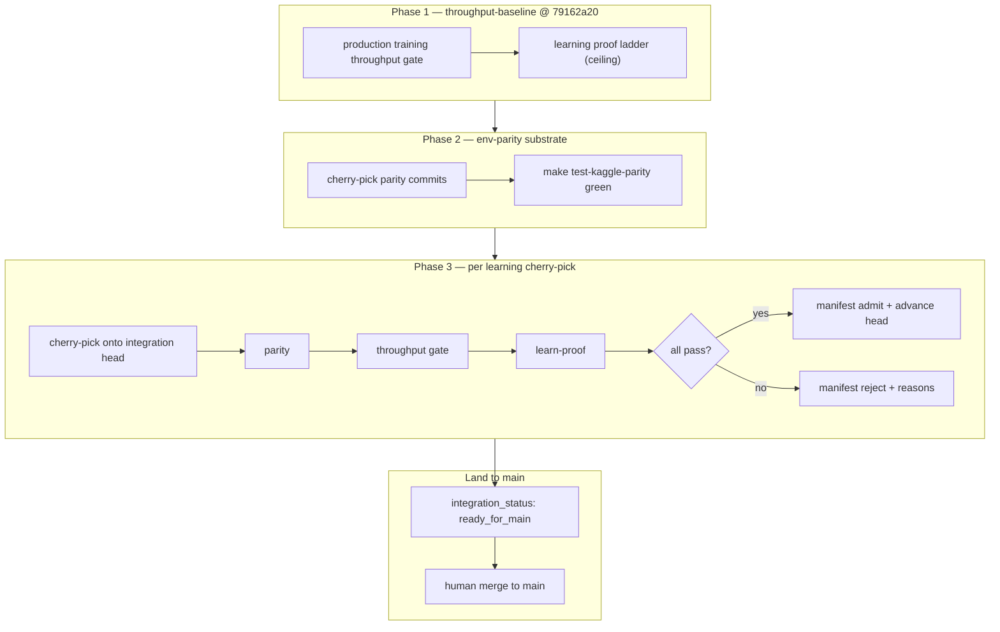

# Requirements: Nuclear Rollback + Cherry-Pick Manifest

## Summary

Establish a **throughput-baseline** integration branch pinned at the documented pre-hygiene SHA, integrate **Kaggle mechanics parity** (env-parity) correctness onto that anchor, then advance via a machine-readable **cherry-pick manifest** that admits only post-baseline **learning-improvement** commits passing **both** the **production training throughput gate** (tier-2) and the **learning proof ladder**. This is the **primary integration strategy** — semantic rollout redesign (selected-action validation) is **halted**, not a parallel critical path. Land to `main` when the integration stack is dual-gate green.

---

## Problem Frame

Post–**within-turn launch dedup masks** (launch hygiene), the **production training throughput gate** fails by ~75% against the pre-hygiene baseline captured at `79162a2088160b8ed05c3e3a050e064c7f6c9556` (`docs/benchmarks/launch-hygiene-e2e-baseline.json`). Hot-path micro-optimizations are **exhausted** per `docs/plans/2026-06-01-launch-hygiene-rollout-throughput-design.md`. The **learner ablation** (`docs/benchmarks/launch-hygiene-ablation.json`) shows why `main` cannot stay as-is: pre-hygiene arm A fails `beat_noop` (throughput good, learning NOT_VERIFIED); hygiene arm B VERIFIED through `beat_random` but ~2.4K env_steps/sec is impractical for submission-scale training volume.

Operators face three bad defaults: **blind revert** (restores throughput, destroys learning signal and may skip env-parity substrate), **blind forward** (keeps learning on slow `main` while redesign continues), or **untracked cherry-picks** (merge conflict risk, missed interacting commits, no audit trail). The project needs a disciplined recovery path: start from the throughput anchor, layer env-parity correctness, then selectively cherry-pick learning improvements that still meet throughput — not learning-at-any-cost, and not bare-baseline stagnation.

**Ablation tension (explicit):** Pre-hygiene alone is an honest throughput anchor but **not** a submission-ready learner (`launch-hygiene-ablation.json` arm A: `beat_noop` NOT_VERIFIED). Cherry-pick exists to recover learning signal **on top of** the baseline — the integration tip must eventually pass the learning proof ladder, not merely match anchor throughput.

---

## Key Decisions

- **Primary path; redesign halted.** Cherry-pick manifest integration is the **only** active recovery track. Semantic rollout redesign (selected-action validation per `docs/plans/2026-06-01-launch-hygiene-rollout-throughput-design.md`) is **stopped** — not insurance parallel to `main`, not escalation-only fallback.

- **Q1 locked — long-lived integration branch.** Maintain `throughput-baseline-integration` as a persistent branch accumulating manifest `admit` commits. Periodic PRs to `main` are optional for visibility; **authoritative landing** is a human-merge when the integration tip passes dual gate + parity. No squash-only-at-escalation; integration head advances continuously on admit.

- **Fixed sequence (three phases).**
  1. **Throughput anchor** — `throughput-baseline` at `79162a20`; prove production training throughput within ±10% of `launch-hygiene-e2e-baseline.json`.
  2. **Env-parity substrate** — Integrate env-parity correctness commits until `make test-kaggle-parity` is green on the integration branch. Non-negotiable before learning cherry-picks. No blind revert that skips parity verification.
  3. **Learning cherry-picks** — Topological cherry-pick of post-baseline learning-improvement commits; each candidate (commit or minimal bundle) must pass dual gate on current integration head.

- **Dual gate for every cherry-pick candidate.** A commit may enter the manifest only after passing **both** the **production training throughput gate** (`make test-launch-hygiene-e2e-throughput` vs `docs/benchmarks/launch-hygiene-e2e-baseline.json`, ±10%) **and** the **learning proof ladder** (`make preflight-learn-proof` or `ow benchmark learn-proof` with calibrated gates from `docs/benchmarks/preflight-calibration.json`). Learner ablation explains historical `main` posture; it does **not** waive the throughput gate for manifest admission and does **not** justify staying on slow `main`.

- **Kaggle mechanics parity is a blocking prerequisite.** Every candidate evaluation runs `make test-kaggle-parity` before throughput or learning gates. Throughput recovery targets rollout/decoder stack on verified game rules — not env physics rewrites.

- **No blind revert; no hygiene removal without ablation re-run.** Reverting to pre-hygiene wholesale or disabling within-turn launch dedup masks without a fresh learner ablation is out of scope. Cherry-pick is selective forward motion from a throughput anchor, not a hygiene rollback and not a parity-skipping revert.

- **Reject slow `main` + redesign.** Keeping current `main` throughput while pursuing semantic redesign in parallel is explicitly rejected.

- **Manifest extends the ablation JSON pattern.** Machine-readable artifact alongside `docs/benchmarks/launch-hygiene-ablation.json` — same committed-artifact discipline, schema test hook, operator-runbook cross-link. Not a one-off spreadsheet.

- **Baseline anchor is the documented pre-hygiene SHA.** `throughput-baseline` starts at `79162a2088160b8ed05c3e3a050e064c7f6c9556` unless Phase 0 throughput gate fails on canonical host — then document alternate anchor with rationale in manifest header (throughput band still references `launch-hygiene-e2e-baseline.json` unless recalibrated). Anchor learn-proof NOT_VERIFIED is **expected** and motivates Phase 3 — not a reason to skip cherry-picks.

---

## Actors

- **A1. Human operator** — Owns branch creation, GPU host runs, merge authority to `main`, and manifest sign-off. Runs or supervises gate commands on the canonical RTX-class GPU host used for baseline capture.

- **A2. Coding agent** — Executes bisect/cherry-pick trials, records gate artifacts, updates manifest JSON, and proposes ordered integration — does **not** merge to `main` without human approval.

- **A3. CI / pre-merge policy** — Enforces `make test-kaggle-parity` on PRs; production training throughput gate remains operator/GPU-gated until CI variance budget exists (consistent with existing tier-2 posture).

---

## Requirements

### Baseline and branch

- R1. Create and document a **`throughput-baseline`** branch at SHA `79162a2088160b8ed05c3e3a050e064c7f6c9556` (first parent of PR #163 merge per `docs/benchmarks/launch-hygiene-e2e-baseline.json` merge topology notes).

- R2. On `throughput-baseline`, capture and commit proof artifacts: production training throughput gate PASS (within ±10% band), learning proof ladder outcome (expected NOT_VERIFIED at anchor — records ceiling and motivates Phase 3), and document initial parity status. Fork **`throughput-baseline-integration`** from this anchor for Phase 2–3 work.

- R3. Document baseline procedures in `docs/operator-runbook.md` under a **Cherry-pick manifest** section cross-linking this doc, the manifest path, and dual-gate command recipes (primary preset: `task=shield_cheap`, `model=transformer_factorized` per baseline JSON).

### Env-parity substrate (Phase 2)

- R3a. Before any learning-improvement cherry-pick, integrate env-parity correctness onto `throughput-baseline-integration` until `make test-kaggle-parity` is green. Record parity-admit commits in manifest `candidates[]` with `phase: env_parity` (throughput gate may be no-op reconfirm only if anchor unchanged).

- R3b. **Reject** blind revert or anchor-only landing that lacks verified Kaggle mechanics parity.

### Manifest artifact

- R4. Maintain a committed machine-readable manifest at `docs/benchmarks/cherry-pick-manifest.json` extending the shape of `docs/benchmarks/launch-hygiene-ablation.json`:

  | Field group | Purpose |
  |-------------|---------|
  | `manifest_id`, `assessed_date`, `baseline_sha`, `baseline_branch` | Anchor identity |
  | `baseline_gates` | Throughput, learn-proof, parity verdicts on anchor |
  | `criterion` | Dual gate definition (throughput AND learning AND parity per learning candidate) |
  | `candidates[]` | Per-commit: `sha`, `subject`, `phase` (`env_parity` \| `learning`), `cherry_pick_order`, `parity`, `throughput_e2e`, `learn_proof`, `verdict` (`admit` \| `reject` \| `pending`), `reject_reasons[]` |
  | `integration_state` | `branch`, `ordered_shas[]`, `last_integrated_sha`, `integration_status` (`building` \| `ready_for_main`) |
  | `decision` | Human-readable summary string |

- R5. Each `candidates[]` entry records gate artifacts by path (repo-relative or `outputs/` convention) — same traceability pattern as `arms.*.learn_proof.artifact` in the ablation JSON.

- R6. Add schema guard test mirroring `tests/test_training_benchmark_gate.py::test_committed_launch_hygiene_ablation_artifact` for the committed manifest (required fields, verdict enum, baseline SHA pin).

### Candidate evaluation (Phase 3 — learning)

- R7. Evaluate post-baseline **learning-improvement** commits in **topological order** (merge-base → `main` tip), typically one commit or minimal logical group per trial — bisect-friendly, not bulk merge. Exclude semantic redesign-only commits unless they also satisfy dual gate.

- R8. Per learning candidate, run gates in order: (1) `make test-kaggle-parity`, (2) production training throughput gate, (3) learning proof ladder — on the **candidate cherry-picked onto current `throughput-baseline-integration` head** (worktree or branch), with `env -u JAX_COMPILATION_CACHE_DIR ORBIT_WARS_PYTEST_JAX_CACHE=0` per AGENTS.md.

- R9. **Admit** only when all three pass. **Reject** with structured `reject_reasons` (e.g. `parity_fail`, `throughput_floor`, `learn_proof_beat_noop`). **Pending** for not-yet-run commits.

- R10. Removing or disabling **within-turn launch dedup masks** on any candidate requires a **fresh learner ablation** against pre-hygiene and hygiene arms before manifest admission — no shortcut around `docs/solutions/tooling-decisions/launch-hygiene-learner-ablation-gate.md`.

### Integration and landing

- R11. **Primary integration mode (default):** `throughput-baseline-integration` advances on every manifest `admit`; `integration_status: building` until tip passes full dual gate + parity.

- R12. **Ready for `main`** — set `integration_status: ready_for_main` when integration tip passes:
  - `make test-kaggle-parity` green,
  - production training throughput gate within ±10% of `launch-hygiene-e2e-baseline.json`,
  - learning proof ladder VERIFIED at minimum through `beat_noop` (calibrated thresholds).

  Human operator opens PR / merge from `throughput-baseline-integration` to `main` with manifest audit trail. This is the **success exit**, not a redesign-failure escalation.

- R13. Integration back to `main` is **human-merge authority** — agents propose `ordered_shas` and conflict notes; no automated merge to `main`.

- R14. Do **not** remove within-turn launch dedup masks from production training paths as part of nuclear recovery unless a new ablation documents learner regression acceptance.

---

## Key Flows

- F1. **Phase 1 — throughput anchor**
  - **Trigger:** Manifest effort starts; redesign work halted on `main`.
  - **Actors:** A1, A2
  - **Steps:** Create `throughput-baseline` at `79162a20`; run throughput gate → learn-proof (record ceiling) → parity status; fork `throughput-baseline-integration`; initialize `docs/benchmarks/cherry-pick-manifest.json` with `baseline_gates`.
  - **Outcome:** Documented anchor with throughput PASS; learn-proof NOT_VERIFIED expected; integration branch ready for env-parity layer.

- F2. **Phase 2 — env-parity substrate**
  - **Trigger:** Anchor proof complete.
  - **Actors:** A2 (execute), A1 (review)
  - **Steps:** Cherry-pick env-parity correctness commits onto integration head; run `make test-kaggle-parity` until green; record `phase: env_parity` admits.
  - **Outcome:** Integration branch with verified Kaggle mechanics parity before learning cherry-picks begin.

- F3. **Phase 3 — learning candidate trial**
  - **Trigger:** Parity green; next commit in bisect queue.
  - **Actors:** A2 (execute), A1 (review)
  - **Steps:** Cherry-pick learning-improvement commit onto integration head; R8 gate sequence; append `candidates[]` entry; advance integration head only on `admit`.
  - **Outcome:** Manifest records admit/reject with artifact paths; stack accumulates learning signal without throughput regression.

- F4. **Land to `main`**
  - **Trigger:** R12 condition met (`integration_status: ready_for_main`).
  - **Actors:** A1
  - **Steps:** Re-run full dual gate + parity on integration tip; human PR/merge to `main`; update manifest `decision`.
  - **Outcome:** `main` superseded by audited integration stack — throughput + learning + parity.

---

## Acceptance Examples

- AE1. **Covers R8, R9**
  - **Given:** Learning candidate touches `src/jax/rollout/collect.py` only; parity already green on integration head.
  - **When:** Throughput gate reports `env_steps_per_sec` above floor 8798.69 and learn-proof VERIFIED through `beat_noop`.
  - **Then:** Manifest `verdict: admit`, `phase: learning`; `ordered_shas` appends SHA; integration head advances.

- AE2. **Covers R9, R10**
  - **Given:** Candidate restores throughput but disables within-turn launch dedup masks in training rollout.
  - **When:** Learn-proof passes throughput floor but no fresh learner ablation is recorded.
  - **Then:** Manifest `verdict: reject`; `reject_reasons` includes `hygiene_change_without_ablation`.

- AE3. **Covers R12, R13**
  - **Given:** Integration tip passes parity, throughput band, and learn-proof `beat_noop`; manifest lists ordered admits from env-parity + learning phases.
  - **When:** A1 sets `integration_status: ready_for_main`.
  - **Then:** Operator opens PR from `throughput-baseline-integration` with manifest `decision` and `ordered_shas`; no agent auto-merge.

- AE4. **Covers R2, ablation tension**
  - **Given:** Phase 1 learn-proof on `79162a20` fails `beat_noop` (consistent with ablation arm A).
  - **When:** Phase 3 admits learning commits that restore `beat_noop` while holding throughput band.
  - **Then:** Integration tip reaches `ready_for_main`; manifest `decision` documents learning recovery atop throughput anchor — not bare-baseline acceptance.

- AE5. **Covers R3a, R3b**
  - **Given:** Anchor at `79162a20` has parity gaps vs current `main`.
  - **When:** Env-parity commits cherry-picked and `make test-kaggle-parity` green before first learning candidate.
  - **Then:** Manifest records `phase: env_parity` admits; Phase 3 blocked until parity green.

---

## Success Criteria

- **Anchor established:** `throughput-baseline` exists; baseline_gates recorded in manifest; operator-runbook section links commands.

- **Env-parity substrate:** `throughput-baseline-integration` passes `make test-kaggle-parity` before learning cherry-picks begin.

- **Dual gate operational:** Every admitted **learning** manifest entry has parity PASS, throughput within ±10% of `docs/benchmarks/launch-hygiene-e2e-baseline.json`, and learn-proof VERIFIED at minimum through `beat_noop` (calibrated thresholds, no invented relaxations).

- **Learning recovered on anchor:** Integration tip exceeds bare-baseline learn-proof ceiling documented in Phase 1 — addresses ablation arm A NOT_VERIFIED without accepting slow `main` (arm B throughput).

- **Audit trail:** Committed `docs/benchmarks/cherry-pick-manifest.json` with schema test; reject reasons explain why selective forward motion stopped.

- **Posture clarity:** Redesign halted; manifest-driven integration is primary; `integration_status` reflects building vs ready_for_main.

- **Parity non-negotiable:** No admitted candidate with failing `make test-kaggle-parity`; no blind revert landing without parity verification.

---

## Scope Boundaries

**In scope:**
- `throughput-baseline` and `throughput-baseline-integration` branches
- Phase 1–3 sequencing (anchor → env-parity → learning cherry-picks)
- Cherry-pick bisect workflow and committed manifest artifact
- Operator-runbook dual-gate documentation
- Schema test for manifest JSON
- Human merge to `main` when integration stack is dual-gate green

**Deferred for later:**
- Automated CI enforcement of manifest admission on every PR (GPU variance budget)
- Makefile display-name aliases from nomenclature RFC phase 2
- Framework extraction or package split (blocked until throughput restored)
- Long-campaign wall-clock proof beyond short gate recipes
- Resuming semantic rollout redesign (halted; revisit only if integration stack fails after bounded cherry-pick queue)

**Explicitly out of scope:**
- **Blind revert** to pre-hygiene `main` or wholesale hygiene removal **without** parity verification
- **Removing within-turn launch dedup masks** without ablation re-run
- **Semantic rollout redesign** as active parallel work on `main`
- **Keeping slow `main`** while redesign continues
- **Bare-baseline acceptance** — anchor learn-proof NOT_VERIFIED is not the integration end state
- **Code mass rename** (nomenclature RFC phase 4)
- **Rewriting Kaggle env physics** — parity fixes belong in env-parity phase, not throughput-only shortcuts
- **Relaxing calibrated learning or throughput thresholds** to force manifest admits

---

## Dependencies / Assumptions

- Pre-hygiene baseline artifact is complete (`capture_status: complete` in `docs/benchmarks/launch-hygiene-e2e-baseline.json`).
- Canonical GPU host matches baseline capture class (RTX 5080 / `cuda:0` documented).
- `ow benchmark training`, `make test-launch-hygiene-e2e-throughput`, and `make preflight-learn-proof` remain the gate primitives — no parallel harness.
- Semantic redesign (#2 selected-action validation) is **halted**; `main` is not the active redesign target until integration lands.
- Git worktree workflow (`git worktree add`) is acceptable for anchor and candidate trials.
- Merge topology after PR #163 may require cherry-picking groups, not single commits, when hygiene bundle landed atomically — manifest `candidates[]` may use `commit_group` label when needed.
- Post-baseline learning-improvement commits are identifiable in history (hygiene-only / redesign-only commits may be skipped or rejected per R7).

---

## Unified session context

Synthesized from agent session `29f290d2-781a-474e-a1ef-4461f9159961`, including its analysis of the prior ideation/brainstorm session `78f18bfc-6c86-4715-9b38-4a22e0f090ae`. Transcript wins over earlier doc drafts where user intent diverged.

- **Baseline-first primary strategy (user reframe).** Cherry-pick manifest integration is the **only** active recovery track; semantic rollout redesign (selected-action validation) is **halted**. Periodic branch work (stagger perf, multitask-smoke micro-opts) is orthogonal measurement/SSOT fixes — it does **not** substitute for manifest Phase 1–3 or resume redesign as a parallel critical path.

- **Two throughput measurement frames (do not conflate).** The **production training throughput gate** (`make test-launch-hygiene-e2e-throughput` vs `launch-hygiene-e2e-baseline.json`, tier-2 primary preset, anchor `79162a20` ≈ **9,776** `env_steps_per_sec`) remains the manifest admission authority for anchor proof and learning cherry-picks. A separate **validation preset** (`scripts/issues_jax_30update_benchmark.py --preset validation`) is required for env-parity-era bisect and Phase 2 candidate triage — session bisect localized **`71c3e91` (~8,565)** → **`b11b9b0` (~380)** on comet train-path stepping, with HEAD validation **~299** `env_steps_per_sec` post-stagger (additional regression beyond ablation arm B **~2,399** tier-2). Manifest `candidates[]` must record **which preset** each throughput artifact used; smokes (`multitask_smoke`, `ssot_preflight`) are not interchangeable with either gate.

- **Env-parity substrate is concrete, not abstract.** Phase 2 cherry-picks must include Kaggle mechanics parity fixes (comet subsystem, reference planet generation — commits in the `33b56e2` / `b11b9b0` window per session bisect) until `make test-kaggle-parity` is green **before** learning cherry-picks. Default train path uses `task.env_parity_mode=train`; **`task.env_parity_mode` is opt-in diagnostic only** (`task=kaggle_parity` / tests) — excluded from frozen operator config picker (`EXCLUDE_PATHS` in `scripts/build_config_frozen_defaults_picker.py`).

- **Nomenclature and missing artifacts.** Session produced `docs/nomenclature-rfc.md` and `docs/ideation/2026-06-05-orbit-wars-continuation-directions.md` but they were **not committed**; this requirements doc and the plan use RFC terms (**production training throughput gate**, **within-turn launch dedup masks**, **Kaggle mechanics parity**, **learning proof ladder**). Planning should recover or recreate those artifacts as doc-only follow-up — not block Phase 0 execution.

- **Manifest + bisect tooling alignment.** `docs/solutions/workflow-issues/jax-validation-throughput-benchmark-and-bisect.md` records per-trial fields (`commit_sha`, `overrides[]`, `rollout_seconds_mean`, `env_steps_per_sec`) that should extend manifest `throughput_e2e` entries for env-parity candidates. Cherry-pick queue uses topological order from merge-base → `main`; PR #163 merge topology (`79162a20` first parent vs `6e75826` hygiene bundle) may require `commit_group` labels (see `co_landing_commits` in baseline JSON).

- **Tier-2 format + metric scope (2026-06-05 feedback).** Blocking U1/tier-2 gate uses `primary` preset → **2p-only** (`format_weights` 2:1.0 / 4:0.0). **4p-only** (`training=4p_32`) and **mixed 2p+4p** (`training=2p4p_32_split`) are **supplementary characterization** runs (manifest `throughput_gate_contract.supplementary_format_coverage`) — advisory until format-specific baselines exist; they do **not** block Phase 2 env-parity. Gate authority: **`env_steps_per_sec`** + **`seconds_per_update_mean`** ceiling; **`samples_per_sec` recorded, not gated** (model-size dependent). Tier-2 captures should pass **`--detailed-timing`** for `rollout_collect_seconds_per_update_mean` / `ppo_seconds_per_update_mean` diagnosis.

---

## Outstanding Questions

**Resolved:**
- **Q1. Merge authority workflow** — **Locked:** long-lived `throughput-baseline-integration` branch accumulating admits; land to `main` when integration tip is dual-gate green (`integration_status: ready_for_main`). Periodic PRs optional; not escalation-only squash.

**Deferred to planning:**
- **Q2. Bisect granularity** — Default **PR-merge-group** when baseline JSON `co_landing_commits` or PR #163 second-parent bundle applies; otherwise single-commit trials. Plan specifies manifest `commit_group` field.
- **Q3. Learn-proof model size on baseline** — Anchor Phase 1 ceiling: `transformer_factorized_small` (ablation parity). Learning candidate admission: **tier-2 primary profile** (`transformer_factorized` per baseline JSON) for throughput + learn-proof gates.
- **Q4. Env-parity commit identification** — Phase 2 queue: topological filter from merge-base → `main`, prioritized by validation-preset bisect window (`71c3e91`…`b11b9b0` and comet/env commits); admit when `make test-kaggle-parity` green on integration head.
- **Q5. Cherry-pick queue exhaustion** — If no further learning commits admit while tip still fails `beat_noop`, human escalation (alternate anchor, threshold recalibration request) — **not** redesign resume; document in manifest `decision`.
- **Q6. Dual throughput presets in manifest** — Resolved in unified context: tier-2 primary for anchor + learning admits; validation preset recorded on env-parity `candidates[]` throughput trials.

---

## Sources / Research

- `docs/ideation/2026-06-05-orbit-wars-continuation-directions.md` — survivor #1 ranked idea; posture updated 2026-06-05 to primary integration (redesign halted)
- `docs/nomenclature-rfc.md` — user-facing terms (**production training throughput gate**, **within-turn launch dedup masks**, **Kaggle mechanics parity**, **learning proof ladder**)
- `docs/benchmarks/launch-hygiene-e2e-baseline.json` — anchor SHA, primary profile, pass band
- `docs/benchmarks/launch-hygiene-ablation.json` — dual-arm learn-proof vs throughput evidence; arm A motivates Phase 3
- `docs/plans/2026-06-01-launch-hygiene-rollout-throughput-design.md` — hot-path exhausted; redesign halted per this doc
- `docs/solutions/tooling-decisions/launch-hygiene-learner-ablation-gate.md` — ablation tiebreaker rules; hygiene removal guard
- `docs/operator-runbook.md` — tier-2 and learner ablation procedures
- `AGENTS.md` — gate commands, threshold calibration policy, Kaggle parity facts
