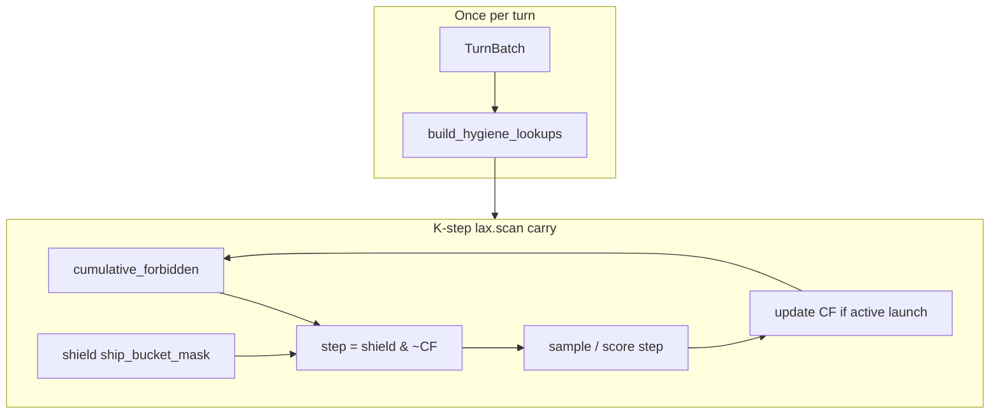

# Plan: Fix launch hygiene rollout throughput (incremental carry)

## Summary

Replace the O(K²) prefix-recompute hygiene path inside the factorized K-step scan with an **incremental cumulative-forbidden carry** and **turn-static lookups**, restoring rollout sampler throughput to within 10% of `main` while preserving R1–R6 semantics and R9 sample/replay parity.

## Problem Frame

PR #163 added `compose_hygiene_with_shield_mask` inside `sequence_scan_body` (`src/jax/action_sampling.py`). Each scan step calls `hygiene_adjusted_bucket_mask_at_step`, which runs `jax.lax.fori_loop(0, step_idx, …)` over prior launches — **O(K²) hygiene work per turn**. Each inner iteration uses `_planet_id_to_row` linear scans over `MAX_PLANETS=60` and full-grid boolean broadcasts (`src/jax/launch_hygiene.py`).

Measured regression (`scripts/benchmark_factorized_sampler.py`, batch=32, shield=cheap):

| `max_moves_k` | main (ms) | hygiene branch (ms) | Slowdown |
|---------------|-----------|---------------------|----------|
| 3 | 1.51 | 2.20 | +46% |
| 5 (default) | 2.93 | 4.56 | **+56%** |
| 8 | 2.56 | 12.55 | +390% |

Default training uses `max_moves_k: 5` (`conf/model/base.yaml`). This blocks merging PR #163 until fixed.

**Amends** original plan KTD1 (prefix recompute, no carry): semantics stay prefix-derived; **representation** moves from per-step recompute to incremental carry updated once per active launch. Equivalence must be proven by tests (see U4).

## Requirements

Traceability to origin requirements (unchanged behavior):

| ID | Requirement |
|----|-------------|
| R1–R3 | Duplicate `(source_row, target_slot)` masked; stop fall-through unchanged |
| R4–R6 | Friendly reverse ban unchanged |
| R9 | Rollout sampling and PPO replay apply the same cumulative forbidden state |
| R11 | Existing hygiene tests remain passing |
| **PERF1** | `benchmark_factorized_sampler` K=5, batch=32 within **10%** of `main` |
| **PERF2** | No Hydra toggle; always-on for factorized decoder (KTD6) |

## Key Technical Decisions

**KTD1′ — Incremental cumulative-forbidden carry (replaces bundle KTD1 for hot path).** Maintain `cumulative_forbidden` with shape `(env, MAX_PLANETS, k, buckets)` in the K-step scan carry. Before step `t`: `step_bucket_mask = shield_mask & ~cumulative_forbidden`. After each **active launch** at step `t`, apply the same dup + reverse rules as `_apply_one_launch_hygiene` via **sparse** updates to `cumulative_forbidden`. Total work O(K) per turn. Rationale: measured +56% regression at default K; prefix recompute is correct but too expensive inside `lax.scan`.

**KTD2′ — Turn-static `HygieneLookups` computed once per sample/replay.** Before the K-step scan, build from `TurnBatch`:
- `planet_id_to_row` gather table (eliminate per-launch `edge_src_ids == planet_id` scans)
- Learner-owned flags by source row (turn-start POV, same as `_owner_is_learner_pov`)

Lookups are read-only inside scan; no mutation.

**KTD3′ — Sparse forbidden updates, not full-grid broadcasts.** Duplicate: mark `(src_row, slot, all buckets)`. Reverse: mark `(rev_row, matching_slots, all buckets)` using precomputed row lookup + slot match mask. Avoid `jnp.arange(num_planets)` equality grids in the hot path.

**KTD4′ — Shared carry logic for rollout and replay scans.** `src/jax/action_sampling.py` and `src/jax/factored_sequence_scan.py` both use the same helpers from `src/jax/launch_hygiene.py`. Replay scan updates carry from **stored** prefix actions; rollout updates from **sampled** actions. Same mask at step `t` given the same prefix.

**KTD5′ — Keep prefix-recompute as parity oracle, not hot path.** Retain `hygiene_adjusted_bucket_mask_at_step` (possibly refactored to use lookups + sparse ops) for golden/property tests comparing carry vs recompute. Not called from `sequence_scan_body` or replay scan after U3.

**KTD6′ — Benchmark gate in tests.** Add a JAX-marked test (or extend `scripts/benchmark_factorized_sampler.py` with `--assert-within-pct 10`) invoked from implementation verification; document in plan verification, not necessarily CI slow tier unless cheap after JIT warm-up.

## High-Level Technical Design

**Scan carry extension (rollout):** add `cumulative_forbidden` to `sequence_scan_body` carry tuple; initialize zeros.

**Replay scan:** add same carry to `_replay_logprobs_with_prefix_forwards` `scan_step`; remove `_hygiene_adjusted_step_mask` call from hot loop.

## Scope Boundaries

### In scope

- Hot-path refactor in `launch_hygiene.py`, `action_sampling.py`, `factored_sequence_scan.py`
- Parity tests (carry ≡ recompute)
- Throughput benchmark gate (PERF1)
- PR #163 re-merge after gates pass

### Deferred to Follow-Up Work

- PPO-update replay throughput tuning if still slow after rollout fix (lower priority — replay scan is not env-step bound)
- Telemetry for hygiene block rates (origin doc non-blocking)
- R12 u5000 replay-parser fixture

### Non-goals

- Changing hygiene semantics or adding Hydra toggles
- Builder merge changes (`src/opponents/jax_actions/builders.py`)
- Heuristic edge-batch opponents (R10)

---

## Implementation Units

### U1. Turn-static hygiene lookups

**Goal:** Precompute planet-id → row and learner-ownership data once per turn.

**Requirements:** KTD2′; enables KTD3′

**Dependencies:** None

**Files:**
- `src/jax/launch_hygiene.py`
- `tests/test_launch_hygiene.py`

**Approach:** Add `HygieneLookups` (NamedTuple or small dataclass) and `build_hygiene_lookups(batch) -> HygieneLookups`. Replace `_planet_id_to_row` hot-path usage with `jnp.take` on the lookup table. Expose `learner_owned_at_row(batch, row)` for friendly checks without planet-id scan.

**Patterns to follow:** `TurnBatch` field layout in `src/jax/features.py`; existing `_owner_is_learner_pov` semantics.

**Test scenarios:**
- Lookup row for each active planet id matches brute-force `_planet_id_to_row`
- Learner-owned flags match `_owner_is_learner_pov` for sample planet ids
- Edge case: invalid planet id maps to sentinel (no reverse ban)

**Verification:** Unit tests pass; no behavior change yet.

---

### U2. Sparse cumulative-forbidden update helper

**Goal:** Single O(1)-per-edge update implementing dup + friendly reverse without full-grid masks.

**Requirements:** R1–R6; KTD3′

**Dependencies:** U1

**Files:**
- `src/jax/launch_hygiene.py`
- `tests/test_launch_hygiene.py`

**Approach:** Add `apply_launch_to_cumulative_forbidden(cumulative, lookups, batch, src_row, slot, active) -> cumulative` using `.at[...].set(True)` on affected cells only. Refactor `_apply_one_launch_hygiene` to delegate to this helper OR share internal logic so oracle and carry paths cannot drift.

**Test scenarios:**
- Duplicate masks only `(src, slot)` buckets
- Friendly reverse masks all slots on reverse row targeting forward source (multi-slot case from existing test)
- Inactive launch (`active=False`) leaves cumulative unchanged
- Sequential two launches match two-step prefix recompute

**Verification:** All scenarios match `compose_hygiene_with_shield_mask` oracle on random small fixtures.

---

### U3. Wire incremental carry into rollout scan

**Goal:** Remove `compose_hygiene_with_shield_mask` from `sequence_scan_body` hot path.

**Requirements:** R1–R3, R9 (rollout side); PERF1

**Dependencies:** U1, U2

**Files:**
- `src/jax/action_sampling.py`
- `src/jax/launch_hygiene.py`

**Approach:**
1. Before `jax.lax.scan`, `lookups = build_hygiene_lookups(batch)`.
2. Extend carry with `cumulative_forbidden` zeros `(env, MAX_PLANETS, k, buckets)`.
3. In body: `step_bucket_mask = shield_step_mask & ~cumulative_forbidden`.
4. After launch validity resolved (same `launch_valid` gate as today), update cumulative via U2 helper.
5. Pass `lookups` via closure (static per scan).

**Execution note:** Run `scripts/benchmark_factorized_sampler.py` after this unit before U4 to confirm PERF1 trending.

**Test scenarios:**
- Existing `tests/test_factored_sequence_scan.py` rollout/replay parity tests still pass (may fail until U4 — run targeted after U3+U4)
- Stop fall-through test still passes

**Verification:** Benchmark K=5 ≤ 110% of main wall time.

---

### U4. Wire incremental carry into replay scan

**Goal:** Replay uses same carry semantics; remove O(K²) `_hygiene_adjusted_step_mask` from `scan_step`.

**Requirements:** R9; R11

**Dependencies:** U1, U2, U3

**Files:**
- `src/jax/factored_sequence_scan.py`
- `tests/test_factored_sequence_scan.py`

**Approach:** Mirror rollout carry in `_replay_logprobs_with_prefix_forwards`:
- Initialize `cumulative_forbidden` before scan
- At step `t`: mask from shield slice + cumulative; score stored action
- Update cumulative from **stored** `source_index[:, t]`, `target_slot[:, t]`, and launch-valid predicate matching rollout

Remove duplicate hygiene application inside `factored_step_logprob_at_index` when `batch=` is passed (hygiene already in `step_bucket_mask` passed to logprob fn).

**Test scenarios:**
- Covers R9: all existing parity tests in `tests/test_factored_sequence_scan.py`
- Covers AE parity: per-step logprob matches prefix forward path
- Property: carry mask at step `t` equals `compose_hygiene_with_shield_mask(..., step_idx=t)` for recorded prefixes

**Verification:** Full targeted JAX test module green.

---

### U5. Benchmark gate and PR readiness

**Goal:** Prevent recurrence; unblock PR #163 merge.

**Requirements:** PERF1, PERF2

**Dependencies:** U3, U4

**Files:**
- `tests/test_launch_hygiene_throughput.py` (new) **or** extend `scripts/benchmark_factorized_sampler.py`
- `docs/plans/2026-06-01-launch-hygiene-bundle-plan.md` (add note in Deferred — perf fix plan link)

**Approach:** JAX test that JIT-warms and asserts median sample time at K=5, batch=32 is ≤ 1.10 × a stored baseline or ≤ 1.10 × live main comparison (prefer fixed baseline constant from calibration run documented in test docstring to avoid needing two checkouts in CI). Mark `@pytest.mark.jax` only; not `slow` if < 30s.

**Test scenarios:**
- Warmup ≥ 3, repeats ≥ 10, assert within 10% of baseline ms documented in file header
- Failure message prints actual vs threshold ms

**Verification:**
- `make test-fast` green
- Throughput test green
- `uv run pytest tests/test_launch_hygiene.py tests/test_factored_sequence_scan.py -q -m jax` green
- PR #163 merge after user approval

---

## Risks and Mitigations

| Risk | Mitigation |
|------|------------|
| Carry vs recompute drift | U2 shared core; U4 property tests against oracle |
| Tiered shield reject → stop changes effective prefix | Use same `launch_valid` predicate for carry updates as rollout (already documented in action_sampling) |
| Replay update order wrong | Mirror rollout: update cumulative **after** scoring step `t` from stored launch at `t` |
| Benchmark flaky on WSL2 GPU | Use median of repeats; document baseline; run on idle GPU |

## Open Questions

None blocking — incremental carry and 10% gate were confirmed in debug/brainstorm session.

## Sources and Research

- Debug session: O(K²) root cause, microbenchmark table above
- Origin: `docs/brainstorms/2026-06-01-launch-hygiene-bundle-requirements.md` (R1–R9)
- Parent implementation: `docs/plans/2026-06-01-launch-hygiene-bundle-plan.md` (KTD1 amended by KTD1′)
- Benchmark script: `scripts/benchmark_factorized_sampler.py`
- Default K: `conf/model/base.yaml` (`max_moves_k: 5`)
