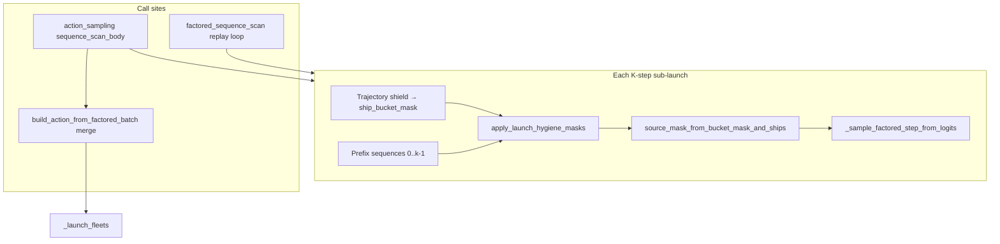

# Plan: Launch Hygiene Bundle

## Summary

Add a shared within-turn hygiene mask layer to the factorized K-step launch decoder: block duplicate `(source row, target slot)` picks, block friendly reverse relays after a forward friendly pick, and merge identical decoded launches in the action builder before env submission. The same mask logic must run during rollout sampling and PPO log-prob replay.

## Problem Frame

The K-step scan in `src/jax/action_sampling.py` tracks `remaining_ships` but not prior edge picks. u5000 replays showed ~72% duplicate-identical launch turns and ~157 same-turn friendly reverse pairs. Requirements R1–R12 define behavioral fixes; this plan sequences implementation without changing reward, encoder, or edge ranking.

## Requirements

Traceability to brainstorm R-IDs (unchanged semantics):

- R1–R3: Within-turn dedup + stop fall-through
- R4–R6: Friendly reverse ban
- R7–R8: Builder merge backstop (P1)
- R9–R10: Sample/replay parity; neural opponent paths only
- R11–R12: Tests (R12 fixture non-blocking)

## Key Technical Decisions

**KTD1 — Prefix-derived hygiene masks (no separate carry tensor).** At step `k`, derive illegal edges from the prefix `source_sequence[:, :k]` and `slot_sequence[:, :k]` plus turn-start planet ownership. Recompute each step inside both sampling and replay rather than maintaining a mutable `(MAX_PLANETS, k)` used-edge carry. Rationale: single source of truth, replay parity by construction (addresses doc-review F-001).

**KTD2 — Canonical identity is `(source_row, target_slot)`.** Hygiene masks, reverse-ban lookup, and tests use factorized indices. Builder merge (KTD3) is the only planet-id layer.

**KTD3 — Builder merge key `(src_planet_id, tgt_planet_id, ships)` with integer ships.** Avoid raw float angle equality; decode slot → `(edge_src_ids, edge_tgt_ids)` from `TurnBatch` when merging factorized steps. For any legacy list-of-tuples path, merge on `(src_id, round(angle, 6), ships)`.

**KTD4 — Reverse ban via planet-id lookup.** When step commits friendly `src_row → slot`, record `(src_planet_id, tgt_planet_id)` from `batch.edge_src_ids` / `batch.edge_tgt_ids`. Later steps mask `tgt_planet` as source row with any slot whose target planet equals `src_planet`. Uses turn-start `game.planets.owner` / learner id for friendly check.

**KTD5 — Compose hygiene into `ship_bucket_mask` before `source_mask_from_bucket_mask_and_ships`.** Hygiene AND-shields existing trajectory shield output; do not post-hoc zero logits after `_factored_step_log_prob_entropy` forced-legal override (doc-review F-003).

**KTD6 — Always-on for factorized decoder; no Hydra toggle in v1.** Simplifies test matrix; revert via git if needed.

## High-Level Technical Design

**Mask rules (pure functions on prefix):**

1. **Used-edge:** For each prior active non-stop launch `(s, t)`, zero `ship_bucket_mask[s, t, :]`.
2. **Reverse friendly:** For each prior friendly→friendly `(i_planet, n_planet)`, when evaluating source row for planet `n`, zero slots targeting planet `i`.

**Stop fall-through (R3):** Existing `_sample_factored_step_from_logits` already sets stop when `~has_target` after masking; extend tests to confirm hygiene can empty all targets.

## Implementation Units

### U1 — Launch hygiene mask helper

**Goal:** Pure JAX helpers that compose hygiene constraints onto `ship_bucket_mask`.

**Files:**
- Create `src/jax/launch_hygiene.py`
- Tests: `tests/test_launch_hygiene.py`

**Approach:**
- `apply_launch_hygiene_to_bucket_mask(batch, ship_bucket_mask, *, learner_id, turn_start_owner, source_prefix, slot_prefix, step_idx, active_prefix_mask)` → masked bucket mask
- Internals: build `(src_row, slot)` pairs from prefix where launch was valid (non-stop, ships>0); apply used-edge zeros; build friendly-forward pairs and reverse zeros via `edge_tgt_ids` / `edge_src_ids`
- Export small CPU reference helper for tests (no JAX) optional

**Test scenarios:**
- After one pick (s=2, t=1), step mask zeros bucket `[2,1,*]`
- Friendly A→B then B→A slot blocked; B→enemy slot legal
- A→B then B→C (enemy) unchanged
- Empty prefix → identity
- Hygiene + shield both illegal → all buckets false → source mask empty → stop path

**Verification:** `uv run pytest tests/test_launch_hygiene.py -q`

---

### U2 — Wire hygiene into rollout sampling

**Goal:** K-step scan applies hygiene before sampling each step; stored `bucket_mask_stack` reflects post-hygiene masks for replay buffer.

**Files:**
- `src/jax/action_sampling.py` (`sequence_scan_body` in `_sample_shielded_factored_sequence_with_params`)

**Approach:**
- Capture `turn_start_owner` once per scan from `game.planets.owner`
- After `apply_configured_trajectory_shield_factorized_topk`, call hygiene helper with prefix built from `source_sequence`/`slot_sequence` columns `< step_idx` (reuse pattern from `build_shield_prefix_teacher_sequences`)
- Pass post-hygiene mask into `_sample_factored_step_from_logits` path (via existing `step_bucket_mask` / `source_mask` chain)
- Store post-hygiene mask in `bucket_mask_stack` so replay buffer matches what sampling saw

**Test scenarios:**
- Extend or add `tests/test_factored_sequence_scan.py`: two-step sequence with forced logits picks duplicate edge on step 2 → step 2 must be stop or different edge
- Integration: `tests/test_factored_step_vmap.py` if vmap hygiene invariants needed

**Verification:** `uv run pytest tests/test_factored_sequence_scan.py tests/test_launch_hygiene.py -q`

---

### U3 — Wire hygiene into PPO replay

**Goal:** `replay_factored_sequence_logprob` / `_replay_logprobs_with_prefix_forwards` applies identical hygiene when recomputing log-probs.

**Files:**
- `src/jax/factored_sequence_scan.py` (`factored_step_logprob_at_index`, `_replay_logprobs_with_prefix_forwards`)
- `src/jax/ppo_update.py` (confirm no bypass)

**Approach:**
- In replay loop at step `k`, apply same `apply_launch_hygiene_to_bucket_mask` using prefix from stored `source_index[:, :k]` / `target_slot[:, :k]` and stored `turn_start_owner` snapshot (add to rollout transition if not recoverable from batch alone — prefer encoding owner in `TurnBatch` globals or pass from rollout state)
- Ensure `rollout_replay_parity_summary` passes with hygiene-enabled sequences

**Test scenarios:**
- Sample sequence in U2 → replay log-prob delta ≈ 0 (existing parity harness)
- Deliberately skip hygiene in replay only → test fails (guard regression)

**Verification:** `uv run pytest tests/test_factored_sequence_scan.py -q`

---

### U4 — Builder merge backstop

**Goal:** Collapse duplicate decoded launches before env; no effect on log-probs.

**Files:**
- `src/opponents/jax_actions/builders.py` (`build_action_from_factored_batch`)
- `src/jax/submission_runtime.py` (if separate action packing)
- Tests: `tests/test_factored_action_builders.py`

**Approach:**
- Post-process valid launch rows: group by `(src_planet_id, tgt_planet_id, ships)` using batch edge tables; sum ships; compact into `JaxAction` fixed width (drop trailing invalid rows)
- Document that merge runs after factorized decode only; does not feed back into training

**Test scenarios:**
- Two identical factorized steps → one fleet row, summed ships (AE3)
- Two different targets → two rows unchanged
- Merge does not run when only one valid launch

**Verification:** `uv run pytest tests/test_factored_action_builders.py -q`

---

### U5 — Regression coverage & docs touch

**Goal:** Satisfy R11; note R10 opponent boundary.

**Files:**
- `tests/test_launch_hygiene.py` (consolidate edge cases)
- `tests/test_factored_sequence_scan.py` (parity + ping-pong)
- Optional comment in `docs/feature-encoding-v2.md` K-step section (1 paragraph on hygiene masks)

**Test scenarios:**
- R10: single test or docstring that heuristic opponents use edge-batch single-step (excluded)
- R3: forced single-edge scenario → stop on step 2

**Verification:** `make test-domain-policy` or `uv run pytest tests/test_launch_hygiene.py tests/test_factored_sequence_scan.py tests/test_factored_action_builders.py -q`

## Sequencing

1. **U1** (helper + unit tests) — no behavior change yet
2. **U2 + U3** in one PR slice (parity requirement) — rollout + replay together
3. **U4** builder merge — can land after U2/U3 or same PR if small
4. **U5** polish + optional doc line

Do not merge U2 without U3 — breaks PPO (R9).

## Scope Boundaries

**In:** Factorized K-step learner, eval/submission, neural opponents sharing `_sample_policy_action`.

**Out:** Ownership-tier ranking, in-scan merge, env-only dedup, heuristic opponents, Hydra feature flag, promotion metrics gates (R12).

## Risks & Dependencies

| Risk | Mitigation |
|------|------------|
| Replay parity break | U2+U3 same PR; extend `rollout_replay_parity_summary` |
| Turn-start owner not in replay batch | Snapshot owner vector in rollout transition or read from `TurnBatch` planet features |
| Reverse ban too aggressive on rotating maps | v1 uses planet-id topology; add rotating-map fixture in U5; revisit if eval regresses |
| IAM exploration shrinkage | Monitor distinct-edges-per-turn in P1 replay parse (non-blocking) |

## Open Questions

**Deferred to implementation (non-blocking):**
- Whether to store `turn_start_owner` on rollout transitions vs reconstruct from batch each replay step
- Exact compact algorithm for builder merge under fixed `max_fleets` padding

**Resolved in this plan:**
- Prefix recompute over carry (KTD1)
- Merge key uses planet ids from edge tables (KTD3)

## Acceptance Examples

Inherited from requirements doc AE1–AE4, F1–F4; implementer verifies via U1–U5 tests mapping to those cases.

## Sources / Research

- Requirements: `docs/brainstorms/2026-06-01-launch-hygiene-bundle-requirements.md`
- Sampling scan: `src/jax/action_sampling.py` (`sequence_scan_body`)
- Replay: `src/jax/factored_sequence_scan.py` (`replay_factored_sequence_logprob`, `factored_step_logprob_at_index`)
- Log-prob forced legal: `src/jax/action_codec.py` (`_factored_step_log_prob_entropy`)
- Existing parity tests: `tests/test_factored_sequence_scan.py`
- Doc review finding F-001 (replay must reconstruct hygiene from prefix)
