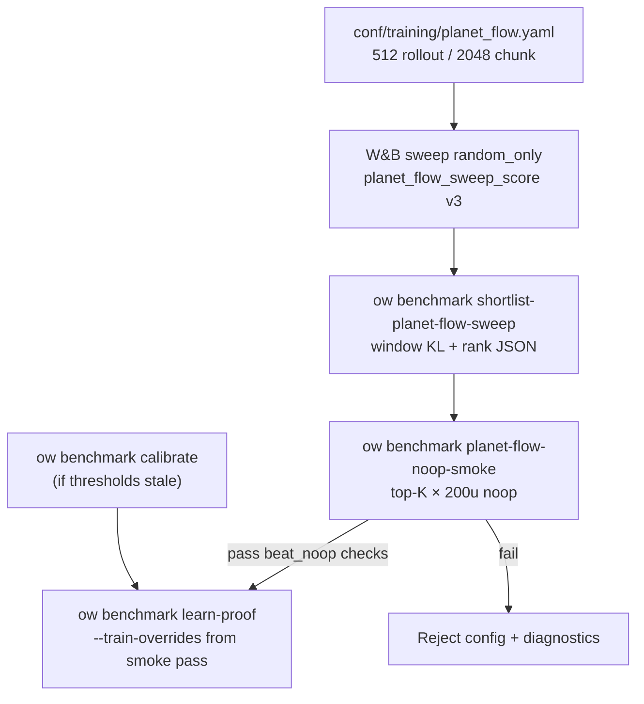

# feat: Planet Flow Proof Pipeline (Gates 2–3) + Baseline Config Audit

**Target repo:** feat/planet-flow-policy worktree (PR #171)

## Summary

Close the sweep → learn-proof gap exposed by `j0epauu2`: random-only sweep scores do not predict noop learn-proof pass rates. Ship **sweep_score v3** (window-mean KL/entropy eligibility aligned with preflight), a **deterministic shortlist CLI** (GitHub #166), **noop smoke** on top-K finalists before full learn-proof, operator docs, and a **Planet Flow baseline config audit** (rollout length, PPO chunk size, action-generation knobs).

This plan delivers **Milestone M1** toward the Planet Flow vs `factorized_topk` decision (see origin `docs/brainstorms/2026-06-01-planet-flow-policy-requirements.md` R20, F4): trustworthy Gates 2–3 evidence for Planet Flow only. It does **not** by itself answer whether Planet Flow is worth pursuing over the factorized decoder — that requires **M2** (paired baseline comparison) and optionally **M3** (Gate 5 tournament).

## Problem Frame

Reachability masking (P0 v2) works — post-mask unreachable rate is 0. The blocker is **objective misalignment**:

| Candidate | Random sweep | Noop learn-proof | Failure |
|-----------|--------------|------------------|---------|
| Winner | strong trend, low point KL | +0.07 trend | KL window mean 1.5 » 0.15 |
| Runner-up | stable KL | flat trend | win_rate_delta 0.006 < 0.05 |

Current `planet_flow_sweep_score` uses **point-sample** `approx_kl` / `entropy` from the latest PPO update while preflight gates use **last-10 window means**. W&B summary scalars understate KL spikes. The legacy `outputs/_meta/sweeps/planet_flow_sweep_followup.py` ranks on `overall_win_rate` with point KL — unsuitable for post-`j0epauu2` workflows.

## Requirements Traceability

| Req | Plan unit |
|-----|-----------|
| R1–R3 | U4, U5 (calibrated thresholds; learn-proof with `--train-overrides`) |
| R4–R7 | U1, U2 |
| R8–R12 | U3, U4 |
| R13 | U6 |
| Side: config defaults audit | U5 |

## Key Technical Decisions

**KTD1 — Shared window metric helper.** Extend `src/jax/train/sweep_score.py` with a generic `MetricWindowTracker` (or reuse preflight `_window_mean` via a thin shared module) using `WINDOW_UPDATES=10` from `src/jax/preflight_calibration.py`. Track `approx_kl` and `entropy` alongside existing `WinRateTrendTracker`.

**KTD2 — sweep_score v3 inputs are window means.** `planet_flow_sweep_score` eligibility compares **window-mean** KL/entropy, not point samples. Training loop passes window means; log `approx_kl_window_mean`, `entropy_window_mean`, and `planet_flow_sweep_score_v3` (or bump semantics of existing keys — prefer explicit new log keys plus backward-compatible score name per R7).

**KTD3 — Shortlist reads the same fields preflight uses.** Rank on eligible `win_rate_delta_10`; tie-break lower `approx_kl_window_mean`, higher `entropy_window_mean`, higher launch activity. Reject ineligible configs with structured `guardrail_reasons` (R12). Prefer W&B summary fields logged by U2; optionally fall back to parsing local `logs/*_jax.jsonl` when `--run-dir` is supplied.

**KTD4 — Noop smoke reuses gate evaluation.** `ow benchmark planet-flow-noop-smoke` runs 200-update `noop_only` trains with shortlist overrides, then evaluates **beat_noop** checks via existing `preflight.py` gate logic (same thresholds as learn-proof). Default top-K=3 (OQ1 deferred — use 3 unless operator passes `--top-k`).

**KTD5 — Planet Flow training profile, not global defaults.** Introduce `conf/training/planet_flow.yaml` (rollout_steps=512, update_chunk_rows=2048) referenced by sweep fixed axes, preflight calibration overrides, and proof artifacts. Do **not** change `conf/training/base.yaml` global defaults for factorized policies. Align preflight hardcoded `training.rollout_steps=128` override with the new profile.

**KTD6 — Action-generation audit conclusions (plan-time).**

| Knob | Current resolved path | Recommendation |
|------|----------------------|----------------|
| `training.rollout_steps` | `base.yaml` 500 via `2p4p_16_split`; preflight forces 128 | Planet Flow profile **512** (covers ~500-step game horizon) |
| `training.update_chunk_rows` | `base.yaml` 1024; sweep searches [512,1024,2048] | Planet Flow profile default **2048** (workstation already uses this) |
| `model.max_moves_k` | `model/base.yaml` 5; Planet Flow is one compound pressure action per env step | Set **1** in `conf/model/planet_flow_target_heatmap.yaml` so launch telemetry denominators match semantics |
| `task.candidate_count` | `task/base.yaml` 6 (schema default 8) | Keep 6 unless audit shows catalog truncation on proof boards; document in audit note; optional bump to **8** only if compile diagnostics show held demand from edge-rank limits |

**KTD7 — CLI placement.** New capabilities live under `ow benchmark` (`src/cli/benchmark.py` + dispatch in `src/cli/__init__.py`), replacing the ad-hoc script pattern. Retire or thin-wrap `outputs/_meta/sweeps/planet_flow_sweep_followup.py` as a deprecated pointer to the CLI.

**KTD8 — Thresholds unchanged.** Calibration bars come only from measured runs (`docs/benchmarks/preflight-calibration.json`). Config/default changes require re-calibration before interpreting learn-proof, but do not relax thresholds to pass a sweep winner (see origin KD3).

**KTD9 — M1 only; decoder choice needs M2.** Gates 2–3 VERIFIED proves Planet Flow **can learn** under calibrated bars, not that it **beats** `factorized_topk`. Passing the same gates as factorized is viability, not superiority (see Decision Outcomes).

---

## Decision Outcomes

Upstream decision frame: `docs/brainstorms/2026-06-01-planet-flow-policy-requirements.md` **R20** (deeper investment requires capped budget or factorized failure on calibrated gates) and **F4** (variant proof comparison against current decoder).

| Milestone | What this plan delivers | Decoder-family implication |
|-----------|-------------------------|----------------------------|
| **M1** (this plan) | Trustworthy sweep → shortlist → smoke → learn-proof for Planet Flow Gates 2–3 | Enables an interpretable Planet Flow learnability verdict — prerequisite for any go/no-go call |
| **M2** (follow-up, out of scope) | Same gate vocabulary + throughput/action-quality side-by-side vs optimized `factorized_topk` profile | Answers “worth pursuing **over** factorized?” — requires paired learn-proof and launch-hygiene baseline |
| **M3** (follow-up, out of scope) | Gate 5 tournament win proof on promoted checkpoint | Answers Kaggle competitiveness if M2 favors Planet Flow |

| Outcome after M1 operator run | Interpretation |
|-------------------------------|----------------|
| Gates 2–3 **VERIFIED** on smoke-passing config | Planet Flow learnability confirmed under fair config — **proceed to M2**; do not declare decoder winner |
| All top-K fail noop smoke | Negative signal for current Planet Flow + PPO combo (sweep v4 or architecture pivot) — **not** a factorized verdict until M2 |
| Universal NOT_VERIFIED after fair config + recalibration | Treat as **negative learnability signal** for this variant; revisit thresholds only via new calibration campaign, not ad-hoc relaxation |
| VERIFIED trend but poor action-quality vs control | Continue research; **not** a production decoder candidate |
| M2: factorized passes same gates with better throughput/trend | **Do not pursue** Planet Flow as primary decoder |

**Evidence reset:** U5 profile changes invalidate pre-U5 learn-proof and `j0epauu2` post-mortem for final M1 verdict — re-calibrate, re-sweep or re-shortlist on v3 metrics, then smoke → learn-proof.

---

## High-Level Technical Design



Window metric flow (training loop):

```mermaid
sequenceDiagram
  participant Loop as train/loop.py
  participant Track as MetricWindowTracker
  participant Score as sweep_score.py
  participant WandB as telemetry

  Loop->>Track: observe approx_kl, entropy each update
  Loop->>Track: observe overall_win_rate (existing)
  Track-->>Loop: window means when len >= 10
  Loop->>Score: planet_flow_sweep_score(window KL, window entropy, ...)
  Score-->>Loop: score or -1.0
  Loop->>WandB: log win_rate_delta_10, approx_kl_window_mean, planet_flow_sweep_score
```

---

## Scope Boundaries

**In scope:** sweep_score v3, shortlist CLI, noop smoke, Planet Flow training profile + model/task audit, operator docs, unit tests on ranking/eligibility — **Milestone M1 only**.

**Out of scope (from origin):** Gate 4 curriculum, Gate 5 tournament (M3), hybrid promotion, compiler rewrite, threshold relaxation without calibration, multi-config ensembles, **factorized baseline comparison (M2)**.

**Deferred for later:**
- **M2:** Side-by-side learn-proof + throughput/action-quality vs optimized `factorized_topk` (e.g. `transformer_factorized_small` or post-hygiene profile) under identical gate vocabulary — separate plan after M1 VERIFIED or clean M1 fail.
- **M3:** Gate 5 tournament after M2 favors Planet Flow.
- sweep v4 with inline noop runs; random smoke in shortlist (OQ2).

**Deferred to Follow-Up Work:** W&B agent automation for smoke batches; download-all-run-artifacts for offline shortlist without summary fields.

---

## Implementation Units

### U1. Window-metric trackers and sweep_score v3 eligibility

**Goal:** Eligibility uses last-10 window means for KL and entropy, matching preflight gate evaluation (R4–R6).

**Requirements:** R4, R5, R6

**Dependencies:** none

**Files:**
- `src/jax/train/sweep_score.py`
- `src/jax/preflight_calibration.py` (export shared window helper if deduplicating `_window_mean`)
- `tests/test_planet_flow_sweep_score.py`

**Approach:**
- Add `MetricWindowTracker` mirroring `WinRateTrendTracker` API: `observe(value)`, `window_mean() -> float | None`.
- Change `planet_flow_sweep_score` to accept `approx_kl` and `entropy` as **window means** (rename parameters in docstring; callers pass window values).
- Add explicit ineligible tests when window-mean KL > 0.15 despite low point KL.
- Export constants for max KL / min entropy so shortlist CLI imports the same floors.

**Test scenarios:**
- Window mean KL 0.20 with point KL 0.01 → ineligible (covers AE1 pathology).
- Window mean entropy below floor → ineligible.
- All activity + reachability floors pass with window KL 0.10 → score equals `win_rate_delta`.
- Tracker returns `None` until 10 observations; score ineligible before window full.

**Verification:** `make test-domain-policy` or targeted `pytest tests/test_planet_flow_sweep_score.py`.

---

### U2. Training loop logging of window metrics

**Goal:** W&B and JSONL carry window means used by sweep objective and offline shortlist (R7).

**Requirements:** R7

**Dependencies:** U1

**Files:**
- `src/jax/train/loop.py`
- `src/jax/train/telemetry.py`
- `src/telemetry/metric_registry.py`
- `tests/test_train_telemetry.py` (extend if needed)

**Approach:**
- Instantiate KL and entropy window trackers when `track_planet_flow_sweep`.
- Each update after PPO metrics host is available: `observe(approx_kl)`, `observe(entropy)`.
- Pass window means into `planet_flow_sweep_score`; log `approx_kl_window_mean`, `entropy_window_mean` alongside existing `win_rate_delta_10` and `planet_flow_sweep_score`.
- Register new metrics in metric registry with descriptions noting window length.

**Test scenarios:**
- Mock tracker sequence: after 10 updates, logged sweep score uses window KL not last point KL.
- Before window full, sweep score stays ineligible (-1.0).
- Telemetry record includes new keys when action_decision metric group enabled.

**Verification:** extend unit tests; optional manual check on 15-update smoke train with planet flow model.

---

### U3. Deterministic Planet Flow sweep shortlist CLI

**Goal:** Replace manual W&B inspection and legacy followup script with `ow benchmark shortlist-planet-flow-sweep` (R8, R9, R12).

**Requirements:** R8, R9, R12

**Dependencies:** U1, U2 (summary fields must exist on finished sweep runs; document minimum sweep version)

**Files:**
- `src/jax/planet_flow_shortlist.py` (new — ranking, guardrails, Hydra override extraction)
- `src/cli/benchmark.py`
- `src/cli/__init__.py`
- `tests/test_planet_flow_shortlist.py` (new)
- `outputs/_meta/sweeps/planet_flow_sweep_followup.py` (deprecation header → CLI)

**Approach:**
- Extract PPO override keys from existing script (`training.lr`, `clip_coef`, `ent_coef`, `epochs`, `vf_coef`, `max_grad_norm`, `update_chunk_rows`).
- Fetch finished W&B runs by sweep id; build eligibility via shared sweep_score + window summary fields.
- Rank eligible runs per R9 tie-break order; include ineligible runs in `audit` array with reasons.
- Emit JSON schema: `{sweep_id, generated_at, eligible[], audit[], winner: null | entry}`.
- CLI flags: `--sweep-id`, `--entity`, `--project`, `--out`, `--max-kl`, `--min-entropy`, `--limit`.

**Patterns to follow:** `src/cli/kaggle_runner.py` shortlist pattern; `tests/test_jax_benchmark.py` for CLI registration checks.

**Test scenarios:**
- Fixture W&B run dicts: high random trend + high window KL → ineligible, not in `eligible`.
- Runner-up-like stable KL + weak trend ranks below strong random trend but remains in eligible list.
- Tie-break: equal `win_rate_delta_10` → lower KL wins.
- Missing summary field → audit records `missing metric` reason.
- Hydra overrides round-trip expected keys.

**Verification:** `uv run ow benchmark shortlist-planet-flow-sweep --help`; pytest on ranking module.

---

### U4. Noop smoke benchmark command

**Goal:** Run cheap noop-only verification on top-K shortlist entries before full learn-proof (R10, R11).

**Requirements:** R10, R11, R2, R3

**Dependencies:** U3

**Files:**
- `src/jax/planet_flow_smoke.py` (new — orchestration)
- `src/cli/benchmark.py`
- `src/cli/__init__.py`
- `tests/test_planet_flow_smoke.py` (new)

**Approach:**
- CLI: `ow benchmark planet-flow-noop-smoke --shortlist PATH [--top-k 3] [--thresholds PATH] [--out PATH]`.
- For each of top-K eligible entries: subprocess `ow train` with shortlist `train_overrides`, fixed proof stack (`model=planet_flow_target_heatmap`, `opponents=noop_only`, `training.total_updates=200`, `artifacts=planet_flow_proof`, `curriculum=off`, `training=planet_flow` from U5).
- After each run, evaluate **beat_noop** gate via existing preflight gate evaluator on `logs/*_jax.jsonl` (reuse `preflight.py` functions — do not duplicate threshold logic).
- Output JSON: per-config smoke results, pass/fail, gate diagnostics, recommended `--train-overrides` for learn-proof.
- First passing config becomes `recommended_for_learn_proof`; if none pass, exit non-zero with full diagnostics (OQ3 input for sweep v4 decision).

**Test scenarios:**
- Mock gate evaluator: passing noop metrics → config marked pass.
- KL window failure → fail with structured reasons matching learn-proof wording.
- `--top-k 1` only runs one train.
- Empty eligible list → clear error.

**Verification:** pytest with mocked train subprocess; manual dry-run with `--dry-run` flag if implemented.

---

### U5. Planet Flow baseline config audit and profile

**Goal:** Sensible defaults for action generation and training throughput on the proof path (user side-request).

**Requirements:** (side-request; enables stable calibration/sweep/learn-proof parity)

**Dependencies:** none (can land before U4 but U4 should reference profile)

**Files:**
- `conf/training/planet_flow.yaml` (new)
- `conf/model/planet_flow_target_heatmap.yaml`
- `conf/wandb_sweep/fixed/planet_flow_ppo_signal.yaml`
- `src/jax/preflight_calibration.py` (`calibration_train_overrides`)
- `docs/benchmarks/preflight-calibration.md` (audit table)
- `tests/test_config_consolidation.py`

**Approach:**
- Create `planet_flow.yaml`: `rollout_steps: 512`, `update_chunk_rows: 2048`, inherit sensible fields from `2p4p_16_split` via defaults chain.
- Set `max_moves_k: 1` on planet flow model YAML.
- Wire `training=planet_flow` into sweep fixed config and preflight calibration overrides (replace hardcoded `rollout_steps=128`).
- Document audit table in preflight-calibration.md: before/after, rationale (512 ≈ full game; chunk 2048 matches workstation; max_moves_k=1 matches single compound action).
- **candidate_count:** add comment in planet flow sweep README or audit doc; only change task override if held-demand diagnostics warrant it (execution-time check deferred to implementer running one proof train).
- After merge, operator must re-run calibrate before learn-proof (KTD8) — note in docs, do not edit thresholds in plan.

**Test scenarios:**
- `test_planet_flow_ppo_signal_sweep_generates_expected_guardrails` resolves `training=planet_flow` with rollout_steps 512.
- Resolved config for `model=planet_flow_target_heatmap` + `training=planet_flow` shows update_chunk_rows 2048 and max_moves_k 1.
- Preflight calibration override composition includes planet_flow profile without duplicate conflicting rollout_steps.

**Verification:** `make test-domain-config`; `uv run ow train print_resolved_config=true model=planet_flow_target_heatmap training=planet_flow`.

---

### U6. Operator documentation

**Goal:** Reproducible command sequence from sweep id to learn-proof (R13).

**Requirements:** R13

**Dependencies:** U3, U4, U5

**Files:**
- `docs/benchmarks/preflight-calibration.md`
- `docs/solutions/logic-errors/planet-flow-sweep-gameable-objective.md` (add v3 + pipeline section)
- `AGENTS.md` (one-line CLI additions if warranted)

**Approach:**
- Document end-to-end flow with `j0epauu2` as example sweep id placeholder.
- Explicit warning: re-shortlist with v3 after U1–U2 deploy; do not promote pre-v3 winner blindly.
- Link acceptance examples AE2–AE4 to CLI outputs.
- Add **Decision Outcomes** operator summary: this pipeline satisfies **M1**; link to `docs/brainstorms/2026-06-01-planet-flow-policy-requirements.md` **R20** and **F4** for when M2/M3 are required before choosing Planet Flow over `factorized_topk`.
- State that Gates 2–3 VERIFIED is necessary but not sufficient for decoder promotion.

**Test expectation:** none — documentation only.

**Verification:** doc review for command accuracy against CLI `--help`.

---

## Risks and Dependencies

| Risk | Mitigation |
|------|------------|
| Finished `j0epauu2` runs lack window summary fields | Shortlist falls back to ineligible + audit reason; re-run sweep after U2 or parse local run dirs when available |
| 512 rollout × 2048 chunk increases GPU memory | Planet Flow profile only; monitor one calibrate run; workstation profile already uses 2048 chunk |
| max_moves_k=1 breaks unexpected code paths | Grep planet-flow tests; factorized policies unchanged |
| Config change invalidates calibration JSON | Operator re-runs calibrate; plan does not auto-edit thresholds; **do not use pre-U5 learn-proof for M1 verdict** |
| Strict calibrated floors vs weak Planet Flow median trend (~−0.02 vs floor 0.05) | Universal NOT_VERIFIED after fair pipeline → treat as negative learnability signal for this variant, not pipeline bug; do not relax thresholds ad hoc; M2 still required before final kill vs factorized |
| Gates 2–3 VERIFIED misread as “beat factorized” | Decision Outcomes table + U6 docs; M2 follow-up plan owns paired comparison |

**Prerequisites:** W&B auth for shortlist; existing `planet_flow_learning_signal` in calibration JSON for smoke gate thresholds.

---

## Acceptance Examples (verification targets)

**AE1.** Config with random trend but window-mean KL 0.5 → ineligible in sweep score and absent from shortlist `eligible`.

**AE2.** Runner-up passes noop smoke while winner fails KL → smoke JSON recommends runner-up for learn-proof.

**AE3.** Smoke pass shows unreachable ≈ 0 and KL window mean ≤ calibrated max.

**AE4.** `ow benchmark shortlist-planet-flow-sweep --sweep-id j0epauu2` reproduces ranking without W&B UI.

---

## Open Questions (carried from origin)

| ID | Resolution in this plan |
|----|-------------------------|
| OQ1 top-K default | Default 3 in U4 CLI |
| OQ2 random smoke in shortlist | Deferred; trust sweep window metrics |
| OQ3 sweep v4 if all fail | Operator decision after first smoke cycle; document in U6 |

---

## Sources and Research

- Origin: `docs/brainstorms/2026-06-02-planet-flow-proof-pipeline-requirements.md`
- Decision frame: `docs/brainstorms/2026-06-01-planet-flow-policy-requirements.md` (R20, F4, P0 success criteria)
- Institutional: `docs/solutions/logic-errors/planet-flow-sweep-gameable-objective.md`
- Evidence runs: sweep `j0epauu2`, learn-proof reports under `outputs/preflight/`
- Config audit: `conf/training/base.yaml` (rollout 500), `preflight_calibration.py` (128 override), `conf/training/workstation.yaml` (chunk 2048), `conf/model/base.yaml` (max_moves_k 5)
