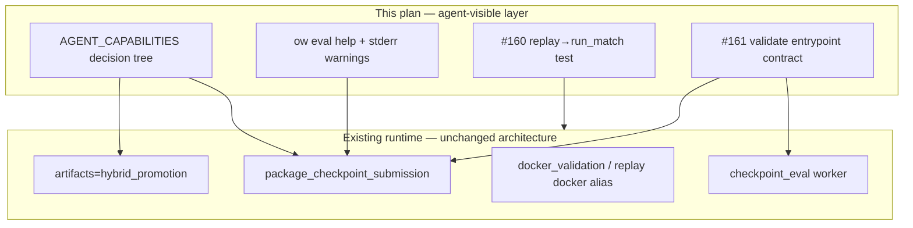

# feat: CLI hardening — submit-valid path funnel

## Summary

Converge coding agents and operators onto one **submit-valid validation funnel** (hybrid `checkpoint_eval` poll + manifest read, or `ow eval package --validate-docker`) by strengthening agent docs, CLI discovery/messaging, and CI guardrails ([#160](https://github.com/jmduea/orbit_wars/issues/160), [#161](https://github.com/jmduea/orbit_wars/issues/161)). Option 3 scope: docs + tests + bounded runtime warnings—not wholesale removal of replay/docker worker kinds or script entrypoints (see origin).

## Problem Frame

Too many surfaces look like “validation”: local replay HTML, packaging-only `ow eval package`, default-profile async `replay` with `replay_backend=docker`, direct `scripts/*` invocation, and tournament `--write-replays`. Agents can pass `make test-fast` while missing replay caller arity drift or Docker-bypass refactors. Roadmap “Now” work depends on Kaggle Docker probes and tournament-gated promotion (`docs/ROADMAP.md`); this plan makes the canonical path unavoidable in agent-facing material (origin Problem Frame, F5).

---

## Requirements

| ID | Requirement | Origin |
|----|-------------|--------|
| R1 | Document the two-step agent contract: hybrid train → `ow eval status --watch` → `ow eval results show` / `manifest.json` for `validation_ok`; manual `ow eval package --validate-docker` with JSON `"ok": true`. | R1, F1–F2 |
| R2 | Add a compact decision tree (mermaid or numbered branches) to `docs/AGENT_CAPABILITIES.md` routing submit-valid vs inspect-only vs demoted alias paths; Gate 5 tournament-proof **after** Docker, not as substitute. | R2, AE5 |
| R3 | Success signals are manifest/JSON-backed; local replay HTML alone is never submit-valid proof. | R3, AE1 |
| R4 | Demote replay-as-validation in agent docs; name `replay_backend=docker` as real Docker but out of funnel; hybrid already disables replay. | R4, AE6 |
| R5 | Packaging-only emits stable stderr line; agent docs label layout-only. | R5, AE2 |
| R6 | Remove script-first discovery from agent docs; optional runtime stderr warning on direct script invoke. | R6, AE5 |
| R7 | Steer hybrid runs to `checkpoint_eval` composite; document standalone `docker_validation` as secondary. | R7 |
| R8 | Tournament `--write-replays` classified as inspect-only in help + tree. | R8, AE6 |
| R9 | **#160** — CI exercises `maybe_write_jax_checkpoint_replay` → `run_match` arity contract. | R9, AE3 |
| R10 | **#161** — Contract that user-facing validate paths invoke Docker validation entrypoints, not layout-only. | R10, AE4 |
| R11 | `ow eval package` / `submit` / `worker` / `tournament` help distinguishes validate vs package vs replay inspect vs docker-replay alias. | R11 |
| R12 | No new monolithic validate wrappers; extend primitives only. | R12 |

---

## Key Technical Decisions

- **Option 3 enforcement (docs + CI + light runtime messaging).** No deletion of `replay` worker kind, `scripts/validate_kaggle_docker_submission.py`, or root `artifacts=default` Hydra defaults in this track (origin Key Decisions).

- **`artifacts=default` replay: warn-only + doc demotion.** Do not change `conf/artifacts/base.yaml` replay defaults; document that async `replay_backend=docker` is out of funnel and optional worker stderr may warn when a `replay` job runs without hybrid `checkpoint_eval` (origin Open Questions — product/config).

- **Script escape hatches: doc removal + stderr warning.** No `OW_ALLOW_SCRIPT_VALIDATE` gate in v1; maintainers keep scripts; agents are steered to `ow eval` primitives (origin R6).

- **#161 test strategy: boundary mocks, not real Docker in CI.** Patch or spy the shared Docker validation function (`src/artifacts/docker_validation.py` / packager call chain) so tests assert the entrypoint is invoked when `--validate-docker` is set; reuse patterns from `tests/test_checkpoint_eval.py` fake_docker and `tests/test_kaggle_submission_packager.py` (origin Open Questions — implementation).

- **Status JSON unchanged.** `validation_ok` remains on `ow eval results show` and `evaluations/checkpoint_eval_u*/manifest.json`; inline in `ow eval status` stays deferred (origin Deferred).

- **Packaging-only line is canonical.** Keep and reference existing stderr: `docker_validation=skipped (packaging only; does not prove competition compatibility)` in `src/cli/eval.py` `run_package_cli` (grep-friendly for agents).

---

## High-Level Technical Design

Agent reads docs/help → chooses F1 (hybrid poll + results) or F2 (`package --validate-docker`) → never substitutes F3 inspect paths or demoted docker-replay alias as submit-valid proof.

---

## Scope Boundaries

**In scope**

- `docs/AGENT_CAPABILITIES.md`, `docs/kaggle_submission.md` (agent sections), minimal `AGENTS.md` pointer sync
- `src/cli/eval.py` help text and top-level `print_eval_help` examples
- Optional stderr in `scripts/validate_kaggle_docker_submission.py` and `scripts/run_artifact_worker.py` when `__main__`
- `tests/test_replay.py` or artifact-domain extension (#160)
- New or extended test module for validate invariant (#161), e.g. `tests/test_eval_validate_invariant.py`

**Deferred for later** (from origin — unchanged)

- Inline `validation_ok` in `ow eval status`
- Automated agent linter blocking replay prompts
- Root Hydra default change for `replay_async` / `replay_backend`
- Full script removal; Planet Flow proof pipeline (#166–#170); Gate 5 semantics change

**Outside this product's identity**

- Artifact worker architecture rewrite
- Planet Flow / compiler-control tracks

### Deferred to Follow-Up Work

- Retarget or rename `replay` worker kind for docker backend
- Env-gated script invocation (`OW_ALLOW_SCRIPT_VALIDATE`)
- Subjective agent-session qualitative review (non-merge gate per origin)

---

## Assumptions

Planning resolved origin **Open Questions** for implementation (headless; revise if product disagrees):

| Question | Assumption for this plan |
|----------|---------------------------|
| Warn-only vs auto-disable replay under `artifacts=default` | Warn-only + doc demotion only; no Hydra default change. |
| `replay_backend=docker` alias treatment | Doc demotion + optional one-line worker warning; no kind rename. |
| Script deprecation mechanism | stderr warning on direct `python scripts/...` when not imported as library. |
| #161 Docker in tests | Mock/spy at `docker_validation` boundary; no Docker daemon in `make test-fast`. |

---

## Implementation Units

### U1. Agent decision tree and canonical funnel

**Goal:** Single agent-readable map from “validate checkpoint” to F1/F2 with explicit non-validating branches (R1–R3, R2, AE1, AE2, AE5).

**Requirements:** R1, R2, R3, R5 (doc half), R4, R6, R7, R8

**Dependencies:** None

**Files:**

- `docs/AGENT_CAPABILITIES.md`
- `docs/AGENT_CAPABILITIES.md` copy-paste prompts section (extend)

**Approach:**

- Add **Submit-valid decision tree** section with mermaid (reuse origin diagram structure: canonical / inspect / demote subgraphs).
- Expand **Hybrid promotion poll contract** to require `ow eval results show --run <run_dir> --result <checkpoint_eval_id>` (or `evaluations/checkpoint_eval_u*/manifest.json`) for `validation_ok` before claiming success—not queue idle alone.
- Add **Manual pre-upload** subsection: `ow eval package --checkpoint … --validate-docker` → JSON `"ok": true`.
- Add **Inspect only** subsection: local replay, `replay_backend=local`, tournament `--write-replays`; explicit “still need F1 or F2.”
- Add **Demoted paths** bullet: default async `replay` + `replay_backend=docker`, packaging-only, scripts—do not cite as agent default.
- Add copy-paste prompt: “Validate my checkpoint for submission” → hybrid or package path.
- Note Gate 5 `ow benchmark tournament-proof` only after Docker validation (no semantics change).

**Patterns to follow:** Existing hybrid poll contract in same file (~lines 92–98); `AGENTS.md` hybrid bullet for manifest read.

**Test scenarios:**

- Covers AE5. Given a reader using only AGENT_CAPABILITIES, when tracing “validate checkpoint,” then the tree lists hybrid poll+results and package `--validate-docker` before any script or replay HTML path.
- Covers AE2. Tree states packaging without `--validate-docker` is layout-only and requires follow-up validate step.
- Covers AE6. Inspect branch does not claim submit-valid.

**Verification:** Doc review against origin acceptance examples AE1, AE2, AE5, AE6; no code change required for unit completion.

---

### U2. Secondary doc sync (kaggle + AGENTS)

**Goal:** Align operator/submission docs with funnel; remove script-first agent discovery (R6, R7, R4).

**Requirements:** R4, R6, R7, R1 (pointers)

**Dependencies:** U1 (shared terminology)

**Files:**

- `docs/kaggle_submission.md`
- `AGENTS.md` (minimal: submit-valid two-step poll + link to AGENT_CAPABILITIES tree)

**Approach:**

- In `docs/kaggle_submission.md`, label agent workflows as **Submit-valid (agents)** vs **Inspect / operator advanced**.
- Move `scripts/run_artifact_worker.py` reference under operator/advanced with “non-agent; prefer `ow eval worker`.”
- State hybrid `checkpoint_eval` preferred over standalone `docker_validation` when using `artifacts=hybrid_promotion`.
- `AGENTS.md`: one short bullet under hybrid promotion pointing to decision tree + `results show` for `validation_ok`.

**Test scenarios:**

- Test expectation: none — documentation-only unit; U1 scenarios cover agent routing.

**Verification:** Grep agent-oriented docs for `scripts/validate_kaggle_docker_submission` as recommended first step — should be absent or explicitly non-agent.

---

### U3. CLI help and packaging messaging

**Goal:** CLI discovery reinforces validate vs package vs replay (R5, R8, R11).

**Requirements:** R5, R8, R11

**Dependencies:** U1 (terminology alignment)

**Files:**

- `src/cli/eval.py`
- `tests/test_eval_cli.py` (extend or add focused help/message tests)

**Approach:**

- Update `print_eval_help()` examples to include `ow eval package … --validate-docker` and `ow eval results show` after hybrid train.
- Refine `package` / `submit` parser `help=` strings: layout-only default vs `--validate-docker` submit-valid.
- `worker` help: mention processes `checkpoint_eval`, `replay`, `docker_validation`; note replay local = inspect, docker backend = demoted alias.
- `tournament` help (in `_add_tournament_arguments`): `--write-replays` is inspection/debug, not submit-valid.
- Ensure `run_submit_cli` prints the same packaging-only stderr when `--validate-docker` omitted (mirror `run_package_cli` if missing).
- Add/extend test asserting stderr line when package without `--validate-docker` (stable substring for agents).

**Patterns to follow:** Existing `run_package_cli` stderr at `src/cli/eval.py`; `tests/test_eval_cli.py` subprocess patterns if present.

**Test scenarios:**

- Given `ow eval package` without `--validate-docker`, when CLI runs, then stderr contains `docker_validation=skipped` and `packaging only`.
- Given `ow eval package --help`, when parsed, then help text mentions Docker validation flag for submit-valid proof.
- Given `ow eval tournament --help`, when parsed, then `--write-replays` described as inspect/debug not submit-valid.

**Verification:** `make test-fast` including new/updated eval CLI tests.

---

### U4. Script demotion warnings (optional, low risk)

**Goal:** Secondary guard when maintainers/agents invoke scripts directly (R6).

**Requirements:** R6

**Dependencies:** U2 (docs already demoted)

**Files:**

- `scripts/validate_kaggle_docker_submission.py`
- `scripts/run_artifact_worker.py`
- `tests/test_script_deprecation_warnings.py` (new, small)

**Approach:**

- Under `if __name__ == "__main__":`, print one stderr line: prefer `ow eval package --validate-docker` or `ow eval worker` respectively; non-fatal (exit code unchanged).
- Skip warning when imported as module (tests import validate script today).

**Test scenarios:**

- Given direct script invocation with patched argv, when main runs, then stderr contains `ow eval` preference string and exit code unchanged.

**Verification:** `make test-fast` on new test file.

---

### U5. #160 — Replay integration coverage

**Goal:** CI fails if `run_match` return arity breaks `maybe_write_jax_checkpoint_replay` callers (R9, closes #160).

**Requirements:** R9

**Dependencies:** None (can parallel U3)

**Files:**

- `tests/test_replay.py` (extend) or `tests/test_artifact_replay_integration.py` (new)
- `src/artifacts/replay.py` (read-only unless fix needed)
- `src/artifacts/tournament/runner.py` (`run_match` signature)

**Approach:**

- Add integration-style test that calls `maybe_write_jax_checkpoint_replay` with minimal `TrainConfig` (replay enabled, local backend), mocking `run_match` to return a 3-tuple and asserting replay metadata/HTML write path executes without unpack errors.
- Alternatively smoke-call with monkeypatched `run_match` returning fixed tuple and tmp paths—mirror issue intent: caller contract enforced.
- Register under artifact domain if new file; ensure `tests/conftest.py` domain map updated if needed.

**Execution note:** Characterization-first—assert current 3-tuple unpack at `replay.py` line calling `run_match` before any signature change elsewhere.

**Test scenarios:**

- Covers AE3. Given `run_match` mocked to return `(outcome, env, timing)` 3-tuple, when `maybe_write_jax_checkpoint_replay` runs, then no unpack error and metadata path returned/written.
- Given `run_match` mock returns wrong arity (2-tuple), when test invokes caller wrapper, then test fails (documents expected contract).

**Verification:** `make test-domain-artifacts`; closes [#160](https://github.com/jmduea/orbit_wars/issues/160) when merged.

---

### U6. #161 — Validate subcommand invariant

**Goal:** Contract test that user-facing validate paths invoke real Docker validation, not layout-only (R10, closes #161).

**Requirements:** R10

**Dependencies:** U3 (CLI flags stable)

**Files:**

- `tests/test_eval_validate_invariant.py` (new)
- `src/artifacts/kaggle_submission.py` (`package_checkpoint_submission`)
- `src/artifacts/docker_validation.py` (or module re-exporting validate)
- `src/artifacts/checkpoint_eval.py` (docker phase — optional second assertion)

**Approach:**

- Test `package_checkpoint_submission(..., validate_docker=True)` calls Docker validation helper (patch `run_docker_validation` or equivalent; assert called once with checkpoint/output args).
- Test `validate_docker=False` does **not** call Docker helper (layout-only path).
- Test `ow eval package` CLI with `--validate-docker` propagates flag (subprocess or `run_package_cli` with monkeypatch).
- If feasible without Docker daemon: assert `ow eval submit --validate-docker` packaging path triggers same helper when packaging from checkpoint.
- Document in test module that internal `--skip-docker` on scripts is not user-facing per issue intent.

**Test scenarios:**

- Covers AE4. Given refactor that removes Docker call from `package_checkpoint_submission` when `validate_docker=True`, when CI runs invariant tests, then build fails.
- Given `validate_docker=False`, when packager runs, then Docker helper not called.

**Verification:** `make test-domain-artifacts` and `make test-fast`; closes [#161](https://github.com/jmduea/orbit_wars/issues/161) when merged.

---

## Verification (track-level)

| Check | Command / criterion |
|-------|---------------------|
| Fast CPU tests | `make test-fast` after U3–U6 |
| Artifact domain | `make test-domain-artifacts` after U5–U6 |
| Doc grep | No agent doc recommends local replay HTML or packaging-only as submit-valid |
| Issues | Close #160 and #161 with PR linking this plan |

Do not run slow/JAX-compile smokes or full `make test-premerge` unless user requests.

---

## Risks & Dependencies

- **Risk:** Wording drift between `AGENT_CAPABILITIES.md` and `AGENTS.md` — mitigate by U2 minimal sync and single decision tree as source of truth.
- **Risk:** #161 tests too brittle if they bind to private helper names — mitigate by patching stable public function in `docker_validation` / packager layer.
- **Dependency:** Hybrid promotion and `checkpoint_eval` worker remain implemented on `main` (origin Dependencies).
- **Dependency:** Docker unavailable remains environment failure (F5); docs must not suggest replay workaround.

---

## Sources & Research

- Origin: `docs/brainstorms/2026-06-02-cli-hardening-requirements.md`
- Issues: [#160](https://github.com/jmduea/orbit_wars/issues/160), [#161](https://github.com/jmduea/orbit_wars/issues/161)
- Code: `src/cli/eval.py`, `src/artifacts/replay.py`, `src/cli/run_status.py`, `conf/artifacts/hybrid_promotion.yaml`, `conf/artifacts/base.yaml`
- Tests: `tests/test_replay.py`, `tests/test_checkpoint_eval.py`, `tests/test_kaggle_submission_packager.py`, `tests/test_artifact_pipeline.py` (`test_replay_job_defaults_to_docker_backend`)
- Prior art: `docs/solutions/developer-experience/agent-native-operator-cli-phase1.md`
