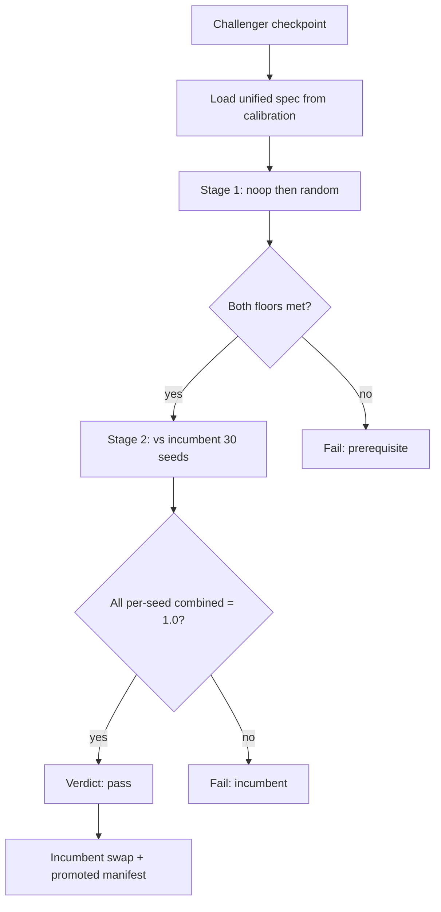
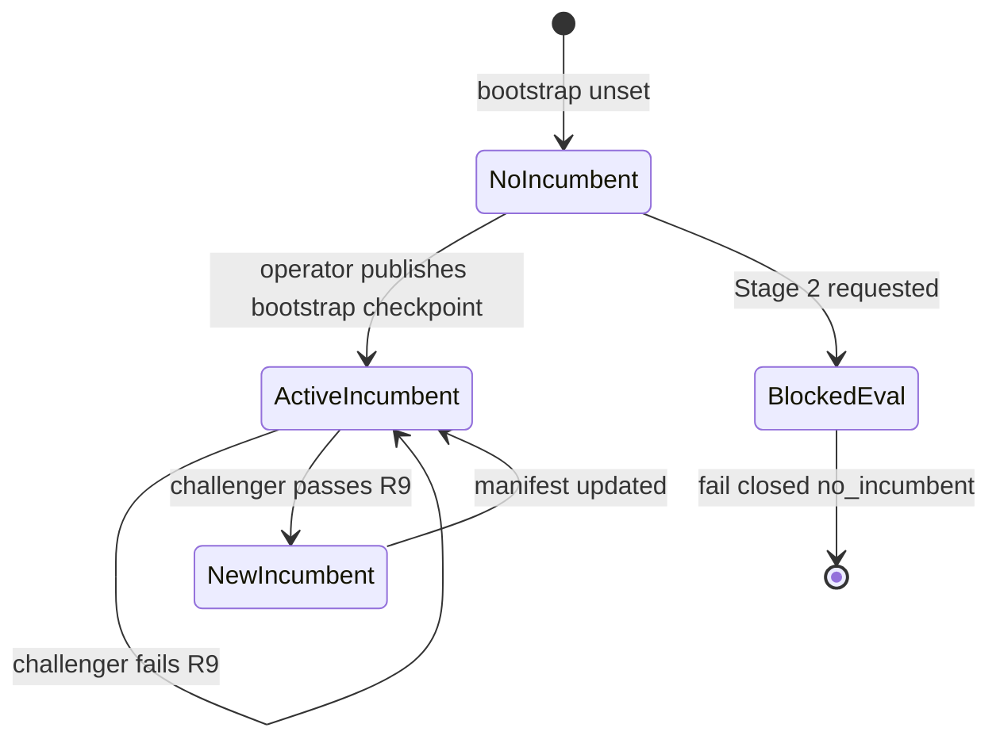
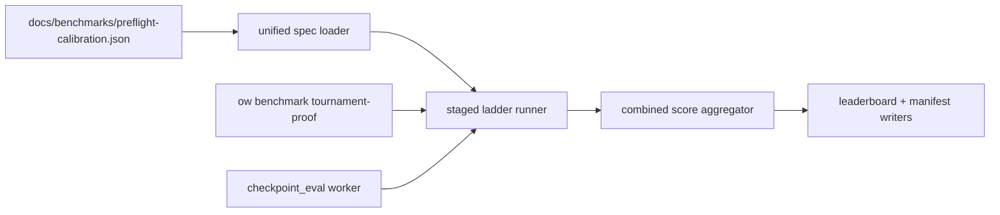

# feat: Gate 5 unified held-out tournament

## Summary

Unify Gate 5 win proof (`ow benchmark tournament-proof` / `ow benchmark learn-proof`) and hybrid promotion tournament stages (`checkpoint_eval` under `artifacts=hybrid_promotion`) behind one held-out tournament specification: combined 2p+4p scoring, noop/random prerequisites, then a strict nearest_sniper incumbent ladder with per-seed 100% combined win rate over 30 seeds. Replace today's divergent 2p-only Gate 5 CLI and legacy soft sniper promotion gates with a single config-driven ladder consumed by both CLI and worker paths.

---

## Problem Frame

Gate 5 and hybrid promotion currently disagree on what “tournament passed” means. `run_tournament_proof_cli` in `src/cli/benchmark.py` hardcodes `2p_vs_baseline`, one baseline per invocation, and compares a single pooled 2p win rate against floors in `docs/benchmarks/preflight-calibration.json`. Hybrid `checkpoint_eval` inherits `conf/artifacts/base.yaml` promotion gates (`min_win_rate_vs_sniper: 0.55`, `min_win_rate_vs_incumbent: 0.51`) with different seeds, games-per-pair, and no combined 2p+4p metric. Agents cannot treat tournament verdicts as portable between benchmark proof and training promotion, 4p competence is untested in the preflight path, and the public-readiness incumbent bar is neither Gate 5 nor what hybrid workers enforce today (see origin).

---

## Requirements

### Unified tournament shape

- R1. Gate 5 and hybrid `checkpoint_eval` tournament stages share one opponent set, format coverage, combined scoring, seed policies, and pass/fail rules; orchestration (CLI subprocess vs async worker) may differ, definition may not.
- R2. Every stage runs held-out games in both 2-player and 4-player modes aligned with tournament format vocabulary in `src/config/schema.py` and `conf/artifacts/base.yaml`.
- R3. Combined score = `0.5 × win_rate_2p + 0.5 × win_rate_4p` per opponent; Stage 2 incumbent evaluation (R9) additionally computes per-seed combined scores from that seed's 2p and 4p games.
- R4. Opponent ladder: Stage 1 = noop + random only; Stage 2 = promoted incumbent checkpoint (not scripted curriculum `sniper`).

### Prerequisites

- R5. noop combined score ≥ `noop_min_win_rate` (initial 0.7 from calibration) before incumbent stage.
- R6. random combined score ≥ `random_min_win_rate` (initial 0.58) before incumbent stage.
- R7. Prerequisite failure stops the ladder; incumbent stage does not run.

### Incumbent ladder

- R8. Stage 2 compares challenger vs promoted incumbent checkpoint until R9 satisfied.
- R9. Incumbent swap requires every one of 30 seeds to achieve per-seed combined score 1.0 vs incumbent; pooled rate is insufficient.
- R10. Hybrid promotion supersedes legacy `PromotionTournamentConfig` soft sniper floors once unified spec ships.

### Staged execution and reporting

- R11. Runtime runs noop/random before incumbent evaluation; early exit on prerequisite failure.
- R12. Staging affects scheduling only; pass criteria are identical across stages.
- R13. Reports expose combined score plus per-format rates per opponent (leaderboard, proof report, checkpoint_eval manifest).
- R14. Unified tournament does not replace Docker validation in the submit-valid funnel.

---

## Key Technical Decisions

**KTD1 — Single spec module, two thin consumers.** Introduce a dedicated unified tournament module (e.g. `src/artifacts/tournament/unified/`) owning ladder definition, staged runner, combined scoring, and verdict serialization. `run_tournament_proof_cli` and `run_tournament_promotion_job` delegate to this module instead of duplicating subprocess flags or legacy `evaluate_gates` semantics. Rationale: R1 parity; today `benchmark.py` and `worker.py` diverge at the first line of tournament config.

**KTD2 — Extend calibration JSON, not ad-hoc CLI flags.** Authoritative numeric defaults (games-per-seed, seed lists, incumbent pointer, recalibrated floors) live in an extended `docs/benchmarks/preflight-calibration.json` section `unified_tournament` (or sibling `docs/benchmarks/unified-tournament-calibration.json` referenced from preflight calibration). CLI `--games-per-pair` / `--seeds` become overrides only; committed enforcement waits on calibration artifact per project verification policy (see origin Success Criteria).

**KTD3 — New 4p format for single-checkpoint evaluation (Q5).** Add `4p_challenger_vs_baselines`: one checkpoint agent plus three scripted baseline slots (default filler triple: noop, random, random — overridable in calibration) in a 4p free-for-all per seed. Win rate for the 4p leg = fraction of games where challenger places first. Do not reuse `4p_free_for_all` (requires ≥4 unique candidates in `src/artifacts/tournament/eval.py`). If 4p scheduling yields zero games, fail closed with reason `missing_4p_games` rather than treating 4p rate as 0.5 or skipping the leg. Rejected alternative: padding with duplicate checkpoint clones — rejected because it does not test multi-opponent 4p interaction.

**KTD4 — Combined scoring replaces legacy gate fields.** Replace `evaluate_gates` sniper/incumbent/4p-first-place checks for unified paths with `UnifiedLadderVerdict`: per-opponent `{win_rate_2p, win_rate_4p, combined, passed}` and Stage 2 `{per_seed_combined: list[float], all_seeds_perfect: bool}`. Legacy `PromotionTournamentConfig` fields remain in schema for non-unified profiles but are ignored when unified spec is active (`conf/artifacts/unified_tournament.yaml` or hybrid profile override).

**KTD5 — Incumbent reference: campaign promoted manifest + global bootstrap.** Stage 2 resolves incumbent via existing `resolve_promoted_agent` / `promoted/current_best/manifest.json` per campaign. For Gate 5 held-out runs without a campaign context, read `unified_tournament.incumbent_checkpoint_path` from calibration JSON (Q4). Missing incumbent → fail closed, reason `no_incumbent`, no promotion side effects (origin AE3, Q4).

**KTD6 — Staged runner with explicit stage artifacts.** One ladder invocation writes `stage1_prerequisites/` then, only on pass, `stage2_incumbent/` under the evaluation output dir. Proof report JSON includes `stages[]` with early-exit reason when Stage 2 skipped (R7, R11, AE1–AE2).

**KTD7 — Gate 5 YAML recipe (optional loader hook).** Add `conf/benchmark/gates/win_proof_tournament.yaml` documenting win-proof overrides for discoverability; `preflight_gate_loader.py` does not need to build train specs for Gate 5 (checkpoint-only), but the YAML provides a stable name for `ow benchmark gate list` and future CI wiring. Primary Gate 5 entry remains `tournament-proof`.

---

## High-Level Technical Design

### Staged tournament flow

### Incumbent model

### Component topology

---

## System-Wide Impact

| Surface | Change |
| --- | --- |
| `ow benchmark tournament-proof` | Multi-stage ladder, combined metric, both baselines in one invocation; `--baselines` becomes deprecated or maps to stage filter for debugging only |
| `ow benchmark learn-proof --eval-checkpoint` | Inherits new tournament-proof behavior unchanged composer-wise |
| `artifacts=hybrid_promotion` | Tournament stage uses unified ladder; promotion requires Stage 2 pass, not legacy 0.55 sniper floor |
| `ow eval tournament` | May gain `--unified-ladder` flag or become internal detail; standalone tournament CLI keeps legacy multi-candidate behavior for non-proof use |
| `ow eval results show` / status JSON | New fields: `tournament_stages`, per-opponent combined scores, `incumbent_swap` boolean |
| `ow promote show` | Manifest may record unified metrics (`unified_combined_noop`, etc.) alongside legacy fields during transition |
| `AGENTS.md` / `docs/AGENT_CAPABILITIES.md` | Gate 5 description updated to unified spec; threshold comments refreshed from calibration |
| CI / agent loops | No enforced unified pass/fail until calibration artifact committed (origin Success Criteria) |

---

## Implementation Units

### U1. Unified tournament spec and config

**Goal:** Define the canonical ladder spec (opponents, stages, seed counts, floors, formats) loadable from calibration JSON and Hydra.

**Requirements:** R1, R2, R4, R5, R6, R8

**Dependencies:** None

**Files:**
- `src/artifacts/tournament/unified/spec.py` (new)
- `src/artifacts/tournament/unified/__init__.py` (new)
- `src/config/schema.py` — optional `UnifiedTournamentConfig` dataclass
- `conf/artifacts/unified_tournament.yaml` (new) — defaults for hybrid profile composition
- `conf/artifacts/hybrid_promotion.yaml` — compose unified tournament defaults
- `docs/benchmarks/preflight-calibration.json` — add `unified_tournament` section stub (non-enforcing until U6 calibration)
- `tests/test_unified_tournament_spec.py` (new)

**Approach:** Dataclass spec mirroring origin R3–R9 semantics: `StageSpec(name, opponents, seeds, games_per_pair, formats, floors)`, `UnifiedTournamentSpec(stage1, stage2, incumbent_ref)`. Loader reads calibration JSON with fallback to schema defaults; validates incumbent path when Stage 2 enabled.

**Patterns to follow:** `src/jax/preflight_calibration.py` threshold loading; Hydra composition in `conf/artifacts/hybrid_promotion.yaml`.

**Test scenarios:**
- Happy path: load spec from fixture JSON with noop/random floors 0.7/0.58 and 5 + 30 seeds → parsed stage seeds match.
- Edge: missing `unified_tournament` section → loader returns `needs_calibration` sentinel (no enforcement).
- Error: Stage 2 enabled but incumbent path absent → spec validation raises or returns `no_incumbent` blocking flag.
- Integration: Hydra `artifacts=hybrid_promotion` + unified overlay resolves tournament enabled and unified flag true (`tests/test_config_consolidation.py` extension).

**Verification:** Spec loader unit tests pass; config consolidation test confirms hybrid profile composes unified tournament.

---

### U2. Combined score aggregation

**Goal:** Implement R3 combined scoring and per-seed incumbent aggregation from match outcomes.

**Requirements:** R3, R9, R13

**Dependencies:** U1

**Files:**
- `src/artifacts/tournament/unified/scoring.py` (new)
- `src/artifacts/tournament/types.py` — extend `LeaderboardRow` or add `UnifiedOpponentScore` type
- `tests/test_unified_tournament_scoring.py` (new)

**Approach:** Pure functions: `aggregate_format_win_rate(outcomes, agent_id, format_name, opponent_filter)` → `win_rate_2p`, `win_rate_4p`; `combined_score(w2, w4) = 0.5*w2 + 0.5*w4` with fail-closed when either leg missing. `per_seed_combined(outcomes, seed)` groups by logical seed (not match_index offset) for Stage 2. Covers AE5 reporting shape.

**Execution note:** Implement scoring test-first against golden outcome fixtures before wiring runner.

**Test scenarios:**
- Covers AE5. noop with 2p=0.80, 4p=0.60 → combined=0.70.
- Edge: zero 4p games → combined is None, verdict reason `missing_4p_games`.
- Edge: zero 2p games → combined is None, reason `missing_2p_games`.
- Covers AE3. Stage 2: 29 seeds at combined 1.0, one seed at 0.967 → `all_seeds_perfect=False`.
- Happy path: 30 seeds all combined 1.0 → `all_seeds_perfect=True`.
- Edge: empty outcomes → all rates None.

**Verification:** Scoring module tests pass independent of Kaggle env.

---

### U3. Single-checkpoint 4p topology and match scheduling

**Goal:** Resolve Q5 by adding `4p_challenger_vs_baselines` scheduling for one checkpoint.

**Requirements:** R2, R3

**Dependencies:** U1

**Files:**
- `src/artifacts/tournament/eval.py` — extend `_schedule_matches`
- `src/artifacts/tournament/runner.py` — ensure 4p placement results populated
- `src/artifacts/tournament/unified/scheduling.py` (new) — challenger + 3 baseline slots
- `tests/test_unified_tournament_scheduling.py` (new)
- `docs/architecture/tournament-eval.md` — document new format

**Approach:** For each seed in Stage 1/2, schedule `2p_vs_baseline` games vs noop then random (or sequential opponent loop), plus one `4p_challenger_vs_baselines` game with challenger + three `build_baseline_agent` fillers. Stage 2 uses incumbent agent instead of scripted baselines for 2p head-to-head; 4p leg may use three scripted fillers while challenger competes for first place (KTD3).

**Test scenarios:**
- Happy path: one candidate, formats include new 4p format → schedule count = `(2 opponents × 2p × seeds × games) + (4p × seeds × games)`.
- Edge: legacy `4p_free_for_all` unchanged when ≥4 candidates.
- Error: new 4p format with zero baseline fillers configured → scheduling error at spec validation.
- Integration: dry-run schedule for Stage 1 produces both 2p and 4p entries.

**Verification:** Scheduling tests pass without executing Kaggle env matches.

---

### U4. Staged ladder runner

**Goal:** Orchestrate prerequisite-first evaluation with early exit and structured stage artifacts.

**Requirements:** R7, R11, R12, R13

**Dependencies:** U1, U2, U3

**Files:**
- `src/artifacts/tournament/unified/ladder.py` (new)
- `src/artifacts/tournament/unified/reporting.py` (new)
- `tests/test_unified_tournament_ladder.py` (new)

**Approach:** `run_unified_ladder(checkpoint, spec, output_dir)` runs Stage 1 via `run_tournament` or internal match loop, scores with U2, checks floors; on failure writes final verdict and returns. On success runs Stage 2 with incumbent agent from U5 resolution, 30 seeds, scores per-seed combined, checks R9. Output: `unified_verdict.json` plus stage subdirs.

**Test scenarios:**
- Covers AE1. noop combined 0.68 → Stage 2 not scheduled; verdict `failed_prerequisite_noop`.
- Covers AE2. noop pass, random 0.55 → fail random; Stage 2 skipped.
- Happy path: both prerequisites pass, incumbent stage mocked → verdict includes stage artifacts.
- Edge: Stage 2 skipped when spec blocking flag `no_incumbent`.
- Integration: verdict JSON schema includes per-opponent `win_rate_2p`, `win_rate_4p`, `combined`.

**Verification:** Ladder tests use mocked match outcomes / patched `run_tournament`; no slow Kaggle smokes in default tier.

---

### U5. Incumbent state management

**Goal:** Bootstrap, resolve, and swap incumbent per R8–R9; fail closed when missing.

**Requirements:** R8, R9, R10

**Dependencies:** U1, U4

**Files:**
- `src/artifacts/tournament/unified/incumbent.py` (new)
- `src/artifacts/tournament/promotion.py` — unified swap path or delegate
- `src/artifacts/promotion_manifest.py` — optional unified metric fields
- `src/cli/promote.py` — document bootstrap workflow
- `tests/test_unified_tournament_incumbent.py` (new)

**Approach:** `resolve_incumbent(spec, campaign, output_root)` order: campaign `promoted/current_best` → calibration global path → None. Swap on R9 calls existing `write_promoted_manifest` with unified metrics; reject swap if any seed < 1.0. Deprecate `tournament_improves_incumbent` soft comparison for unified strategy. Protect incumbent checkpoint delete (`src/cli/runs.py`) unchanged.

**Test scenarios:**
- Happy path: challenger passes R9 → promoted manifest updated, index append.
- Covers AE3. one seed below 1.0 → swap denied, reason `incumbent_not_defeated`.
- Edge: no incumbent anywhere → Stage 2 returns `no_incumbent`, no manifest write.
- Edge: bootstrap incumbent from calibration path only (no campaign) → Gate 5 can run Stage 2.
- Integration: after swap, subsequent ladder resolves new incumbent via manifest.

**Verification:** Incumbent unit tests pass; promote show reflects new checkpoint path.

---

### U6. Extend tournament-proof CLI and learn-proof composer

**Goal:** Wire Gate 5 CLI to unified ladder; deprecate single-baseline 2p-only path.

**Requirements:** R1, R13, R14 (F1 Gate 5 CLI proof)

**Dependencies:** U4, U5

**Files:**
- `src/cli/benchmark.py` — refactor `run_tournament_proof_cli`
- `conf/benchmark/gates/win_proof_tournament.yaml` (new)
- `tests/test_cli_tournament_proof.py`
- `tests/test_benchmark_cli.py`

**Approach:** Replace subprocess to `ow eval tournament` with direct `run_unified_ladder` call (or subprocess to new `ow eval tournament --unified-ladder` if worker parity requires single entry). Proof report maps `PreflightVerdict` from unified verdict. `learn-proof --eval-checkpoint` unchanged routing. Dry-run prints stage plan and seed counts.

**Test scenarios:**
- Happy path dry-run: emits both stages, noop+random opponents, no `--baselines` single-opponent assumption.
- Covers AE4. patched ladder returns same verdict when called from CLI vs worker helper.
- Edge: `--thresholds-path` missing unified section → inconclusive verdict, non-zero exit.
- Error: checkpoint path missing → exit non-zero before ladder.

**Verification:** `tests/test_cli_tournament_proof.py` and benchmark CLI tests pass.

---

### U7. Hybrid checkpoint_eval alignment

**Goal:** Hybrid promotion tournament stage uses unified ladder; supersede legacy gates (R10).

**Requirements:** R1, R10, R14 (F2 hybrid checkpoint_eval, F3 incumbent swap)

**Dependencies:** U4, U5

**Files:**
- `src/artifacts/tournament/worker.py`
- `src/artifacts/checkpoint_eval.py`
- `conf/artifacts/hybrid_promotion.yaml`
- `conf/artifacts/base.yaml` — comment legacy gates superseded
- `src/cli/run_status.py` — surface unified tournament fields in checkpoint_eval summaries
- `tests/test_checkpoint_eval_unified.py` (new)

**Approach:** `run_tournament_promotion_job` detects unified strategy and calls `run_unified_ladder` instead of legacy `run_tournament` + `evaluate_gates`. Promotion requires unified pass including Stage 2 when incumbent present; prerequisites-only pass does not promote (origin F2). Extend checkpoint_eval manifest with `tournament_unified_verdict_path`.

**Test scenarios:**
- Happy path: mocked unified pass → `promoted=True` in composite result.
- Edge: prerequisite fail → `promoted=False`, Docker validation still independent.
- Edge: unified pass but Docker fail → `validation_ok=False`, no promotion.
- Covers AE4. same checkpoint → CLI proof and worker manifest agree on combined scores.
- Integration: `ow eval status` checkpoint_eval summary includes unified pass/fail flag.

**Verification:** checkpoint_eval tests pass with mocked ladder; hybrid config consolidation test still green.

---

### U8. Calibration workflow, tests, and documentation

**Goal:** Calibrate games-per-seed, validate floors on combined metric, publish enforcing artifact, update operator docs.

**Requirements:** R5, R6, success criteria (calibration before enforcement)

**Dependencies:** U1–U7 (code paths must exist before calibration campaigns)

**Files:**
- `src/cli/benchmark.py` — add `ow benchmark calibrate-unified-tournament` subcommand (or extend `calibrate` with `--unified-tournament` mode)
- `docs/benchmarks/preflight-calibration.json` — committed calibrated values
- `docs/benchmarks/preflight-calibration.md`
- `AGENTS.md` — Gate 5 / hybrid promotion sections
- `docs/AGENT_CAPABILITIES.md` — decision tree update
- `docs/operator-runbook.md`
- `scripts/agent_context.py` — expose unified tournament thresholds
- `tests/test_preflight_calibration.py`

**Approach:** Calibration campaign runs representative checkpoints against unified ladder with varying games-per-seed; records score variance and wall time. Q2: compare combined-metric pass rates vs legacy 2p-only; adjust floors only from measured data. Q3: default Stage 1 seeds = existing five-seed set unless calibration shows insufficient power. Q4: operator publishes bootstrap incumbent path into calibration JSON. Until artifact merged, production enforcement flag remains off (`unified_tournament.enforcement: false` in JSON).

**Test scenarios:**
- Happy path: calibration analyzer writes JSON schema valid per loader tests.
- Edge: `enforcement: false` → ladder runs but CI/agents treat inconclusive as expected.
- Edge: recalibrated floor higher than legacy → documented in calibration notes array.
- Snapshot: `test_preflight_calibration.py` asserts unified section parses when present in committed JSON.

**Verification:** Calibration subcommand dry-run documented; committed JSON validates; agent_context preflight block includes unified section when present.

---

## Scope Boundaries

**In scope:** Unified definition, combined scoring, staged ladder, Gate 5 CLI, hybrid checkpoint_eval, incumbent bootstrap/swap, calibration workflow, operator/agent docs.

**Deferred for later** (from origin — unchanged):

- Leaderboard meta opponents beyond nearest_sniper.
- Extending unified spec to `artifacts=default` metric-only promotion.

**Outside this product's identity** (from origin — unchanged):

- Launch-hygiene tier-2 e2e throughput gates.
- Planet Flow proof pipeline gate YAML variants.
- Replacing Kaggle Docker validation with tournament-only proof.

**Deferred to Follow-Up Work:**

- CI gate wiring in `.github/workflows/` enforcing unified tournament once calibration lands (plan local; not blocking initial ship).
- Deprecation removal of legacy `--baselines` single-opponent tournament-proof UX after one release of dual logging.

---

## Risks and Dependencies

| Risk | Mitigation |
| --- | --- |
| 4p format behavior differs from Kaggle 4p competition layout | Document delta in `tournament-eval.md`; calibrate on kaggle_environments harness already used locally |
| Unified ladder wall time exceeds hybrid worker timeout | Stage early exit; calibrate games-per-seed; raise `checkpoint_timeout_seconds` only if calibration proves need |
| Incumbent bootstrap unset blocks all Stage 2 promotions | Fail closed with explicit `no_incumbent`; operator runbook documents bootstrap publish |
| Combined metric shifts noop/random pass rates vs 2p-only | Q2 recalibration before `enforcement: true`; do not relax floors without measured pass |
| Legacy manifests / agents expect `win_rate_vs_sniper` | Transitional dual fields in reports; docs call out unified combined as pass source |
| Single GPU/operator contention during calibration | Serialize calibration campaigns per AGENTS.md terminal hygiene |

**Dependencies:** Existing tournament harness (`src/artifacts/tournament/`), promoted manifest layout, `docs/benchmarks/preflight-calibration.json`, hybrid promotion profile, Docker validation unchanged.

---

## Open Questions

Resolved at planning time (implementation must honor):

| ID | Resolution |
| --- | --- |
| Q5 | `4p_challenger_vs_baselines` format (KTD3); fail closed if 4p leg missing |
| Q4 | Global incumbent via calibration JSON path; campaign manifest takes precedence when present |
| Q3 | Default Stage 1 seeds = calibration `prerequisite_seeds` (initially `[0,1,2,3,4]`); Stage 2 = 30 seeds |

Deferred to U8 calibration (not blocking code structure):

| ID | Notes |
| --- | --- |
| Q1 | Games-per-seed via calibration campaign; no invented default in enforcing JSON |
| Q2 | Recalibrate noop/random floors on combined metric before enforcement |

---

## Sources and Research

- Origin: `docs/brainstorms/2026-06-03-gate5-unified-tournament-requirements.md`
- Current Gate 5 CLI: `src/cli/benchmark.py` (`run_tournament_proof_cli`)
- Tournament harness: `src/artifacts/tournament/eval.py`, `ranking.py`, `worker.py`
- Hybrid composite eval: `src/artifacts/checkpoint_eval.py`
- Calibration authority: `docs/benchmarks/preflight-calibration.json`
- Incumbent manifests: `src/artifacts/promotion_manifest.py`, `src/artifacts/tournament/promotion.py`
- Architecture: `docs/architecture/tournament-eval.md`
- Prior art (out of scope but adjacent): `docs/plans/2026-06-02-007-feat-submit-valid-operator-closure-plan.md` (status introspection, not tournament semantics)
