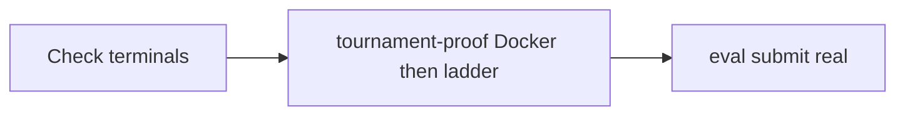

# feat: Post-hygiene unified tournament proof + Kaggle submit

## Summary

Validate the post-hygiene checkpoint (`preflight_beat_random` run `20260602T193448Z-s42-0422c38a`) against the **enforced** unified Gate 5 ladder (combined 2p+4p, `games_per_pair=2`, noop/random floors 0.76), then attempt a real Kaggle submission after Docker submit-valid proof passes.

## Problem Frame

Gate 5 unified tournament implementation is merged on `feat/gate5-unified-tournament` with calibrated floors in `docs/benchmarks/preflight-calibration.json` (`unified_tournament.enforcement: true`). The post-hygiene checkpoint is the operator candidate for external submission. This plan is **validation and submit orchestration only** — no feature rework of the ladder (see origin plan U1–U8, completed).

## Scope

| In scope | Out of scope |
|----------|----------------|
| Held-out `ow benchmark tournament-proof` on fixed checkpoint | Recalibrating unified floors |
| `ow eval package --validate-docker` submit-valid proof | Training new checkpoints |
| Real `ow eval submit` if credentials + validation pass | Weakening CI or tournament assertions |
| Operator artifacts under `outputs/preflight/` and `outputs/kaggle_runner/` | Browser UI testing |

## Requirements

- R1. Run unified tournament proof on `outputs/campaigns/preflight_beat_random/runs/20260602T193448Z-s42-0422c38a/checkpoints/jax_ckpt_last.pkl` using default thresholds (`docs/benchmarks/preflight-calibration.json`).
- R2. Record verdict as VERIFIED / NOT VERIFIED from report `verdict` with `enforcement: true`.
- R3. Docker validation via `ow eval package --validate-docker`; require JSON `"ok": true`.
- R4. If R3 passes, attempt **non-dry-run** `ow eval submit`; document launch metadata under `outputs/kaggle_runner/`.
- R5. Commit tracked operator artifacts (proof JSON, submit log) when produced; open PR on branch.

## Key Technical Decisions

**KTD1 — Single full ladder invocation.** `run_tournament_proof_cli` always runs `run_unified_ladder` (noop + random prerequisites + incumbent Stage 2). Legacy `--baselines` is unused; one proof run satisfies R1–R2. Optional duplicate invocations with `--baselines` are not required.

**KTD2 — Thresholds from committed calibration.** No CLI floor overrides; `games_per_pair=2` and floors 0.76 come from `unified_tournament` section. Incumbent path is bootstrapped to the same checkpoint for Stage 2 (self-comparison semantics per calibration).

**KTD3 — Submit-valid funnel order.** Docker/packaging validation (`ow eval package --validate-docker` or embedded in `tournament-proof` / `checkpoint_eval`) **before** held-out tournament ladder (kaggle_environments), then upload — matches `docs/AGENT_CAPABILITIES.md` and `docs/kaggle_submission.md`.

## Implementation Units

### U1. Operator validation run

**Files:** none (CLI only)

**Steps:**

1. Check terminals for competing GPU/pytest jobs.
2. `uv run ow benchmark tournament-proof --eval-checkpoint <ckpt> --out outputs/preflight/tournament_proof_unified_post_hygiene.json` (runs Docker validation first, then unified ladder).
3. Parse `verdict`, `docker_validation_ok`, `unified_verdict`, `enforcement` from stdout/report.

**Test scenarios:**

| ID | Scenario | Expected |
|----|----------|----------|
| T1 | Checkpoint missing | CLI exit 1, clear error |
| T2 | Ladder completes with floors met | `verdict: verified` |
| T3 | Prerequisite fails under enforcement | `verdict: not_verified` |

### U2. Docker + Kaggle submit

**Files:** `outputs/kaggle_runner/` (launch log), `/tmp/kaggle_submit` (ephemeral package)

**Steps:**

1. Confirm Docker already passed in tournament-proof report (`docker_validation_ok: true`) or re-run `uv run ow eval package --checkpoint <ckpt> --output-dir /tmp/kaggle_submit --validate-docker`.
2. On `"ok": true`, `uv run ow eval submit --checkpoint <ckpt> --validate-docker -m "post-hygiene unified bar"`.
3. If Kaggle CLI missing or auth fails, document failure in `outputs/kaggle_runner/submit_attempt.json` without weakening gates.

**Test scenarios:**

| ID | Scenario | Expected |
|----|----------|----------|
| T4 | Docker unavailable | Document blocker; no silent pass |
| T5 | Validation ok | Proceed to submit |
| T6 | `--dry-run` only when validation fails or user blocks real upload | No fake success |

## Dependencies and sequencing

## Risks

| Risk | Mitigation |
|------|------------|
| GPU contention with long calibration job | Docker gate is fast; skip ladder when packaging fails |
| Incumbent = challenger bootstrap | Expected for calibration bootstrap; Stage 2 may be INCONCLUSIVE or strict pass — record actual `unified_verdict` |
| Kaggle credentials absent | Record INCONCLUSIVE submit; do not skip Docker gate |

## Verification

- Proof report at `outputs/preflight/tournament_proof_unified_post_hygiene.json`
- Docker JSON `"ok": true` captured in operator notes or `outputs/kaggle_runner/`
- PR includes plan path and artifact commits where appropriate
