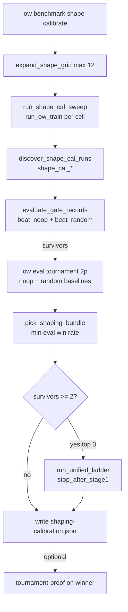

# Plan: `ow benchmark shape-calibrate`

## Summary

Add **`ow benchmark shape-calibrate`**, an agent-native outer-loop operator that runs a bounded factorial over **reward profile × training opponent × `reseed_every_updates`**, filters cells with **preflight gate trends** on training logs, ranks survivors with **held-out 2p eval**, runs a **unified Stage-1 micro-bracket** on the top three, and writes **`docs/benchmarks/shaping-calibration.json`** with a pinned MDP decision—mirroring `calibrate-seed-scheduler` without retraining via `gate run`.

---

## Problem Frame

MDP shaping knobs are scattered across Hydra groups; operators lack a single **measure → decide → commit** loop. Preflight gates and tournament proof exist separately, but no primitive enumerates shaping candidates, scores them on calibrated criteria, and records the winner in-repo. (see origin: `docs/brainstorms/2026-06-03-shape-calibrate-requirements.md`)

**Scope:** CLI + `src/jax/shaping_calibration.py` + tests + benchmark artifacts. **Out of scope (v1):** shaping catalog profiles, LLM reward codegen, shield/feature factorial, tournament on every cell, hybrid auto-promotion, AGENTS.md auto-sync, decomposed shaping telemetry in JSONL (follow-up).

---

## Requirements Traceability

| ID | Plan coverage |
|----|----------------|
| R1–R4 | U5 (CLI), U1 (grid/campaigns) |
| R5 | U1 (`run_ow_train` sweep) |
| R6 | U2 (`evaluate_gate_records`, not subprocess `gate run`) |
| R7 | U3 (held-out eval rank) |
| R8 | U4 (micro-bracket top-3) |
| R9 | U4 (`--confirm-winner-tournament`) |
| R10–R12 | U6 (report + metric context fields) |
| SC1–SC5 | U7 (tests) + U6 verification |
| NG1–NG4 | Listed under Scope Boundaries |

---

## Key Technical Decisions

| Decision | Choice | Rationale |
|----------|--------|-----------|
| Gate evaluation | `evaluate_gate_records` on cell JSONL | `ow benchmark gate run` retrains in `preflight_*` campaigns—violates one-train-per-cell (see `src/jax/preflight.py`) |
| Smoke budget | **`--total-updates 50`**, base `conf/training/shape_cal_smoke.yaml` | `training=smoke` is only 2 updates—insufficient for trend windows (origin Q1) |
| Tier-1 held-out | **2p only**, noop + random baselines | Matches seed-scheduler cost; origin Q2 |
| Survivor bracket | Skip tier-2 if **&lt;2** gate survivors | Origin Q3; single winner by eval rank only |
| Gate elimination | Fail if **both** beat_noop and beat_random trends fail | Origin R6 |
| Tier-1 ranking | Mean eval win rate across eval seeds, **min(noop, random)** as tie-breaker | Conservative vs gameable noop-only wins (learnings: planet-flow-sweep) |
| Thresholds | Load from `docs/benchmarks/preflight-calibration.json` only | SC5 / AGENTS invariant |
| Train base | `task=shield_off`, `curriculum=off`, W&B/artifacts off, `log_every=1` | Mirror `SEED_SCHED_TRAIN_BASE` in `src/jax/seed_scheduler_calibration.py` |
| Shaping telemetry | Deferred | Origin Q4 — optional follow-up unit |

---

## High-Level Technical Design

---

## Implementation Units

### U1. Core module: grid, sweep, discovery

**Goal:** Introduce `src/jax/shaping_calibration.py` with grid expansion, campaign naming, train sweep, and analyze-only discovery.

**Requirements:** R3, R4, R5, SC4

**Dependencies:** None

**Files:**
- Create `src/jax/shaping_calibration.py`
- Create `conf/training/shape_cal_smoke.yaml`
- Modify `conf/training/smoke.yaml` or document only via new profile (no change to smoke if new file suffices)

**Approach:**
- `expand_shape_grid(reward_profiles, opponents, reseed_intervals, max_cells=12)` → list of `ShapeCalArm` dataclasses; **error** if Cartesian product &gt; `max_cells` unless `--subsample` flag (defer subsample to v1.1—hard error only).
- `shape_cal_campaign(reward, opponent, reseed, total_updates)` → `shape_cal_<sanitized_reward>_<opponent>_reseed<N>_u<U>`.
- `SHAPE_CAL_TRAIN_BASE` tuple: `training=shape_cal_smoke`, `task=shield_off`, `curriculum=off`, telemetry/artifacts off, `log_every=1`.
- Per-arm overrides: `reward=<profile>`, `opponents=<profile>`, `training.reseed_every_updates=<n>`.
- `run_shape_cal_sweep(...)` → subprocess via `run_ow_train` from `src/jax/preflight_calibration.py` (streaming, arm banners per learnings doc).
- `discover_shape_cal_runs` + `SHAPE_CAL_CAMPAIGN_RE` + reuse `latest_completed_run_dir` pattern from seed-scheduler.

**Patterns to follow:** `src/jax/seed_scheduler_calibration.py` (`run_seed_scheduler_sweep`, `discover_seed_sched_runs`).

**Test scenarios:**
- `test_shape_grid_rejects_more_than_max_cells`
- `test_shape_cal_campaign_name_round_trip`
- `test_discover_shape_cal_runs_skips_empty_jsonl`
- `test_run_shape_cal_sweep_dry_run_lists_arms`

**Verification:** Dry-run prints ≤12 `ow train` commands with expected campaign names.

---

### U2. Gate trend filter on cell logs

**Goal:** After each cell train, evaluate beat_noop and beat_random trends on that cell’s JSONL without retraining.

**Requirements:** R6, R12, SC3

**Dependencies:** U1

**Files:**
- `src/jax/shaping_calibration.py`
- `tests/test_shaping_calibration.py`

**Approach:**
- `analyze_shape_cal_gates(run_dir, thresholds_path)`:
  - `read_jsonl_records(log_path)`
  - `build_gate_spec("beat_noop", ...)` / `build_gate_spec("beat_random", ...)` via `src/jax/preflight_gate_loader.py`
  - `evaluate_gate_records(spec, records)` from `src/jax/preflight.py`
- Store per cell: `gate_beat_noop_pass`, `gate_beat_random_pass`, trend scalars (`win_rate_delta`, `approx_kl`, `entropy` window means).
- **Survivor rule:** pass if **at least one** gate passes (origin says eliminate if both fail—equivalently survivor = NOT (both fail)).
- Attach `metric_context` dict: opponent profile, reward profile, reseed, warnings for self-play training arms.

**Patterns to follow:** `src/cli/benchmark_gates.py` dry-run tests; preflight gate loader.

**Test scenarios:**
- `test_gate_filter_eliminates_when_both_trends_fail` (mock `evaluate_gate_records`)
- `test_gate_filter_survivor_when_one_gate_passes`

**Verification:** Unit tests with fixture JSONL snippets; no GPU.

---

### U3. Tier-1 held-out eval and ranking

**Goal:** Rank gate survivors by held-out 2p eval vs noop and random.

**Requirements:** R7, SC3

**Dependencies:** U2

**Files:**
- `src/jax/shaping_calibration.py`
- Reuse eval helper extracted or copied from `run_tournament_win_rate` in `src/jax/seed_scheduler_calibration.py`

**Approach:**
- For each survivor checkpoint: run `ow eval tournament` subprocess with `--formats 2p_vs_baseline`, baselines `noop` and `random`, `--eval-seeds` from CLI (default match seed-scheduler set).
- Record `eval_win_rates_by_seed` per baseline; compute means.
- **Rank key:** `min(mean_noop, mean_random)` descending (conservative).
- `--eval-existing` on analyze-only: re-run eval without retrain (mirror seed-scheduler flag).

**Patterns to follow:** `run_tournament_win_rate` / leaderboard parsing in seed-scheduler module.

**Test scenarios:**
- `test_pick_shaping_bundle_ranks_by_min_eval_win_rate` (synthetic snapshots)
- `test_tier1_skips_eliminated_cells`

**Verification:** Pick logic tested without GPU; integration smoke optional manual.

---

### U4. Tier-2 micro-bracket and optional confirmation

**Goal:** Run unified Stage-1 on top-3 ranked cells; optionally full tournament-proof on winner.

**Requirements:** R8, R9

**Dependencies:** U3

**Files:**
- `src/jax/shaping_calibration.py`
- `src/jax/unified_tournament_calibration.py` (import `run_unified_ladder` / spec loader)

**Approach:**
- If `len(survivors) < 2`: winner = top tier-1 rank; skip bracket; record `bracket_skipped_reason`.
- Else: take top `min(3, len(survivors))`; for each checkpoint `run_unified_ladder(..., stop_after_stage1=True)` with spec from `docs/benchmarks/preflight-calibration.json` `unified_tournament` section.
- Winner = highest combined Stage-1 score meeting prerequisite floors.
- `--confirm-winner-tournament`: delegate to existing `run_tournament_proof_cli` path in `src/cli/benchmark.py`; set `decision.confirmation_status` to `passed` / `provisional` / `skipped`.

**Patterns to follow:** `src/jax/unified_tournament_calibration.py`, `tests/test_unified_tournament_calibration.py`.

**Test scenarios:**
- `test_micro_bracket_skipped_when_single_survivor`
- `test_bracket_selects_top_three_only` (mock ladder results)

**Verification:** Bracket skip and ordering covered in unit tests.

---

### U5. CLI registration and help

**Goal:** Wire subcommand into `ow benchmark` dispatch and help text.

**Requirements:** R1, R3, SC1

**Dependencies:** U1–U4 (orchestrator function)

**Files:**
- `src/cli/benchmark.py`
- `tests/test_benchmark_cli.py` (or extend existing benchmark CLI tests)

**Approach:**
- Parser block mirroring `calibrate-seed-scheduler`: `--out`, `--out-md`, `--output-root`, `--reward-profiles`, `--opponents`, `--reseed-intervals`, `--max-cells`, `--total-updates`, `--train-seed`, `--eval-seeds`, `--analyze-only`, `--eval-existing`, `--confirm-winner-tournament`, `--dry-run`, `--thresholds-path`.
- `run_shape_calibrate_cli` → import shaping module inside handler (deferred JAX).
- Add to `print_benchmark_help` (also add missing `calibrate-unified-tournament` line while here).
- Reproduce block at end of successful run (like seed-scheduler).

**Test scenarios:**
- `test_shape_calibrate_parser_defaults`
- `test_shape_calibrate_dry_run_exits_zero`

**Verification:** `uv run ow benchmark shape-calibrate --help` lists subcommand.

---

### U6. Calibration report artifacts

**Goal:** Write JSON + MD reports with decision traceability.

**Requirements:** R2, R10, R11, R12, SC2

**Dependencies:** U1–U4

**Files:**
- `src/jax/shaping_calibration.py`
- Default paths: `docs/benchmarks/shaping-calibration.json`, `docs/benchmarks/shaping-calibration.md`

**Approach:**
- `build_shaping_calibration_report` / `write_shaping_calibration_report` mirroring seed-scheduler (`gate: shape_calibration`, `commit_sha`, `decision`, `runs[]`).
- MD summary: chosen bundle, eliminated count, bracket outcome, confirmation status, reproduce command.
- Do **not** auto-edit AGENTS.md (R11).

**Patterns to follow:** `write_seed_scheduler_calibration_report` in `src/jax/seed_scheduler_calibration.py`.

**Test scenarios:**
- `test_build_shaping_calibration_report_includes_decision_and_runs`
- `test_report_serializes_repo_relative_paths`

**Verification:** Golden-ish dict structure test against fixture snapshots.

---

### U7. Test suite and documentation touchpoints

**Goal:** Fast CPU coverage and agent discoverability.

**Requirements:** SC1–SC5

**Dependencies:** U1–U6

**Files:**
- `tests/test_shaping_calibration.py`
- `tests/test_benchmark_cli.py`
- `docs/AGENT_CAPABILITIES.md` (one row + example command)

**Approach:**
- No slow/JAX GPU tests in default tier.
- Extend agent capability map test if present (`tests/test_agent_capability_map.py`).
- Document metric-context warnings in MD template.

**Test scenarios:** (consolidate U1–U6 tests); `make test-fast` subset passes.

**Verification:** `uv run pytest tests/test_shaping_calibration.py tests/test_benchmark_cli.py -q`

---

## Scope Boundaries

### In scope
- Full pipeline R1–R12 for reward×opponent×reseed grid ≤12 cells.

### Deferred to Follow-Up Work
- Shaping profile catalog (`conf/shaping_profiles/`) — ideation #1
- Decomposed shaping metrics in `metric_contract.py` — ideation #2
- `conf/benchmark/gates/shaping_calibrated.yaml` loading floors from shaping JSON
- Grid subsampling when product &gt; 12
- `make agent-context` excerpt for shaping calibration JSON

### Non-goals (v1)
- Per origin NG1–NG4

---

## Risks & Dependencies

| Risk | Mitigation |
|------|------------|
| Smoke 50 updates too short for trends | Document in MD; allow `--total-updates` override; calibrate window sensitivity later |
| Gate specs assume `training=2p_16` mismatch | Pass explicit overrides in `build_gate_spec` or dedicated gate YAML for shape_cal logs |
| Micro-bracket GPU cost | Cap at 3 cells; analyze-only path for iteration |
| Campaign name sanitization | Restrict reward profile tokens to `[a-z0-9_]+` in CLI validation |
| One GPU contention | Document in reproduce block; check terminals (AGENTS) |

**Prerequisites:** Existing `evaluate_gate_records`, `run_unified_ladder`, `run_ow_train`, preflight calibration JSON.

---

## Open Questions (deferred to implementation)

- Exact `build_gate_spec` overrides when training profile differs from gate recipe defaults.
- Whether tier-1 should store combined 2p+4p in v1.1 (currently 2p-only).
- Extract shared `run_tournament_proof_cli` helper if confirmation duplicates code.

---

## Related documentation

- Ideation: `docs/ideation/2026-06-03-searchable-measurable-env-shaping-ideation.md`
- Solutions: `docs/solutions/developer-experience/shape-calibrate-env-shaping-calibration-operator.md`
- Template: `docs/solutions/developer-experience/seed-scheduler-calibration-agent-native-operator-phase2.md`
- Metric gates: `docs/solutions/logic-errors/planet-flow-sweep-gameable-objective.md`

---

## Sources & Research

- Origin: `docs/brainstorms/2026-06-03-shape-calibrate-requirements.md`
- `src/jax/seed_scheduler_calibration.py`, `src/jax/unified_tournament_calibration.py`
- `docs/benchmarks/seed-scheduler-calibration.json`, `docs/benchmarks/preflight-calibration.json`
- Learnings: `docs/solutions/developer-experience/seed-scheduler-calibration-agent-native-operator-phase2.md`, `docs/solutions/logic-errors/planet-flow-sweep-gameable-objective.md`, `docs/solutions/developer-experience/benchmark-subprocess-training-observability.md`
