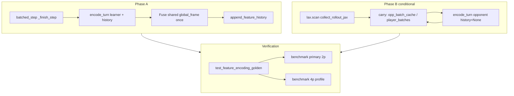

# Plan: JAX feature-encoding throughput recovery (phased)

## Summary

Recover pre–launch-hygiene tier-2 training throughput on the `primary` preset **with launch hygiene kept**, by optimizing the v2 `encode_turn` hot path and rollout opponent re-encodes. Phase A fuses internal encoding work; Phase B (conditional) extends the existing **rollout scan carry** opponent cache to 4p. Opponent `encode_turn` continues to use `history=None` (today’s semantics). A separate follow-up will revisit opponent-side `FeatureHistory` when `feature_history_steps > 1` and deeper encoding design.

## Problem Frame

Post-hygiene e2e throughput on the reference GPU sits far outside the calibrated band in `docs/benchmarks/launch-hygiene-e2e-baseline.json` (~75% below pre-hygiene `env_steps_per_sec` at assessed commits). Rollout hygiene/sampler optimizations are largely exhausted (`docs/plans/2026-06-01-launch-hygiene-rollout-throughput-design.md`). Profiling still shows rollout dominates PPO; within rollout, encoding cost is structural: duplicate global-frame work in `encode_turn` + `append_feature_history`, full edge catalog per call, 2p opponent re-encode, and 4p multi-perspective `encode_turn` fan-out (see origin brainstorm).

Reverting launch hygiene is **out of scope** (ablation: hygiene wins learn-proof). Success is wall-clock per update and env-steps/sec within the baseline ±10% band on the **same machine**, for **both 2p and 4p** measurement profiles.

## Requirements

Traceability to `docs/brainstorms/2026-06-03-jax-encoding-throughput-requirements.md`:

| ID | Requirement |
|----|-------------|
| R1 | Tier-2 gate: `ow benchmark training --preset primary` vs `docs/benchmarks/launch-hygiene-e2e-baseline.json`, `--assert-within-pct 10`, same GPU as capture |
| R2 | Primary metric: `seconds_per_update_mean` (also `env_steps_per_sec`, `samples_per_sec`) |
| R3 | **2p and 4p** both improve vs post-hygiene snapshot before track closes |
| R4 | Launch hygiene remains on; no revert for throughput |
| R5 | Fuse duplicate global-frame work on learner step path (`encode_turn` + `append_feature_history`) |
| R6 | Safe encoding trims only; default `edge_rank_mode: snapshot`; no `intercept_min` without golden proof |
| R7 | Phase A: no rollout/env shape changes for opponent cache |
| R8 | Phase B only if Phase A fails R1–R3 with hygiene on |
| R9 | Phase B cache invalidation on reset, `done`, learner swap (`assign_learner_players`) |
| R10 | `tests/test_feature_encoding_golden.py` — semantic equivalence; golden updates only with proof |
| R11 | Iteration: `make test-fast`, `make test-domain-features` |
| R12 | Benchmark discipline: no `tail`/`head` on long `ow` runs; JSON via `--out` |
| R13 | Separate 2p and 4p benchmark JSON artifacts for R3 |

## Key Technical Decisions

**KTD1 — Phase A before Phase B.** Ship internal fusion and safe trims first; measure tier-2 band on 2p and 4p. Opponent carry optimization is conditional on failure (see origin R8). Rationale: smallest diff, isolates encoding ROI.

**KTD2 — Phase B lives in rollout scan carry.** Extend `opp_batch_cache` (2p) to a real per-player batch cache in 4p inside `collect_rollout_jax` carry — not `JaxEnvState`, not `JaxStepResult` expansion. Rationale: existing 2p wiring; opponent batch consumed in `src/opponents/jax_actions/`; env/submission paths stay learner-centric; aligns with JAX scan carry patterns for non-trainable side state.

**KTD3 — Opponent encode keeps `history=None`.** Phase B caches tensors produced by the same `encode_turn(game, cfg.task)` call pattern as today. **Do not** attach learner `JaxEnvState.feature_history` to opponent batches. Rationale: learner history is learner-seat-specific; reusing it would change semantics without golden proof.

**KTD4 — Opponent history parity deferred (follow-up).** When `task.feature_history_steps > 1`, self-play already receives zero-padded global history and non-historical planet ship deltas on the opponent path while the learner uses rolled `feature_history`. Fixing that requires opponent-perspective `FeatureHistory` in carry (or env), not this plan. Rationale: product wants throughput recovery at default H=1 and benchmarked profiles first; deeper encoding review is a separate initiative.

**KTD5 — 4p baseline before R3 sign-off.** Capture measured 4p (and document overrides) in a sibling benchmark JSON under `docs/benchmarks/` before declaring 4p complete; tier-2 baseline JSON is 2p-only at pre-hygiene SHA. Rationale: origin Q1.

**KTD6 — Optional attribution via `--detailed-timing`.** One profiling capture on post-hygiene main before/after Phase A to bound encoding vs rollout sampling share; not a merge gate unless it changes Phase B scope. Rationale: origin Q2.

## High-Level Technical Design

**Phase A data flow:** `_finish_step` calls `encode_turn` then `append_feature_history` on the same post-step learner game. Both paths call `_global_frame` independently today — fusion returns or threads a single frame into history append.

**Phase B data flow:** Scan carry holds opponent (2p) or all-player (4p) `TurnBatch` used **before** `batched_step*`. After step + reset merge, refresh cache from merged `game` with player-relative `encode_turn(..., history=None)`. Invalidation mirrors `maybe_reset` / `assign_learner_players` paths.

## Scope Boundaries

### In scope

- Phase A: `src/jax/features.py`, learner path in `src/jax/env.py`
- Phase B (conditional): `src/jax/rollout/collect.py`, opponent sampling in `src/opponents/jax_actions/sampling.py` if API tweaks needed
- 4p benchmark capture artifact
- `--detailed-timing` attribution run
- Golden + domain feature tests; tier-2 e2e gate

### Deferred to follow-up work

- **Opponent `FeatureHistory` when `feature_history_steps > 1`** — self-play / policy-forward opponents using true temporal stacks per seat (see KTD4)
- **Deeper feature-encoding redesign** — catalog shape, sparse edges, structural encoding (origin Phase C)
- Env fleet collision/compaction, shield tier changes, PPO replay forward-pass reduction (origin non-goals)

### Outside this product's identity

- Reverting or disabling launch hygiene
- Tier-1 sampler microbench as sole proof of training health

## Implementation Units

### U1. Capture 4p encoding benchmark baselines

**Goal:** Establish authoritative pre/post encoding work measurements for 4p separate from 2p-only tier-2 JSON.

**Requirements:** R3, R13, KTD5

**Dependencies:** None

**Files:**

- `docs/benchmarks/` (new sibling JSON, e.g. `launch-hygiene-e2e-4p-baseline.json` or dated capture)
- `docs/brainstorms/2026-06-03-jax-encoding-throughput-requirements.md` (reference overrides in verification note)
- `src/jax/training_benchmark.py` (document overrides if extending preset bundles — only if CLI lacks 4p profile)

**Approach:** On reference GPU, run `uv run ow benchmark training` with documented 4p overrides (e.g. `training=2p4p_16_split` or `task.player_count=4` + format weights per team convention). Capture N≥3 runs: post-hygiene **before** Phase A, and retain pre-hygiene comparison if a worktree capture is still practical at SHA `79162a2088160b8ed05c3e3a050e064c7f6c9556`. Record `seconds_per_update_mean`, `env_steps_per_sec`, device identity, override list in JSON.

**Test scenarios:**

- Test expectation: none — artifact capture; sanity-check JSON schema matches existing baseline shape.

**Verification:** JSON committed or documented in plan PR with operator runbook one-liner; R13 satisfied for planning closure of 4p numbers.

---

### U2. Detailed-timing attribution snapshot

**Goal:** Bound how much of post-hygiene rollout time is encoding vs other rollout stages before Phase A lands.

**Requirements:** KTD6

**Dependencies:** None (parallel with U1)

**Files:**

- `src/jax/training_benchmark.py` (consumer of `--detailed-timing` output)
- Operator notes in PR or `docs/benchmarks/` optional sidecar JSON

**Approach:** `uv run ow benchmark training --preset primary --updates 2 --warmup 3 --detailed-timing --out /tmp/encoding_attribution_pre.json` on current main (hygiene on). Repeat after Phase A (U3) for delta. Do not use as sole gate; informs whether Phase B is likely necessary.

**Test scenarios:**

- Test expectation: none — profiling artifact.

**Verification:** Sidecar JSON or PR comment cites rollout vs PPO segment times; no threshold invented.

---

### U3. Phase A — fuse global frame and safe encode trims

**Goal:** Remove duplicate `_global_frame` work per learner step; preserve semantic policy inputs.

**Requirements:** R5, R6, R7, R10, R11

**Dependencies:** U2 optional (before/after comparison)

**Files:**

- `src/jax/features.py`
- `src/jax/env.py`
- `tests/test_feature_encoding_golden.py`
- `tests/test_feature_registry.py` (if dims touched)

**Approach:**

- Thread single `global_frame` from `encode_turn` into `append_feature_history` (or shared helper) so one assembly per step on the learner path.
- Keep `edge_rank_mode: snapshot`; avoid `intercept_min` unless equivalence proven.
- Do not change opponent encode sites in this unit.

**Execution note:** Run golden tests before and after; any golden update requires documented equivalence argument in PR.

**Patterns to follow:** Existing `encode_turn` / `FeatureHistory` API in `src/jax/features.py`; env `_finish_step` learner_game replace pattern.

**Test scenarios:**

- Happy path: `test_feature_encoding_golden.py` full suite passes unchanged with fusion.
- Covers AE3 intent: `edge_rank_mode` remains snapshot default; no intercept_min without new golden vectors.
- Edge: `feature_history_steps=1` (primary preset) — batch shapes unchanged vs pre-change golden.
- Edge: `feature_history_steps=3` in golden test — stacked global dim unchanged when history provided to learner encode only.
- Integration: `make test-domain-features` passes.

**Verification:** `make test-fast`; golden green; no opponent-path file changes in diff except imports if shared helper moves.

---

### U4. Phase A tier-2 and 4p verification gates

**Goal:** Prove Phase A meets or misses throughput bar on 2p and 4p with hygiene on.

**Requirements:** R1, R2, R3, R4, R12, R13

**Dependencies:** U1 (4p reference), U3

**Files:**

- `docs/benchmarks/launch-hygiene-e2e-baseline.json` (read-only compare)
- 4p capture from U1

**Approach:**

- 2p: `uv run ow benchmark training --preset primary --label phase_a_2p --repeats 3 --out /tmp/phase_a_2p.json --baseline docs/benchmarks/launch-hygiene-e2e-baseline.json --assert-within-pct 10`
- 4p: same harness with U1 overrides, compare to U1 post-hygiene snapshot and pre-hygiene 4p capture if available.
- If **both** pass band: Phase B (U5) **skipped** per R8 / AE4.
- If either fails: authorize U5.

**Test scenarios:**

- Test expectation: none — benchmark gate (operator/CI tier per project policy).

**Verification:** Document pass/fail JSON paths in PR; `make test-launch-hygiene-e2e-throughput` if wired to primary 2p.

---

### U5. Phase B — rollout carry opponent cache (conditional)

**Goal:** Eliminate redundant opponent/multi-player `encode_turn` work while preserving today’s `history=None` opponent semantics.

**Requirements:** R8, R9, R10, R3 (if Phase A failed)

**Dependencies:** U4 failure on R1–R3

**Files:**

- `src/jax/rollout/collect.py`
- `src/opponents/jax_actions/sampling.py`
- `tests/test_feature_encoding_golden.py`
- Rollout tests if present (`tests/test_jax_rollout*.py` — jax tier only if user requests)

**Approach:**

- **2p:** Reuse `opp_batch_cache`; avoid second full encode when cache can be updated incrementally or reused from step outputs where player-relative views align (prove with golden/parity).
- **4p:** Replace inline 4× `encode_turn` (lines ~279–295) with carry `player_batches` updated once per scan step after transition; remove 4p stub (`initial_opp_batch_cache = turn_batch`).
- Invalidate on `reset_branch`, `maybe_reset`, learner swap — checklist in KTD2 architecture review.
- **Invariant:** all opponent encodes use `history=None` unless a follow-up plan explicitly adds opponent `FeatureHistory`.

**Patterns to follow:** Existing 2p `next_opp_batch_cache` update; `jax.tree.map(maybe_reset, ...)` reset merge.

**Test scenarios:**

- Happy path: 2p rollout smoke — opponent sampling still produces valid `JaxAction` shapes (existing tests or minimal jax test).
- Error path: done env row reset — cached batch for reset slot matches fresh `encode_turn` on reset game (characterization or golden slice).
- Integration: mixed opponent families still select correct branch with cached batch (`OPPONENT_LATEST` reads same tensor layout as before).
- Covers R9: learner side swap after `assign_learner_players` — opponent cache uses flipped player index, not stale pre-swap batch.

**Verification:** Re-run U4 benchmarks; golden tests green; Phase B diff does not touch `JaxEnvState` fields for opponent tensors.

---

## Risks & Dependencies

| Risk | Mitigation |
|------|------------|
| Phase A insufficient to close ~75% gap | U5 Phase B; U2 timing shows whether to prioritize 4p fan-out |
| Fusion changes global/planet tensors subtly | R10 golden gate; explicit PR equivalence note |
| 4p baseline missing | U1 blocks R3 sign-off, not Phase A merge |
| JIT carry pytree growth in 4p | Profile after U5; separate compile per `player_count` already idiomatic |
| Confusing learner history with opponent cache | KTD3 code review checklist; forbid in U5 acceptance |

**Dependencies:** Reference GPU availability; `docs/benchmarks/launch-hygiene-e2e-baseline.json` unchanged unless recalibrated per AGENTS.md policy.

## Sources & Research

- Origin: `docs/brainstorms/2026-06-03-jax-encoding-throughput-requirements.md`
- Baseline: `docs/benchmarks/launch-hygiene-e2e-baseline.json`
- Prior exhausted rollout work: `docs/plans/2026-06-01-launch-hygiene-rollout-throughput-design.md`
- Profiling: `docs/solutions/developer-experience/production-training-throughput-profiling.md`
- Archive P0/P1: `docs/archive/omg/specs/deep-interview-rollout-optimization.md`
- Architecture review consensus: rollout scan carry for Phase B; env-state discouraged

## Follow-up (not in this plan)

**feat: Opponent feature history and encoding architecture review** — When `feature_history_steps > 1`, implement per-seat `FeatureHistory` for policy-forward opponents so self-play matches learner temporal inputs; revisit catalog cost (sparse edges, incremental encode). Trigger: explicit product request or sweep campaign on history depth.
