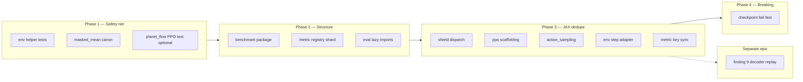

# refactor: src/ simplification follow-up (post-review)

## Summary

Land the remaining structural simplification and optimization work from the 2026-06-03 `src/` code review walkthrough: split oversized CLI/telemetry modules, add characterization tests before JAX refactors, dedupe shield/PPO/sampling paths, align metric key contracts, lazy-load JAX in `eval` CLI, and remove checkpoint unpickle shims. Prefix-decoder PPO replay throughput (review finding 9) is a separate performance epic, not mixed into this refactor track.

## Problem Frame

A multi-agent review of `src/` on `main` identified maintainability debt (1521-line `benchmark.py`, 1092-line `metric_registry.py`, duplicated shield/PPO/sampling scaffolding) and correctness/perf risks. An interactive walkthrough **already applied** reliability and quick-win fixes (artifact worker, masked factorized `value_loss`, env `source_id` guard, parity-summary gating, factorized-sampler inlining, eval package JSON, etc.).

This plan covers the **nine deferred structural items** plus **finding 9** (PPO prefix-decoder replay cost), which the walkthrough deferred because it is architectural, not a safe single PR.

## Requirements

| ID | Requirement |
|----|-------------|
| R1 | Split `src/cli/benchmark.py` into a `src/cli/benchmark/` package without changing `ow benchmark` CLI surface, help text contracts, or `LEARN_PROOF_PRIMITIVES` strings |
| R2 | Shard `src/telemetry/metric_registry.py` inline `_METRICS` using the `planet_flow_registry.py` pattern; keep lookup/filter API stable |
| R3 | Add CPU-light unit tests for pure helpers in `src/jax/env.py` before env refactors |
| R4 | Consolidate `masked_mean` to one canonical JAX helper; remove duplicate definitions in `ppo_update.py` and `factored_sequence_scan.py` |
| R5 | Dedupe trajectory-shield dispatch in `src/jax/shield/trajectory.py` behind `apply_configured_trajectory_shield_factorized_topk` |
| R6 | Extract shared PPO minibatch scaffolding shared by factorized and planet_flow update paths |
| R7 | Extract shared sequence-scan scaffolding in `src/jax/action_sampling.py` (factorized vs flat-edge) |
| R8 | Make `env.step` a thin adapter over `step_multi_player` for 2p launches |
| R9 | Single source of truth for rollout metric key tuples (`metric_contract` ↔ `metric_registry`) |
| R10 | Lazy-import JAX/tournament stack in `src/cli/eval.py` so status/results/jobs paths avoid policy import at module load |
| R11 | Remove `_install_dataclass_unpickle_compat` hot-path shim; fail fast on stale checkpoint pickles with clear errors |
| R12 | Default verification: `make test-fast`; shield/env/PPO changes also run `make test-domain-features`, `make test-domain-policy`, `make test-kaggle-parity` where behavior touches env or encoding |
| R13 | Finding 9 (prefix-decoder replay in PPO) documented and tracked separately; no behavior change in this plan unless explicitly scoped in a follow-up epic |

## Key Technical Decisions

**KTD1 — Tests before JAX behavior refactors.** U1 (env helpers) and targeted PPO/planet_flow tests land before U5–U8. Rationale: review flagged `test_jax_env_parity.py` as the only env safety net; parity tests are slow and poor for incremental decomposition.

**KTD2 — CLI split mirrors `benchmark_gates.py`.** New package `src/cli/benchmark/` with `parser.py` plus one module per command family (`training.py`, `calibrate.py`, `learn_proof.py`, `planet_flow.py`, `gate.py` thin wrapper). `src/cli/benchmark.py` becomes a re-export shim **only if** import paths require it; prefer updating `src/cli/__init__.py` to import from package `main` and delete the monolith file once tests pass. Rationale: AGENTS.md prefers no parallel APIs — update call sites instead of permanent shims.

**KTD3 — Metric registry generation direction.** Prefer **registry-owned definitions** with `metric_contract` importing generated key tuples (filter by `record_kind` + rollout groups), not hand-maintained duplicate tuples. Add a small test that contract keys ⊆ registered rollout metric names. Rationale: review finding 21; planet_flow already uses descriptor-driven registry entries.

**KTD4 — Checkpoint compat: fail-fast, not silent shim.** Remove runtime `__setstate__` patching in `load_checkpoint_payload`. Stale pickles must raise with actionable message (`validate_checkpoint_config_compatibility` / feature metadata errors). Optional **one-off** migration helper lives outside the hot path (`scripts/` or `ow eval` subcommand), not in-loader patching. Rationale: AGENTS.md v2-only / no shim policy; review finding 23.

**KTD5 — Finding 9 is out of band.** Prefix-decoder replay cost (`factored_sequence_scan` + `ppo_update`) stays a separate performance initiative (GitHub issue if not already filed). This refactor plan may add profiling notes but must not change training loss semantics. Rationale: walkthrough deferred; high risk; overlaps `docs/plans/2026-06-03-007-feat-jax-encoding-throughput-plan.md` thematically but targets decoder replay not `encode_turn`.

**KTD6 — Shield dedupe preserves modes.** Collapse dispatch only; do not change `shield_cheap` / `shield_off` defaults or tiered semantics without explicit tests. Run `make test-launch-hygiene-throughput` after U5. Rationale: launch-hygiene tier-1 microbench guards sampler structure.

## High-Level Technical Design

## Scope Boundaries

**In scope:** Items listed in R1–R11; preserving agent-facing CLI contracts documented in `docs/AGENT_CAPABILITIES.md` and tested in `tests/test_benchmark_cli.py`, `tests/test_cli_benchmark_gate.py`, `tests/test_agent_capability_map.py`.

**Deferred to follow-up work**

- Finding 9 full optimization (batched teacher-forcing decode, replay fusion) — track via GitHub issue; link from plan handoff
- `eval.py` / `preflight_calibration.py` monolith splits (same pattern as benchmark, lower priority)
- `scripts/make_wandb_sweep.py` and `scripts.validate_kaggle_docker_submission` inlining (project-standards; separate PR)
- `kaggle_runner.py` `PackageRequest | Any` narrowing (orchestration cleanup)

**Outside scope**

- Reverting already-landed walkthrough fixes (artifact worker, value_loss mask, etc.)
- Recalibrating preflight thresholds or running GPU benchmark campaigns except smoke gates listed in verification

## Implementation Units

### U1. Env pure-helper characterization tests

**Goal:** Enable safe decomposition of `src/jax/env.py` combat/geometry/reward helpers.

**Requirements:** R3, R12

**Dependencies:** None

**Files:** `tests/test_jax_env_pure_helpers.py` (new), `src/jax/env.py` (read-only targets: `fleet_speed`, `swept_pair_hit`, `point_to_segment_distance_xy`, `_shaping`, `_resolve_combat` or public wrappers if needed)

**Approach:** Minimal `JaxGameState` / planet fixtures (reuse patterns from `tests/test_jax_env.py` where possible without importing private symbols from parity tests). CPU-only, no full `step` integration.

**Execution note:** Characterization-first — assert current numeric behavior on fixed fixtures before U8 refactors launch paths.

**Patterns to follow:** `tests/test_feature_encoding_golden.py` style focused tables; avoid cross-import from `test_jax_env_parity.py` (review flagged coupling).

**Test scenarios:**

| Scenario | Expected |
|----------|----------|
| `fleet_speed` with known ship counts | Matches hand-computed ceiling |
| `swept_pair_hit` grazing vs miss | Hit boolean matches geometry |
| `_shaping` terminal reward sign | Matches reward mode config |

**Verification:** `uv run pytest tests/test_jax_env_pure_helpers.py -q`

---

### U2. Canonical `masked_mean`

**Goal:** One implementation for PPO and replay parity paths.

**Requirements:** R4, R12

**Dependencies:** None (land before U6–U7)

**Files:** `src/jax/array_ops.py` (new) or extend `src/jax/encoders/planet_encoder_common.py` re-export; `src/jax/ppo_update.py`, `src/jax/factored_sequence_scan.py`

**Approach:** Move existing `planet_encoder_common.masked_mean` to `src/jax/array_ops.py` (preferred neutral layer); re-export from encoder module if needed; delete duplicate defs.

**Test scenarios:**

| Scenario | Expected |
|----------|----------|
| Import `masked_mean` from canonical module in both consumers | No local duplicate remains |
| `make test-fast` | Green |

**Verification:** `rg 'def masked_mean' src/jax` returns single definition site

---

### U3. Split `ow benchmark` CLI package

**Goal:** Reduce `benchmark.py` below ~400 lines total across package; unchanged CLI behavior.

**Requirements:** R1, R12

**Dependencies:** U2 optional (none required)

**Files:** `src/cli/benchmark/` (new: `__init__.py`, `parser.py`, `training.py`, `sanity.py`, `calibrate.py`, `learn_proof.py`, `planet_flow.py`, `factorized.py`, `gate.py`); `src/cli/__init__.py`; `tests/test_benchmark_cli.py`, `tests/test_cli_benchmark_gate.py`

**Approach:** Move `build_parser` and per-`run_*_cli` into modules; keep `LEARN_PROOF_PRIMITIVES` and help strings byte-stable; `main()` dispatches on `args.command`.

**Patterns to follow:** `src/cli/benchmark_gates.py` separation; `src/jax/factorized_sampler_benchmark.py` already inlined for factorized-sampler (do not reintroduce subprocess).

**Test scenarios:**

| Scenario | Expected |
|----------|----------|
| `uv run ow benchmark --help` | Unchanged help sections |
| `test_benchmark_cli.py` learn-proof dry-run / print-primitives | Pass |
| `test_cli_benchmark_gate.py` positional alias | Pass |

**Verification:** `make test-domain-config` or `uv run pytest tests/test_benchmark_cli.py tests/test_cli_benchmark_gate.py -q`

---

### U4. Planet Flow PPO happy-path integration test

**Goal:** Guard planet_flow PPO path before U6 scaffolding extraction.

**Requirements:** R12 (supports U6)

**Dependencies:** U2

**Files:** `tests/test_ppo_update.py`

**Approach:** Mirror `test_ppo_update_factorized_path_matches_on_policy_kl` with valid `planet_flow_target_heatmap` batch; set `debug_replay_parity` only if parity metrics asserted.

**Test scenarios:**

| Scenario | Expected |
|----------|----------|
| `ppo_update_jax` planet_flow batch | Finite metrics; `approx_kl` ≈ 0 on-policy |

**Verification:** `uv run pytest tests/test_ppo_update.py -k planet_flow -m jax -q` (jax-marked tier as appropriate)

---

### U5. Trajectory shield dispatch dedupe

**Goal:** Single configured entry point for off/cheap/tiered/full shield modes.

**Requirements:** R5, R12

**Dependencies:** U1 recommended; U6 not required

**Files:** `src/jax/shield/trajectory.py`, `tests/test_trajectory_shield_factorized.py`, `make test-launch-hygiene-throughput`

**Approach:** Route all paths through `apply_configured_trajectory_shield_factorized_topk`; delete redundant inner `mode == "off"` branches and duplicate diagnostics init.

**Test scenarios:**

| Scenario | Expected |
|----------|----------|
| Existing factorized shield tests | Pass unchanged |
| Tier-1 factorized sampler microbench | Pass |

**Verification:** `make test-fast` + `make test-launch-hygiene-throughput`

---

### U6. PPO minibatch scaffolding extraction

**Goal:** ~200 lines deduped between factorized and planet_flow update functions.

**Requirements:** R6, R12

**Dependencies:** U4

**Files:** `src/jax/ppo_update.py`, `tests/test_ppo_update.py`

**Approach:** Extract `_normalize_advantages`, `_build_turn_minibatches`, shared `_finalize_ppo_epoch_scan` wiring; leave thin replay-shape adapters per decoder mode.

**Test scenarios:**

| Scenario | Expected |
|----------|----------|
| Factorized on-policy KL test (with `debug_replay_parity=True` where needed) | Pass |
| Planet Flow happy-path from U4 | Pass |

**Verification:** `uv run pytest tests/test_ppo_update.py -m jax -q` (jax tier per project policy)

---

### U7. Action sampling scan scaffolding extraction

**Goal:** Shared scan buffer/diagnostics setup for factorized vs flat-edge samplers.

**Requirements:** R7, R12

**Dependencies:** U5 (shield outputs must stay consistent)

**Files:** `src/jax/action_sampling.py`, `tests/test_launch_hygiene.py`, shield-related tests

**Approach:** Extract `_empty_shield_diagnostics`, `_init_sequence_buffers`, generic scan wrapper with per-step kernel callback.

**Test scenarios:**

| Scenario | Expected |
|----------|----------|
| Launch hygiene throughput tests | Pass |
| Rollout smoke tests touching sampling | Pass |

**Verification:** `make test-fast`; `make test-launch-hygiene-throughput` if sampling touched

---

### U8. `env.step` delegates to `step_multi_player`

**Goal:** One launch/comet/finish code path for 2p and 4p.

**Requirements:** R8, R12

**Dependencies:** U1 (required)

**Files:** `src/jax/env.py`, `tests/test_jax_env_pure_helpers.py`, `make test-kaggle-parity`

**Approach:** Build `(2, …)` player action pytree from learner/opponent actions; delegate to `step_multi_player`; keep public `step` signature.

**Test scenarios:**

| Scenario | Expected |
|----------|----------|
| `make test-kaggle-parity` | Pass (env parity) |
| U1 helper tests | Still pass |

**Verification:** `make test-kaggle-parity`; `make test-fast`

---

### U9. Metric registry shard

**Goal:** `metric_registry.py` ~150 lines API + imported definition tuples.

**Requirements:** R2, R12

**Dependencies:** None (coordinate with U11)

**Files:** `src/telemetry/metrics/` (new modules per `METRIC_GROUPS` bucket), `src/telemetry/metric_registry.py`, `src/telemetry/planet_flow_registry.py` (pattern reference)

**Approach:** One file per major group (`core_progress.py`, `losses.py`, `rollout.py`, …); concatenate in `metric_registry.py`.

**Test scenarios:**

| Scenario | Expected |
|----------|----------|
| `make test-domain-artifacts` or telemetry tests | Pass |
| Metric names in logs unchanged | Spot-check via existing tests |

**Verification:** `make test-fast`; grep shows no duplicate metric name definitions

---

### U10. Lazy JAX imports in `eval` CLI

**Goal:** `ow eval status` / `results` / `jobs` avoid importing `src/jax/policy` at CLI module import.

**Requirements:** R10, R12

**Dependencies:** None

**Files:** `src/cli/eval.py`, `tests/test_eval_cli.py` or agent import smoke (add if missing)

**Approach:** Move tournament/package imports inside `run_*_cli` handlers; keep status/results on lightweight `run_status` paths.

**Test scenarios:**

| Scenario | Expected |
|----------|----------|
| Import `src.cli.eval` without JAX initialized | Sub-second, no GPU backend init |
| Existing eval CLI tests | Pass |

**Verification:** `uv run python -c "import time; t=time.perf_counter(); import src.cli.eval; print(time.perf_counter()-t)"`; `make test-fast`

---

### U11. Rollout metric key single source of truth

**Goal:** Adding a rollout metric updates one registry-derived contract.

**Requirements:** R9, R12

**Dependencies:** U9

**Files:** `src/jax/rollout/metric_contract.py`, `src/telemetry/metric_registry.py`, `tests/test_metric_registry.py` or new contract test

**Approach:** Generate `BASE_ROLLOUT_SCALAR_KEYS` and rate keys from `MetricDefinition` registry filters; delete manual duplicate lists where safe.

**Test scenarios:**

| Scenario | Expected |
|----------|----------|
| Contract keys ⊆ registered names | Test fails on drift |
| Rollout merge tests | Pass |

**Verification:** `make test-domain-artifacts` or targeted new test file

---

### U12. Checkpoint unpickle fail-fast

**Goal:** Align loader with v2-only policy; no silent field drops.

**Requirements:** R11, R12

**Dependencies:** Land last — breaking for old local pickles

**Files:** `src/artifacts/checkpoint_compat.py`, `tests/test_checkpoint_compat.py`, `docs/AGENT_CAPABILITIES.md` (note for operators)

**Approach:** Remove `_install_dataclass_unpickle_compat`; ensure `validate_checkpoint_*` surfaces clear errors; document retrain/migration expectation.

**Test scenarios:**

| Scenario | Expected |
|----------|----------|
| Pickle with removed TrainConfig field | Raises with explicit message |
| Current-format golden checkpoint load | Still works |

**Verification:** `make test-domain-artifacts` or checkpoint compat tests

---

### U13. Finding 9 — prefix-decoder PPO replay epic (tracking only)

**Goal:** Close the walkthrough deferral with a tracked, scoped performance initiative.

**Requirements:** R13

**Dependencies:** None for code in this plan

**Files:** GitHub issue (create if missing), cross-link `docs/plans/2026-06-03-007-feat-jax-encoding-throughput-plan.md`

**Approach:** File/refresh issue describing `_replay_logprobs_with_prefix_forwards` cost, profiling checklist (`ow benchmark training --detailed-timing`), non-goals (no loss semantic change without proof). **No code changes in this unit.**

**Verification:** Issue URL recorded in PR description when closing walkthrough backlog

---

## Risks & Dependencies

| Risk | Mitigation |
|------|------------|
| U8 changes Kaggle env parity | `make test-kaggle-parity` gate before merge |
| U5–U7 change shield/logprob distributions | Tier-1 microbench + existing shield tests |
| U12 breaks local checkpoint resume | Communicate fail-fast; keep validation messages actionable |
| U3 breaks agent capability map | Run `tests/test_agent_capability_map.py` |
| Scope creep into finding 9 | R13 + separate issue; code review rejects loss-path changes in refactor PRs |

## Open Questions

| Question | Status |
|----------|--------|
| Keep temporary `src/cli/benchmark.py` re-export vs only package import? | Resolve in U3 — prefer delete monolith after `__init__.py` update (KTD2) |
| Generate metric keys vs import tuples from registry modules? | Resolve in U11 — prefer generation (KTD3) |

## Sources & Research

- Walkthrough artifact: `/tmp/compound-engineering/ce-code-review/20260603-154444-d3e8fe21/`
- Deferred issues: [#189](https://github.com/jmduea/orbit_wars/issues/189) (rollout bottleneck), [#190](https://github.com/jmduea/orbit_wars/issues/190) (planet_flow PPO test), [#191](https://github.com/jmduea/orbit_wars/issues/191), [#192](https://github.com/jmduea/orbit_wars/issues/192)
- Related throughput plan: `docs/plans/2026-06-03-007-feat-jax-encoding-throughput-plan.md`
- Learnings: `docs/solutions/performance-issues/launch-hygiene-incremental-carry-throughput.md`, `docs/solutions/developer-experience/agent-native-operator-cli-phase1.md`
