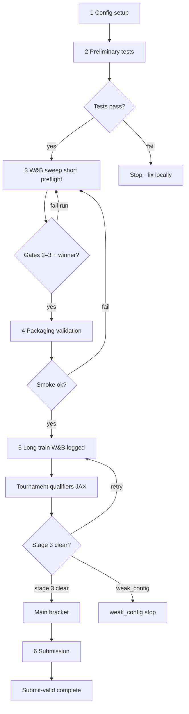
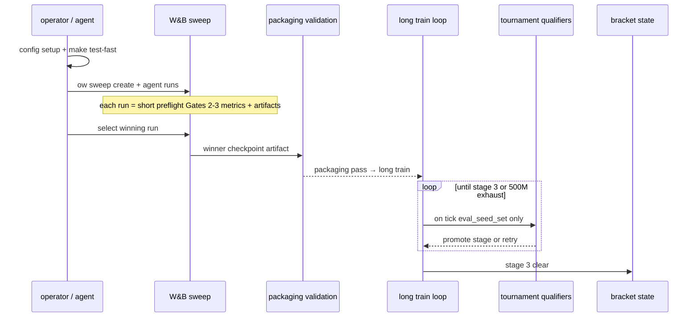

# feat: SSOT training pipeline — config to submission

## Summary

Implement the single canonical pipeline from the SSOT requirements doc:

**config setup → preliminary tests → W&B sweep (short preflight / ablations) → packaging validation (sweep winner checkpoint) → long train (W&B observability) → tournament qualifiers (JAX) → main bracket → submission**

Uses **Weights & Biases** for sweep coordination, run observability, and checkpoint artifact handoff — **no custom config registry or bad-config cache**. Disjoint train/eval seeds, `artifacts=ssot_pipeline`, and teardown of legacy `hybrid_promotion` / `bracket_training` / Gate-5-first spines.

**Operator map:** [`docs/tools/ssot-training-pipeline-flowchart.html`](../tools/ssot-training-pipeline-flowchart.html) (interactive; gates and side paths match plan mermaid below)

Tracker: GitHub #205 (epic). Implementation: #211. Perf dependency: #204.

---

## Problem Frame

Operators and agents face parallel submit-valid narratives (`default`, `hybrid_promotion`, `bracket_training`, Gate 5, async `qualifier_eval`). The SSOT requirements doc defines one spine with plain names: **long train**, **tournament qualifiers**, **submission**. This plan implements that spine and removes competing defaults. (see origin: `docs/brainstorms/2026-06-03-training-pipeline-ssot-requirements.md`)

---

## Requirements

Traceability to origin R-IDs (subset — full list in origin doc):

| ID | Plan coverage |
|----|----------------|
| R1–R2 | U1, U8 — spine + operator docs |
| R3–R8 | U3 — packaging validation |
| R5–R6, R9–R11 | U1 — W&B sweep + artifacts replace local registry; Gates 2–3 in sweep runs |
| R12–R20 | U4, U5, U6, U7 — long train, tournament qualifiers, bracket MVP |
| R21–R22 | U7 — submission |
| R23–R25 | U2, U5 — seed partition + JAX parity for qualifiers |
| R26–R28 | U6 — calibration JSON |
| R29–R31 | U8 — teardown + tracker |

---

## Key Technical Decisions

**KTD1 — Terminology in code and docs.** User-facing spine: **packaging validation**, **long train**, **tournament qualifiers**, **submission**. Internal module names may retain legacy tokens during migration but CLI/help and operator docs use SSOT names only.

**KTD2 — W&B replaces custom config registry.** Use existing `telemetry.wandb`, `ow sweep`, `ow make wandb_sweep=…`, and W&B **artifacts** for sweep runs, metrics, and checkpoint handoff — not `outputs/config_registry/` or `ow registry`. Sweep metric + Gates 2–3 trends filter preflight candidates; operator promotes **winning run artifact** to packaging validation. Reuse `src/cli/sweep.py`, `scripts/make_wandb_sweep.py`, `conf/wandb_sweep/`.

**KTD3 — Preflight checkpoint drives packaging validation.** Extend `ow eval package --validate-docker` to accept `--checkpoint` from the **W&B sweep winner** (or local path synced from W&B artifact) with seed-0 / 4p-only mode matching R7. No random-weight packaging path.

**KTD4 — Seed partition replaces `heldout_eval_seed_set` for training.** Add `training_seed_set` and `eval_seed_set` to `src/config/schema.py`; `SeedScheduler` draws reseeds only from `training_seed_set`; tournament qualifiers consume `eval_seed_set` exclusively. Remove training use of `heldout_eval_seed_set` (R29).

**KTD5 — Tournament qualifiers = new JAX harness, not async Docker `qualifier_eval`.** Fast held-out match runner invoked from training loop on checkpoint ticks. Promotion metric: final-score win fraction (R18), wired to `_terminal` in `src/jax/env.py`. No Docker per tick.

**KTD6 — Hydra profile `artifacts=ssot_pipeline`.** Single composition replacing production use of `default` / `hybrid_promotion` / `bracket_training` for the canonical path. Long train enables rollout curriculum stages R15–R17, tournament qualifier ticks, and **W&B logging enabled**.

**KTD7 — Qualifier calibration before enforcement.** Ship `docs/benchmarks/qualifier-seed-calibration.json` via `ow benchmark calibrate-qualifier-seeds` before R19 floors are enforced in production profile. Until committed, profile uses conservative interim rules (R19).

**KTD8 — Teardown is hard delete of production defaults.** Sole-operator context: remove legacy YAML from default train path, strip hybrid/Gate-5-first narratives from `AGENTS.md` / `docs/AGENT_CAPABILITIES.md`, close the loop on #205 sub-issues. No phased deprecation labels (origin KD7).

**KTD9 — Bracket MVP reuses plan 005 artifacts where possible.** `src/artifacts/tournament/bracket/` state + μ/σ updates from plan 005 U1–U5; SSOT changes *when* entrants qualify (tournament qualifiers during long train, not Docker noop-first async ladder). Plan 005 superseded for qualifier order and eval runtime (origin KD6).

**KTD10 — Preliminary tests gate all GPU/Docker work.** `make test-fast` (step 2) blocks W&B sweeps, packaging, and long train on failure. No new pytest tier — document in operator spine and U8.

**KTD11 — Short preflight runs inside W&B sweeps.** Step 3 is not a separate ad-hoc train — coordinate config search and short ablations via W&B sweep recipes (`conf/wandb_sweep/`) with Gates 2–3 metrics as sweep objective / early-terminate filters. Failed sweep runs stay in W&B history; no local bad-config cache.

---

## Canonical operator spine

Interactive reference: [`docs/tools/ssot-training-pipeline-flowchart.html`](../tools/ssot-training-pipeline-flowchart.html).

| Step | Stage | Typical wall clock | Outcome if not met |
|------|--------|-------------------|---------------------|
| 1 | Config setup — `uv run ow train print_resolved_config=true` | seconds | — |
| 2 | Preliminary tests — `make test-fast` | ~3–8 min CPU | **Stop** (no GPU/Docker) |
| 3 | **W&B sweep · short preflight ablations** — `ow make wandb_sweep=…` + `ow sweep create --backend wandb` | varies (parallel agents) | Failed runs ranked in W&B; pick next candidate |
| — | Select sweep **winner** (Gates 2–3 pass + sweep metric) | operator / W&B UI | Packaging uses winner checkpoint artifact |
| 4 | Packaging validation — Docker, **winner ckpt**, seed 0, 4p | ~3–8 min | **Stop** — pick another sweep run |
| 5 | Long train — `artifacts=ssot_pipeline`, W&B on, ≤500M env steps | hours–days (#204) | **500M without stage 3 → `weak_config` in W&B** (AE4). Qualifier **retry loop** |
| — | Tournament qualifiers (JAX, during step 5) | minutes/tick | Not cleared → continue train. Stage 3 clear → main bracket |
| — | Main bracket μ/σ | ongoing | Does not substitute for submission (R22) |
| 6 | Submission — trained weights + noop/random legs + upload | ~5–15 min | Packaging-only pass insufficient (R21) |

**Terminal outcomes:** submit-valid complete · stop and fix / pick next sweep run · `weak_config` tagged in W&B (budget exhaust).

**Runtime vs implementation order:** U3 packaging primitive can land before U1 sweep recipes; U4 wires winner handoff → packaging → long train before U8 teardown.

---

## High-Level Technical Design

### Canonical spine

### Training loop integration

---

## Implementation Units

Spine-step mapping (runtime order):

| Unit | Spine steps | Notes |
|------|-------------|-------|
| U1 | step 3 | W&B sweep recipes, metrics, artifact handoff |
| U2 | step 5 (train seeds) | Contamination guard AE6 |
| U3 | step 4 | Docker primitive; winner ckpt from W&B |
| U4 | step 5 | `ssot_pipeline` long train + W&B observability |
| U5 | step 5 (qualifier ticks) | JAX harness; retry loop |
| U6 | step 5 (floors) | Calibration JSON before enforcement |
| U7 | bracket + step 6 | Submission trained-weight smoke |
| U8 | docs + teardown | Link flowchart; strip legacy spines |

Steps 1–2 use existing Hydra + `make test-fast` — no new unit; verify in U8 operator docs.

### U1. W&B sweep preflight pipeline

**Goal.** Runtime **step 3**: coordinate short preflight ablations and config search via W&B sweeps; artifact + metric registry for winner handoff to packaging (origin R5–R6, R9–R11 — **W&B replaces local registry**).

**Requirements.** R5, R6, R9, R10, R11.

**Dependencies.** None.

**Files.**
- Create `conf/wandb_sweep/ssot_preflight.yaml` (and `conf/wandb_sweep/metric/` objective aligned with Gates 2–3 + `preflight-calibration.json`)
- Modify `scripts/make_wandb_sweep.py` / `src/cli/sweep.py` if SSOT-specific flags needed
- Enable `telemetry.wandb.log_artifacts` path for preflight checkpoint upload on passing runs
- Tests: extend `tests/test_config_consolidation.py` sweep smoke; new `tests/test_ssot_wandb_sweep_compose.py`

**Approach.**
1. Each sweep agent run executes **short preflight** (Gates 2–3 family, `preflight-calibration.json` thresholds) with swept Hydra params.
2. W&B logs win-rate delta, KL, entropy, and **checkpoint artifact** on runs that pass gates.
3. Operator (or scripted `ow sweep status` + metric filter) selects **winner**; no `ow registry` or bad-config JSON cache — failed runs remain in W&B for comparison.
4. Document promotion flow: W&B run → download/link artifact → U3 packaging validation.

**Test scenarios.**
- SSOT sweep YAML composes via `ow make wandb_sweep=ssot_preflight`.
- Sweep metric references calibrated preflight floors (not invented round numbers).
- Passing run produces artifact retrievable for packaging step.
- Failed gate run does not block other sweep agents (no global bad-config reject).

**Verification.** `ow sweep create --backend wandb --make wandb_sweep=ssot_preflight --dry-run`; one dogfood sweep with ≥2 agents on operator GPU.

---

### U2. Train / eval seed partition

**Goal.** Disjoint `training_seed_set` and `eval_seed_set`; remove training reseed from `heldout_eval_seed_set` (origin R14, R25, R29).

**Requirements.** R14, R25; AE6.

**Dependencies.** None (parallel with U1).

**Files.**
- Modify `src/config/schema.py`, `conf/config.yaml`
- Modify `src/training/seed_scheduler.py`
- Modify `src/jax/train/loop.py` (pass seed sets)
- Tests: `tests/test_seed_scheduler.py`, extend `tests/test_jax_env_parity.py` or new `tests/test_eval_seed_contamination.py`

**Approach.** Default `eval_seed_set` to held-out list; assert disjoint at train start. CI test: eval seed in reseed pool → fail (AE6).

**Test scenarios.**
- Covers AE6. Eval seed in training reseed → build/test fails.
- `training_seed_set ∩ eval_seed_set = ∅` enforced at config resolve.
- Reseed draws only from `training_seed_set` when set.

**Verification.** `make test-fast` green; contamination test fails when violated.

---

### U3. Packaging validation (sweep winner checkpoint)

**Goal.** Runtime **step 4**: Docker smoke using **W&B sweep winner** checkpoint, seed 0, 4p identical agents (origin R4, R7–R8).

**Requirements.** R3, R4, R7, R8, R11 (ordering after step 3 winner selected).

**Dependencies.** U1 (artifact source).

**Files.**
- Modify `src/artifacts/kaggle_submission.py`, `src/cli/eval.py`
- Optional: `ow eval package --wandb-run <entity/project/run_id>` helper to resolve artifact
- Tests: `tests/test_eval_package_validate_docker.py` (extend or create)

**Approach.** After sweep winner selected, invoke `ow eval package --checkpoint <path> --validate-docker` (path from W&B artifact sync). Record pass/fail in W&B run summary tags optional — not a separate registry file.

**Test scenarios.**
- Packaging validation runs only after sweep winner selected (ordering).
- Fail blocks long train; operator picks alternate W&B run.
- Checkpoint load exercises trained weights from preflight (not random init).

**Verification.** One local Docker smoke succeeds on dogfood sweep winner (operator machine with Docker).

---

### U4. SSOT Hydra profile and long train (W&B observability)

**Goal.** Runtime **step 5**: long train with rollout curriculum stages (origin R12–R13, R15–R17) and **W&B logging** for metrics, artifacts, and run lineage from sweep winner.

**Requirements.** R12, R13, R15, R16, R17.

**Dependencies.** U2, U3 (packaging pass before long train start).

**Files.**
- Create `conf/artifacts/ssot_pipeline.yaml`
- Modify `src/jax/train/loop.py`, `src/jax/train/bracket_training.py` (refactor or replace curriculum hooks)
- Ensure `telemetry.wandb.enabled=true` default for SSOT profile; group/tags link to sweep parent run
- Tests: `tests/test_ssot_pipeline_config.py`

**Approach.**
1. **Entry:** Only after U3 packaging pass on sweep winner config/checkpoint.
2. **Long train:** `artifacts=ssot_pipeline`. Rollout opponent mix follows random → noop-heavy → sniper-heavy based on qualifier stage. Env-step budget 500M; exhaustion without stage 3 → log **`weak_config`** to W&B (AE4) — no local bad-config cache.
3. **Observability:** Full W&B metrics JSONL mirror, periodic checkpoint artifacts, campaign group continuity from U1 sweep.

**Test scenarios.**
- Resolved config selects ssot_pipeline composition with wandb enabled.
- Packaging fail blocks long train start.
- Stage 1 opponents predominantly random at train start.
- 500M exhaustion emits `weak_config` in W&B when stage 3 uncleared.

**Verification.** `uv run ow train artifacts=ssot_pipeline training.total_updates=5 telemetry.wandb.enabled=true` smoke starts without legacy hybrid hooks.

---

### U5. Tournament qualifiers (JAX)

**Goal.** Runtime **step 5 sub-loop**: checkpoint-tick held-out JAX eval for stage promotion using final-score wins (origin R18–R19, KD5). **Retry** continues long train when stage not cleared; **500M exhaust** → `weak_config` in W&B.

**Requirements.** R18, R19, R23, R24; AE3 (illustrative).

**Dependencies.** U2, U4.

**Files.**
- Create `src/jax/tournament_qualifiers/` (`runner.py`, `promotion.py`, `metrics.py`)
- Modify `src/jax/train/loop.py` (tick hook)
- Modify `src/jax/env.py` (expose terminal final score for eval aggregation if needed)
- Tests: `tests/test_tournament_qualifiers.py`, golden parity with `tests/test_jax_env_parity.py`

**Approach.** On interval, run N games per leg on `eval_seed_set` only. Aggregate win fraction from `_terminal` final score. Compare to calibration JSON floors (interim conservative rules until U6). Emit promotion events to shift rollout stage; log qualifier metrics to W&B.

**Test scenarios.**
- Promotion uses final-score wins, not rollout JSONL `overall_win_rate`.
- Eval seeds never appear in rollout batch (integration with U2).
- Block promotion when calibration JSON missing (R19 interim rules).

**Verification.** Unit tests with fixed seeds; promotion event logged in metrics JSONL and W&B.

---

### U6. Qualifier seed calibration

**Goal.** Committed `qualifier-seed-calibration.json` and calibration primitive (origin R26–R28).

**Requirements.** R26, R27, R28.

**Dependencies.** U5 (needs promotion API to calibrate against).

**Files.**
- Create `src/cli/benchmark_calibrate_qualifier_seeds.py` (or extend `src/cli/benchmark.py`)
- Create `docs/benchmarks/qualifier-seed-calibration.json` (after campaign)
- Tests: `tests/test_qualifier_calibration_loader.py`

**Approach.** Campaign runs fixed checkpoints vs legs; commit floors + seed counts. Loader used by U5 promotion. Do not relax floors ad hoc (R28).

**Test scenarios.**
- Loader reads committed JSON; missing file → interim conservative mode.
- Calibration JSON schema validated in CI once committed.

**Verification.** `ow benchmark calibrate-qualifier-seeds --help` documents campaign; loader unit tests pass.

---

### U7. Bracket MVP and submission

**Goal.** Main bracket entry after stage 3; submission with trained weights + opponent legs (origin R20–R22).

**Requirements.** R20, R21, R22; AE5.

**Dependencies.** U5.

**Files.**
- Reuse/adapt `src/artifacts/tournament/bracket/` from plan 005
- Modify `src/cli/eval.py` (`ow eval submit`, package paths)
- Tests: `tests/test_submission_requirements.py`, bracket transition tests

**Approach.** Stage 3 clear → write bracket state, enable self-play hook (MVP). Submission: trained checkpoint Docker smoke + noop/random legs at trained weights (R21). Separate from packaging validation (preflight/sweep winner ckpt).

**Test scenarios.**
- Covers AE5. Bracket-qualified checkpoint → submission path allowed after Docker pass.
- Tournament qualifier clearance alone insufficient for submission without trained-weight smoke (R22).

**Verification.** Submission CLI documents SSOT order; integration test mocks Docker where needed.

---

### U8. Legacy teardown and operator docs

**Goal.** Remove parallel spines; point operators/agents to SSOT only (origin R2, R29–R31).

**Requirements.** R2, R29, R30, R31.

**Dependencies.** U1–U7 (profile must exist before deleting defaults).

**Files.**
- Remove or relocate `conf/artifacts/hybrid_promotion.yaml`, `conf/artifacts/bracket_training.yaml` from production docs (delete or move to `conf/artifacts/_legacy/`)
- Modify `AGENTS.md`, `docs/AGENT_CAPABILITIES.md`, `docs/README.md`, `docs/ONBOARDING.md`
- Modify agent capability tests if present
- Update GitHub #205 epic body via `gh issue edit` (manual step in verification)

**Approach.** Hard teardown: `uv run ow train` without profile targets `ssot_pipeline` or errors with pointer to SSOT doc. Demote `learn-proof` composer from primary workflow. Link [`docs/tools/ssot-training-pipeline-flowchart.html`](../tools/ssot-training-pipeline-flowchart.html). Remove any `ow registry` / config-registry references from operator docs. Annotate superseded plans in `docs/plans/2026-06-03-005-*.md` headers only.

**Test scenarios.**
- Agent capability map lists SSOT + W&B sweep primitives only (origin success criteria).
- Import/hydra smoke: default train does not enable hybrid_promotion funnel.

**Verification.** `make test-fast` green; docs link to SSOT requirements; #204 referenced as long-train dependency.

---

## Scope Boundaries

**Deferred for later** (from origin — unchanged)
- Wilson/binomial formula details (calibration campaign)
- Full bracket async round-robin worker (plan 005 U7–U8)
- Gate 4 `curriculum_staged` as non-Kaggle research track

**Deferred to Follow-Up Work**
- Launch hygiene tier-2 recovery as hard gate on long train (#204 implementation)
- Planet Flow track relocation (origin R30) — may share W&B sweep infra with U1

**Outside this product's identity** (from origin)
- Replacing Kaggle Docker
- Planet Flow as default competition path
- Building a parallel local config-registry service (explicitly out of scope per KTD2)

---

## Open Questions

**Resolved in this plan (assumptions)**
- Preflight length: inherit `docs/benchmarks/preflight-calibration.json` Gates 2–3 window in sweep objective.
- Hydra profile name: `ssot_pipeline`.
- W&B artifact is the checkpoint handoff between steps 3→4→5; no local registry JSON.

**Deferred to implementation**
- Exact tournament qualifier tick interval vs checkpoint save frequency
- Whether submission opponent legs reuse unified ladder executor or slim Docker matrix
- Automated vs manual sweep winner promotion (`ow sweep status` filter vs W&B UI)

---

## Risks & Dependencies

| Risk | Mitigation |
|------|------------|
| Shipping teardown before SSOT profile works | U8 last; smoke test in U4 before doc flip |
| W&B artifact drift vs local checkpoint path | U3 documents sync path; test with `log_artifacts=true` |
| Tournament qualifiers diverge from Docker submission | R23–R24 parity tests; submission opponent legs at trained weights (R21) |
| Long train wall clock (#204) | Document before enforcing R12 in production; not blocking U1–U5 merge |
| Plan 005 code assumes Docker qualifiers | Reuse bracket state, replace qualifier *trigger* with U5 |
| Wrong Hydra profile during sweep preflight | U1 sweep recipe pins SSOT-relevant groups + `preflight-calibration.json` |

---

## Sources & Research

- Origin: `docs/brainstorms/2026-06-03-training-pipeline-ssot-requirements.md`
- Operator flowchart: `docs/tools/ssot-training-pipeline-flowchart.html`
- W&B sweep CLI: `src/cli/sweep.py`, `scripts/make_wandb_sweep.py`, `conf/wandb_sweep/`
- Superseded qualifier flow: `docs/plans/2026-06-03-005-feat-kaggle-bracket-ranking-plan.md`
- Existing packaging: `src/cli/eval.py`, `src/artifacts/kaggle_submission.py`
- Seed scheduler: `src/training/seed_scheduler.py`, `src/config/schema.py`
- Training loop hooks: `src/jax/train/loop.py`, `src/jax/train/bracket_training.py`
- Preflight calibration: `docs/benchmarks/preflight-calibration.json`
- Institutional learnings: `docs/solutions/architecture-patterns/ssot-training-pipeline-config-to-kaggle-submission.md` (canonical spine), `docs/solutions/architecture-patterns/gate5-unified-tournament-submit-valid-funnel.md` (legacy), `docs/solutions/architecture-patterns/jax-comet-kaggle-parity-ci-gate.md`, `docs/solutions/architecture-patterns/kaggle-bracket-ranking-foundational-slice.md` (legacy), `docs/solutions/developer-experience/seed-scheduler-calibration-agent-native-operator-phase2.md`
