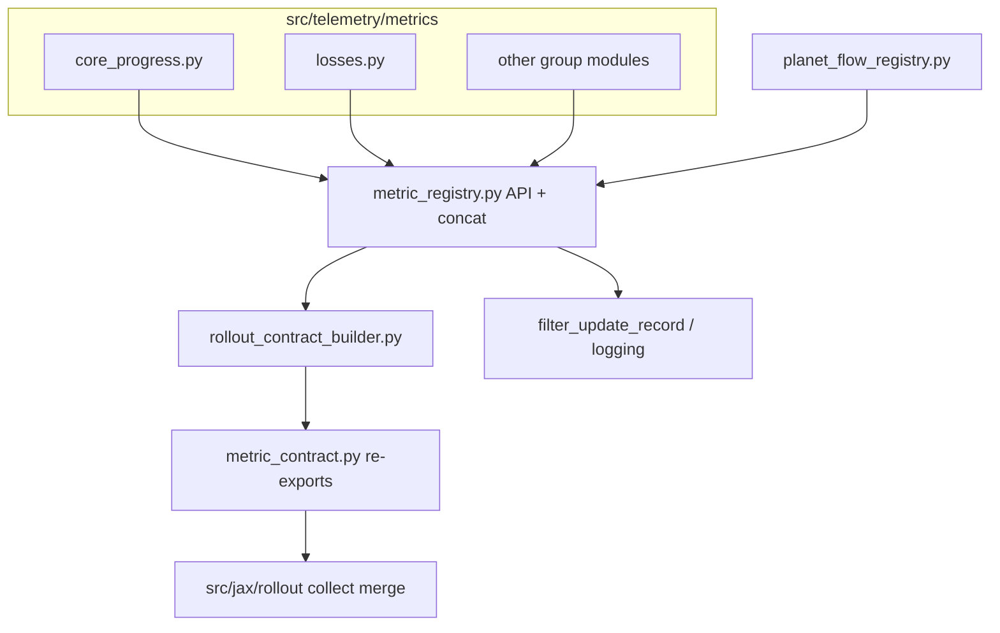

# refactor: metric registry shard and rollout contract sync (#198 → #199)

## Summary

Execute Phase 2 telemetry work from the src simplification follow-up: split the monolithic `metric_registry.py` inline definitions into per-group modules (GitHub #198 / plan U9), then derive JAX rollout `metric_contract` key tuples from `MetricDefinition` metadata with drift tests (GitHub #199 / plan U11). Preserve every emitted training-log metric name and the public registry lookup/filter API.

## Problem Frame

`src/telemetry/metric_registry.py` is ~1092 lines with ~130 inline `_metric(...)` entries, making reviews and safe edits costly. Rollout scalar key tuples in `src/jax/rollout/metric_contract.py` duplicate registry knowledge; `metric_registry.py` imports those tuples at module load, so adding metrics requires coordinated hand edits in two places (review finding 21, plan R9).

Phase 1 of plan `011` landed elsewhere; issues #198 and #199 are the coordinated metric track. Issue #199 explicitly depends on #198.

## Requirements

| ID | Requirement |
|----|-------------|
| R1 | Shard inline `_METRICS` into `src/telemetry/metrics/` modules — one module per major `METRIC_GROUPS` bucket; concatenate in `metric_registry.py` (see origin R2) |
| R2 | Keep `metric_definition`, `enabled_metric_names`, `filter_metric_record`, `rollout_compute_scalar_keys`, and related public APIs behavior-stable |
| R3 | Emitted training-log metric **names** unchanged (no renames, no dropped keys) |
| R4 | Planet Flow metrics continue to flow through `planet_flow_registry.py` / descriptors; do not fork a second Planet Flow naming scheme |
| R5 | `metric_contract` scalar tuples are built from registry metadata, not hand-duplicated name lists where a definition exists |
| R6 | Contract keys ⊆ registered rollout-related metric names; existing structural invariants in `test_rollout_metric_contract_syncs_with_telemetry_registry` keep passing |
| R7 | Break the `metric_registry` ↔ `metric_contract` import cycle at module load (registry must not import contract tuples at top level after U11) |
| R8 | Default verification: `make test-fast` and `make test-domain-artifacts` |

## Key Technical Decisions

**KTD1 — Shard layout mirrors `planet_flow_registry.py`.** Each `METRIC_GROUPS` bucket (except Planet Flow, which already has `planet_flow_registry.py`) gets a module under `src/telemetry/metrics/` exporting `*_metric_definitions() -> tuple[MetricDefinition, ...]`. `metric_registry.py` retains types, constants (`METRIC_GROUPS`, protected-name frozensets), `_metric()` helper, curriculum probability expansion, concatenation, and lookup/filter functions — target ~200–250 lines of API plus imports. Rationale: origin U9; planet_flow precedent.

**KTD2 — Rollout contract via `rollout_scalar_role` metadata.** Extend `MetricDefinition` with an optional `rollout_scalar_role: str | None` using a small closed vocabulary: `base_sum`, `internal`, `finalized_rate`, `chunk_only`. Non-rollout metrics leave it `None`. Builder functions in `src/telemetry/rollout_contract_builder.py` derive `BASE_ROLLOUT_SCALAR_KEYS`, `ROLLOUT_INTERNAL_SCALAR_KEYS`, `FINALIZED_ROLLOUT_RATE_KEYS`, and `ROLLOUT_CHUNK_ONLY_SCALAR_KEYS` from `METRIC_DEFINITIONS` filtered by role. Rationale: origin KTD3; heuristic-only filters (suffix `_rate`, group name) are brittle for debug/timing overlap and Planet Flow imports.

**KTD3 — Stable logged order is explicit, registry-validated.** `LOGGED_ROLLOUT_SCALAR_KEYS` and `ROLLOUT_SCALAR_ORDER` keep a single canonical **order tuple** (today’s order) in `rollout_contract_builder.py`, validated at import/test time: every name must exist in registry with the correct role; no extras; no renames. New rollout metrics add a definition + role + append to order tuple in one PR. Rationale: merge/finalize paths depend on stable ordering; generation alone from unsorted definition iteration would churn dashboards and tests.

**KTD4 — Planet Flow keys stay descriptor-driven.** Count/rate/delta key tuples for Planet Flow remain sourced from `planet_flow_metric_descriptors.py` inside the builder (same as today’s `metric_contract` imports). Registry entries for Planet Flow stay produced by `planet_flow_registry.py`. Rationale: origin R4; descriptors already own suffix semantics.

**KTD5 — Delivery: one branch, two commits.** Land U9 (shard) then U11 (contract sync) in sequence on one PR to avoid intermediate broken import cycles; close #198 and #199 together. Rationale: user confirmation; issue #199 depends on #198.

## High-Level Technical Design

**Import-cycle rule after U11:** `metric_registry.py` imports builder outputs lazily or only inside functions that need rollout tuples; `metric_contract.py` imports from `rollout_contract_builder.py` only; builder imports `METRIC_DEFINITIONS` from `metric_registry` after definitions are assembled (builder lives under `src/telemetry/` to stay outside JAX).

## Scope Boundaries

**In scope:** Issues #198 and #199; plan `011` U9 and U11; tests in `tests/test_metric_registry.py` and rollout contract consumers.

**Deferred to follow-up work**

- Other plan `011` units (benchmark package, env step adapter, checkpoint fail-fast, etc.)
- Adding `internal_only=True` on definitions (field exists but unused today)
- Collapsing `planet_flow_metric_descriptors` into registry-only metadata (would widen Planet Flow scope)

**Outside scope**

- Renaming or removing emitted metric keys
- Preflight threshold recalibration
- Finding 9 prefix-decoder PPO replay optimization

## Implementation Units

### U1. Shard metric registry definitions (#198)

**Goal:** Reduce `metric_registry.py` to API + concatenation; move inline `_METRICS` into group modules without changing `METRIC_DEFINITIONS` content.

**Requirements:** R1, R2, R3, R4, R8

**Dependencies:** None

**Files:**
- `src/telemetry/metrics/__init__.py` (new)
- `src/telemetry/metrics/core_progress.py`, `losses.py`, `timing.py`, `curriculum.py`, `opponent_composition.py`, `action_decision.py`, `game_state.py`, `trajectory_shield_debug.py`, `historical_pool.py`, `events.py`, `debug.py` (new)
- `src/telemetry/metric_registry.py` (modify)
- `tests/test_metric_registry.py` (extend if needed)

**Approach:**
- Move `_metric()` helper to `src/telemetry/metrics/_helpers.py` or keep in `metric_registry.py` and import from modules (prefer shared `_helpers.py` to avoid circular imports).
- Each group module exports `def <group>_metric_definitions() -> tuple[MetricDefinition, ...]:` using the same `_metric(...)` calls as today (copy-paste move, no semantic edits).
- `_METRICS` becomes concatenation: `core_progress + losses + ... + events + debug` (order preserved from current file).
- Keep `_planet_flow_metrics()` lazy import and `_curriculum_prob_metrics` generation in `metric_registry.py`.
- Do **not** change `METRIC_DEFINITIONS_BY_NAME` membership or group strings.

**Patterns to follow:** `src/telemetry/planet_flow_registry.py` descriptor-driven tuple builder.

**Test scenarios:**

| Scenario | Expected |
|----------|----------|
| `test_metric_registry_names_are_unique_and_grouped` | Pass unchanged |
| Snapshot count of `METRIC_DEFINITIONS` | Same length and name set as pre-shard (optional assert in test) |
| `rg '_metric\(' src/telemetry/metric_registry.py` | No inline bulk definitions remain (only helper if kept) |

**Verification:** `make test-fast`; `make test-domain-artifacts`

---

### U2. Registry-derived rollout contract (#199)

**Goal:** Single source of truth for rollout scalar key tuples; delete redundant manual duplicates; add drift guard.

**Requirements:** R5, R6, R7, R8

**Dependencies:** U1

**Files:**
- `src/telemetry/metric_registry.py` (extend `MetricDefinition`, remove top-level `metric_contract` import)
- `src/telemetry/rollout_contract_builder.py` (new)
- `src/jax/rollout/metric_contract.py` (thin re-exports from builder)
- `src/telemetry/metrics/*.py` (add `rollout_scalar_role` on rollout-related definitions during tag pass)
- `tests/test_metric_registry.py` (extend drift/role tests)

**Approach:**
1. Add `rollout_scalar_role: str | None = None` to `MetricDefinition` and `_metric(..., rollout_scalar_role=...)`.
2. While tagging definitions in group modules, assign roles matching today’s `metric_contract` partitions (use existing test invariants as ground truth).
3. Implement `rollout_contract_builder.py`:
   - Role-filtered tuples for base/internal/finalized/chunk-only.
   - `LOGGED_ROLLOUT_SCALAR_KEYS` / order: canonical order tuple + validation against registry.
   - Planet Flow segments: still compose from `planet_flow_metric_descriptors` keys in the same positions as today.
4. Update `metric_registry.py` to set `ROLLOUT_SCALAR_ORDER` from builder (after `METRIC_DEFINITIONS` built).
5. Replace manual duplicates in `metric_contract.py` with imports from builder.
6. Extend `test_rollout_metric_contract_syncs_with_telemetry_registry` with explicit `contract keys ⊆ METRIC_DEFINITIONS_BY_NAME` and role-consistency checks.

**Execution note:** Tag roles using characterization — run existing contract sync test after each role batch (core, shield, opponent, planet flow).

**Test scenarios:**

| Scenario | Expected |
|----------|----------|
| `test_rollout_metric_contract_syncs_with_telemetry_registry` | Pass |
| New: every `LOGGED_ROLLOUT_SCALAR_KEYS` name registered | Drift fails if typo |
| New: role-filtered base keys match `BASE_ROLLOUT_SCALAR_KEYS` set | Fails if role mis-tagged |
| `test_collect_rollout_jax_emits_training_scalar_metric_contract` | Pass (domain artifacts / jax tier as appropriate) |

**Verification:** `make test-domain-artifacts`; `make test-fast`

---

## Risks & Dependencies

| Risk | Mitigation |
|------|------------|
| Import cycle reintroduced | Enforce: `metric_registry` must not import `metric_contract` at module top; code review + optional lint comment |
| Stable log order changes | Keep explicit `LOGGED` order tuple; test asserts exact order against golden tuple or hash |
| Missed rollout metric during tag pass | Drift test + rollout JAX smoke |
| Planet Flow double-source drift | Builder composes PF segments only from descriptors; registry PF entries still via `planet_flow_registry` |

## Open Questions

| Question | Status |
|----------|--------|
| Heuristic-only vs `rollout_scalar_role` metadata? | Resolved — metadata (KTD2) |
| One PR vs two PRs? | Resolved — one PR, two commits (KTD5) |

## Sources & Research

- Parent plan: `docs/plans/2026-06-03-011-refactor-src-simplification-followup-plan.md` (U9, U11, KTD3)
- GitHub: [#198](https://github.com/jmduea/orbit_wars/issues/198), [#199](https://github.com/jmduea/orbit_wars/issues/199)
- Pattern reference: `src/telemetry/planet_flow_registry.py`
- Contract tests: `tests/test_metric_registry.py` (`test_rollout_metric_contract_syncs_with_telemetry_registry`)
- AGENTS.md: v2-only / no parallel shim APIs — update call sites, avoid permanent re-export layers
