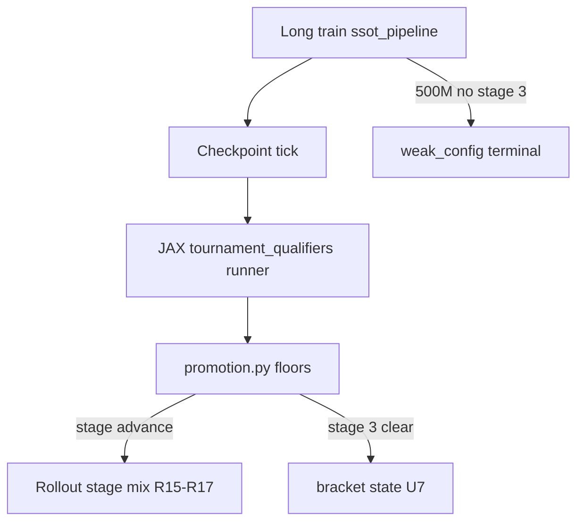

# feat: SSOT pipeline U5–U8 (LFG #211)

## Summary

Implement the remaining SSOT spine after foundation slice [#212](https://github.com/jmduea/orbit_wars/pull/212): **JAX tournament qualifiers** (U5), **qualifier-seed calibration** (U6), **bracket MVP + submission** (U7), and **legacy teardown** (U8). Parent plan `2026-06-03-013-feat-ssot-training-pipeline-plan.md` remains authoritative; this plan scopes only U5–U8 for one LFG delivery.

**Runtime spine:** config → `make test-fast` → W&B sweep → packaging (winner) → long train (`artifacts=ssot_pipeline`) → **JAX qualifiers** → main bracket → submission.

---

## Problem Frame

Operators still rely on legacy `hybrid_promotion`, Docker `qualifier_eval`, and Gate-5-first docs while `ssot_pipeline` is a stub without qualifier ticks, calibration JSON, or teardown. U1–U4 shipped seed partition, W&B preflight sweep, packaging CLI flags, and the Hydra profile stub — U5–U8 complete the production path to Kaggle submission.

---

## Requirements

| ID | Unit | Requirement |
|----|------|-------------|
| R12 | U5, U7 | Long train ≤500M env steps; exhaustion without stage 3 → `weak_config` in W&B and stop |
| R13 | U4, U8 | Single SSOT artifacts profile (`ssot_pipeline`) as production train path |
| R15–R17 | U5 | Rollout curriculum stages driven by qualifier promotion (random → noop-heavy → sniper-heavy) |
| R18 | U5 | Qualifier wins from JAX **final score** on `eval_seed_set`; not rollout JSONL win rate |
| R19 | U5, U6 | Floors from `qualifier-seed-calibration.json` when committed; interim conservative rules until then |
| R20 | U7 | Stage 3 clear → main bracket state + self-play hook MVP |
| R21–R22 | U7 | Submission requires trained-weight packaging + noop/random legs |
| R23–R24 | U5 | Env + outcome parity with Kaggle (`test_jax_env_parity`) |
| R25 | U5 | Qualifiers use `eval_seed_set` only (U2 guard) |
| R26–R28 | U6 | Calibration campaign primitive; no ad-hoc floor relaxation |
| R2, R29–R31 | U8 | Teardown parallel spines; docs point to SSOT only |

---

## Key Technical Decisions

**KTD-U1 — Sync JAX qualifiers, not Docker ticks.** Replace legacy `qualifier_eval` optional jobs with `src/jax/tournament_qualifiers/` hooked from `src/jax/train/loop.py` when `artifacts=ssot_pipeline`. Reuse bracket state helpers from `bracket_training.py` / `src/artifacts/tournament/bracket/` for weak_config and stage-3→main — do not queue per-tick Docker jobs (see origin KD5).

**KTD-U2 — Win metric = terminal final score.** Aggregate learner win fraction from `_terminal()` ship totals (highest score wins). Promotion must not read `overall_win_rate` or `binary_win` training metrics (R18, learning doc).

**KTD-U3 — Three threshold regimes stay separate.** Gate 5 / unified **0.76** (legacy), bracket Docker qualifier **1.0** (legacy), SSOT stage floors from **`docs/benchmarks/qualifier-seed-calibration.json`** (U6). Do not copy 0.76 into qualifier promotion.

**KTD-U4 — U6 loader mirrors preflight pattern.** `load_qualifier_calibration()` with missing-file → conservative interim floors (R19); block strict enforcement only when schema + `enforcement: true` in committed JSON.

**KTD-U5 — U8 last.** Move `hybrid_promotion.yaml` / `bracket_training.yaml` to `conf/artifacts/_legacy/` only after U5–U7 smokes pass; update AGENTS.md and capability map in same PR.

**KTD-U6 — Interim floors for U5 landing.** Until calibration JSON is committed, use documented conservative per-leg minimum win rates (no promotion on ties); wire loader so U6 drop-in replaces interim constants.

---

## High-Level Technical Design

---

## Implementation Units

### U5. Tournament qualifiers (JAX)

**Goal.** Checkpoint-tick held-out JAX eval for stage promotion; retry long train until cleared; 500M exhaust → `weak_config`.

**Requirements.** R12, R15–R19, R23–R25; Covers AE3 (illustrative).

**Dependencies.** U2, U4 (foundation merged).

**Files.**
- Create `src/jax/tournament_qualifiers/runner.py`, `promotion.py`, `metrics.py`
- Create `src/jax/qualifier_calibration.py` (loader + interim floors)
- Modify `src/jax/train/loop.py`, `conf/artifacts/ssot_pipeline.yaml`
- Modify `src/config/schema.py` (SSOT qualifier tick config if needed)
- Tests: `tests/test_tournament_qualifiers.py`

**Approach.** On `qualifier_eval_interval_updates`, run N games per opponent leg on each `eval_seed_set` seed; count wins via final-score rule; compare to loader floors; emit promotion events and shift rollout opponent mix; log metrics to JSONL/W&B; call bracket weak_config helper at env-step budget.

**Test scenarios.**
- Promotion uses final-score wins, not `overall_win_rate`.
- Eval seeds never used in qualifier runner's training draw (mock scheduler).
- Missing calibration JSON → interim conservative mode (no silent promotion).
- Tie game does not advance stage (R19 interim).

**Verification.** `make test-fast` includes new unit tests; optional `pytest -m jax` only if user requests compile smokes.

---

### U6. Qualifier seed calibration

**Goal.** `ow benchmark calibrate-qualifier-seeds` + committed `docs/benchmarks/qualifier-seed-calibration.json`.

**Requirements.** R26–R28.

**Dependencies.** U5 promotion API.

**Files.**
- Create `src/cli/benchmark/calibrate_qualifier_seeds.py`
- Create `src/jax/qualifier_seed_calibration.py` (campaign merge)
- Modify `src/cli/benchmark/parser.py`, `src/cli/benchmark/__init__.py`, `src/cli/benchmark/common.py`
- Create `docs/benchmarks/qualifier-seed-calibration.json` (stub with `enforcement: false` until campaign)
- Tests: `tests/test_qualifier_calibration_loader.py`

**Approach.** Mirror `calibrate_unified.py`: `--write-stub`, `--analyze-only`, `--dry-run`; JAX eval campaign on fixed checkpoints vs legs; merge floors into JSON; loader consumed by U5.

**Test scenarios.**
- Loader reads committed JSON schema.
- `--write-stub` creates valid JSON without GPU.
- Missing file → interim mode (same as U5 test).

**Verification.** `uv run ow benchmark calibrate-qualifier-seeds --help`; loader tests in `make test-fast`.

---

### U7. Bracket MVP and submission

**Goal.** Main bracket after stage 3; submission path documents trained-weight + opponent legs.

**Requirements.** R20–R22; Covers AE5.

**Dependencies.** U5.

**Files.**
- Modify `src/jax/tournament_qualifiers/promotion.py` (stage-3 → bracket transition)
- Reuse `src/artifacts/tournament/bracket/*`
- Modify `src/cli/eval.py` (SSOT submission help / guards)
- Tests: extend `tests/test_bracket_training_hooks.py` or add `tests/test_ssot_bracket_transition.py`

**Approach.** On stage 3 clear, persist bracket state and set phase `main`; wire self-play hook MVP from bracket package. Submission CLI: document order packaging (trained ckpt) → Docker validate → noop/random legs; qualifier clearance alone does not skip trained-weight smoke (R22).

**Test scenarios.**
- Covers AE5. Stage-3 cleared state allows bracket `main` phase write.
- Qualifier-only clearance without trained-weight validation flagged in CLI/docs test.

**Verification.** Unit tests with mocked checkpoint paths; `make test-fast`.

---

### U8. Legacy teardown and operator docs

**Goal.** Demote hybrid/bracket/Gate-5-first paths; SSOT-only operator spine.

**Requirements.** R2, R29–R31.

**Dependencies.** U5–U7.

**Files.**
- Move `conf/artifacts/hybrid_promotion.yaml`, `conf/artifacts/bracket_training.yaml` → `conf/artifacts/_legacy/`
- Modify `AGENTS.md`, `docs/AGENT_CAPABILITIES.md`, `docs/README.md`, `docs/ONBOARDING.md`
- Modify `tests/test_agent_capability_map.py`, `tests/test_config_consolidation.py`
- Annotate `docs/plans/2026-06-03-005-*.md` headers

**Approach.** Keep legacy YAML composable under `_legacy/` for debugging; remove from primary agent docs; capability map lists SSOT + `calibrate-qualifier-seeds` primitives.

**Test scenarios.**
- Agent capability map includes SSOT spine primitives; hybrid demoted.
- `compose_hydra_train_config(["artifacts=ssot_pipeline"])` still passes; `_legacy/hybrid_promotion` composes if referenced explicitly.

**Verification.** `make test-fast`; manual `gh issue edit 205` note in PR body.

---

## Scope Boundaries

**Deferred for later** (from origin)
- Full bracket async round-robin worker (plan 005 U7–U8)
- Wilson/binomial formula in calibration campaign
- Gate 4 `curriculum_staged` on Kaggle spine
- Automated W&B sweep winner promotion resolver

**Deferred to Follow-Up Work**
- Long-train wall-clock hard gate (#204)
- Exact qualifier tick vs checkpoint save coupling tuning

**Outside this product's identity**
- Replacing Kaggle Docker
- Local config-registry service

---

## Risks & Dependencies

| Risk | Mitigation |
|------|------------|
| U5 JAX compile cost in CI | Unit-test promotion logic with mocked terminal outcomes; defer full rollout JAX smokes |
| Teardown breaks existing PR workflows | U8 last; `_legacy/` path preserves compose |
| Confuse 0.76 vs qualifier floors | KTD-U3 + docs table in AGENTS.md |
| weak_config still loops in old docs | U8 + flowchart note |

---

## Sources & Research

- Origin: `docs/brainstorms/2026-06-03-training-pipeline-ssot-requirements.md`
- Parent: `docs/plans/2026-06-03-013-feat-ssot-training-pipeline-plan.md`
- Foundation: `docs/plans/2026-06-04-001-feat-ssot-lfg-foundation-slice-plan.md`
- Learning: `docs/solutions/architecture-patterns/ssot-training-pipeline-config-to-kaggle-submission.md`
- Flowchart: `docs/tools/ssot-training-pipeline-flowchart.html`
- Reuse: `src/jax/train/bracket_training.py`, `src/artifacts/tournament/bracket/`
