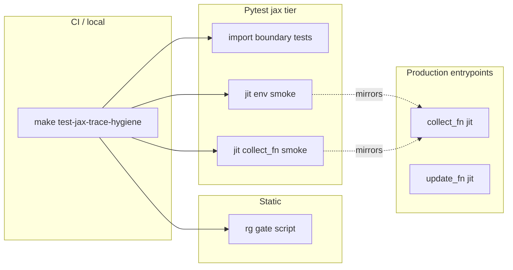

# feat: JAX trace-tier hygiene enforcement

## Summary

Add automated guardrails so tier-A JAX hot-path modules stay compatible with production `jax.jit` / `jax.vmap` / `jax.lax.scan` entrypoints: static pattern checks, import-boundary tests, fast jit contract smokes, and CI wiring. No behavior change to training; documentation and agent rules cross-linked.

## Problem Frame

JAX trace bugs (host I/O, `.item()`, `pure_callback`, telemetry imports inside scans) surface late—at compile time or in slow smokes. The repo documents conventions (`jax-flax-linen.mdc`, `jax-no-kaggle-callbacks.md`) but does not enforce them in CI. Production compiles `collect_fn` and `update_fn` in `src/jax/train/rollout_groups.py` and `src/jax/train/loop.py`; tier-A code must stay trace-safe.

## Requirements

| ID | Requirement |
|----|-------------|
| R1 | Document three trace tiers (A/B/C) with repo-relative module lists and allowed escape hatches (`pure_callback` forbidden in tier A per existing convention). |
| R2 | Static gate fails on forbidden patterns in tier A (`pure_callback`, `io_callback`, `_reference_`, `env_parity_mode`, `from src.game.(planet\|comet)_generation`, `print(`, `open(`, `logging.`, `breakpoint(`). |
| R3 | Pytest asserts tier-A modules do not import `src.telemetry` or `src.artifacts` (except allowlisted pure-constant modules if any—default: none). |
| R4 | Fast jax-tier test: `jax.jit(jax.vmap(reset))` + one `batched_step` on train config without tracer error. |
| R5 | Fast jax-tier test: `group.collect_fn` one-step smoke (minimal envs/steps) exercises jitted collect boundary. |
| R6 | `make test-jax-trace-hygiene` runs static gate + import tests + fast jit smokes; documented in `AGENTS.md` / Makefile. |
| R7 | CI workflow runs `make test-jax-trace-hygiene` on PRs (alongside or inside existing jax parity workflow). |
| R8 | Extend `docs/solutions/conventions/jax-no-kaggle-callbacks.md` or add sibling doc linking tiers, verify commands, and `JAX_CHECK_TRACER_LEAKS` debug tip. |

## Key Technical Decisions

| Decision | Rationale |
|----------|-----------|
| **Tiered enforcement, not “all of src/jax”** | `train/loop.py` and checkpoint paths legitimately use logging, artifacts, filesystem—banning globally would be noisy and wrong. |
| **Shell `rg` gate + pytest, defer full Ruff `[tool.ruff]` until a second pass** | No `[tool.ruff]` today; `rg` matches existing `jax-no-kaggle-callbacks` verify style; fast, no new dep. Optional Ruff in follow-up. |
| **Keep existing `checkpoint_compat` / `metric_registry` imports in collect/ppo for this slice** | Refactoring telemetry coupling (unit G) is deferred—import test allowlists `checkpoint_compat` only if needed after audit; prefer failing test to force explicit allowlist. |
| **Collect jit smoke stays fast** | `rollout_steps=1`, `num_envs=2`, small model dims—mirror `test_jax_rollout_groups_collect_*` but eligible for `test-jax` tier (not slow). |
| **No new `ow` subcommand** | Makefile target matches repo agent conventions (`make test-domain-*`). |

## Scope Boundaries

**In scope:** docs, Makefile, CI, `tests/test_jax_trace_hygiene.py`, `scripts/jax_trace_hygiene.sh` (or inline Makefile recipe), AGENTS.md one-liner.

**Out of scope:** Splitting telemetry out of `collect.py`/`ppo_update.py`; moving slow compile smokes to daily tier; Ruff plugin authoring; formal JAX typing (`jaxtyping`).

### Deferred to Follow-Up Work

- Ruff `[tool.ruff]` per-file bans for tier A.
- ast-grep structural rules for Python `for` inside scan bodies.
- `JAX_CHECK_TRACER_LEAKS=1` on full `make test-jax`.
- Refactor metric registry imports out of tier A.

## High-Level Technical Design

Tier A modules (initial list): `src/jax/env.py`, `src/jax/features.py`, `src/jax/rollout/collect.py`, `src/jax/ppo_update.py`, `src/jax/action_sampling.py`, `src/jax/factored_sequence_scan.py`, `src/jax/planet_flow.py`, `src/jax/action_codec.py`.

---

## Implementation Units

### U1. Trace tier architecture doc

**Goal:** Single SSOT for what “trace-safe” means in this repo.

**Requirements:** R1, R8

**Files:**
- `docs/architecture/jax-trace-tiers.md` (create)
- `docs/solutions/conventions/jax-no-kaggle-callbacks.md` (link)
- `AGENTS.md` (one bullet under key invariants)

**Approach:** Define tier A (must trace), B (jit wrappers), C (host orchestration). List modules, forbidden APIs, allowed `pure_callback` (none in A). Point to verify commands.

**Test scenarios:**
- Test expectation: none — documentation only.

**Verification:** Doc renders; links resolve; tier A list matches U2 gate file list.

---

### U2. Static pattern gate

**Goal:** Fail fast on known-forbidden tokens in tier A.

**Requirements:** R2, R6

**Dependencies:** U1

**Files:**
- `scripts/jax_trace_hygiene.sh` (create)
- `Makefile` (target `test-jax-trace-hygiene`)
- `docs/architecture/jax-trace-tiers.md` (verify command section)

**Approach:** Script runs `rg` with fixed patterns over tier-A paths; exit 1 on match. Makefile target invokes script then pytest subset (U3–U4).

**Test scenarios:**
- Happy path: clean tree → script exit 0.
- Error path: intentional `print(` in tier A in a branch → script exit 1 (manual/dev only; no committed violation).

**Verification:** `make test-jax-trace-hygiene` fails if `rg` finds `pure_callback` in `src/jax/env.py`.

---

### U3. Import boundary pytest

**Goal:** Block new telemetry/artifacts imports in tier A.

**Requirements:** R3, R6

**Dependencies:** U1

**Files:**
- `tests/test_jax_trace_hygiene.py` (create)

**Approach:** Parametrize tier-A module paths; `importlib` or AST parse top-level imports; assert no `src.telemetry` / `src.artifacts` prefixes. Document explicit allowlist tuple in test module if `checkpoint_compat` must remain temporarily.

**Test scenarios:**
- Happy path: all tier-A modules pass import scan.
- Edge case: test module list matches doc tier-A list (drift fails when file added to A without test update).

**Verification:** `uv run pytest tests/test_jax_trace_hygiene.py -k import -m jax` passes.

---

### U4. Fast jit contract smokes

**Goal:** Exercise same transforms as production on every PR jax hygiene run.

**Requirements:** R4, R5, R6

**Dependencies:** U2

**Files:**
- `tests/test_jax_trace_hygiene.py`
- `tests/conftest.py` (only if new test names need `jax` marker—likely auto via file name)

**Approach:**
- Env: `TrainConfig()` with `task.env_parity_mode=train` (or default train), tiny fleets; `jax.jit(jax.vmap(reset))` + one `batched_step`.
- Collect: `init_rollout_groups` + single `collect_fn` call, `rollout_steps=1`, `num_envs=2`, small hidden size—mark `@pytest.mark.jax` not `slow`.

**Test scenarios:**
- Happy path: env jit vmap reset returns valid `JaxEnvState` pytree.
- Happy path: collect_fn returns transitions with expected leading dims.
- Error path: N/A in CI (covered by static gate for obvious bugs).

**Verification:** Tests run under `-m "jax and not slow"`.

---

### U5. CI workflow

**Goal:** PRs cannot merge trace violations silently.

**Requirements:** R7

**Dependencies:** U2, U3, U4

**Files:**
- `.github/workflows/jax-trace-hygiene.yml` (create) or extend `.github/workflows/kaggle-jax-parity.yml`

**Approach:** New workflow `make test-jax-trace-hygiene` on pull_request; CPU, `uv sync --group dev`, same env vars as parity workflow where applicable.

**Test scenarios:**
- Test expectation: none — workflow YAML.

**Verification:** Workflow file valid; local `make test-jax-trace-hygiene` matches CI command.

---

## Risks and Dependencies

| Risk | Mitigation |
|------|------------|
| Existing tier-A imports fail import test | Narrow allowlist with comment + follow-up issue; do not weaken gate silently |
| Collect jit smoke slow on cold compile | Keep dims minimal; reuse conftest JAX cache env |
| False positives from `rg` in comments/strings | Use word-boundary patterns; exclude `docs/` |

## Sources and Research

- Prior discussion: JAX trace hygiene layered defense
- `docs/solutions/conventions/jax-no-kaggle-callbacks.md`
- `.cursor/rules/jax-flax-linen.mdc`
- `src/jax/train/rollout_groups.py` (`collect_fn` jit), `src/jax/train/loop.py` (`update_fn` jit)
