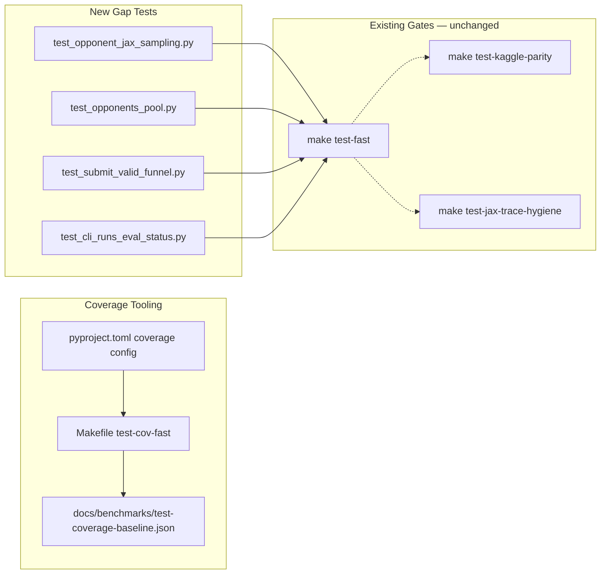

# feat: Comprehensive test coverage infrastructure and gap tests

## Summary

Add pytest-cov instrumentation, Makefile coverage targets, and targeted unit tests for the highest-risk untested modules — without replacing the repo's tiered behavioral gates (parity, trace hygiene, admission) with a global coverage percentage.

## Problem Frame

Orbit Wars has **913** pytest items across tiered Makefile targets but **no line-coverage tooling** (`pytest-cov` / `coverage.py`). Verification today is behavioral: golden encoding, Kaggle parity, trace hygiene, and GPU benchmark gates. Several fast-tier packages remain thin or untested directly:

- `src/opponents/jax_actions/sampling.py` (~621 LOC, admission hot path, zero direct tests)
- `src/opponents/pool.py` (historical pool logic)
- CLI handler error paths beyond parser wiring
- `src/artifacts/submit_valid_funnel.py` and related operator primitives

"Comprehensive" here means **measurable coverage on fast-tier packages plus high-ROI behavior tests** — not 100% repo-wide line coverage.

---

## Requirements

| ID | Requirement |
|----|-------------|
| R1 | Dev dependencies include `pytest-cov` and `coverage[toml]`; `uv sync --group dev` installs them |
| R2 | `[tool.coverage.run]` and `[tool.coverage.report]` in `pyproject.toml` omit non-source paths (`scripts/`, `outputs/`, `tests/`, `__main__` blocks) |
| R3 | `make test-cov-fast` runs fast tier with HTML + terminal summary; `make test-cov-report` writes `coverage.xml` for CI artifacts |
| R4 | Baseline coverage report is captured in `docs/benchmarks/test-coverage-baseline.json` (package-level percentages, no invented thresholds) |
| R5 | New fast-tier tests cover `src/opponents/jax_actions/sampling.py` family dispatch and pool selection branches |
| R6 | New fast-tier tests cover `src/opponents/pool.py` empty pool and snapshot edge cases |
| R7 | New fast-tier tests extend artifact funnel coverage (`src/artifacts/submit_valid_funnel.py`) |
| R8 | New fast-tier tests cover CLI dispatch error paths for `ow runs` and `ow eval status` primitives |
| R9 | All new tests pass `make test-fast`; no slow/JAX-compile smokes added to default tier |
| R10 | `docs/ONBOARDING.md` documents coverage targets and when to run them |

---

## Key Technical Decisions

**KTD1 — Instrument first, gate later.** Add coverage reporting without `fail-under` in CI initially. Thresholds come only after measuring `docs/benchmarks/test-coverage-baseline.json` — never invent round percentages.

**KTD2 — Fast tier as coverage scope.** Coverage Makefile targets use `-m "not slow and not jax and not sweep"` (same as `make test-fast`). JAX/slow modules remain behavior-gated via existing tiers; coverage on them is diagnostic only via optional `make test-cov-premerge`.

**KTD3 — Domain-aligned test placement.** New tests follow conftest auto-marking: opponent tests in `tests/test_opponent_jax_sampling.py` (jax marker via filename), pool/artifact/cli in fast-tier files matching existing patterns (`test_cli_*.py`, `test_artifact_*.py`).

**KTD4 — Mock at boundaries.** Opponent sampling tests use minimal `TurnBatch` / `JaxTrainState` fixtures and mock policy sampling at `src.jax.action_sampling` boundary — not full rollout collect.

**KTD5 — No CI fail-under yet.** Optional coverage artifact upload in a follow-up; this plan adds local/operator tooling only.

---

## High-Level Technical Design

---

## Scope Boundaries

**In scope:** Coverage tooling, baseline capture, opponent sampling/pool tests, submit-valid funnel tests, CLI primitive handler tests, ONBOARDING doc update.

**Out of scope:**
- Global 90%+ line coverage mandate
- CI fail-under gates (deferred until baseline measured)
- GPU benchmark / throughput tests under pytest
- Full `src/jax/train/loop.py` unit coverage (stays slow-tier integration)
- Rewriting all 125 test files for coverage padding

### Deferred to Follow-Up Work

- CI workflow uploading `coverage.xml` on PR
- Package-level `fail-under` thresholds after baseline review
- Replay integration smoke (`maybe_write_jax_checkpoint_replay` → `run_match`, issue #160)
- `src/orchestration/wandb_sweeps.py` handler coverage

---

## Implementation Units

### U1. Coverage tooling and Makefile targets

**Goal:** Install and wire pytest-cov with project-appropriate omit rules and operator Makefile targets.

**Requirements:** R1, R2, R3

**Dependencies:** none

**Files:**
- `pyproject.toml`
- `Makefile`
- `.gitignore` (verify coverage artifacts already ignored)

**Approach:** Add `pytest-cov` and `coverage[toml]` to dev group. Configure `[tool.coverage.run]` source=`src`, omit tests/scripts/outputs. Add `test-cov-fast` (HTML to `htmlcov/`, terminal missing lines) and `test-cov-report` (XML). Document in `make help`.

**Patterns to follow:** Existing Makefile `PYTEST_CPU` / marker filters; `.gitignore` already lists `.coverage`, `htmlcov/`, `coverage.xml`.

**Test scenarios:**
- Happy path: `uv sync --group dev` resolves pytest-cov
- Happy path: `make test-cov-fast` exits 0 and creates `htmlcov/index.html`
- Happy path: `make test-cov-report` writes `coverage.xml`
- Edge case: coverage omits `tests/` and `scripts/` from measured source

**Verification:** `make test-cov-fast` completes; `htmlcov/` generated.

---

### U2. Baseline capture artifact

**Goal:** Record measured fast-tier package coverage for future threshold decisions.

**Requirements:** R4

**Dependencies:** U1

**Files:**
- `docs/benchmarks/test-coverage-baseline.json`
- `docs/benchmarks/README.md` (index entry)

**Approach:** Run `make test-cov-report`, parse `coverage.xml` or use `coverage json` to emit per-package percentages for `src/config`, `src/features`, `src/artifacts`, `src/cli`, `src/opponents`, `src/jax` (top-level). Store commit SHA, date, fast-tier marker filter in metadata. No fail-under values — observation only.

**Test scenarios:**
- Test expectation: none — artifact generation script/one-shot capture, validated by JSON schema sanity (required keys present)

**Verification:** JSON exists with `packages` map and `metadata.tier=fast`.

---

### U3. Opponent JAX sampling unit tests

**Goal:** Direct fast-tier coverage of family dispatch, historical pool branches, and metric helpers in opponent sampling.

**Requirements:** R5, R9

**Dependencies:** U1

**Files:**
- `tests/test_opponent_jax_sampling.py` (create)
- `src/opponents/jax_actions/sampling.py` (read only)

**Execution note:** Add characterization-style tests for pure helpers (`_opponent_count_metrics`, `_select_env_action`, `_gather_action_by_env`) before integration-style family dispatch tests.

**Approach:** Test pure JAX helpers with minimal arrays. For `sample_opponent_actions` (or public entry), use mocked `_sample_policy_action` and tiny `TurnBatch` fixtures. Cover noop/random/scripted family IDs and historical vs latest pool branch via `jax.lax.cond` paths. Mark file for jax tier via conftest `FULL_JAX_FILES` or filename convention.

**Patterns to follow:** `tests/test_jax_scripted_opponents.py`, `tests/test_rollout_noop_opponent.py`; `.cursor/rules/orbit-testing-philosophy.mdc`.

**Test scenarios:**
- Happy path: noop opponent mode produces valid `JaxAction` shapes for batch size 2
- Happy path: random opponent mode returns actions within edge bounds
- Happy path: `_opponent_count_metrics` counts per-family IDs correctly
- Edge case: historical pool index 0 vs empty pool fallback
- Error path: invalid opponent mode raises or validates per `validate_jax_training_opponent_mode`
- Integration: family dispatch selects different builders for noop vs random vs scripted

**Verification:** `make test-jax` includes new file; increases `src/opponents/jax_actions/sampling.py` line coverage measurably.

---

### U4. Opponents pool and artifact funnel tests

**Goal:** Cover thin `pool.py` and submit-valid funnel ordering invariants.

**Requirements:** R6, R7, R9

**Dependencies:** U1

**Files:**
- `tests/test_opponents_pool.py` (create)
- `tests/test_submit_valid_funnel.py` (create or extend if exists)
- `src/opponents/pool.py`
- `src/artifacts/submit_valid_funnel.py`

**Approach:** Pool tests: empty pool, single snapshot, interval selection with mocked checkpoint list. Funnel tests: assert stage order (docker → tournament → promote), disabled stage skips, error propagation at boundary (mock subprocess).

**Patterns to follow:** `tests/test_artifact_pipeline.py`, `tests/test_promotion.py`; mock Docker/tournament at subprocess boundary.

**Test scenarios:**
- Happy path: pool with one snapshot returns that opponent id
- Edge case: empty historical pool returns noop or configured fallback
- Edge case: `pool_size=0` with curriculum off does not raise in pool sampler
- Happy path: submit-valid funnel runs docker before tournament when both enabled
- Error path: docker validation failure prevents tournament enqueue
- Edge case: hybrid promotion disabled skips tournament stage

**Verification:** `make test-domain-artifacts` and `make test-fast` pass.

---

### U5. CLI operator primitive handler tests

**Goal:** Cover `ow runs` and `ow eval status` handler paths beyond parser-only tests.

**Requirements:** R8, R9

**Dependencies:** U1

**Files:**
- `tests/test_cli_runs_eval_status.py` (create)
- `src/cli/runs.py` (or equivalent module)
- `src/cli/eval.py` (status subcommand)

**Approach:** Use `tmp_path` run directories with minimal `manifest.json` / queue fixtures. Test list/show/status with missing run (exit 1 + message), empty queue, and valid run path. Mock heavy imports deferred until command execution.

**Patterns to follow:** `tests/test_cli_train_hosts.py`, `tests/test_agent_context.py`; parser tests in `tests/test_benchmark_cli.py`.

**Test scenarios:**
- Happy path: `ow runs list` with one campaign run prints run id
- Happy path: `ow eval status --run <path>` returns JSON with job counts
- Error path: missing run directory prints actionable error and non-zero exit
- Edge case: run with empty queue reports `active_jobs: 0`

**Verification:** `make test-fast` passes; CLI modules show increased coverage in `make test-cov-fast` report.

---

### U6. Documentation update

**Goal:** Document coverage commands and philosophy for agents and humans.

**Requirements:** R10

**Dependencies:** U1, U2

**Files:**
- `docs/ONBOARDING.md`
- `AGENTS.md` (test tiers bullet, brief)

**Approach:** Add subsection under verification matrix: when to run `make test-cov-fast`, how to read `htmlcov/`, baseline JSON location, explicit note that coverage supplements — not replaces — parity/trace/admission gates.

**Test scenarios:**
- Happy path: `tests/test_docs_navigation.py` links resolve if README hrefs added

**Verification:** Doc links valid; `make test-fast` still passes.

---

## Risks & Dependencies

| Risk | Mitigation |
|------|------------|
| Opponent sampling tests trigger JAX compile cliff | Keep fixtures minimal; use `-m jax and not slow`; reuse `jax_warmup` |
| Coverage targets encourage low-value assertion padding | KTD1: no fail-under; review focuses on behavior scenarios in plan |
| xdist + coverage skew | Coverage targets use serial `PYTEST_CPU` only (no parallel xdist) |
| GPU contention during implementation | Run `make test-fast` / `make test-jax` only; check terminals |

---

## Sources & Research

- Repo scan: 913 tests, no pytest-cov (`pyproject.toml`, `Makefile`)
- Testing philosophy: `.cursor/rules/orbit-testing-philosophy.mdc`
- Institutional learnings: tiered verification over `% coverage` (`docs/solutions/workflow-issues/phase2-pick4-jax-compile-rollback-criteria.md`)
- Gap analysis: `src/opponents/jax_actions/sampling.py` highest ROI
