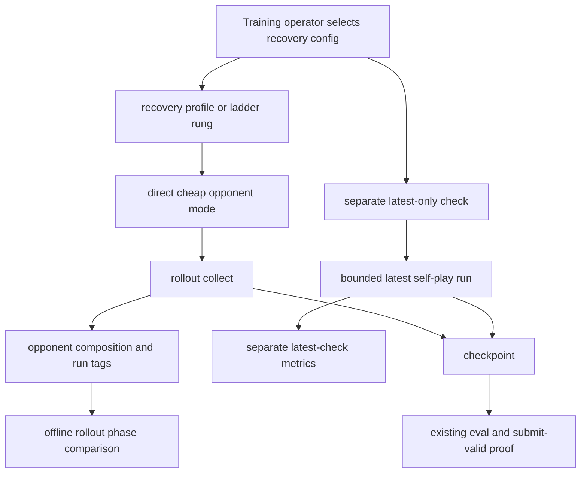

# feat: Add opponent throughput recovery profiles

## Summary

Add a v1 opponent-throughput recovery path for the integration worktree that makes cheap opponents the normal rollout default, removes historical sampling from the recommended hot path, and keeps latest self-play available as an explicit check. The first implementation should chase a measurable rollout-phase share drop through config, telemetry, and operator workflow before attempting a flattened all-seat sampler rewrite.

---

## Problem Frame

The origin requirements frame the current blocker as sampler-side cost, not feature encoding: opponent sampling can consume roughly 70% of rollout time, while opponent encoding is much smaller. Iterating on small sampler fixes has not recovered enough throughput, so v1 should accept weaker rollout opponents if that makes training viable again.

This plan treats evaluation and submit-valid proof as separate from rollout training pressure. Faster cheap-opponent training is allowed to be weak; it must not masquerade as leaderboard readiness without passing the existing evaluation and tournament paths.

---

## Target Worktree Compatibility

This plan is intended to land on the integration worktree. A pre-work compatibility check found these integration-specific facts:

- `conf/curriculum/default.yaml` currently resolves to `curriculum=off`, so the recovery path does not need new random/noop curriculum profiles just to avoid default historical/latest stages.
- `conf/curriculum/scripted_heavy.yaml` and `conf/curriculum/self_play_only_stage.yaml` already exist and are covered by `tests/test_opponent_ladder_compose.py`.
- `scripts/ce_optimize/opponent_ladder_rungs.py` already defines noop, scripted-heavy, self-play, and production-mix rungs; recovery profiles should either plug into that ladder or be documented as separate operator profiles.
- `ow benchmark rollout-phase-profile` can run in-process when invoked inside integration; main-repo delegation is still relevant only when profiling integration from the main harness.
- `tests/test_rollout_phase_profile.py::test_profile_breakdown_includes_opponent_subphase_details` currently fails because `src/jax/rollout/phase_timing_report.py` does not emit the `opponent_details` payload that the test expects. U5 must repair that drift before adding a new comparison helper.

---

## Requirements

**Throughput recovery**

- R1. Provide at least one easy-to-select training profile where normal rollout updates do not sample historical opponents (origin R1, R11).
- R2. Make the recommended recovery profile cheap-majority by default, with no latest or historical neural policy work in normal updates (origin R2, R4).
- R3. Preserve latest self-play as an explicit bounded check or calibration lane, separate from the cheap-majority run (origin R3, R8).
- R4. Keep JAX state validity, legal player actions, and 2p/4p rollout semantics unchanged (origin R5).

**Visibility and proof**

- R5. Expose opponent mode and composition clearly enough that operators can distinguish cheap-opponent progress from latest-self-play checks (origin R7).
- R6. Define the matched rollout-phase profile comparison used to decide whether the first slice improved the bottleneck; a roughly 10 percentage point drop in opponent share is sufficient for v1 (origin R4, SC1).
- R7. Preserve evaluation, tournament, package validation, and submit-valid proof behavior; rollout profile changes must not weaken those flows (origin R6, SC4).

**Migration and future path**

- R8. Resume safely from checkpoints that contain historical-pool state while the recovery profile is active, without sampling historical opponents in normal rollout collection (origin R10, AE4).
- R9. Keep historical and latest sampler code loadable for future optimization; do not make scripted opponents the long-term endpoint (origin R12, SC5).
- R10. Defer all-seat flattened latest/self-play sampling, distilled opponents, and new bracket/ranking systems to follow-up work (origin scope boundaries).

---

## Actors and Key Flows

- A1. Training operator selects a recovery run, reads opponent composition telemetry, and decides whether the throughput improvement is enough to train.
- A2. Coding agent implements the recovery path without preserving historical sampling as a default constraint.
- A3. Learner policy trains mostly against cheap rollout opponents, then faces latest self-play in a bounded check.
- A4. Evaluation and gate tooling continue to decide whether a checkpoint is competitively meaningful.

- F1. Cheap-majority update: a run selects the recovery opponent profile; rollout collection avoids historical and latest policy sampling; telemetry identifies the cheap profile.
- F2. Latest self-play check: an operator runs a bounded latest-only check separately; its result is reported independently from cheap-opponent training progress.
- F3. Honest evaluation: a checkpoint trained with the recovery profile enters the same evaluation, tournament, and package proof paths as any other checkpoint.

---

## Key Technical Decisions

- KTD1. Config/profile-first v1: Start with opponent profiles, ladder wiring, telemetry, docs, and characterization tests because the integration code already supports direct `random` and `noop` opponent modes plus latest-only profiles. This avoids spending the first slice on a risky sampler rewrite before proving that removing neural/historical work moves the phase share.
- KTD2. Direct-mode before mixed cheap diversity: The recommended recovery profile should use one direct cheap mode with `curriculum=off` first. Integration already has `curriculum=scripted_heavy` for cheap mixed diversity, but that path still exercises the family-batched sampler; treat it as a comparison arm, not the fastest default.
- KTD3. Latest check is explicit, not scheduled inside training: Use the existing latest-only path as a separate bounded run/check for v1. Adding an in-training pulse scheduler would add control-flow and attribution complexity before the throughput recovery path is proven.
- KTD4. Historical state remains compatible but inactive: Keep checkpoint payloads and historical-pool restore behavior loadable, but ensure recovery profiles set historical weight to zero and snapshot cadence to zero so restored pool state is not sampled.
- KTD5. Offline phase profiling is the proof surface: Do not enable production `telemetry=rollout_phase_timing` for train runs. Repair the integration `opponent_details` breakdown drift first, then use the existing offline rollout-phase profile and breakdown tooling, following `docs/solutions/developer-experience/offline-rollout-phase-profile-decoupled-from-jit-collect.md`.
- KTD6. Evaluation stays unchanged: No evaluation, tournament, Docker/package validation, or submit-valid configuration should point at the cheap recovery mix as proof of competitive strength.

---

## High-Level Technical Design

The cheap-majority path and latest-check path share the existing rollout and policy code. The separation is in configuration and operator workflow, which keeps attribution clean: cheap runs answer "can we train quickly enough?" while latest checks answer "is the learner still in contact with live policy behavior?"

---

## Implementation Units

### U1. Add direct cheap recovery profiles and ladder wiring

**Goal:** Create easy-to-select recovery profiles that avoid historical and latest policy sampling in normal rollout updates, while fitting the integration ladder surface.

**Requirements:** R1, R2, R4, R9, R10

**Dependencies:** None

**Files:**

- `conf/opponents/throughput_recovery.yaml`
- `conf/opponents/throughput_recovery_floor.yaml`
- `scripts/ce_optimize/opponent_ladder_rungs.py`
- `tests/test_config_consolidation.py`
- `tests/test_opponent_ladder_compose.py`
- `tests/test_curriculum.py`

**Approach:** Add a recommended `opponents=throughput_recovery` profile that defaults to direct `mode.opponent: random`, `self_play.enabled: false`, historical weight `0.0`, latest weight `0.0`, random weight `1.0`, and snapshot pool/interval `0`. Pair it explicitly with `curriculum=off`; integration's current default curriculum is already off, but the operator recipe should stay explicit so future default changes cannot reintroduce historical/latest stages.

Add a separate `opponents=throughput_recovery_floor` profile that uses direct `mode.opponent: noop` with noop weight `1.0` as a diagnostic lower-bound, not the main training recommendation. Update the existing opponent ladder definitions so direct recovery, noop floor, existing scripted-heavy, latest/self-play, and production-mix rungs remain easy to compare.

Keep these as new profiles rather than modifying `random_only.yaml` or `noop_only.yaml`, because existing tests and workflows may rely on those profiles retaining their current `mode.opponent: self` behavior.

**Execution note:** Start with config composition tests before changing rollout code. The desired v1 is a profile-level recovery path unless those tests reveal an existing validation issue.

**Patterns to follow:**

- `conf/opponents/random_only.yaml`
- `conf/opponents/noop_only.yaml`
- `conf/opponents/latest_only.yaml`
- `conf/curriculum/off.yaml`
- `conf/curriculum/scripted_heavy.yaml`
- `conf/curriculum/self_play_only_stage.yaml`
- `scripts/ce_optimize/opponent_ladder_rungs.py`
- `src/config/runtime.py`
- `src/opponents/constants.py`

**Test scenarios:**

- Compose `opponents=throughput_recovery curriculum=off` and assert `self_play.enabled` is false, snapshot pool and interval are zero, historical and latest weights are zero, random weight is one, and `mode.opponent` resolves to `random`.
- Compose `opponents=throughput_recovery_floor curriculum=off` and assert the same historical/latest/snapshot invariants, with noop weight one and normalized `mode.opponent` equal to `noop`.
- Verify both profiles pass current opponent runtime validation with `curriculum=off`.
- Verify the opponent ladder exposes direct recovery, noop floor, existing scripted-heavy, latest/self-play, and production-mix rungs without reintroducing historical weight into cheap rungs.
- Verify a cheap recovery stage view or default-stage view reports only the configured cheap opponent slots when `opponent_composition` metrics are enabled.

**Verification:** The recovery profiles resolve without Hydra/runtime validation errors, never require historical snapshot setup, and identify only cheap opponent families in composition metrics.

### U2. Add recovery and latest-check telemetry visibility

**Goal:** Make cheap-majority progress and latest-only checks distinguishable in metrics, logs, and W&B tags.

**Requirements:** R3, R5, R7

**Dependencies:** U1

**Files:**

- `conf/telemetry/opponent_recovery.yaml`
- `conf/README.md`
- `tests/test_config_consolidation.py`
- `tests/test_train_telemetry.py`

**Approach:** Add a telemetry profile that enables `metric_groups.opponent_composition`, keeps core timing/progress metrics on, and tags runs with a recovery label. Document that recovery runs should pair `opponents=throughput_recovery curriculum=off` with this telemetry profile, while latest checks can use `opponents=latest_only curriculum=off` or the existing self-play ladder rung with an explicitly documented check tag override.

Do not overload evaluation metrics with cheap-opponent semantics. The visibility target is attribution, not a new proof gate.

**Patterns to follow:**

- `conf/telemetry/throughput_only.yaml`
- `conf/telemetry/base.yaml`
- `src/jax/rollout/collect.py`
- `tests/test_config_consolidation.py`

**Test scenarios:**

- Compose `telemetry=opponent_recovery` and assert `metric_groups.opponent_composition` remains true with timing/core progress still enabled.
- Compose a recovery run with telemetry enabled and assert generated W&B tags or config-group tags contain an opponent recovery signal and do not imply production-mix self-play.
- Verify telemetry filtering keeps opponent composition fields when the metric group is enabled.

**Verification:** A reader of the resolved config or update records can tell whether the run used the cheap recovery profile or the latest-only check path.

### U3. Characterize historical-pool resume safety under recovery mode

**Goal:** Ensure historical checkpoint state can be loaded or ignored safely when the recovery profile is active.

**Requirements:** R1, R4, R8, R9

**Dependencies:** U1

**Files:**

- `src/jax/train/checkpoint.py`
- `src/jax/train/snapshots.py`
- `src/jax/train/loop.py`
- `tests/test_curriculum.py`
- `tests/test_checkpoint_compat.py`

**Approach:** Add characterization coverage for resuming from a checkpoint payload that contains historical-pool state while the active config has snapshot pool and interval set to zero. The expected behavior is that the run may restore the payload for compatibility, but recovery stage views and opponent weights never sample historical slots.

Only change restore code if the characterization test reveals a shape, validation, or serialization issue. If a code change is needed, prefer an explicit "inactive pool is compatible but not sampled" guard over deleting historical-pool payload handling.

**Patterns to follow:**

- `restore_historical_snapshot_pool` in `src/jax/train/checkpoint.py`
- `init_historical_snapshot_pool` and `snapshot_due` in `src/jax/train/snapshots.py`
- Historical round-trip tests in `tests/test_curriculum.py`

**Test scenarios:**

- Build a checkpoint payload with a valid historical snapshot pool, resume with a recovery config, and assert the restore does not fail.
- Assert `snapshot_due` remains false under `curriculum=off` and zero snapshot interval.
- Assert recovery opponent metrics report zero historical slots even when restored historical-pool state exists.
- Assert checkpoint serialization still includes or tolerates historical-pool payloads for existing self-play/curriculum tests.

**Verification:** Recovery-mode resume is compatible with historical-pool checkpoints and does not reintroduce historical sampling into normal rollout collection.

### U4. Document the operator workflow and matched profile comparison

**Goal:** Give operators and agents a clear recipe for using the recovery mode, running latest checks, and proving the phase-share improvement without poisoning production train timing.

**Requirements:** R3, R5, R6, R7, R10

**Dependencies:** U1, U2

**Files:**

- `docs/tools/opponent-throughput-recovery.md`
- `docs/solutions/developer-experience/offline-rollout-phase-profile-decoupled-from-jit-collect.md`
- `conf/README.md`
- `docs/README.md`

**Approach:** Add a short operator doc that defines three concepts: recommended recovery run, latest-only check, and phase-share proof. The doc should point to existing offline rollout-phase profile tooling and make clear that production `ow train` should not enable rollout-phase timing telemetry.

The matched comparison should use the same task, model, format geometry, rollout steps, warmup window, and measured update window for baseline and candidate. When the command is run inside integration, it can profile in-process; when run from the main harness, it should delegate to integration via the existing `--repo-root` path. The proof target is opponent phase fraction, not learning quality.

**Patterns to follow:**

- `docs/solutions/developer-experience/offline-rollout-phase-profile-decoupled-from-jit-collect.md`
- `docs/benchmarks/README.md`
- `conf/README.md`

**Test scenarios:**

- Test expectation: none - this unit is documentation and operator guidance. Behavioral proof is covered by U1 through U3 and U5.

**Verification:** The docs identify the recommended recovery profile, latest-check path, and matched phase comparison criteria in a way an operator can follow without changing evaluation gates.

### U5. Add a lightweight phase-share regression assertion helper

**Goal:** Make the "70% to 60% is enough" success criterion easy to check from rollout-phase breakdown payloads.

**Requirements:** R6, R7

**Dependencies:** U4

**Files:**

- `src/jax/rollout/phase_timing_report.py`
- `src/cli/benchmark/rollout_phase_breakdown.py`
- `src/cli/benchmark/parser.py`
- `tests/test_rollout_phase_profile.py`
- `tests/test_rollout_phase_breakdown.py`
- `tests/test_benchmark_cli.py`

**Approach:** First repair the integration phase-breakdown contract so records containing `rollout_phase_opponent_sample_*` and `rollout_phase_opponent_encode_*` produce an `opponent_details` payload. Then extend the existing rollout-phase breakdown surface with an optional comparison mode or assertion helper that accepts a baseline opponent fraction and a minimum percentage-point drop. Keep it diagnostic-only; it should not become an admission or learning gate.

If implementation reveals that adding CLI flags is too much for v1, keep the helper internal to `phase_timing_report.py` and document how to read the JSON fields manually. The load-bearing requirement is that the comparison is easy and unambiguous, not that it becomes a new command.

**Patterns to follow:**

- `extract_rollout_phase_breakdown_from_input` in `src/jax/rollout/phase_timing_report.py`
- `run_rollout_phase_breakdown_cli` in `src/cli/benchmark/rollout_phase_breakdown.py`
- Existing parser wiring for `rollout-phase-breakdown` in `src/cli/benchmark/parser.py`

**Test scenarios:**

- Given records with `rollout_phase_opponent_sample_fraction` and `rollout_phase_opponent_encode_fraction`, assert the breakdown payload includes `opponent_details` for both subphases.
- Given a baseline payload with opponent fraction `0.70` and candidate payload with `0.60`, assert the helper reports a 10 percentage point drop and passes a 10 point threshold.
- Given a candidate payload with `0.65`, assert the helper fails a 10 point threshold and reports the actual drop.
- Verify the existing single-input rollout-phase breakdown output remains unchanged when comparison flags are absent.
- Verify CLI help or parser coverage includes the new diagnostic comparison option if the CLI surface is added.

**Verification:** Operators can determine whether the recovery profile materially reduces opponent share without hand-computing phase deltas or enabling production train phase timing.

---

## Acceptance Examples

- AE1. Baseline phase profile shows opponent sampling around 70%; recovery profile on matched geometry reports a material drop, with around 60% accepted as a first win.
- AE2. Normal updates use cheap opponents, and a latest-only check reports separately so operators can see whether stronger live-policy behavior is still handled.
- AE3. A checkpoint trained with the recovery profile still uses the existing evaluation and tournament proof standards.
- AE4. A resumed run with historical-pool checkpoint state can use the recovery profile without sampling historical opponents in normal rollout collection.

---

## Scope Boundaries

**In scope:**

- New direct cheap recovery opponent profiles and integration ladder wiring.
- Telemetry and docs that distinguish cheap-majority runs from latest checks.
- Characterization coverage for historical-pool resume compatibility.
- Offline rollout-phase comparison as the v1 speed proof.

**Deferred for later:**

- Flattening all opponents into player-slot space for uniform latest/self-play sampling.
- Per-family rollout lanes or environment sub-batching by opponent family.
- Distilled/self-play approximation opponents.
- New ranking, bracket, or long-term opponent pool systems.

**Out of scope:**

- Weakening evaluation, tournament, Docker/package validation, or submit-valid proof.
- Changing the production train path to use host-timed rollout phase telemetry.
- Declaring scripted, random, or noop opponents sufficient as the final competitive training strategy.

---

## Risks and Dependencies

- **Recovery may be too weak for learning:** Direct random or noop opponents may restore throughput but under-train competitive behavior. Mitigation: keep latest-only checks separate and preserve evaluation gates as the source of truth.
- **Random mode may not drop enough share:** Shielded random actions still use action-building and shield work. Mitigation: include the noop floor profile to bound how much cost is removable without neural opponents, then decide whether sampler surgery is worth it.
- **Existing profile names are misleading:** `random_only` and `noop_only` currently inherit `mode.opponent: self`, so they are not the direct-mode recovery path. Mitigation: add new profiles rather than silently changing existing ones.
- **Existing ladder surface can drift:** Integration already has opponent ladder rungs used by tests and optimization scripts. Mitigation: wire recovery profiles into that surface or document why they are separate, instead of leaving parallel operator recipes.
- **Phase breakdown drift blocks proof:** Integration currently has a failing subphase-details test. Mitigation: repair `opponent_details` before adding new phase-share comparison behavior.
- **Historical restore shape drift:** Checkpoints with old historical-pool payloads may restore shapes that differ from recovery config capacity. Mitigation: characterize resume behavior before changing restore logic.
- **Phase profiles are diagnostic, not gates:** Quick profiles can show fractions but not admission throughput. Mitigation: document matched-geometry requirements and keep learning/admission proof separate.

---

## Sources and Research

- Origin requirements: `docs/brainstorms/2026-06-07-opponent-throughput-recovery-requirements.md`
- Opponent sampler: `src/opponents/jax_actions/sampling.py`
- Opponent family IDs and direct modes: `src/opponents/constants.py`, `src/opponents/pool.py`
- Rollout collection and opponent metrics: `src/jax/rollout/collect.py`
- Historical snapshot lifecycle: `src/jax/train/snapshots.py`, `src/jax/train/checkpoint.py`, `src/jax/train/loop.py`
- Config validation and profiles: `src/config/runtime.py`, `conf/opponents/*.yaml`, `conf/curriculum/*.yaml`, `conf/telemetry/*.yaml`
- Integration ladder surface: `scripts/ce_optimize/opponent_ladder_rungs.py`, `tests/test_opponent_ladder_compose.py`
- Phase profiling guidance: `docs/solutions/developer-experience/offline-rollout-phase-profile-decoupled-from-jit-collect.md`
- Related tests: `tests/test_config_consolidation.py`, `tests/test_curriculum.py`, `tests/test_jax_scripted_opponents.py`, `tests/test_rollout_phase_breakdown.py`, `tests/test_rollout_phase_profile.py`
