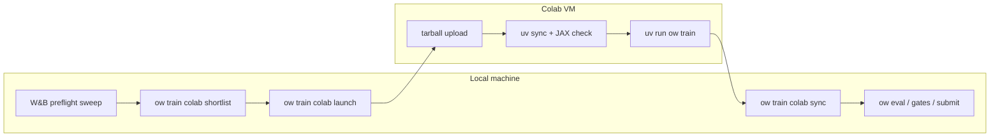

# feat: Colab train host for preflight → long-run workflow

## Summary

Add `ow train colab` as a third train host alongside `local` and `kaggle`, reusing the existing remote-worker packaging and W&B shortlist plumbing. Operators run preflight W&B sweeps locally, shortlist a promising config, then launch a long training run on Colab GPU compute with one command — without the Kaggle script-kernel embedded-payload constraint that blocked the earlier remote-training attempt.

---

## Problem Frame

Orbit Wars already supports:

- **Local preflight sweeps** via `ow sweep create --backend wandb` and `conf/wandb_sweep/fixed/preflight.yaml`
- **Remote training MVP** via `ow train kaggle` (package → push kernel → poll → sync)

The Kaggle path was set aside because:

1. Kaggle script kernels execute only `script.py`; the repo must be embedded as base64 inside that single file (`embedded-payload-v6` in `src/orchestration/kernel_package.py`).
2. JAX/CUDA bootstrap on Kaggle is brittle (`src/orchestration/kaggle_jax.py`, ~800 LOC of image-specific driver discovery).
3. Default hardware is P100; long JAX compiles are slow.
4. W&B-on-Kaggle is deprecated; standalone mode only; post-hoc W&B sync is still future work (`docs/kaggle_runner.md`).

[google-colab-cli](https://github.com/googlecolab/google-colab-cli) (June 2026) provides terminal-driven Colab VM lifecycle (`colab new`, `colab exec`, `colab upload/download`, `colab stop`). Colab accepts a tarball + separate bootstrap script — no single-file embedding hack — and offers T4/L4/A100 GPUs with session keep-alive.

**Goal:** Wire Colab into the existing `ow train` host router so the operator workflow is:

1. Local W&B preflight sweep (unchanged)
2. `ow train colab shortlist` → pick winner
3. `ow train colab launch` → long run on Colab GPU
4. `ow train colab sync` → pull checkpoints/logs for local eval/gates/submit

This plan does **not** replace Kaggle runner or move preflight sweeps to Colab.

---

## Requirements

**Operator workflow**

- R1. `ow train colab` is discoverable from `ow train --help`, `print_train_help()`, and `docs/AGENT_CAPABILITIES.md`.
- R2. Preflight sweeps remain **local W&B only**; Colab is for long runs after shortlist selection.
- R3. `ow train colab shortlist` reuses `src/orchestration/wandb_sweeps.shortlist_from_api` (same ranking as `ow train kaggle shortlist`).
- R4. `ow train colab launch` accepts Hydra overrides on the CLI (same token rules as `ow train kaggle`) and optional `--from-shortlist` to apply a ranked row's overrides.
- R5. `ow train colab sync` downloads `outputs/campaigns/<campaign>/` (checkpoints + `logs/*_jax.jsonl`) from the remote VM to `outputs/colab_runner/synced/`.
- R6. All subcommands emit JSON on stdout for agent loops; human progress on stderr (match `ow benchmark gate run` convention).

**Remote execution**

- R7. Remote worker runs `uv sync --group dev` (or documented Colab-equivalent) then `uv run ow train …` — not raw `python -m src.train` without package install.
- R8. Remote worker verifies JAX sees a GPU before training; fail fast with structured `worker-summary.json` on bootstrap failure.
- R9. Repo payload includes `src/`, `conf/`, `pyproject.toml`, `uv.lock`, and `data/jax_map_pool/` when present (map-pool long runs).
- R10. Long runs use `--timeout` ≥ JAX cold-compile budget (default 86400s for launch; document override for compile smokes).

**Safety and scope**

- R11. Do not weaken local verification gates; Colab output is training compute only — eval/gates/submit stay local.
- R12. `artifacts=default` or explicit SSOT long-train profile for v1; defer hybrid promotion / async artifact pipeline on Colab.
- R13. Ledger at `outputs/colab_runner/launches.jsonl` records session id, git commit, overrides, exit code, sync paths.

---

## Actors and Key Flows

- A1. **Training operator** runs local preflight sweep, shortlists, launches Colab long run, syncs checkpoints.
- A2. **Coding agent** uses primitive `ow train colab` subcommands; composes with `ow runs show`, `ow eval package`, gates.



**F1 — Preflight → shortlist:** Operator finishes `wandb agent` on `conf/wandb_sweep/fixed/preflight.yaml`; runs `ow train colab shortlist --sweep-id <id>`; inspects JSON top rows (preflight_sweep_score, win-rate delta, approx_kl).

**F2 — Long launch:** Operator runs `ow train colab launch --gpu T4 training.total_updates=2000 …` or `--from-shortlist outputs/colab_runner/shortlist.json --rank 0`; CLI provisions session, uploads payload, execs bootstrap, streams stderr.

**F3 — Sync and resume locally:** `ow train colab sync --session <id>` pulls campaign tree; operator runs `ow eval package`, gates, or `ow train` resume from synced checkpoint path.

---

## Key Technical Decisions

- **KTD1 — Mirror Kaggle host shape, not Kaggle packaging.** Extend `HOSTS` in `src/cli/train_hosts.py` with `colab`; add `src/cli/colab_runner.py` + `src/orchestration/colab_runner.py`. Subcommands: `preflight`, `prepare`, `launch`, `status`, `sync`, `shortlist`, `stop`. Do not fork a parallel CLI tree.

- **KTD2 — Tarball transport, not embedded single-file bootstrap.** Reuse tarball creation from `src/orchestration/kernel_package.py` (`_copy_repo_payload`, `_payload_archive`) but upload `orbit_wars.tgz` via `colab upload` and run a small `scripts/colab_worker_entry.py` on the VM. Colab does not require the Kaggle `embedded-payload-v6` base64-in-script pattern.

- **KTD3 — Extract shared remote worker bootstrap.** Factor common logic from `scripts/kaggle_worker_entry.py` into `src/orchestration/remote_worker.py` (uv install, env load, Hydra override merge, `worker-summary.json`, training subprocess). Kaggle worker becomes a thin host-specific wrapper; Colab worker calls the same core. Minimize diff to existing Kaggle path in v1 — extraction can be incremental if risk is high.

- **KTD4 — Colab CLI as subprocess, not Python dependency.** Detect `colab` on PATH (`uv tool install google-colab-cli` documented in operator docs). Wrap with timeouts and structured error capture. Do not add `google-colab-cli` to project `pyproject.toml` runtime deps.

- **KTD5 — JAX bootstrap: Colab-first, Kaggle reuse second.** Start with Colab base-image JAX (trust preinstalled CUDA JAX where possible, similar to `ORBIT_WARS_KAGGLE_TRUST_BASE_JAX`). Add `src/orchestration/colab_jax.py` only if smoke proves base JAX insufficient; do not port all of `kaggle_jax.py` upfront.

- **KTD6 — Session naming and ledger.** Default session slug `ow-<campaign>-<short_sha>` derived from `output.campaign` override or `colab_long`. Persist session id in `outputs/colab_runner/sessions.json` for `status`/`sync`/`stop` without re-parsing Colab CLI output.

- **KTD7 — W&B telemetry from Colab.** Long runs should pass through `telemetry.wandb.enabled=true` when operator sets it (shortlist winner may inherit from preflight YAML). W&B API key: document `colab secrets` or env injection via `worker-env.json`; do not block v1 on Colab Secrets API if env-file upload is sufficient.

- **KTD8 — Land on integration worktree first.** Follow four-worktree discipline; do not merge to main until smoke + one 100-update long-run proof on operator machine.

---

## High-Level Technical Design

### CLI routing

```
ow train [local|kaggle|colab] [SUBCMD] [FLAGS] [HYDRA_OVERRIDES...]
ow train --host colab ...
```

`parse_train_argv` in `src/cli/train_hosts.py` gains `colab` branch parallel to `kaggle` (`COLAB_SUBCOMMANDS`, `_split_colab_remaining`, `_build_colab_argv`).

### Orchestration layout

| Module | Role |
|--------|------|
| `src/cli/colab_runner.py` | Argparse + `run(argv)` entry |
| `src/orchestration/colab_runner.py` | `preflight`, `prepare`, `launch`, `status`, `sync`, `shortlist`, `stop` |
| `src/orchestration/colab_cli.py` | Thin wrapper: `colab new/exec/upload/download/stop/status` subprocess helpers |
| `src/orchestration/remote_package.py` | Shared tarball render (extracted from `kernel_package` payload copy rules) |
| `src/orchestration/remote_worker.py` | Shared bootstrap + train subprocess (extracted from `kaggle_worker_entry`) |
| `scripts/colab_worker_entry.py` | VM entry: unpack, load `worker-env.json`, call `remote_worker` |

### Package contents (remote tarball)

Include (mirror Kaggle payload rules + map pool):

- `src/`, `conf/`, `scripts/colab_worker_entry.py`, `pyproject.toml`, `uv.lock`, `README.md`
- `data/jax_map_pool/default_v1.npz` when file exists (warn if `task=map_pool` and missing)
- Exclude: `outputs/`, `.git/`, `.venv/`, `__pycache__`, `.pytest_cache`

### Remote worker env (`worker-env.json`)

| Key | Purpose |
|-----|---------|
| `HYDRA_OVERRIDES` | List of override strings for `ow train` |
| `ORBIT_WARS_COLAB_WORKER_MODE` | `standalone` (v1 only) |
| `WANDB_API_KEY` | Optional; for remote W&B logging |
| `ORBIT_WARS_COLAB_TRUST_BASE_JAX` | Default `1`; skip pip JAX reinstall when base image works |

### Operator commands (target UX)

```bash
# Install Colab CLI (once per machine)
uv tool install google-colab-cli
colab auth   # or gcloud ADC per Colab docs

# Preflight checks
uv run ow train colab preflight

# Inspect package without launching
uv run ow train colab prepare --gpu T4 training.total_updates=10

# Shortlist after local W&B sweep
uv run ow train colab shortlist --sweep-id <id> --out outputs/colab_runner/shortlist.json

# Long run (overrides explicit)
uv run ow train colab launch --gpu T4 --timeout 86400 \
  training.total_updates=2000 \
  opponents=throughput_recovery \
  output.campaign=colab_long \
  telemetry.wandb.enabled=true

# Long run (from shortlist row 0, with extra overrides)
uv run ow train colab launch --from-shortlist outputs/colab_runner/shortlist.json --rank 0 \
  --gpu T4 training.total_updates=2000 task=map_pool

# Poll + pull artifacts
uv run ow train colab status --session ow-colab_long-abc1234
uv run ow train colab sync --session ow-colab_long-abc1234
uv run ow train colab stop --session ow-colab_long-abc1234
```

---

## Scope Boundaries

**In scope (v1)**

- U1–U6 implementation units below
- `docs/colab_runner.md` operator doc
- `docs/AGENT_CAPABILITIES.md` capability row
- Fast CLI tests (`tests/test_cli_train_hosts.py`, `tests/test_colab_runner.py`)

**Deferred (v2+)**

- Colab-side W&B sweep agents (`wandb agent` on VM)
- Periodic background sync / checkpoint watch daemon
- `artifacts=hybrid_promotion` / async eval queue on Colab
- Replacing or removing Kaggle runner
- `ow sweep create --backend colab`
- Auto-promotion from Colab run to `promoted/current_best`

**Out of scope**

- Tournament eval on Colab (stay local / `kaggle_environments`)
- Docker packaging validation on Colab
- CI execution of Colab smokes (operator-machine proof only)

---

## Implementation Units

### U0 — Prerequisites and spike (operator, pre-code)

**Goal:** Validate Colab CLI auth + GPU + `uv sync` on a manual tarball before wiring `ow`.

**Steps:**

1. `uv tool install google-colab-cli`; `colab auth`
2. Manual tarball from repo root (exclude `outputs/`, `.git/`, `.venv/`)
3. `colab new -s ow-spike --gpu T4`; upload; `uv sync --group dev`; `uv run ow train training.total_updates=3 curriculum=off`
4. Record: JAX version, compile time, whether base-image JAX works without pip reinstall

**Exit:** Spike notes in plan PR description or `docs/colab_runner.md` § Prerequisites.

---

## U0 spike results

**Date/time:** 2026-06-07 19:08–19:13 local (2026-06-08T00:08–00:13Z)  
**Worktree:** `orbit_wars-integration`  
**Session:** `ow-spike-u0` (stopped after spike)

| Item | Result |
|------|--------|
| Colab CLI version | 0.5.9 (`colab version`) |
| Auth method | OAuth2 (default `--auth oauth2`; cached credentials at `~/.colab-cli-oauth-config.json`) |
| Auth blockers | None — `colab sessions` emitted a WSL `Parameter format not correct` warning once, then succeeded |
| GPU provisioned | T4 (`colab status`: `Hardware: T4 \| Variant: GPU`) |
| Tarball path / size | `/tmp/orbit_wars_colab_spike.tgz` — **2.9 MB** (includes `data/jax_map_pool/default_v1.npz` 2.4 MB) |
| Upload method | `colab upload` → `/content/orbit_wars.tgz` in ~4 s; adequate for v1-sized payloads |
| uv on VM | Preinstalled at `/usr/local/bin/uv` (pip install not required) |
| `uv sync --group dev` | **PASS** — 52 s wall; fresh `.venv`; ~2 GB CUDA/JAX wheel downloads |
| JAX version | **0.10.0** (project pin via `uv sync`, not base-image-only) |
| `jax.devices()` | `[CudaDevice(id=0)]`, `default_backend=gpu` |
| Base-image JAX without reinstall (`ORBIT_WARS_COLAB_TRUST_BASE_JAX`) | **Not directly tested** — spike used full `uv sync`, which installs pinned `jax==0.10.0` + CUDA wheels. GPU path works after sync; defer isolated base-JAX-only probe to U3/`colab_jax.py` if needed |
| Smoke train command | `uv run ow train training.total_updates=3 curriculum=off task=shield_cheap opponents=base opponents.mode.opponent=noop output.campaign=colab_u0_smoke telemetry.wandb.enabled=false` |
| Smoke exit code | **0** |
| Total bootstrap wall | **255 s** (~4.3 min): untar 0.05 s, uv sync 52 s, JAX check 4 s, train 199 s |
| Compile / first-update estimate | Update 1: `rollout_s=68.355`, `ppo_s=27.863`, `sps=85.1` (includes cold JAX compile) |
| Steady-state rollout | Update 3: `rollout_s=1.491`, `ppo_s=0.411`, `sps=4307.3` |
| Non-fatal stderr | `fatal: not a git repository` (tarball excludes `.git`; manifest metadata only) |
| W&B | **Disabled** for smoke (`telemetry.wandb.enabled=false`); not validated in U0 |
| Local GPU contention | `wandb agent` preflight sweep active in another terminal — Colab uses remote T4; no local GPU conflict |

### Open questions (U0 answers)

1. **Base JAX sufficient without pip reinstall?** Inconclusive for trust-base-JAX shortcut — full `uv sync` path works on T4 with project pins. Recommend default `ORBIT_WARS_COLAB_TRUST_BASE_JAX=0` (sync project JAX) until a base-only micro-smoke is run.
2. **Upload adequate for 50–200 MB tarballs?** Yes at 2.9 MB; scale untested but CLI upload is viable for v1 code-only payloads. Map-pool-inclusive archives likely fine; very large pools may need Drive mount (v2).
3. **W&B via `worker-env.json`?** Unanswered — defer to U6 with `telemetry.wandb.enabled=true` + injected `WANDB_API_KEY`.
4. **Persistent session vs one-shot `colab run`?** Persistent session + `colab exec --timeout 7200` worked; keep manual `stop` for long runs (plan default).

### Plan amendments from spike

- Document that `colab exec -f` reads a **local** file path (CLI uploads code to VM); remote paths fail.
- Default launch/exec timeout must exceed first-update compile (~70–100 s for 3-update noop smoke; budget ≥7200 s for long runs).
- Tarball should optionally include `.git` HEAD metadata file or worker should tolerate missing git (stderr only today).
- `uv` is preinstalled on Colab GPU runtime — worker bootstrap can skip pip-install-uv when `which uv` succeeds.

### Recommendation

**Proceed to U1 — yes.** Spike validated auth, T4 provisioning, tarball upload, `uv sync`, GPU JAX, and 3-update `ow train` smoke end-to-end. Follow-ups for U3/U6: W&B key injection test, base-JAX-only shortcut probe, larger tarball upload timing.

---

### U1 — Shared remote package + worker extraction

**Files:**

- `src/orchestration/remote_package.py` (new; extract from `kernel_package.py`)
- `src/orchestration/remote_worker.py` (new; extract from `kaggle_worker_entry.py`)
- `scripts/colab_worker_entry.py` (new)
- `src/orchestration/kernel_package.py` (refactor to call `remote_package` — keep Kaggle behavior identical)
- `scripts/kaggle_worker_entry.py` (thin wrapper over `remote_worker` if low-risk; else defer refactor to U1b)
- `tests/test_remote_package.py` (new)

**Test scenarios:**

- Tarball contains `src/`, `conf/`, `pyproject.toml`; excludes `outputs/`
- Map pool file included when present; warning when `task=map_pool` requested and file absent
- `worker-env.json` round-trip with Hydra overrides list
- Kaggle `prepare` output unchanged (regression: `tests/test_kaggle_runner.py` package tests)

**Verification:**

```bash
uv run pytest tests/test_remote_package.py tests/test_kaggle_runner.py -q -k "not slow"
```

---

### U2 — Colab CLI subprocess wrapper

**Files:**

- `src/orchestration/colab_cli.py` (new)
- `tests/test_colab_cli.py` (new; mock subprocess)

**Test scenarios:**

- Missing `colab` binary → structured error with install hint
- `new/exec/upload/download/stop/status` argv assembly
- Timeout propagation to `exec`
- JSON parse of session list when available

**Verification:**

```bash
uv run pytest tests/test_colab_cli.py -q
```

---

### U3 — Colab orchestration (preflight, prepare, launch)

**Files:**

- `src/orchestration/colab_runner.py` (new)
- `src/orchestration/colab_jax.py` (new only if U0 spike requires it)
- `outputs/colab_runner/` (gitignored; created at runtime)

**Test scenarios:**

- `preflight`: colab found, auth check (mocked), GPU type valid
- `prepare`: renders tarball + `worker-env.json` + `package-summary.json` under `outputs/colab_runner/kernel/`
- `launch` dry-run: JSON lists session slug, tarball path, overrides, no subprocess
- `launch` records ledger line on completion (mocked colab)
- Hydra override validation via `validate_hydra_overrides` before packaging

**Verification:**

```bash
uv run pytest tests/test_colab_runner.py -q
uv run ow train colab preflight   # on operator machine with colab CLI
uv run ow train colab prepare --gpu T4 training.total_updates=10
```

---

### U4 — Shortlist, status, sync, stop

**Files:**

- `src/orchestration/colab_runner.py` (extend)
- Reuse `wandb_sweeps.shortlist_from_api`, `kaggle_runner._shortlist_payload` (move payload helper to `remote_worker` or `wandb_sweeps` if shared)

**Test scenarios:**

- `shortlist` writes JSON to `outputs/colab_runner/shortlist.json`
- `--from-shortlist --rank N` merges overrides into launch request
- `sync` maps remote `/content/orbit_wars/outputs/campaigns/<campaign>/` to local synced dir
- `stop` idempotent when session already stopped
- `status` returns session state + last ledger event

**Verification:**

```bash
uv run pytest tests/test_colab_runner.py -q -k "shortlist or sync or status"
```

---

### U5 — CLI integration + docs

**Files:**

- `src/cli/colab_runner.py` (new)
- `src/cli/train_hosts.py` (extend `HOSTS`, help strings, parse/dispatch)
- `src/cli/__init__.py` (no change if train_hosts dispatch covers it)
- `docs/colab_runner.md` (new)
- `docs/AGENT_CAPABILITIES.md` (add row)
- `tests/test_cli_train_hosts.py` (extend)
- `tests/test_agent_capability_map.py` (extend if capability map test exists)

**Test scenarios:**

- `ow train colab --help` mentions subcommands
- `ow train --help` lists colab host
- Unknown colab flag → exit 1 with message
- Hydra overrides after colab flags parsed correctly

**Verification:**

```bash
uv run pytest tests/test_cli_train_hosts.py tests/test_agent_capability_map.py -q
make test-fast
```

---

### U6 — Operator proof (GPU, integration worktree)

**Goal:** End-to-end proof on operator WSL2 machine with Colab CLI authenticated.

**Proof script:**

```bash
# 1. Short smoke (10 updates)
uv run ow train colab launch --gpu T4 --timeout 7200 \
  training.total_updates=10 curriculum=off output.campaign=colab_smoke \
  task=shield_cheap opponents=base opponents.mode.opponent=noop

uv run ow train colab sync --session <slug>
test -f outputs/colab_runner/synced/colab_smoke/runs/*/logs/*_jax.jsonl

# 2. Long-run shaped like post-preflight winner (100+ updates; operator choice)
uv run ow train colab launch --from-shortlist outputs/colab_runner/shortlist.json --rank 0 \
  --gpu T4 --timeout 86400 training.total_updates=100
```

**Exit criteria:**

- `worker-summary.json` exit code 0 on VM
- Synced `jax_ckpt_*.pkl` present
- W&B run visible when `telemetry.wandb.enabled=true`
- Document wall time and GPU type in `docs/colab_runner.md` § Proof runs

---

## Dependencies and Sequencing

```
U0 (spike) → U1 → U2 → U3 → U4 → U5 → U6
                ↘ U4 can start after U3 launch path stubs exist
```

- **U0** de-risks JAX bootstrap before code investment.
- **U1** must not break Kaggle package tests.
- **U5** follows U3/U4 so help strings match implemented subcommands.
- **U6** requires live Colab auth; not CI-gated.

---

## Risks and Mitigations

| Risk | Mitigation |
|------|------------|
| Colab CLI auth fragility (OAuth scope, ADC 403) | `preflight` subcommand with explicit check list; document `colab auth` + scope requirements |
| Default `exec` timeout too low for JAX compile | Launch default `--timeout 86400`; stderr heartbeat from worker |
| Base-image JAX mismatch with project pins | U0 spike; `colab_jax.py` fallback; env `ORBIT_WARS_COLAB_TRUST_BASE_JAX=0` |
| Large map-pool tarball upload slow | Optional `--exclude-map-pool` for non-map-pool runs; document Drive mount path as v2 |
| Session teardown loses unsynced checkpoints | Ledger warns on `stop` without prior `sync`; `launch` prints remote output path |
| Refactoring `kaggle_worker_entry` breaks Kaggle | Keep Kaggle tests green each commit; defer extraction if regression risk spikes |
| GPU contention with local `ow train` | Document in `docs/colab_runner.md`: Colab offloads local GPU; still one Colab session at a time |
| W&B key handling on VM | v1: optional env in `worker-env.json`; never commit keys; document rotation |

---

## Verification (plan-level)

**Fast (every PR slice):**

```bash
make test-fast
uv run pytest tests/test_remote_package.py tests/test_colab_cli.py tests/test_colab_runner.py tests/test_cli_train_hosts.py -q
```

**Regression:**

```bash
uv run pytest tests/test_kaggle_runner.py -q -k "package or prepare"
```

**Operator (U6, not CI):**

```bash
uv run ow train colab preflight
uv run ow train colab launch --gpu T4 training.total_updates=10 curriculum=off output.campaign=colab_smoke
uv run ow train colab sync --session <slug>
```

---

## Preflight → long-run recipe (operator reference)

After implementation, the intended steady-state workflow:

```bash
# Local preflight (existing)
uv run ow sweep create --backend wandb \
  --sweep-yaml conf/wandb_sweep/fixed/preflight.yaml
wandb agent <entity>/orbit_wars/<sweep_id>

# Pick winner
uv run ow train colab shortlist --sweep-id <sweep_id> \
  --out outputs/colab_runner/shortlist.json

# Long run on Colab (override total_updates + campaign for long train)
uv run ow train colab launch \
  --from-shortlist outputs/colab_runner/shortlist.json --rank 0 \
  --gpu T4 --timeout 86400 \
  training.total_updates=2000 \
  output.campaign=colab_long \
  task=map_pool

# Pull results for local pipeline
uv run ow train colab sync --session <slug>
uv run ow runs show --run outputs/colab_runner/synced/colab_long/runs/<run_id>
# Then: ow eval package, gates, submit per SSOT spine
```

---

## Related work

- `docs/kaggle_runner.md` — parallel host; reuse shortlist and override parsing patterns
- `notebooks/colab_compute.ipynb` — legacy embedded-payload approach; superseded by tarball + CLI for maintainability
- `docs/brainstorms/2026-06-03-training-pipeline-ssot-requirements.md` — SSOT spine: W&B preflight → long train → qualifiers → submit; Colab fills the long-train slot for GPU-constrained local machines
- GitHub [googlecolab/google-colab-cli](https://github.com/googlecolab/google-colab-cli) — external CLI dependency

---

## Open questions (resolve in U0 spike)

1. Does Colab T4 base image ship JAX CUDA sufficient for `task=map_pool` without pip reinstall?
2. Is `colab upload` adequate for ~50–200 MB tarballs (with map pool), or is Drive mount required for v1?
3. Does W&B logging work with API key injected via `worker-env.json` only, or is Colab Secrets API needed?
4. Should v1 support `--keep` session (manual `stop`) only, or also ephemeral `colab run` one-shot?

**Default answers if spike is inconclusive:** trust base JAX; upload tarball; env-file W&B key; persistent session with manual `stop` (matches long-run checkpoint sync).
