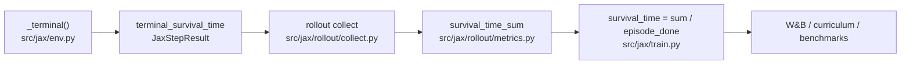

# Issue #101 — `survival_time` metric definition and performance interpretation

Research spike closing [#101](https://github.com/jmduea/orbit_wars/issues/101).

## Summary

`survival_time` is **normalized episode length** in \([0, 1]\): how many game steps elapsed before the episode ended, divided by the configured horizon (`MAX_STEPS = 500`). It is always computed at episode termination and logged as rollout telemetry. Under the default reward profile (`reward.terminal_reward_mode=binary_win`) it is **not** part of the training objective — it measures how long games last, not how well the agent played.

## Definition

At episode termination (`done=True`), per episode:

```text
survival_time = min(game.step + 1, MAX_STEPS) / MAX_STEPS
```

| Symbol | Source | Value |
|--------|--------|-------|
| `game.step` | `JaxGameState.step` at terminal env step | 0-indexed turn counter (starts at 0 on reset) |
| `MAX_STEPS` | `src/game/constants.py` | **500** |
| Range | — | \((1/500,\, 499/500]\) for normal termination; **0** when no episode completes in the rollout window |

**Episode termination** (`src/jax/env.py`, `_terminal`):

```text
done = (game.step >= MAX_STEPS - 2) | (alive_player_count <= 1)
```

- **Horizon:** episode ends when `game.step >= 498`, giving `survival_time = 499/500 ≈ 0.998`.
- **Elimination:** episode ends when at most one player still has planets or fleets. Early knockouts yield low `survival_time` (e.g. elimination at step 99 → `100/500 = 0.20`).

## Code path



| Stage | Module | What happens |
|-------|--------|--------------|
| Compute | `src/jax/env.py` `_terminal()` | `survival_time` scalar at terminal step |
| Store | `src/jax/env.py` `step()` | `terminal_survival_time = survival_time if done else 0` |
| Accumulate | `src/jax/rollout/metrics.py` `_base_episode_metrics()` | `survival_time_sum += terminal_survival_time * done` |
| Finalize | `src/jax/train.py` `_finalize_cross_chunk_rate_metrics()` | `survival_time = survival_time_sum / episode_done` |
| Log | `src/jax/train.py` training loop | Per-update record + curriculum payload |
| Benchmark | `scripts/issues_jax_30update_benchmark.py` | `_survival_time_mean()` from rollout scalars |

Registry: `src/telemetry/metric_registry.py` — group `game_state`, description *"Mean survival time for completed episodes."*

## Relation to the reward signal

`survival_time` is computed in `_terminal()` alongside terminal reward modes. Whether it affects learning depends on `reward.terminal_reward_mode`:

| Mode | Config example | Uses `survival_time` in reward? |
|------|----------------|--------------------------------|
| `binary_win` | `conf/reward/base.yaml` (default) | **No** — ±1 win/loss only |
| `ranked` | — | No — placement-based |
| `score_share` | — | No — learner score fraction |
| `normalized_ship_differential` | `conf/reward/ship_differential.yaml` | No — ship differential |
| `survival_plus_rank` | (no shipped YAML profile) | **Yes** — `0.5 * ranked_reward + 0.5 * survival_time` |

Default training (`reward=terminal_only` → `binary_win`) therefore logs `survival_time` for monitoring but the policy gradient only sees binary terminal reward (+ optional shaping from `early_terminal_only`).

## Reported value

Per training update (one rollout collection across all envs):

```text
survival_time = survival_time_sum / episode_done
```

Mean over **completed episodes in that rollout window only**. If no episode finishes during the window (`episode_done = 0`), the reported value is **0.0** — not "zero-length games," but "no denominator."

Rollout length is `training.rollout_steps` (default 128) per env. With 128 steps and `MAX_STEPS = 500`, a single rollout often spans a fraction of a full game; episodes that started before the window and finish inside it contribute their terminal `survival_time`.

## When to use vs ignore

### Use `survival_time` when

- **Horizon saturation:** values consistently near **0.998** mean games are hitting the step cap rather than ending by elimination — common in balanced mid-training self-play (`validation-500u.json` snapshots at updates 1/100 show ~0.998).
- **Reward ablation with `survival_plus_rank`:** the metric aligns with the terminal objective; compare arms on the same axis.
- **Stalemate / turtle detection:** unusually high survival_time with flat or falling `overall_win_rate` can indicate passive play (especially vs noop/turtle opponents).
- **Custom curriculum gates:** allowed in `CURRICULUM_PROMOTION_METRIC_NAMES` (`src/telemetry/metric_registry.py`), though **no shipped curriculum stage uses it** — all stages promote on `overall_win_rate`.

### Ignore or de-prioritize when

- **Default eval of agent strength:** high `survival_time` ≠ good performance. A dominant agent that wins quickly has **low** survival_time; a losing agent dragged into a long tail can have **high** survival_time.
- **Comparing runs with different `terminal_reward_mode`:** interpret alongside `overall_win_rate`, `score_share`, and (4p) `average_placement_4p`.
- **Sparse episode windows:** `survival_time = 0.0` with `episode_done = 0` is a telemetry artifact (see `validation-500u.json` update 500) — do not treat as "instant games."
- **Curriculum promotion decisions:** use `overall_win_rate` (or stage-specific win-rate metrics); do not substitute survival_time unless a stage explicitly sets `promote_if.metric: survival_time`.

### Recommended pairing

| Goal | Primary metrics | Role of `survival_time` |
|------|-----------------|------------------------|
| Win quality | `overall_win_rate`, `win_rate_2p`, `first_place_rate_4p` | Secondary — context for game length |
| Graded outcome | `score_share`, `average_placement_4p` | Secondary |
| Training health | `approx_kl`, `policy_loss`, `entropy` | Unrelated |
| Long-game bias check | `survival_time` + `overall_win_rate` | Primary for stalemate diagnosis only |

## Example values (committed artifacts)

| Artifact | Reward | Update | `overall_win_rate` | `survival_time` | Notes |
|----------|--------|--------|--------------------|--------------------|-------|
| `validation-500u.json` | `terminal_only` | 1 | 0.67 | **0.998** | Horizon-length games |
| `validation-500u.json` | `terminal_only` | 100 | 0.20 | **0.998** | Still horizon; win rate dropped |
| `validation-500u.json` | `terminal_only` | 500 | 0.0 | **0.0** | No completed episodes in window |
| `terminal-reward-binary-500u.json` | `terminal_only` | 500 | 0.62 | **0.0018** | Fast eliminations dominate |
| `terminal-reward-binary-100u.json` | `terminal_only` | 100 | — | **0.998** | Early training, horizon games |
| `terminal-reward-ship-diff-500u.json` | `ship_differential` | 500 | 0.34 | **0.0064** | Low survival, weak win rate |

The wide spread (0.0–0.998) reflects rollout sampling and opponent mix, not a single "good" target value.

## Conclusion

1. **Definition:** `survival_time` = normalized steps survived at episode end; code owner is `src/jax/env.py` `_terminal()`, aggregated in `src/jax/rollout/metrics.py` and `src/jax/train.py`.
2. **Performance:** under default `binary_win` training, treat it as a **game-length diagnostic**, not a performance score. Prefer `overall_win_rate` and format-specific placement metrics for eval and curriculum.
3. **Action:** no code changes required. When reading W&B or benchmark JSON, pair `survival_time` with win-rate metrics; ignore zero values when `episode_done` is likely zero.

## Related docs

- Partial prior note: `docs/benchmarks/issues-jax-validation-500u.md` (Survival time appendix)
- Terminal reward ablation: `docs/benchmarks/terminal-reward-ablation.md`
- Compile-time research (same benchmark script): `docs/benchmarks/issue-100-jax-compile-time.md`
