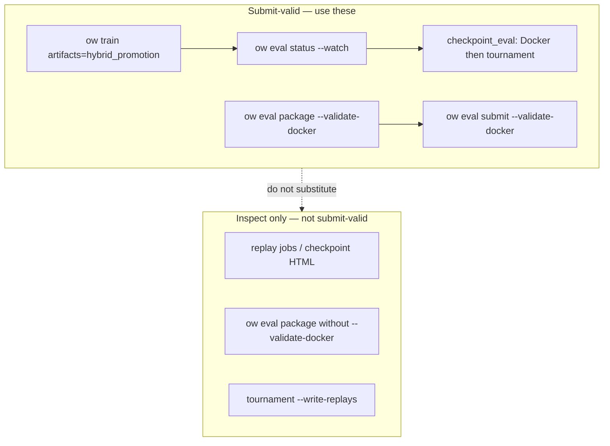

# Requirements: CLI Hardening (Submit-Valid Path Funnel)

## Summary

Converge agents and operators onto one **submit-valid validation funnel**—async Docker validation and tournament promotion via `ow eval` primitives and `artifacts=hybrid_promotion`—and shrink or deprecate parallel paths that look like validation (inline checkpoint replays, packaging-only flows, direct script entrypoints, replay HTML as proof). Deliver guardrails from [#160](https://github.com/jmduea/orbit_wars/issues/160) and [#161](https://github.com/jmduea/orbit_wars/issues/161) plus an explicit **agent decision tree** in `docs/AGENT_CAPABILITIES.md` so coding agents cannot “validate” a checkpoint without hitting real Kaggle Docker probes.

## Problem Frame

The repo’s **Now** roadmap centers submit-valid work: package checkpoints, prove competition compatibility in Kaggle Docker, and gate promotion on tournament wins (`docs/ROADMAP.md`). The intended production path is documented: `ow eval package --validate-docker`, hybrid training with `artifacts=hybrid_promotion`, polling `ow eval status --watch`, and `checkpoint_eval` jobs that chain Docker → tournament → promote (`docs/kaggle_submission.md`, `docs/AGENT_CAPABILITIES.md`).

In practice, agents still reach “validation” through **alternate coded paths**:

- **Synchronous checkpoint replay** during training (`maybe_write_jax_checkpoint_replay` when `replay_async` is false) or via artifact-worker `replay` jobs—HTML/JSON inspection artifacts, not Docker import/episode probes.
- **Packaging without Docker** (`ow eval package` without `--validate-docker`)—layout-only checks that are easy to mistake for submit-valid proof.
- **Direct script invocation** (`scripts/validate_kaggle_docker_submission.py`, `scripts/run_artifact_worker.py`)—same underlying machinery as `ow eval` but bypasses CLI guardrails, help text, and agent-facing discovery.
- **Tournament / eval with `--write-replays`**—useful for debugging, not a substitute for `validation_ok` in docker manifests.
- **Standalone `docker_validation` queue jobs** (when enabled) vs the **hybrid `checkpoint_eval`** composite—two mental models for the same outcome.

Evidence: an agent session generated and treated replay output as validation while **not** running async Docker eval through the eval worker queue. That failure mode is structural (too many plausible “validate” surfaces), not a one-off typo.

## Key Decisions

- **Path funnel (Option 3).** Scope is not limited to tests for #160/#161; it includes **deprecating, hiding, or demoting** alternate validation and replay-as-validation surfaces so the canonical funnel is the obvious and enforced default for agents.

- **Replay is inspection, not validation.** Checkpoint HTML replays and tournament replays remain valuable for debugging and regression (#160 caller coverage) but must not be documented or CLI-labeled as submit-valid proof.

- **Docker validation is the compatibility gate.** Only flows that run Kaggle Docker import probes and seeded 2p/4p episodes count as “validated for submission.” Packaging-only and replay-only outcomes are explicitly **non-validating**.

- **Hybrid promotion is the training-time default for strict promote.** Agents proving submit-valid during training should use `artifacts=hybrid_promotion` and poll `checkpoint_eval` status—not scalar metric promotion alone and not ad-hoc replay generation.

- **Primitives over scripts for agents.** `ow eval package`, `ow eval submit`, `ow eval worker`, `ow eval status` are the supported agent entrypoints; script paths are operator/advanced, hidden from agent docs, and optionally warned at runtime.

---

## Actors

- **A1. Coding agent** — Runs train/eval/package flows from `docs/AGENT_CAPABILITIES.md`; highest risk of choosing replay or packaging-only as validation.
- **A2. Operator / maintainer** — Needs script escape hatches for debugging; accepts deprecation warnings and migration period.
- **A3. CI** — Must exercise replay caller paths (#160) and CLI validate invariants (#161) so signature/help drift cannot silently drop Docker probes.

---

## Requirements

### Canonical submit-valid funnel

- R1. **Single documented agent path for “is this checkpoint submit-valid?”** — After packaging or from a train run: use `uv run ow eval package --checkpoint <pkl> --output-dir <dir> --validate-docker` for manual proof, or train with `artifacts=hybrid_promotion` and poll `uv run ow eval status --run <run_dir> --watch` until `checkpoint_eval` jobs report `validation_ok` and tournament gates pass. `docs/AGENT_CAPABILITIES.md` must state this as the default; replay-only steps are listed under a separate “inspect” branch.

- R2. **Decision tree in agent capabilities** — Add a compact flowchart (mermaid or numbered branches) to `docs/AGENT_CAPABILITIES.md`: goal → command → success signal → what **does not** count (replay HTML, packaging-only stdout, `overall_win_rate` from self-play training logs). Include copy-paste prompts for hybrid poll, manual docker package, and Gate 5 `ow benchmark tournament-proof` without conflating them.

- R3. **Success signals are manifest- and JSON-backed** — Agents treat `docker_manifest.json` / `checkpoint_eval` manifest `validation_ok`, final JSON `"ok": true` from `--validate-docker`, and `promoted_manifest` updates as pass signals—not presence of `replays/*.html` alone.

### Path funnel (shrink alternates)

- R4. **Deprecate or hide replay-as-validation** — Training default and agent docs must not imply that `maybe_write_jax_checkpoint_replay` or worker `replay` jobs substitute for Docker validation. Prefer `replay_async` (or disabled replay) when hybrid/docker validation is enabled; emit clear log/CLI messaging when replay runs without a paired docker validation job.

- R5. **Packaging-only is explicitly non-validating** — `ow eval package` without `--validate-docker` prints a stable, grep-friendly line (already partially present) and agent docs label it “layout only.” Agent prompts must not use packaging-only as a learn-proof or submit-valid step.

- R6. **Demote direct script entrypoints for agents** — `scripts/validate_kaggle_docker_submission.py` and `scripts/run_artifact_worker.py` remain for maintainers but are removed from agent-oriented discovery (`docs/AGENT_CAPABILITIES.md`, `docs/kaggle_submission.md` agent sections). Optional: runtime warning when invoked outside `ow eval` suggesting the CLI wrapper.

- R7. **Converge async validation on `checkpoint_eval` under hybrid** — Document that standalone `docker_validation` queue jobs are legacy/secondary to `checkpoint_eval` when `artifacts=hybrid_promotion` is active; config defaults and examples steer new runs to hybrid composite jobs only.

- R8. **Tournament `--write-replays` is opt-in inspection** — Help text and agent tree classify tournament replays as debug artifacts; default agent flows for submit-valid do not require `--write-replays`.

### Guardrails (#160, #161)

- R9. **#160 — Replay integration coverage** — CI exercises `maybe_write_jax_checkpoint_replay` → `run_match` (or equivalent artifact smoke) so return-arity changes cannot pass `make test-fast` while breaking replay callers. Align with issue body: extend `tests/test_replay.py` or artifact-domain smoke.

- R10. **#161 — Validate subcommand invariant** — Test or contract that user-facing “validate” paths (`ow eval package --validate-docker`, `ow eval submit --validate-docker`, worker docker phase inside `checkpoint_eval`) invoke real Docker validation entrypoints—not tarball layout only. Internal `--skip-docker` (or equivalent) stays non-user-facing per issue intent.

### CLI UX and invariants

- R11. **Help and `--help` examples** — `ow eval package`, `ow eval submit`, and `ow eval worker` help strings distinguish **validate** (Docker) vs **package** (layout) vs **replay** (HTML). Examples show `--validate-docker` on the submit-valid path.

- R12. **No new workflow wrappers for agents** — Hardening extends primitives and docs; does not add monolithic `ow benchmark validate-submission` wrappers (consistent with agent-native Phase 3 policy).

---

## Key Flows

- F1. **Agent proves checkpoint during training (recommended)**
  - **Trigger:** User asks for submit-valid or hybrid promotion proof.
  - **Actors:** A1, artifact worker.
  - **Steps:** `ow train ... artifacts=hybrid_promotion` → note `run_dir` → `ow eval status --run <run_dir> --watch` → confirm `checkpoint_eval` completed with `validation_ok` and tournament gates → read `promoted_manifest` if promoted.
  - **Outcome:** Docker and tournament evidence under `evaluations/checkpoint_eval_u*/`; no reliance on inline replay HTML.

- F2. **Agent proves checkpoint manually (pre-upload)**
  - **Trigger:** One-off package before `ow eval submit`.
  - **Actors:** A1.
  - **Steps:** `ow eval package --checkpoint <pkl> --output-dir <dir> --validate-docker` → confirm JSON `"ok": true` → optional `ow eval submit ... --validate-docker`.
  - **Outcome:** Submit-valid proof without replay-only detour.

- F3. **Agent inspects behavior (non-validating)**
  - **Trigger:** Debug action quality or regression after mask/compiler change.
  - **Actors:** A1.
  - **Steps:** Enable replay (async job or sync config) or `ow eval tournament --write-replays` → read HTML/metadata.
  - **Outcome:** Inspection only; doc tree states Docker validation still required for submit-valid.

- F4. **CI prevents validate/replay drift**
  - **Trigger:** PR touches `src/artifacts/replay.py`, `run_match` signatures, or eval CLI docker flags.
  - **Actors:** A3.
  - **Steps:** #160 and #161 tests run in `make test-domain-artifacts` (or fast tier where appropriate).
  - **Outcome:** Merge blocked on caller or validate-entrypoint regression.

---

## Acceptance Examples

- AE1. **Covers R1, R3, F1**
  - **Given:** A hybrid promotion train run with queued `checkpoint_eval`.
  - **When:** An agent polls `ow eval status` until idle.
  - **Then:** The agent cites `validation_ok` and tournament results from checkpoint_eval manifests; it does not claim submit-valid from `replays/replay_u*.html` alone.

- AE2. **Covers R5; negative path before F2**
  - **Given:** An agent asked to validate a checkpoint before upload.
  - **When:** It runs `ow eval package` without `--validate-docker`.
  - **Then:** That run is classified as layout-only; the agent follows up with `--validate-docker` or hybrid queue proof before reporting success (F2 Steps).

- AE3. **Covers R9**
  - **Given:** `run_match` return arity changes in tournament/replay code.
  - **When:** CI runs artifact/replay tests (#160).
  - **Then:** The build fails until `maybe_write_jax_checkpoint_replay` callers are updated.

- AE4. **Covers R10**
  - **Given:** A refactor renames or bypasses Docker validation in an eval subcommand.
  - **When:** CI runs validate invariant test (#161).
  - **Then:** The build fails if user-facing validate paths no longer invoke Docker probes.

- AE5. **Covers R2, R6**
  - **Given:** A new agent session with only `docs/AGENT_CAPABILITIES.md`.
  - **When:** The user asks “validate my checkpoint.”
  - **Then:** The agent selects F1 or F2 from the decision tree and does not start from `scripts/validate_kaggle_docker_submission.py` or replay generation unless explicitly asked to inspect.

---

## Success Criteria

- Agents following `docs/AGENT_CAPABILITIES.md` default to hybrid poll or `ow eval package --validate-docker` for submit-valid questions; replay and packaging-only paths are labeled non-validating in the same doc.
- #160 and #161 closed with tests merged; `make test-domain-artifacts` (and relevant fast tests) cover replay caller and validate-entrypoint invariants.
- No new agent-facing docs recommend `scripts/validate_kaggle_docker_submission.py` or replay HTML as validation; operator docs may keep advanced script references in architecture/onboarding only with a “non-agent” label.
- Regression: a deliberate attempt to “validate” via replay-only in an agent prompt is contradicted by the decision tree and CLI help (qualitative review on next agent session).

---

## Scope Boundaries

**In scope**

- Path funnel documentation and CLI messaging (`docs/AGENT_CAPABILITIES.md`, `docs/kaggle_submission.md`, eval CLI help).
- Deprecation/demotion of alternate validation surfaces (replay-as-validation, packaging-only confusion, script-first discovery).
- Tests and guardrails for #160 and #161.
- Config/doc defaults steering hybrid `checkpoint_eval` over standalone docker_validation where applicable.

**Deferred for later**

- Full removal of `scripts/validate_kaggle_docker_submission.py` (may remain as implementation detail behind `ow eval` indefinitely).
- Automated agent linter that blocks replay paths in prompts (documentation + tests only in this track).
- Cursor session-start hook (roadmap Later item).

**Outside this product's identity (non-goals)**

- **Planet Flow proof pipeline (#166–#170)** — reachability, sweep, decoder replay contracts, compiler-control tests; separate brainstorm/plan track.
- **Gate 5 / `ow benchmark tournament-proof` semantics change** — thresholds, baseline opponents, and tournament-proof CLI behavior stay as calibrated today; this track only clarifies how tournament-proof fits **after** Docker validation in the agent tree, not redefine Gate 5.
- Rewriting the artifact worker architecture or async pipeline design (behavioral funnel only).

---

## Dependencies and Assumptions

- Hybrid promotion profile (`artifacts=hybrid_promotion`) and `checkpoint_eval` worker path are implemented and remain the strict promotion mechanism on `main`.
- Docker is available on the machine when agents run `--validate-docker` (WSL/Desktop documented in `docs/kaggle_submission.md`); `docker_unavailable` is an environment failure, not bypassed by replay.
- `scripts/validate_kaggle_docker_submission.py` continues to implement Docker probes invoked from `src/artifacts/docker_validation.py` and kaggle packager code paths.
- Solo-operator repo: deprecation can use warnings and doc changes without multi-release coordination beyond a short migration note in `docs/kaggle_submission.md`.

---

## Outstanding Questions

**Deferred to planning**

- Whether to change **default Hydra** `artifacts.replay` / `replay_async` when `hybrid_promotion` is selected (auto-disable sync replay vs warn-only).
- Exact deprecation mechanism for direct script invocation: stderr warning only vs requiring `OW_ALLOW_SCRIPT_VALIDATE=1`.
- Whether #161 tests mock Docker or use the existing test harness stubs in `tests/test_kaggle_submission_packager.py` / `tests/test_checkpoint_eval.py`.

**Resolve before planning (none blocking)**

- All product decisions for Option 3 are captured above; planning may proceed without further brainstorm dialogue.
