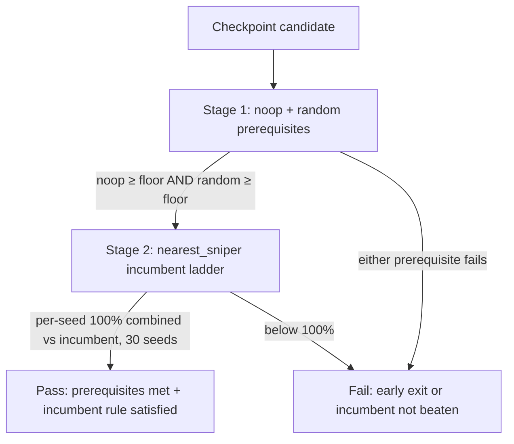

# Requirements: Unified Held-Out Tournament (Gate 5 + Hybrid Promotion)

## Summary

Define one held-out tournament specification shared by Gate 5 (`ow benchmark tournament-proof` / `ow benchmark learn-proof`) and hybrid promotion (`checkpoint_eval` under `artifacts=hybrid_promotion`). The spec tests both 2-player and 4-player formats, scores every opponent with the same combined 2p/4p metric, gates promotion on noop/random prerequisites then a strict nearest_sniper incumbent ladder, and runs stages in prerequisite-first order for efficiency.

---

## Problem Frame

Gate 5 tournament win proof and hybrid promotion today follow divergent shapes. Gate 5 reads thresholds from `docs/benchmarks/preflight-calibration.json` (noop ≥ 0.7, random ≥ 0.58) but runs held-out tournaments in **2p only** with five seeds and four games per pair, via `ow benchmark tournament-proof` hardcoded to `2p_vs_baseline` and a single baseline per invocation. Hybrid promotion under `conf/artifacts/hybrid_promotion.yaml` enables async `checkpoint_eval` tournaments but inherits `conf/artifacts/base.yaml` promotion gates tuned to **sniper** baselines (`min_win_rate_vs_sniper: 0.55`, `min_win_rate_vs_incumbent: 0.51`) with different seed counts, games-per-pair defaults, and format coverage.

That split creates three problems: agents and operators cannot treat “tournament passed” as one portable verdict; 4p competence is untested in the preflight win-proof path despite Kaggle relevance; and the incumbent bar for public leaderboard readiness (nearest_sniper) is neither the Gate 5 prerequisite ladder nor the hybrid promotion gate agents actually hit during training. A unified spec removes duplicate mental models while preserving calibrated noop/random floors and adding a strict incumbent challenge aligned with Kaggle readiness.

---

## Key Decisions

- **One spec, two consumers.** Gate 5 and hybrid `checkpoint_eval` must evaluate checkpoints against the same opponent set, format coverage, scoring formula, seed policy, and pass/fail semantics. Divergent tournament configs between benchmark proof and promotion are out of scope for the unified design.

- **Combined 2p+4p score is canonical.** Every opponent gate (noop, random, nearest_sniper) uses the same aggregate: equal 50/50 weight between 2p aggregate win rate and 4p aggregate win rate. Per-format rates may be reported for diagnostics; pass/fail uses the combined score only.

- **Three opponents, two stages.** noop and random are **prerequisites** with existing calibrated floors (noop ≥ 0.7, random ≥ 0.58 on the combined score). Stage 2 is the **promoted incumbent** ladder — promotion or incumbent swap requires beating the current incumbent checkpoint (R8–R9), not merely clearing legacy soft sniper floors.

- **Incumbent swap is strict.** A checkpoint replaces the incumbent only when **every one of 30 seeds** achieves per-seed combined score 1.0 vs the promoted incumbent (R9). Rationale: inconsistent wins against the public-readiness bar indicate the checkpoint is not ready for Kaggle leaderboard exposure.

- **Staged execution, not staged definitions.** The spec is singular; runtime may run noop/random prerequisite tournaments first and only schedule the 30-seed nearest_sniper ladder for checkpoints that survive. Early exit on prerequisite failure is allowed; changing pass criteria between stages is not.

- **Calibration before invented numbers.** Games per seed (and whether noop/random thresholds need recalibration on the new combined metric) are open calibration items. Requirements pin semantic thresholds; numeric games-per-seed defaults must come from measured calibration campaigns, not round-number guesses.

---

## Actors

- **A1. Operator / maintainer** — Runs Gate 5 via `ow benchmark tournament-proof` or `ow benchmark learn-proof`; calibrates thresholds and games-per-seed; curates the nearest_sniper incumbent reference.
- **A2. Training + eval worker** — Under `artifacts=hybrid_promotion`, enqueues and executes `checkpoint_eval` jobs (Docker validation → tournament → promote) using the unified tournament spec.
- **A3. Coding agent** — Polls `ow eval status` / reads manifests for promotion proof; must not treat training-log win rates or legacy 2p-only Gate 5 semantics as submit-valid tournament proof.
- **A4. Preflight / benchmark tooling** — Loads win-proof thresholds from `docs/benchmarks/preflight-calibration.json` and gate overrides from `conf/benchmark/gates/`; emits pass/fail reports consumable by CI and agent loops.

---

## Requirements

### Unified tournament shape

- R1. **Shared spec across Gate 5 and hybrid promotion.** `ow benchmark tournament-proof` (Gate 5) and hybrid `checkpoint_eval` tournament stages must use identical opponent list, format coverage, combined scoring, seed policies per stage, and pass/fail rules. Consumers may differ in orchestration (CLI vs async worker) but not in tournament definition.

- R2. **Both 2p and 4p formats tested.** Every tournament stage runs games in 2-player and 4-player modes relevant to held-out evaluation (aligned with existing tournament format vocabulary in `conf/artifacts/base.yaml`, extended to cover 4p held-out evaluation rather than 2p-only Gate 5 today).

- R3. **Combined score formula.** For each opponent, compute aggregate win rate over all games in 2p mode and aggregate win rate over all games in 4p mode; combined score = `0.5 × win_rate_2p + 0.5 × win_rate_4p`. The same formula applies to noop, random, and nearest_sniper gates. For Stage 2 incumbent evaluation (R9), also compute a per-seed combined score from that seed's 2p and 4p games; R9 pass uses per-seed combined scores, not a single pooled rate across seeds.

- R4. **Opponent set: noop, random, incumbent.** The ladder definition includes noop and random (Stage 1) plus the promoted incumbent checkpoint (Stage 2, R8). Stage 1 does not evaluate nearest_sniper/scripted `sniper` — only noop and random. Curriculum `nearest_sniper` / runtime `sniper` naming is documented in `docs/architecture/tournament-eval.md` for bootstrap context (Q4), not as a Stage 1 opponent.

### Prerequisites (noop and random)

- R5. **noop prerequisite.** Checkpoint must achieve combined score ≥ `noop_min_win_rate` before nearest_sniper incumbent evaluation. Initial floor: **0.7** from `docs/benchmarks/preflight-calibration.json` (`thresholds.win_proof_tournament.noop_min_win_rate`), subject to recalibration on the combined 2p+4p metric (see Outstanding Questions).

- R6. **random prerequisite.** After passing noop (or in the same prerequisite stage per staged flow), checkpoint must achieve combined score ≥ `random_min_win_rate`. Initial floor: **0.58** from `docs/benchmarks/preflight-calibration.json` (`thresholds.win_proof_tournament.random_min_win_rate`), subject to recalibration on the combined metric.

- R7. **Prerequisite failure stops the ladder.** If either prerequisite fails, the checkpoint fails tournament proof / hybrid promotion tournament stage without running the 30-seed nearest_sniper incumbent challenge. Failing Stage 2 incumbent evaluation (below R9) also fails tournament proof / hybrid promotion tournament stage without incumbent swap.

### Incumbent ladder (nearest_sniper)

- R8. **nearest_sniper incumbent until defeated.** Stage 2 compares the challenger against the **promoted incumbent checkpoint** (designated artifact), not the scripted curriculum `sniper` baseline used in prerequisite semantics. The incumbent remains until a challenger satisfies R9.

- R9. **Incumbent swap threshold.** Challenger must achieve **100% combined win rate** vs the promoted nearest_sniper incumbent across **30 seeds**: every seed's per-seed combined score (R3) equals 1.0. One seed below 1.0 fails the stage (AE3) and denies incumbent swap. Pooled win rate across seeds is not sufficient.

- R10. **Hybrid promotion uses the same incumbent rules.** Under `conf/artifacts/hybrid_promotion.yaml`, tournament promotion must not apply legacy soft sniper floors from `conf/artifacts/base.yaml` (`min_win_rate_vs_sniper: 0.55`, `min_win_rate_vs_incumbent: 0.51`) once the unified spec ships; those thresholds are superseded by R5–R9 for both Gate 5 and promotion.

### Staged execution

- R11. **Prerequisite-first ordering.** Runtime executes noop/random prerequisite evaluation before nearest_sniper incumbent evaluation. Checkpoints failing prerequisites exit early; survivors proceed to the 30-seed nearest_sniper stage.

- R12. **One definition, ordered runs.** Staging affects scheduling and cost, not pass criteria. No opponent may use a different scoring shape or format coverage in a later stage than in the published spec.

### Reporting and agent contract

- R13. **Reports expose combined and per-format rates.** Tournament output (leaderboard, proof report, `checkpoint_eval` manifest) must include combined score plus 2p and 4p aggregate win rates per opponent so operators can diagnose format weakness without inferring from a single number.

- R14. **Docker validation precedes tournament proof.** Submit-valid funnel runs Kaggle Docker packaging validation before any held-out `kaggle_environments` tournament work (`docs/AGENT_CAPABILITIES.md`). `ow benchmark tournament-proof` and hybrid `checkpoint_eval` enforce this order; tournament pass is necessary for win proof and hybrid promotion; Docker `validation_ok` gates whether the ladder runs.

---

## Key Flows

F1. **Gate 5 CLI proof**
- **Trigger:** Operator runs `ow benchmark tournament-proof --eval-checkpoint <path>` (or via `ow benchmark learn-proof`).
- **Actors:** A1, A4
- **Steps:** Load thresholds from `docs/benchmarks/preflight-calibration.json`; run Stage 1 noop/random on combined metric; on pass, run Stage 2 nearest_sniper vs incumbent across 30 seeds; write proof report with per-opponent combined and per-format rates.
- **Outcome:** Pass/fail verdict aligned with R5–R9; failure at either stage yields a definitive fail without promotion side effects.

F2. **Hybrid promotion checkpoint_eval**
- **Trigger:** Training with `artifacts=hybrid_promotion` queues `checkpoint_eval` after scalar metric improvement.
- **Actors:** A2, A3
- **Steps:** Docker validation (unchanged) → unified tournament (F1 semantics) → promote only if tournament stage passes R5–R9.
- **Outcome:** `validation_ok` and tournament fields in manifest reflect unified spec; agents read manifests via `ow eval results show`. Promote only if the tournament stage passes R5–R9 (prerequisites plus incumbent rules per Key Decisions), not prerequisites alone.

F3. **Incumbent swap**
- **Trigger:** Challenger passes R5–R6 and satisfies R9 (per-seed 100% combined vs promoted incumbent).
- **Actors:** A1, A2
- **Steps:** Record new incumbent reference; subsequent tournaments compare against updated nearest_sniper champion.
- **Outcome:** Public-leaderboard-ready bar is enforced literally; prior incumbent remains until R9 is satisfied.

---

## Acceptance Examples

AE1. **Covers R5, R7**
- **Given:** Checkpoint evaluated on combined metric; noop combined score = 0.68.
- **When:** Stage 1 prerequisite evaluation completes.
- **Then:** Tournament fails; Stage 2 nearest_sniper (30 seeds) does not run.

AE2. **Covers R6, R11**
- **Given:** noop combined score = 0.75; random combined score = 0.55.
- **When:** Stage 1 completes.
- **Then:** Tournament fails at random prerequisite; nearest_sniper stage skipped.

AE3. **Covers R3, R9**
- **Given:** Prerequisites passed; nearest_sniper stage uses 30 seeds; combined scores per seed are all 1.0 except one seed at 0.967 (29/30 wins equivalent on combined metric).
- **When:** Incumbent evaluation completes.
- **Then:** Incumbent swap denied; overall tournament proof fails incumbent stage.

AE4. **Covers R1, R14**
- **Given:** Same checkpoint run through Gate 5 CLI and hybrid `checkpoint_eval` tournament stage with identical incumbent and calibration inputs.
- **When:** Both complete.
- **Then:** Pass/fail verdict and combined scores per opponent match; Docker validation outcome remains independent.

AE5. **Covers R13**
- **Given:** Checkpoint passes noop with 2p win rate 0.80 and 4p win rate 0.60.
- **When:** Report is emitted.
- **Then:** Report shows win_rate_2p=0.80, win_rate_4p=0.60, combined=0.70, and explicit pass against noop floor.

---

## Success Criteria

- Calibration artifacts document games-per-seed, 4p match topology for single-checkpoint evaluation, and any threshold adjustments with measured campaigns — no invented defaults in committed thresholds. Unified pass/fail is not enforced in CI or hybrid workers until this artifact is committed.
- Gate 5 (`ow benchmark tournament-proof`) and hybrid `checkpoint_eval` tournament stages consume one documented spec; an operator cannot find conflicting pass rules between `docs/benchmarks/preflight-calibration.json` win-proof semantics and `conf/artifacts/hybrid_promotion.yaml` promotion tournaments.
- Prerequisites use combined 2p+4p scoring with noop ≥ 0.7 and random ≥ 0.58 as initial floors (recalibrated if calibration shows drift on the new metric).
- Incumbent promotion requires literal 100% per-seed combined win rate vs the promoted incumbent over 30 seeds (R9); no checkpoint promotes on legacy 0.55 sniper floor alone.
- Staged execution demonstrably skips nearest_sniper evaluation when prerequisites fail, reducing wasted compute without altering criteria.

---

## Scope Boundaries

**In scope**

- Unified held-out tournament definition for Gate 5 and hybrid promotion.
- Combined 2p+4p scoring, noop/random prerequisites, nearest_sniper incumbent ladder.
- Staged prerequisite-first execution.
- Threshold and games-per-seed calibration updates tied to the new metric shape.
- Agent/operator documentation that Gate 5 and promotion share one tournament spec.

**Deferred for later**

- Leaderboard meta opponents beyond nearest_sniper (additional scripted or historical baselines in the incumbent ladder).
- Extending unified spec to non-hybrid artifact profiles (`artifacts=default` metric-only promotion) unless explicitly requested in a follow-on track.

**Outside this product's identity**

- Launch-hygiene tier-2 e2e throughput gates (`make test-launch-hygiene-e2e-throughput`).
- Planet Flow proof pipeline tracks and planet-flow-specific gate YAML variants under `conf/benchmark/gates/`.
- Replacing Kaggle Docker validation with tournament-only proof.

---

## Dependencies / Assumptions

- **Existing calibration source:** `docs/benchmarks/preflight-calibration.json` remains the authority for initial noop/random floors until recalibrated; commit `614cf36e732c` documents current 2p-only calibration context (`formats: 2p_vs_baseline`, five seeds, four games per pair).
- **Hybrid promotion profile:** `conf/artifacts/hybrid_promotion.yaml` enables `tournament.enabled: true` and `checkpoint_eval_async: true`; unified tournaments plug into the existing Docker → tournament → promote chain.
- **Tournament runtime:** Local Kaggle-env harness (`ow eval tournament`, artifact worker) supports multi-format evaluation for multi-candidate tournaments; single-checkpoint Gate 5 / `checkpoint_eval` paths do not yet satisfy R2/R3 without the topology in Q5 (`4p_free_for_all` today requires ≥ four unique candidates — see `docs/architecture/tournament-eval.md`).
- **Incumbent artifact:** A designated nearest_sniper incumbent checkpoint exists or will be published as part of implementation; until then incumbent stage behavior must fail closed or use an explicit bootstrap incumbent documented in calibration output.
- **Gate 5 primitives:** `ow benchmark tournament-proof` and `ow benchmark learn-proof` remain the CLI entrypoints; unification updates behavior behind those commands rather than introducing parallel proof surfaces.

---

## Outstanding Questions

### Deferred to Planning

- **Q1. Games per seed.** How many games per (checkpoint, opponent, format, seed) pair balances statistical confidence vs evaluation cost? Must be set via calibration campaign (`ow benchmark`-style or tournament sweep), not chosen as a round number in requirements. Current Gate 5 default is 4 games per pair (`docs/benchmarks/preflight-calibration.json`); hybrid default under `conf/artifacts/base.yaml` is 1 — unified spec needs a single calibrated value or stage-specific calibrated values documented in updated calibration JSON.

- **Q2. noop/random threshold recalibration.** Do 0.7 and 0.58 remain valid pass floors on the combined 2p+4p metric, or does the metric shape require a new calibration pass before CI/agents enforce them? Planning should schedule recalibration if combined scores materially diverge from legacy 2p-only measurements.

- **Q3. Prerequisite seed count.** Stage 1 (noop/random) may reuse the existing five-seed held-out set from preflight calibration or adopt a different count; must be explicit in the unified spec and calibration artifact without diverging from Stage 2’s 30-seed incumbent policy.

- **Q4. Incumbent bootstrap.** Which checkpoint seeds the first nearest_sniper incumbent, and where is that reference stored for reproducible Gate 5 and worker runs? Until Q4 is resolved, Stage 2 must fail closed with reason `no_incumbent` (no promotion side effects).

- **Q5. Single-checkpoint 4p topology.** How does a held-out run with one checkpoint produce the 4p leg of R3 (today `4p_free_for_all` requires ≥4 unique candidates)? Define participants, match format, and combined-score behavior when 4p games are zero (fail closed vs explicit fallback).

### Resolve Before Planning

*(none — semantic decisions are pinned; numeric calibration items defer to planning and measured campaigns per project verification policy)*

---

## Sources / Research

- `docs/benchmarks/preflight-calibration.json` — current Gate 5 win-proof thresholds and 2p-only tournament shape.
- `conf/benchmark/gates/beat_noop.yaml`, `conf/benchmark/gates/beat_random.yaml` — Gates 2–3 learning-signal training; Gate 5 tournament is separate win proof.
- `conf/artifacts/hybrid_promotion.yaml` — hybrid promotion enables async tournament via `checkpoint_eval`.
- `conf/artifacts/base.yaml` — legacy tournament and promotion sniper floors to be superseded (R10).
- `src/cli/benchmark.py` — `tournament-proof` subcommand (today: single baseline, `2p_vs_baseline` only).
- `docs/architecture/tournament-eval.md` — tournament harness, nearest_sniper/sniper baseline mapping, 4p candidate rules.
- `AGENTS.md` — Gate 5 thresholds and hybrid promotion funnel context.
