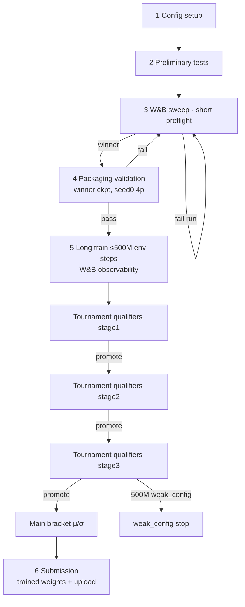

# SSOT Training Pipeline — Config to Kaggle Submission

## Summary

Replace parallel, overlapping training/eval paths with **one canonical pipeline**: config setup → preliminary tests → **W&B sweep short preflight** (learning stability, ablations, artifact handoff) → **packaging validation** (Docker, **sweep winner checkpoint**) → **long train** (≤500M env steps, **W&B observability**) with rollout curriculum (random → noop-heavy → sniper-heavy) advanced by **tournament qualifiers** (fast JAX held-out eval, calibrated statistical floors) → main bracket (μ/σ) → **submission** (Docker packaging + upload with trained weights). **Sweep-only ablations** may stop after step 3 preflight pass; configs **destined for Kaggle submission** must complete steps 4–6. **Teardown** legacy spine components rather than deprecating them in place. **No custom config registry or bad-config cache** — W&B holds sweep history, metrics, and checkpoint artifacts.

## Problem Frame

Operators and agents today face multiple co-equal narratives:

- Preflight gates 0–5 (`learn-proof`, `curriculum_staged`, `tournament-proof` at 0.76)
- `artifacts=default` vs `hybrid_promotion` vs `bracket_training`
- Held-out bracket qualifiers (noop → random → sniper at 1.0) decoupled from rollout opponents
- Docker validation moved to **after preflight, before long train** (preflight checkpoint); **submission** re-validates with trained weights

Work on submit-valid closure stalled partly because Gate 4 wall clock and naming overlap made it unclear which path is authoritative. Legacy plans diverged on qualifier order, eval lane, and promotion semantics — this doc replaces them.

This document defines the **single SSOT** and what must be **removed or relocated** so nothing else reads as an alternate canonical path.

## Key Decisions

**KD1 — W&B sweep preflight → packaging validation → long train.** No config enters **long train** until it passes **short preflight** coordinated via **W&B sweeps** (learning stability / trend gate per agent run) and then **packaging validation** (Docker smoke using the **sweep winner checkpoint**). Failed sweep runs remain in W&B for comparison — no local bad-config cache. **Long train** runs with `telemetry.wandb` enabled for metrics and checkpoint artifacts. **Sweep-only ablations** may terminate after preflight pass without continuing to packaging or long train.

**KD2 — Three runtime modes on the spine.**

| Stage | When | Runtime | Purpose |
|-------|------|---------|---------|
| **Packaging validation** | After preflight, before long train | Docker + `kaggle_environments` | Agent survives Kaggle loader, 1s/step + 60s overage, competition-faithful smoke |
| **Tournament qualifiers** | During long train on checkpoint ticks | Fast JAX | Stage promotion on held-out seeds only — not Docker per tick |
| **Submission** | After bracket clearance | Docker + `kaggle_environments` + upload | Trained-weight packaging smoke + Kaggle submit |

**KD3 — Tournament qualifier outcome = competition final score.** Episode winner for stage promotion is **highest final score** (owned planet ships + owned fleet ships) per `docs/competition/COMPETITION_OVERVIEW.md` scoring section. Env physics parity is maintained separately (`make test-kaggle-parity`). Promotion metrics come from **tournament qualifier** held-out eval, not training rollout JSONL win rates or preflight trend gates.

**KD4 — Statistical promotion floors.** Qualifier stage clearance uses **calibrated statistical floors** (seed variance accounted for), not strict 100% on all games. Floors and seed counts live in committed calibration JSON (e.g. `docs/benchmarks/qualifier-seed-calibration.json`) — never invented at operator time.

**KD5 — Progressive seed budgets (hypothesis).** Initial draft per stage: ~5 seeds (random leg) → ~10 (noop leg) → ~20 (nearest_sniper leg), **reset per stage** on promotion. Exact N and floors require a calibration campaign before enforcement.

**KD6 — Rollout curriculum order.** During **long train**, rollout opponents follow **random → noop-heavy (+ random mix) → sniper-heavy (+ noop/random mix)**, driven by **tournament qualifier** promotions — not noop-first async `qualifier_eval` only. **Rationale:** rollout curriculum optimizes learning progression (easy→hard opponents); Kaggle's forced qualifier ladder remains noop-first at **submission**/bracket time (see competition docs). Plan `2026-06-03-005-feat-kaggle-bracket-ranking-plan.md` is **superseded** for qualifier order and async Docker eval — SSOT uses rollout curriculum + fast JAX tournament qualifiers instead.

**KD7 — Teardown, not demotion.** Legacy parallel spines are **removed or relocated** to explicit alternate tracks (e.g. Planet Flow research). No “demoted but still default” paths in operator docs.

**KD8 — Canonical competition docs.** `docs/competition/COMPETITION_OVERVIEW.md` and `docs/competition/COMPETITION_SUBMISSION.md` are the SSOT for competition rules and agent packaging expectations; operator pipeline docs link here first.

## Actors

| Actor | Role |
|-------|------|
| **Operator / maintainer** | Runs pipeline stages, calibrates seed/floor JSON, manages W&B sweeps and artifact handoff |
| **Coding agent** | Composes primitives (`ow make wandb_sweep`, `ow sweep create`, `ow eval package`, train with SSOT profile, poll tournament qualifier eval, `ow eval submit`); must not invent thresholds |
| **Weights & Biases** | Sweep coordination, run metrics, checkpoint artifacts, and sweep history (replaces local config registry) |
| **Tournament qualifier harness (JAX)** | Runs held-out eval games on eval-only seeds during long train; win = highest final score |

## Requirements

### Canonical pipeline phases

**R1.** Configs **destined for Kaggle submission** MUST traverse **steps 1 → 6** in order before any alternative track is considered. **Sweep-only ablations / research sweeps** may exit after step 3 preflight pass (KD1, R30) without packaging, long train, or submission.

1. **Config setup** — resolved Hydra config, feature compatibility declared
2. **Preliminary tests** — wiring (`make test-fast` tier); fails block all downstream
3. **W&B sweep · short preflight** — see R5–R11
4. **Packaging validation** — see R4, R6–R8
5. **Long train** — rollout curriculum, **tournament qualifiers**, main bracket — see R12–R20
6. **Submission** — Docker packaging smoke with **trained** weights, then upload — see R21–R22

**R2.** Operator and agent docs (`docs/AGENT_CAPABILITIES.md`, `docs/ONBOARDING.md`, runbooks) describe **only this spine** as the path from config to Kaggle submission. Alternate tracks are separate documents/profiles, not footnotes on the spine.

### Packaging validation

**R3.** Canonical references: `docs/competition/COMPETITION_OVERVIEW.md`, `docs/competition/COMPETITION_SUBMISSION.md`.

**R4.** Before long train, package agent from the **W&B sweep winner checkpoint** (weights produced by step 3) sufficient to exercise the full inference path (hidden size, feature history, `max_moves_k`, shield mode, decoder mode, checkpoint load, etc.).

**R5.** Coordinate **short preflight and ablations** through **W&B sweeps** using existing infra (`conf/wandb_sweep/`, `ow make wandb_sweep=…`, `ow sweep create`, `wandb agent`). Each sweep run executes Gates 2–3 (learning trend vs `docs/benchmarks/preflight-calibration.json`), logs metrics to W&B, and uploads checkpoint **artifacts**. Operator or sweep objective selects the **winning run** for packaging validation.

**R6.** No custom **config registry** or **bad-config cache**. Failed sweep runs stay in W&B; packaging validation always runs on the selected winner before long train (no fingerprint skip). **Submission** always re-validates with final trained weights (R21–R22).

**R7.** Packaging validation executes inside the **official Kaggle competition Docker image** using `kaggle_environments` Orbit Wars env: **seed 0**, **4-player**, **all four agents = packaged agent** (mirrors competition validation shape).

**R8.** Packaging validation pass criteria: agent loads via Kaggle-fidelity `exec()` of `main.py` (no `__file__`); episode completes; per-step and overage timing budgets satisfied (`StepTimingBudget`: 1s/step, 60s overage default unless competition doc overrides).

### W&B sweep · short preflight (learning stability)

**R9.** After preliminary tests, launch a **W&B sweep** of short JAX preflight runs proving **learning stability** (win-rate delta trend, KL, entropy — thresholds from `docs/benchmarks/preflight-calibration.json`, not ad hoc). Each run saves a checkpoint artifact for potential packaging validation. After winner selection, run packaging validation (R4, R7–R8).

**R10.** Preflight **fail** on a sweep agent run → run marked failed in W&B; pick next sweep candidate or adjust sweep — **no local bad-config cache**.

**R11.** Preflight **pass** on the selected winner → proceed to packaging validation (step 4). Long train requires packaging validation pass. Winner Hydra overrides and checkpoint artifact hand off to long train via W&B.

### Long train and tournament qualifiers

**R12.** **Long train** budget: **≤500M environment steps** to clear all tournament qualifier stages; exhaustion without clearance → tag **`weak_config`** in W&B and stop (not a silent retry).

**R13.** Training profile is a **single SSOT artifacts/training composition** (successor to today's fragmented `default` / `hybrid_promotion` / `bracket_training` spine — exact Hydra name is a planning detail).

**R14.** **Training seed policy:** rollout and reseed draw only from **`training_seed_set`**. Seeds in **`eval_seed_set`** MUST NEVER appear in training rollouts, reseed pools, or shared RNG derivations (including legacy `heldout_eval_seed_set` behavior — removed per R29).

**R15.** **Qualifier stage 1 — Random:** Rollout opponents predominantly random until **tournament qualifiers** on held-out eval meet **stage-1 statistical floor** on random leg.

**R16.** **Qualifier stage 2 — Noop-heavy:** Rollout opponents predominantly noop with some random mixed in until tournament qualifiers meet **stage-2 statistical floor** on both noop and random legs.

**R17.** **Qualifier stage 3 — Nearest sniper:** Rollout opponents predominantly nearest_sniper with noop/random mixed in until tournament qualifiers meet **stage-3 statistical floor** on noop, random, and nearest_sniper legs.

**R18.** **Tournament qualifiers** on checkpoint ticks use **JAX** env + policy path. Episode **win** = highest **final score** (planet + fleet ships); promotion uses **held-out eval win fraction** on that metric — not training JSONL `overall_win_rate` or `binary_win` rollout gates.

**R19.** Stage promotion uses **calibrated statistical floors** per leg (documented in calibration JSON). Strict 100% is not required when calibration shows acceptable false-pass/false-fail rates. **Until** `qualifier-seed-calibration.json` is committed with per-stage false-pass ceilings, stage promotion and main-bracket entry are **blocked**; interim enforcement uses conservative per-leg minimum wins (no stage advance on tie games).

**R20.** After stage 3 clearance, enter **main tournament bracket** (μ/σ updates). **In-scope MVP:** bracket state persistence, stage-3→main transition trigger, self-play opponent mixture hook derived from **learner ranking and bracket opponent rankings** (not ad-hoc historical snapshot pool alone). **Deferred:** full async round-robin worker (`docs/plans/2026-06-03-005-feat-kaggle-bracket-ranking-plan.md` U7–U8).

### Submission

**R21.** **Submission** requires packaging smoke with **trained checkpoint weights**, then `ow eval submit --validate-docker` (or successor primitive). Upload MUST also include **held-out noop + random legs at trained weights** (competition-fidelity Docker or documented equivalent) — packaging-only pass is insufficient.

**R22.** Tournament qualifier clearance does not substitute for **submission** (weights changed → packaging must re-validate). Statistical qualifier floors do not substitute for trained-weight opponent-leg smoke at upload.

### Parity and seeds

**R23.** Tournament qualifier validity requires maintained **env physics parity** with official Kaggle env (`make test-kaggle-parity` / `tests/test_jax_env_parity.py` tier).

**R24.** Tournament qualifier validity requires **outcome parity**: JAX terminal scoring matches competition **final score** rule (planet + fleet ships; highest wins; termination at step limit or elimination). Document tie behavior explicitly against Kaggle reference.

**R25.** **`eval_seed_set`** is reserved for tournament qualifiers only; CI or runtime asserts **`training_seed_set ∩ eval_seed_set = ∅`**.

### Calibration

**R26.** Seed counts and statistical floors per qualifier stage MUST come from a **calibration campaign** (operator primitive e.g. `ow benchmark calibrate-qualifier-seeds` — planning detail), committed to JSON before enforcement.

**R27.** Initial hypothesis (5 / 10 / 20 seeds per stage, reset on promotion) is a **starting point for calibration**, not production thresholds.

**R28.** Do not relax floors to make a failing config pass; recalibrate with evidence only.

### Teardown and relocation

**R29.** Remove from the canonical spine (delete or relocate — no in-place deprecation labels):

| Component | Teardown action |
|-----------|-----------------|
| `artifacts=default` as implicit production train | Remove; dev smoke profile only if retained elsewhere |
| `hybrid_promotion` / 0.76 `tournament-proof` / “Gate 5” win proof as parallel spine | Remove; submission path absorbs packaging proof |
| `ow benchmark learn-proof` as primary agent workflow | Remove or restrict to dev; SSOT stages replace composer |
| Gate 4 `curriculum_staged` on Kaggle spine | Remove from spine; relocate to separate non-Kaggle calibration doc if still needed |
| Bracket async-only noop→random→sniper qualifier order | Remove; replaced by rollout curriculum + tournament qualifiers |
| `heldout_eval_seed_set` feeding training reseed | Remove behavior; replace with disjoint train/eval sets |
| Local config registry / bad-config fingerprint cache | Delete; W&B sweep history and run artifacts are SSOT (R6) |
| Demoted scripts (`scripts/validate_kaggle_docker_submission.py`, `scripts/run_artifact_worker.py` as agent defaults) | Remove after `ow eval package` / `ow eval worker` own the flow |

**R30.** Relocate retained capabilities explicitly:

| Capability | Relocation |
|------------|------------|
| Planet Flow sweep / learn-proof | Standalone `docs/brainstorms/2026-06-02-planet-flow-proof-pipeline-requirements.md` track |
| Launch hygiene throughput tier-1/tier-2 | Performance gates in runbook, not pipeline stages |
| Research / sweeps | `ow sweep`, W&B campaigns — **step 3** on SSOT spine; sweep-only ablations may stop after preflight pass |

**R31.** GitHub issues and ROADMAP reference this document as the **single pipeline SSOT**. Keep **#205** as the SSOT epic; **rewrite** closed #206–#209 descriptions to reference this doc and teardown (R29) rather than parallel submit-valid spines. Include **#204** (long-run wall clock) as a dependency for enforcing R12–R18.

## Key Flows

1. Resolve config; run preliminary tests.
2. Launch W&B sweep short preflight; each agent run logs Gates 2–3 metrics and checkpoint artifacts.
3. Select sweep **winner** → packaging validation: package **winner checkpoint** → Docker 4p seed-0 smoke.
4. **Long train** with W&B on, stage-appropriate rollout opponents; on interval, **tournament qualifiers** (JAX) on `eval_seed_set` only.
5. Promote stages when statistical floors met; else continue or exhaust 500M → `weak_config` in W&B.
6. Main bracket; **submission**.

## Acceptance Examples

**AE1 — Sweep winner handoff.** W&B sweep produces at least one preflight-pass run with checkpoint artifact → packaging validation on winner → long train resumes winner Hydra overrides with W&B logging.

**AE2 — Sweep run failure.** Preflight fail on a sweep agent → run failed in W&B; operator picks next candidate — no local reject cache, no GPU long train on that run.

**AE3 — Stage 1 promotion (illustrative).** Tournament qualifier random leg clears stage-1 statistical floor per committed calibration JSON → advance rollout to noop-heavy mix; seed budget resets for stage 2 eval. Numbers in examples are placeholders until calibration lands.

**AE4 — 500M exhaustion.** Stage 3 not cleared by env-step budget → run tagged `weak_config` in W&B; no bracket entry.

**AE5 — Submission.** Bracket-qualified checkpoint → submission Docker pass with trained weights → upload allowed.

**AE6 — Eval seed contamination (must fail).** `eval_seed_set` seed appears in training reseed → build/test fails or run aborts with explicit error.

## Success Criteria

- One linked doc path from `docs/README.md` / `AGENTS.md` to this SSOT; no competing “submit-valid” flowcharts elsewhere without “alternate track” header.
- Agent capability map tests list SSOT primitives only for config→submit (no hybrid_promotion as default).
- W&B SSOT sweep recipe (`conf/wandb_sweep/ssot_preflight.yaml` or successor) dogfooded for at least one winner → packaging → long train handoff.
- `qualifier-seed-calibration.json` committed before production enforcement of 5/10/20 hypothesis.
- Long-run wall clock documented (#204) before production enforcement of long train (R12–R18) on one GPU.
- Legacy spine YAML/profiles removed or moved; `uv run ow train` without profile does not start deprecated funnel.

## Scope Boundaries

**Deferred for later**

- Exact Wilson/binomial formula and per-stage floor numbers (calibration campaign)
- Full bracket round-robin async worker (`docs/plans/2026-06-03-005-feat-kaggle-bracket-ranking-plan.md` units U7–U8); SSOT defines behavior; worker wiring follows
- Gate 4 curriculum_staged as optional **non-Kaggle** research track if retained

**Outside this product's identity**

- Replacing Kaggle Docker for packaging validation / submission
- Margin-dependent scoring in main bracket (μ/σ remains margin-independent per Kaggle)
- Planet Flow as default competition path

## Dependencies / Assumptions

- `ow eval package --validate-docker` (or equivalent) implements packaging validation and submission smoke per R7–R8.
- JAX `_terminal` final-score logic matches Kaggle winner determination (verify tie edge cases in parity suite per R24).
- Single GPU operator constraints remain; W&B sweep history replaces local fingerprint cache.
- Competition timing budgets remain 1s/step + 60s overage unless `COMPETITION_OVERVIEW.md` changes.

## Outstanding Questions

**Resolve before planning**

- **Sweep objective:** which metric ranks preflight winners (win-rate delta vs composite)? Default in `conf/wandb_sweep/ssot_preflight.yaml`.
- **Preflight length:** exact update count / opponents per sweep run (inherit `preflight-calibration.json` recipes vs shorter)?

**Deferred to planning**

- Hydra profile name and composition for SSOT long train (successor to `bracket_training`)
- CLI surface for W&B artifact sync and tournament qualifier eval triggers
- Calibration campaign design for statistical floors (which checkpoint(s), which baseline opponents)
