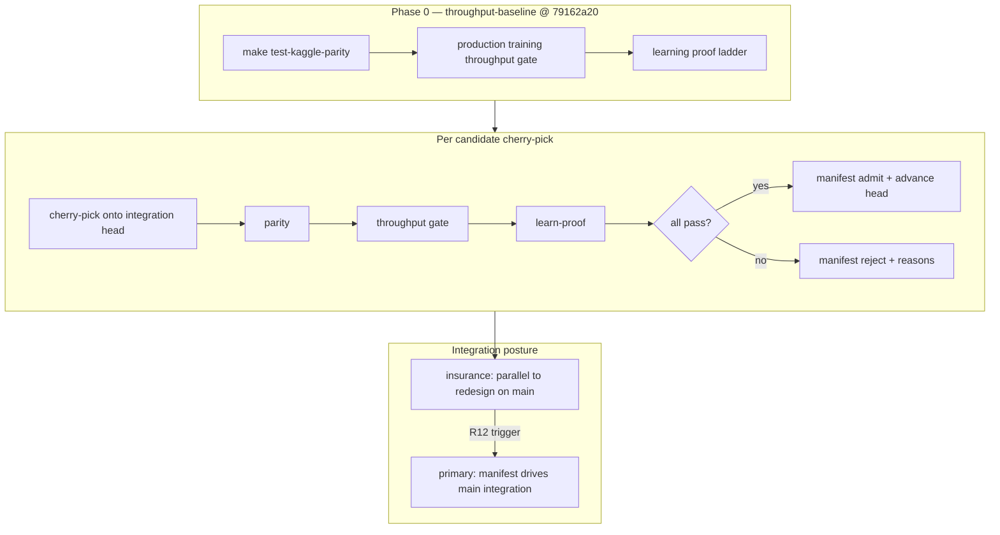

# Requirements: Nuclear Rollback + Cherry-Pick Manifest

## Summary

Establish a **throughput-baseline** integration branch pinned at the documented pre-hygiene SHA, prove **production training throughput** and **learning proof** there, then advance to `main` only via a machine-readable **cherry-pick manifest** that records which commits pass **both** gates while keeping **Kaggle mechanics parity** green. This is **insurance** during semantic rollout redesign — not the first recovery move.

---

## Problem Frame

Post–within-turn launch dedup masks (launch hygiene), the **production training throughput gate** (tier-2) fails by ~75% against the pre-hygiene baseline captured at `79162a2088160b8ed05c3e3a050e064c7f6c9556` (`docs/benchmarks/launch-hygiene-e2e-baseline.json`). Hot-path micro-optimizations are **exhausted** per `docs/plans/2026-06-01-launch-hygiene-rollout-throughput-design.md`. The **learner ablation** (`docs/benchmarks/launch-hygiene-ablation.json`) legitimately keeps within-turn launch dedup masks on `main` — pre-hygiene arm fails `beat_noop`; hygiene arm VERIFIED through `beat_random` — but ~2.4K env_steps/sec is impractical for submission-scale training volume.

Operators face three bad defaults: **blind revert** (restores throughput, destroys learning signal), **blind forward** (keeps learning, accepts unusable training volume), or **untracked cherry-picks** (merge conflict risk, missed interacting commits, no audit trail). The project needs a disciplined recovery path that preserves the **Kaggle mechanics parity** substrate (`make test-kaggle-parity`) while bisecting which post-baseline commits are safe to land on a throughput-known anchor.

---

## Key Decisions

- **Insurance, not primary path.** Cherry-pick manifest work runs **in parallel** with semantic rollout redesign (selected-action validation per `docs/plans/2026-06-01-launch-hygiene-rollout-throughput-design.md`). Escalate manifest-driven integration to **primary** only when redesign attempts fail the production training throughput gate within the calibrated band.

- **Dual gate for every cherry-pick candidate.** A commit may enter the manifest only after passing **both** the **production training throughput gate** (`make test-launch-hygiene-e2e-throughput` vs `docs/benchmarks/launch-hygiene-e2e-baseline.json`, ±10%) **and** the **learning proof ladder** (`make preflight-learn-proof` or `ow benchmark learn-proof` with calibrated gates from `docs/benchmarks/preflight-calibration.json`). Learner ablation is the historical **tiebreaker** for keeping hygiene on `main` when tier-2 is out of band; it does **not** waive the throughput gate for manifest admission.

- **Kaggle mechanics parity is a blocking prerequisite.** Every candidate evaluation runs `make test-kaggle-parity` before throughput or learning gates. Throughput recovery targets rollout/decoder stack on verified game rules — not env physics rewrites.

- **No blind revert; no hygiene removal without ablation re-run.** Reverting to pre-hygiene wholesale or disabling within-turn launch dedup masks without a fresh learner ablation is out of scope. Cherry-pick is selective forward motion from a throughput anchor, not a hygiene rollback.

- **Manifest extends the ablation JSON pattern.** Machine-readable artifact alongside `docs/benchmarks/launch-hygiene-ablation.json` — same committed-artifact discipline, schema test hook, operator-runbook cross-link. Not a one-off spreadsheet.

- **Baseline anchor is the documented pre-hygiene SHA.** `throughput-baseline` starts at `79162a2088160b8ed05c3e3a050e064c7f6c9556` unless Phase 0 baseline learn-proof fails modern calibrated gates — then document an alternate anchor per ideation decision point (post-hygiene main with tier-2-only relaxation), with rationale recorded in the manifest header.

---

## Actors

- **A1. Human operator** — Owns branch creation, GPU host runs, merge authority to `main`, and manifest sign-off. Runs or supervises gate commands on the canonical RTX-class GPU host used for baseline capture.

- **A2. Coding agent** — Executes bisect/cherry-pick trials, records gate artifacts, updates manifest JSON, and proposes ordered integration — does **not** merge to `main` without human approval.

- **A3. CI / pre-merge policy** — Enforces `make test-kaggle-parity` on PRs; production training throughput gate remains operator/GPU-gated until CI variance budget exists (consistent with existing tier-2 posture).

---

## Requirements

### Baseline and branch

- R1. Create and document a **`throughput-baseline`** branch at SHA `79162a2088160b8ed05c3e3a050e064c7f6c9556` (first parent of PR #163 merge per `docs/benchmarks/launch-hygiene-e2e-baseline.json` merge topology notes).

- R2. On `throughput-baseline`, capture and commit proof artifacts: production training throughput gate PASS (within ±10% band), learning proof ladder outcome (even if NOT_VERIFIED — records the anchor's learnability ceiling), and Kaggle mechanics parity green (`make test-kaggle-parity`).

- R3. Document baseline procedures in `docs/operator-runbook.md` under a **Cherry-pick manifest** section cross-linking this doc, the manifest path, and dual-gate command recipes (primary preset: `task=shield_cheap`, `model=transformer_factorized` per baseline JSON).

### Manifest artifact

- R4. Maintain a committed machine-readable manifest at `docs/benchmarks/cherry-pick-manifest.json` extending the shape of `docs/benchmarks/launch-hygiene-ablation.json`:

  | Field group | Purpose |
  |-------------|---------|
  | `manifest_id`, `assessed_date`, `baseline_sha`, `baseline_branch` | Anchor identity |
  | `baseline_gates` | Throughput, learn-proof, parity verdicts on anchor |
  | `criterion` | Dual gate definition (throughput AND learning AND parity per candidate) |
  | `candidates[]` | Per-commit: `sha`, `subject`, `cherry_pick_order`, `parity`, `throughput_e2e`, `learn_proof`, `verdict` (`admit` \| `reject` \| `pending`), `reject_reasons[]` |
  | `integration_state` | `ordered_shas[]`, `last_integrated_sha`, `escalation_status` (`insurance` \| `primary`) |
  | `decision` | Human-readable summary string |

- R5. Each `candidates[]` entry records gate artifacts by path (repo-relative or `outputs/` convention) — same traceability pattern as `arms.*.learn_proof.artifact` in the ablation JSON.

- R6. Add schema guard test mirroring `tests/test_training_benchmark_gate.py::test_committed_launch_hygiene_ablation_artifact` for the committed manifest (required fields, verdict enum, baseline SHA pin).

### Candidate evaluation

- R7. Evaluate post-baseline commits in **topological order** (merge-base → `main` tip), typically one commit or minimal logical group per trial — bisect-friendly, not bulk merge.

- R8. Per candidate, run gates in order: (1) `make test-kaggle-parity`, (2) production training throughput gate, (3) learning proof ladder — on the **candidate cherry-picked onto current manifest integration head** (worktree or branch), with `env -u JAX_COMPILATION_CACHE_DIR ORBIT_WARS_PYTEST_JAX_CACHE=0` per AGENTS.md.

- R9. **Admit** only when all three pass. **Reject** with structured `reject_reasons` (e.g. `parity_fail`, `throughput_floor`, `learn_proof_beat_noop`). **Pending** for not-yet-run commits.

- R10. Removing or disabling **within-turn launch dedup masks** on any candidate requires a **fresh learner ablation** against pre-hygiene and hygiene arms before manifest admission — no shortcut around `docs/solutions/tooling-decisions/launch-hygiene-learner-ablation-gate.md`.

### Integration and escalation

- R11. **Insurance mode (default):** Manifest records candidates; integration head advances on `throughput-baseline` (or a `throughput-baseline-integration` branch) without blocking semantic redesign work on `main`.

- R12. **Primary escalation triggers** — set `escalation_status: primary` when **any** of:
  - Selected-action validation (or paired no-op gate prototype) fails to reach the production training throughput band after bounded iteration (ideation Phase 1 decision point), **or**
  - Human operator declares training volume blocker with documented gate failures on `main`, **or**
  - Ordered manifest integration produces a branch that passes dual gate with strictly better learn-proof than anchor while meeting throughput band — ready to supersede `main` as integration target.

- R13. Integration back to `main` is **human-merge authority** — agents propose `ordered_shas` and conflict notes; no automated merge to `main`.

- R14. Do **not** remove within-turn launch dedup masks from production training paths as part of nuclear recovery unless a new ablation documents learner regression acceptance.

---

## Key Flows

- F1. **Phase 0 — anchor proof**
  - **Trigger:** Manifest effort starts.
  - **Actors:** A1, A2
  - **Steps:** Create `throughput-baseline` at `79162a20`; run parity → throughput gate → learn-proof; initialize `docs/benchmarks/cherry-pick-manifest.json` with baseline_gates.
  - **Outcome:** Documented anchor with honest learn-proof ceiling (expected: throughput PASS, learn-proof may NOT_VERIFIED per ablation arm A).

- F2. **Candidate trial**
  - **Trigger:** Next commit in bisect queue.
  - **Actors:** A2 (execute), A1 (review)
  - **Steps:** Cherry-pick onto integration head in worktree; R8 gate sequence; append `candidates[]` entry; advance integration head only on `admit`.
  - **Outcome:** Manifest records admit/reject with artifact paths.

- F3. **Primary escalation integration**
  - **Trigger:** R12 condition met.
  - **Actors:** A1
  - **Steps:** Fast-forward or PR-merge manifest `ordered_shas` branch; re-run full dual gate + parity on integration tip; update `escalation_status` and `decision`.
  - **Outcome:** Human-reviewed merge proposal to `main` with manifest audit trail.

---

## Acceptance Examples

- AE1. **Covers R8, R9**
  - **Given:** Candidate commit touches `src/jax/rollout/collect.py` only; parity green.
  - **When:** Throughput gate reports `env_steps_per_sec` above floor 8798.69 and learn-proof VERIFIED through `beat_noop`.
  - **Then:** Manifest `verdict: admit`; `ordered_shas` appends SHA; integration head advances.

- AE2. **Covers R9, R10**
  - **Given:** Candidate restores throughput but disables within-turn launch dedup masks in training rollout.
  - **When:** Learn-proof passes throughput floor but no fresh learner ablation is recorded.
  - **Then:** Manifest `verdict: reject`; `reject_reasons` includes `hygiene_change_without_ablation`.

- AE3. **Covers R12, R13**
  - **Given:** Selected-action validation branch fails tier-2 band after documented iteration budget; manifest has ≥1 admitted commit with dual-gate pass on integration head.
  - **When:** A1 sets `escalation_status: primary`.
  - **Then:** Operator opens PR from integration branch with manifest `decision` and `ordered_shas`; no agent auto-merge.

- AE4. **Covers R2, baseline anchor decision**
  - **Given:** Phase 0 learn-proof on `79162a20` fails `beat_noop` (consistent with ablation arm A).
  - **When:** Operator evaluates alternate anchor per ideation decision point.
  - **Then:** Manifest `baseline_sha` updates with `decision` rationale; throughput band still references `launch-hygiene-e2e-baseline.json` unless recalibrated.

---

## Success Criteria

- **Anchor established:** `throughput-baseline` exists; baseline_gates recorded in manifest; operator-runbook section links commands.

- **Dual gate operational:** Every admitted manifest entry has parity PASS, throughput within ±10% of `docs/benchmarks/launch-hygiene-e2e-baseline.json`, and learn-proof VERIFIED at minimum through `beat_noop` (calibrated thresholds, no invented relaxations).

- **Audit trail:** Committed `docs/benchmarks/cherry-pick-manifest.json` with schema test; reject reasons explain why selective forward motion stopped.

- **Posture clarity:** `escalation_status` reflects insurance vs primary; semantic redesign remains the expected first recovery path until R12 triggers.

- **Parity non-negotiable:** No admitted candidate with failing `make test-kaggle-parity`.

---

## Scope Boundaries

**In scope:**
- `throughput-baseline` branch and Phase 0 proof runs
- Cherry-pick bisect workflow and committed manifest artifact
- Operator-runbook dual-gate documentation
- Schema test for manifest JSON
- Escalation triggers (insurance → primary)

**Deferred for later:**
- Automated CI enforcement of manifest admission on every PR (GPU variance budget)
- Makefile display-name aliases from nomenclature RFC phase 2
- Framework extraction or package split (blocked until throughput restored per ideation #7)
- Long-campaign wall-clock proof beyond short gate recipes

**Explicitly out of scope:**
- **Blind revert** to pre-hygiene `main` or wholesale hygiene removal
- **Removing within-turn launch dedup masks** without ablation re-run
- **Replacing semantic rollout redesign** as the preferred throughput fix
- **Code mass rename** (nomenclature RFC phase 4)
- **Rewriting Kaggle env physics** — parity fixes belong in parity track, not cherry-pick throughput recovery
- **Relaxing calibrated learning or throughput thresholds** to force manifest admits

---

## Dependencies / Assumptions

- Pre-hygiene baseline artifact is complete (`capture_status: complete` in `docs/benchmarks/launch-hygiene-e2e-baseline.json`).
- Canonical GPU host matches baseline capture class (RTX 5080 / `cuda:0` documented).
- `ow benchmark training`, `make test-launch-hygiene-e2e-throughput`, and `make preflight-learn-proof` remain the gate primitives — no parallel harness.
- Semantic redesign (#2 selected-action validation) proceeds on `main` in parallel; this manifest does not pause that work.
- Git worktree workflow (`git worktree add`) is acceptable for anchor and candidate trials.
- Merge topology after PR #163 may require cherry-picking groups, not single commits, when hygiene bundle landed atomically — manifest `candidates[]` may use `commit_group` label when needed.

---

## Outstanding Questions

**Resolve before planning:**
- **Q1. Merge authority workflow** — Should admitted manifest integration land via a long-lived `throughput-baseline-integration` branch with periodic PRs to `main`, or squash-merge only at primary escalation? (Affects ce-plan branch strategy.)

**Deferred to planning:**
- **Q2. Bisect granularity** — Single-commit vs PR-merge-group default when co-landing commits (e.g. `ce6714b` in baseline JSON) appear in history.
- **Q3. Learn-proof model size on baseline** — Use `transformer_factorized_small` (ablation parity) or `transformer_factorized` (tier-2 primary profile) for manifest candidates; may differ between anchor proof and admission gates.
- **Q4. Iteration budget** — How many redesign attempts on `main` before mandatory primary escalation (numeric threshold vs human judgment only).

---

## Sources / Research

- `docs/ideation/2026-06-05-orbit-wars-continuation-directions.md` — survivor #1 ranked idea, Phase 0–1 sequencing, insurance posture
- `docs/nomenclature-rfc.md` — user-facing terms (production training throughput gate, within-turn launch dedup masks, Kaggle mechanics parity, learning proof ladder)
- `docs/benchmarks/launch-hygiene-e2e-baseline.json` — anchor SHA, primary profile, pass band
- `docs/benchmarks/launch-hygiene-ablation.json` — dual-arm learn-proof vs throughput evidence
- `docs/plans/2026-06-01-launch-hygiene-rollout-throughput-design.md` — hot-path exhausted; selected-action validation as primary redesign
- `docs/solutions/tooling-decisions/launch-hygiene-learner-ablation-gate.md` — ablation tiebreaker rules; hygiene removal guard
- `docs/operator-runbook.md` — tier-2 and learner ablation procedures
- `AGENTS.md` — gate commands, threshold calibration policy, Kaggle parity facts
