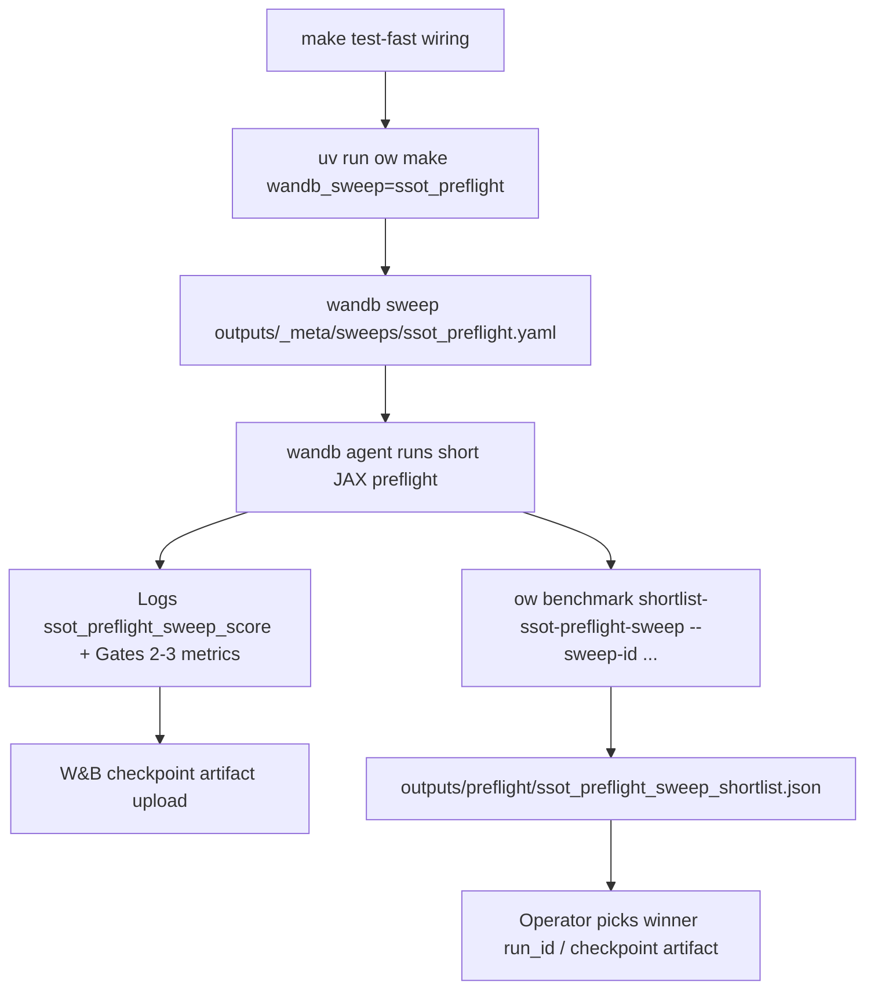
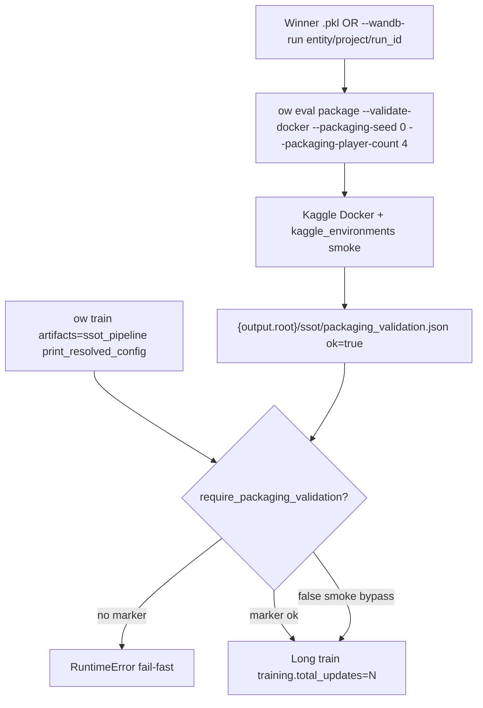

# Dogfood: SSOT U1–U4 handoff (PR #215)

**Branch:** `feat/ssot-u1-u4-handoff` (in-place checkout; optional worktree: `git worktree add ../orbit_wars-ssot-dogfood feat/ssot-u1-u4-handoff`)  
**Scope:** W&B `ssot_preflight` sweep compose, shortlist CLI, Docker packaging validation marker, `artifacts=ssot_pipeline` train gate — not full-app browser QA.  
**Working tree:** Uncommitted WIP on several U1–U4 files plus this report; one local commit for telemetry fix (see Commits).

## Flowcharts

### W&B ssot_preflight sweep → shortlist → winner checkpoint

### Docker packaging validation → marker JSON → long train gate

## Task matrix

| ID | Scenario | Status | Notes |
|----|----------|--------|-------|
| P0 | Branch `feat/ssot-u1-u4-handoff` (not main) | **Pass** | In-place on feature branch |
| P1 | `git diff main...HEAD` reviewed (U1–U4) | **Pass** | ~737 LOC: shortlist, wandb-run resolve, packaging gate, ssot_pipeline profile |
| T1 | `uv run ow make wandb_sweep=ssot_preflight` | **Pass** | Wrote `outputs/_meta/sweeps/ssot_preflight.yaml` |
| T2 | `ow benchmark shortlist-ssot-preflight-sweep --help` | **Pass** | Documents `--sweep-id`, entity, project, `--out`, `--limit` |
| T3 | Targeted unit tests (shortlist, packaging gate, wandb resolve, CLI) | **Pass** | 12 tests + 2 `test_ssot_pipeline_config` |
| T4 | Packaging marker write/read without Docker | **Pass** | `write_packaging_validation_record` + gate assert via Python smoke |
| T5 | `ow eval package --validate-docker` (real Docker) | **Pass** | Fresh ckpt from 2-update smoke; ~48s; marker at `/tmp/ow_dogfood_marker3.json` |
| T6 | Shortlist against real W&B sweep | **Blocked** | No `--sweep-id` provided; operator GPU/W&B sweep run required |
| T7 | `ow train print_resolved_config=true artifacts=ssot_pipeline` | **Pass** | Composes; gate skipped when `print_resolved_config` (by design) |
| T8 | Train without marker → clear RuntimeError | **Pass** | Actionable message with marker path + bypass hint |
| T9 | Train smoke `total_updates=2` | **Pass** | Bypass: `require_packaging_validation=false`; gated: marker under `output.root/ssot/` |

## Environment

| Check | Result |
|-------|--------|
| Docker available | **Yes** (`docker info` ok) |
| W&B authenticated | **Yes** via `~/.netrc` (train run synced); `wandb status` shows null api_key in JSON but login works |
| Local checkpoint .pkl | Legacy May checkpoints **fail** load; fresh smoke ckpt works |

## Paper cuts

1. **`artifacts=ssot_pipeline` train crashed** on first JSONL write with unregistered `ssot_qualifier_*` / `ssot_rollout_family_prob_*` metrics — **fixed** in local commit `fix(telemetry): register SSOT qualifier metrics…`.
2. **Marker path vs Hydra:** CLI default marker `outputs/ssot/packaging_validation.json` matches train gate when `output.root=outputs` (default). Override `output.root` requires marker at `{root}/ssot/packaging_validation.json` or copy marker there. `artifacts.ssot_pipeline.packaging_validation_path` exists in schema but **not** in Hydra struct — use `+artifacts.ssot_pipeline.packaging_validation_path=...` or file copy.
3. **Legacy checkpoints** under `outputs/campaigns/bench_100_baseline` and `train_refactor_smoke` fail packaging with `checkpoint_load_failed` (pre-migration schema). Operators need a current-schema ckpt (e.g. post-sweep winner or short smoke train).
4. **`output.root` + `output.campaign` together** produced nested `.../campaigns/<c>/campaigns/<c>/runs/...` in one gated smoke — avoid redundant `output.root` when campaign already scopes under `outputs/campaigns/`.

## Decisions for human

| # | Decision | Recommendation |
|---|----------|----------------|
| D1 | Include telemetry registry commit in PR #215 before merge | **Yes** — blocks any real `ssot_pipeline` long train without it |
| D2 | Run T6 on a finished `ssot_preflight` sweep | Operator: `wandb sweep …` then `ow benchmark shortlist-ssot-preflight-sweep --sweep-id <id> --out outputs/preflight/ssot_preflight_sweep_shortlist.json` |
| D3 | Expose `packaging_validation_path` in `conf/artifacts/ssot_pipeline.yaml` | Optional follow-up for Hydra overrides without `+` |
| D4 | Uncommitted WIP on branch (eval, shortlist, tests) | Review diff vs committed U1–U4 before merge |

## Commits from dogfood fixes

| SHA | Message |
|-----|---------|
| (local, ahead 1) | `fix(telemetry): register SSOT qualifier metrics for ssot_pipeline train` |

**Not committed:** this report, other unstaged U1–U4 file edits.

## PR #215 recommendation

**Approve after D1:** U1–U4 operator spine (compose sweep, shortlist CLI, `--wandb-run` packaging, JSON marker gate) is **verified on CLI** with targeted tests and live Docker packaging on a fresh checkpoint. **Blocker found and fixed:** missing SSOT telemetry registration for long train — cherry-pick or rebase the dogfood commit onto the PR branch.

**Human follow-up before production long train:** finished W&B sweep + shortlist (T6), packaging winner ckpt with `--validate-docker`, marker at default `outputs/ssot/packaging_validation.json`, then `ow train artifacts=ssot_pipeline` without bypass.

**Verdict:** `ready-with-fixes` (telemetry commit required; T6 sweep shortlist left to operator).
