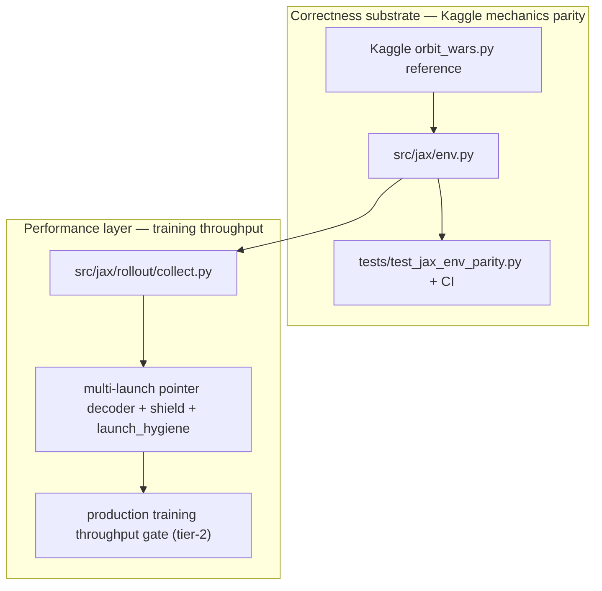

# Nomenclature RFC — user-facing naming layer

Orbit Wars accumulated internal jargon (`tier-1`, `launch hygiene`, `Planet Flow`, …) that hides what systems actually measure or enforce. This RFC proposes **descriptive user-facing terms** while keeping **stable code identifiers** until a later migration.

---

## Problem statement

Several high-traffic terms name **history or implementation detail**, not behavior:

| Symptom | Example |
|---------|---------|
| Throughput gates sound sequential but measure different scopes | **tier-1** (isolated sampler ms) vs **tier-2** (full training env_steps/sec) — both labeled “launch hygiene” though tier-2 gates **whole training throughput**, not hygiene correctness |
| “Hygiene” suggests repo cleanup | **launch hygiene** is **within-turn launch dedup masks** in the K-step decoder stack |
| “Planet flow” suggests env physics | **Planet Flow** is an **experimental demand-heatmap action compiler** — unrelated to `src/game/planet_generation.py` or comet parity |
| Correctness and performance are conflated in prose | **Kaggle mechanics parity** (CI-gated, `make test-kaggle-parity`) is orthogonal to the **production training throughput gate** crisis |

Newcomers and insiders both lose time mapping jargon to two parallel tracks: **correctness substrate** vs **training throughput**.

---

## Two parallel tracks

- **Kaggle mechanics parity** — “Does the JAX env match tournament game rules?” Guard: `make test-kaggle-parity`, `.github/workflows/kaggle-jax-parity.yml`.
- **Production training throughput** — “Can we afford enough env steps to learn on the hot path?” Guard: `make test-launch-hygiene-e2e-throughput` (legacy name **tier-2**).

Launch hygiene **slowed** the throughput gate without breaking parity tests — evidence the tracks are independent.

---

## Alias table (old → proposed user-facing term)

| Old term | Proposed user-facing term | One-line definition | Primary paths |
|----------|---------------------------|---------------------|---------------|
| tier-1 | **factorized sampler microbenchmark** | Isolated K=5 decoder wall time ≤ 3.22 ms | `Makefile` L61–64, `ow benchmark factorized-sampler` |
| tier-2 | **production training throughput gate** | Full rollout+PPO vs pre-hygiene baseline ±10% on same GPU | `Makefile` L68–75, `docs/benchmarks/launch-hygiene-e2e-baseline.json` |
| launch hygiene | **within-turn launch dedup masks** | Block duplicate `(source, target_slot)` and friendly reverse relays per turn | `src/jax/launch_hygiene.py`, `src/jax/action_sampling.py` |
| Planet Flow | **demand-heatmap action compiler** (experimental) | Policy heatmap → catalog-constrained launches | `src/jax/planet_flow.py`, `conf/model/planet_flow_target_heatmap.yaml` |
| ComposablePlanetFlowPolicy | **planet demand policy** | Flax module for heatmap layout | `src/jax/policy.py` |
| preflight gates | **calibrated learning gates** | YAML recipes + JSONL trend checks (Gates 2–5) | `conf/benchmark/gates/`, `src/jax/preflight.py` |
| learn-proof | **learning proof ladder** (workflow) | Composed gates 2–5 CLI workflow | `ow benchmark learn-proof`, `make preflight-learn-proof` |
| hybrid promotion | **async checkpoint eval promotion** | Docker validate → unified tournament → promote on improvement | `conf/artifacts/hybrid_promotion.yaml` |
| factorized decoder / K-step | **multi-launch pointer decoder** | Up to K sub-launches per env step via `jax.lax.scan` | `src/jax/action_sampling.py`, `max_moves_k` in model config |
| trajectory shield | **launch trajectory legality filter** | Simulated fleet path check before launch | `src/jax/shield/`, `conf/task/shield_*.yaml` |
| env / kaggle / jax env parity | **Kaggle mechanics parity** | JAX env matches Kaggle reference rules (planets, comets, combat, obs replay) | `tests/test_jax_env_parity.py`, `make test-kaggle-parity` |

When revising docs, use the **proposed term** in prose and add **one parenthetical** with the old symbol on first mention, e.g. “production training throughput gate (tier-2).”

---

## Naming principles

1. **Name the measurement or behavior**, not the PR that introduced it (e.g. “production training throughput gate” not “tier-2”).
2. **Hierarchical labels where helpful:** `{domain}.{scope}` — benchmark class vs feature vs artifact profile.
3. **Separate correctness from performance** in all user-facing prose (Kaggle mechanics parity ≠ throughput gate).
4. **One parenthetical mapping** when introducing new terms; old symbols live in this alias table.
5. **Code identifiers stay stable** during doc-first migration — rename Makefile help and docs before Python modules.

---

## Makefile / CLI mapping appendix

### Throughput benchmarks

| Proposed display name | Existing target / command | Notes |
|----------------------|---------------------------|-------|
| factorized sampler microbenchmark (tier-1) | `make test-launch-hygiene-throughput` | `PERF1` in `Makefile` L60–64; isolated process |
| production training throughput gate (tier-2) | `make test-launch-hygiene-e2e-throughput` | `PERF2` in `Makefile` L66–75; **tier-1 pass does not imply tier-2 pass** |
| — | `uv run ow benchmark factorized-sampler --max-moves-k 5 …` | Underlying tier-1 CLI |
| — | `uv run ow benchmark training --preset primary --baseline docs/benchmarks/launch-hygiene-e2e-baseline.json --assert-within-pct 10` | Underlying tier-2 CLI; see `docs/operator-runbook.md` |

### Correctness

| Proposed display name | Existing target / command | Notes |
|----------------------|---------------------------|-------|
| Kaggle mechanics parity | `make test-kaggle-parity` | `tests/test_jax_env_parity.py`, `tests/test_jax_env.py`, `tests/test_jax_env_dispatch.py`; CI: `.github/workflows/kaggle-jax-parity.yml` |

### Learning / submit-valid

| Proposed display name | Existing target / command | Notes |
|----------------------|---------------------------|-------|
| calibrated learning gates | `uv run ow benchmark gate run <name>` | Primitives in `conf/benchmark/gates/` |
| learning proof ladder (workflow) | `make preflight-learn-proof` / `ow benchmark learn-proof` | Prefer `gate run` for agents |
| async checkpoint eval promotion | `uv run ow train artifacts=hybrid_promotion …` | Submit-valid funnel; see `AGENTS.md` |

### Proposed Makefile aliases (phase 2 — not implemented yet)

| Proposed alias | Maps to |
|----------------|---------|
| `test-factorized-sampler-microbench` | `test-launch-hygiene-throughput` |
| `test-production-throughput-gate` | `test-launch-hygiene-e2e-throughput` |

---

## Stable code identifiers (do not rename in phase 1)

Keep these symbols until RFC phase 4 (optional code rename):

| Identifier | Why stable |
|------------|------------|
| `src/jax/launch_hygiene.py` | ~120+ references; module name is search anchor |
| Gate id `launch_hygiene_e2e_throughput` | `docs/benchmarks/launch-hygiene-e2e-baseline.json`, `src/jax/training_benchmark.py` |
| Makefile targets `test-launch-hygiene-*` | CI/docs/scripts reference exact names |
| `ComposablePlanetFlowPolicy`, `planet_flow.py` | Large test/sweep surface (~500+ hits) |
| Hydra groups `artifacts=hybrid_promotion`, `conf/task/shield_*` | Checkpoint and campaign compatibility |

Doc pass only: dual labels in prose and `make help`, not mass renames.

---

## Migration phases

| Phase | Scope | Risk |
|-------|-------|------|
| **1 — Docs** | This RFC, ideation cross-links, `ONBOARDING.md` pointer, operator-runbook dual labels (optional) | Low |
| **2 — Makefile / CLI help** | Alias targets + dual display names in `make help` | Low |
| **3 — Artifacts / gate ids** | Optional JSON `display_name`; keep machine ids (`launch_hygiene_e2e_throughput`) | Medium |
| **4 — Code rename** | Python modules and config keys only if RFC approved | High |

**Current status:** phase 1 (this document).

---

## Related docs

- [Operator runbook](operator-runbook.md) — throughput gate procedures
- [Production throughput profiling](solutions/developer-experience/production-training-throughput-profiling.md) — throughput recovery vs parity substrate tradeoffs
- [JAX comet subsystem plan](solutions/architecture-patterns/jax-comet-kaggle-parity-ci-gate.md) — parity work example
- [CI Kaggle/JAX parity plan](solutions/architecture-patterns/jax-comet-kaggle-parity-ci-gate.md)
- [ONBOARDING.md](ONBOARDING.md) — Key Concepts §3 (Python ↔ JAX parity)
