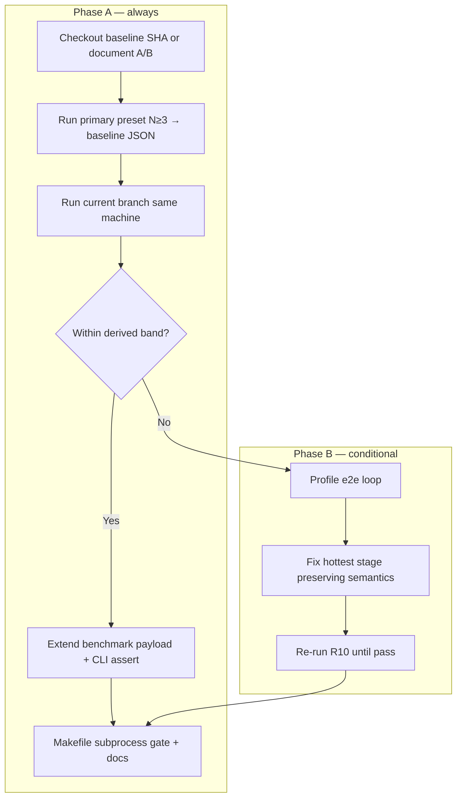
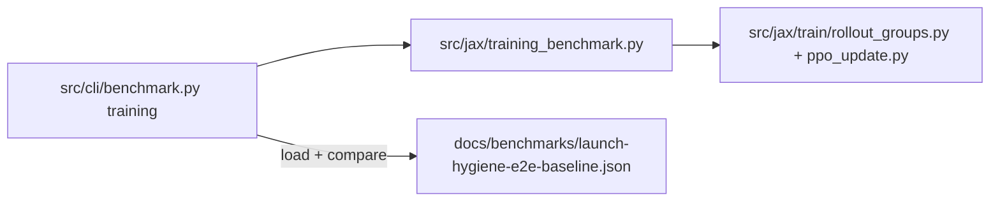

# Plan: Launch hygiene end-to-end throughput verification and recovery

## Summary

Establish a **production-aligned** throughput gate on `ow benchmark training` with a measured pre-hygiene baseline at `docs/benchmarks/launch-hygiene-e2e-baseline.json`, then recover full-loop performance only if the gap exceeds the derived pass band. Phase A (verification) is always required; Phase B (hot-path optimization) is conditional on baseline comparison. The factorized sampler microbenchmark remains tier-1 only (see origin R6).

## Problem Frame

Incremental carry work from `docs/plans/2026-06-01-002-fix-launch-hygiene-throughput-plan.md` addressed sampler-level regression, but operators still perceive slower training and **no paired e2e measurements** exist. `ow benchmark training` today emits `env_steps_per_sec` and `seconds_per_update_mean` but not `samples_per_sec`, has no `task=shield_cheap` primary profile, and always exits 0 — so merge confidence can rest on the wrong benchmark tier.

This plan closes the verification gap first (R1–R4, R6, R10–R11), then applies behavior-preserving hot-path fixes only when quantified gap demands it (R5, R7–R8). (see origin: `docs/brainstorms/2026-06-01-launch-hygiene-e2e-throughput-requirements.md`)

---

## Requirements

Traceability to origin requirements (R1–R11). Grouped by concern.

### Verification and baseline

- R1. Pre-hygiene baseline artifact at `docs/benchmarks/launch-hygiene-e2e-baseline.json` (SHA, merge topology, device, N≥3 runs, aggregates, operator wall-clock example).
- R2. Extend `ow benchmark training` on the production path (rollout + PPO + env), not a parallel harness.
- R3. Payload includes `env_steps_per_sec`, `samples_per_sec`, `seconds_per_update_mean`, `compile_seconds_to_update_3`.
- R4. Primary profile explicitly includes `task=shield_cheap`; secondary profile documented (P1 gating).
- R5. Post-recovery gate: primary profile within derived pass band on **same machine** as baseline.
- R6. Tier-1 `scripts/benchmark_factorized_sampler.py` retained; documented as non-authoritative for merge throughput.

### Performance recovery (conditional)

- R7. If gap exceeds band: reduce full-loop overhead while preserving origin bundle launch hygiene semantics (`docs/brainstorms/2026-06-01-launch-hygiene-bundle-requirements.md` R1–R10).
- R8. Hot-path work covers all factorized decoder paths implicated by profiling (rollout, PPO replay, builders/opponents).
- R9. No production default to disable hygiene; dev-only A/B toggle acceptable if documented and excluded from promotion.

### Regression prevention

- R10. **(P0)** CLI e2e gate (~20 updates, measured-window metrics, `--assert-within-pct` vs baseline); subprocess/CLI exit code, not pytest wall-time.
- R11. **(P0)** Document e2e gate in `AGENTS.md` and `ow benchmark` help.

### Origin bundle cross-reference (Phase B only)

When implementing R7–R8, use **origin bundle** IDs — not this doc’s R7–R10:

| This doc | Origin bundle (`launch-hygiene-bundle-requirements`) |
|----------|-----------------------------------------------------|
| R7 recovery semantics | Origin R1–R6 hygiene rules |
| R8 all decoder paths | Origin R7–R8 builder merge backstop, R10 opponent boundaries |
| Rollout↔replay parity | Origin R9 |

---

## Key Technical Decisions

**KTD1 — Authoritative gate is e2e training benchmark, not sampler microbench.** `make test-launch-hygiene-throughput` stays tier-1; merge throughput health requires `ow benchmark training` vs baseline (origin e2e-over-microbenchmark decision).

**KTD2 — Baseline SHA: first parent of PR #163 merge on `main`.** Merge commit `96bf882eebb30f2d6c2d4f11a4c7150a8e271c23` (PR #163, **merge commit**, not squash). First parent `79162a2088160b8ed05c3e3a050e064c7f6c9556` is the default pre-hygiene checkout (main before launch hygiene). Second parent `6e75826949097cd7acd7ea87c0f699175c7b0b92` is the PR branch tip (full hygiene bundle + incremental carry). Co-landing on `main` after merge includes docs/compound commits (e.g. `ce6714b`); baseline capture uses the first-parent SHA unless operator documents A/B on current code.

**KTD3 — Pass band derived from baseline measurement, not invented constants.** Default derivation for P0: `within_pct` default **10** (recovery target from origin); floors for higher-is-better metrics (`env_steps_per_sec`, `samples_per_sec`): `mean × (1 − within_pct/100)`; ceiling for `seconds_per_update_mean`: `mean × (1 + within_pct/100)`. All three metrics must pass (AND). Store `within_pct`, per-metric floors/ceilings, and raw aggregates in the baseline artifact. Do not relax floors until a post-fix run passes under the same recipe (AGENTS.md calibration policy).

**KTD4 — Primary profile preset in `training_benchmark.py`.** New `PRIMARY_E2E_OVERRIDES` (or `--preset primary`): `task=shield_cheap`, `model=transformer_factorized`, `opponents=self_play_only`, `curriculum=off`, `seed=42`, telemetry/artifacts off as needed for stable timing — exact list captured in baseline JSON after `uv run ow train print_resolved_config=true` with those overrides.

**KTD5 — `samples_per_sec` matches production benchmark semantics.** Sum `rollout_metrics["samples"]` over measured updates; divide by sum of measured update wall seconds (mirror `src/jax/benchmark.py` `production_benchmark_payload`, aligned with aggregate `samples_per_sec` in `src/jax/train/telemetry.py`). Prefer summed rollout `env_steps` for `env_steps_per_sec` when adding samples (today uses theoretical `measured × rollout_steps × total_envs`) so gate metrics match telemetry.

**KTD6 — R10 gate runs outside pytest.** Add `make test-launch-hygiene-e2e-throughput` (or similar) that subprocesses `uv run ow benchmark training ... --assert-within-pct ... --baseline docs/benchmarks/launch-hygiene-e2e-baseline.json` with documented JAX cache env (`env -u JAX_COMPILATION_CACHE_DIR ORBIT_WARS_PYTEST_JAX_CACHE=0`, matching tier-1). Parser/contract tests in pytest; no in-process JAX timing assertions for pass/fail.

**KTD7 — Phase B is optional after gap assessment.** After R1 capture, run current `main`/branch on the same machine with primary preset; if all three metrics within band, ship Phase A only and skip U6.

**KTD8 — Default R10 run shape.** `--updates 20 --warmup 2` (18 measured updates); compile-to-update-3 reported but not gated. Document in CLI help (deferred planning question resolved here).

---

## High-Level Technical Design

### Phase A / B gate flow

### Benchmark extension seam

---

## Scope Boundaries

**In scope:** Baseline capture; `ow benchmark training` extension; behavior-preserving Phase B optimizations; tier-1 microbenchmark retention; operator docs.

**Deferred for later (origin):**
- Long campaign wall-clock proof
- Kaggle Docker path throughput unless e2e gate shows replay/env gap there
- Hygiene block-rate telemetry
- R10 on shared GPU CI until variance budget exists
- Secondary profile automated gating (P1)

**Deferred to Follow-Up Work (plan-local):**
- Aligning `env_steps_per_sec` definition with `issues_jax_30update_benchmark.py` timing splits (`rollout_seconds_mean`, `update_seconds_mean`) in the same payload
- Optional `--preset validation` secondary baseline sibling JSON

**Outside this effort's identity (origin):**
- Disabling hygiene in production for throughput
- Semantic hygiene changes without new behavioral requirements
- Gating on learning-signal or tournament metrics

---

## Implementation Units

### U1. Add throughput metrics to training benchmark

**Goal:** Emit R3 metrics from the production-aligned short training loop.

**Requirements:** R3 (partial), R2 (foundation)

**Dependencies:** None

**Files:**
- `src/jax/training_benchmark.py`
- `tests/test_training_benchmark.py` (create if missing; else extend `tests/test_jax_benchmark.py` patterns)

**Approach:**
- Accumulate `samples` and `env_steps` from summed `rollout_metrics` over measured updates (mirror `src/jax/benchmark.py`).
- Add `samples_per_sec` and optional `samples` total to `TrainingBenchmarkResult` and `training_benchmark_payload`.
- Keep `compile_seconds_to_update_3` unchanged; measured window excludes warmup iterations (existing `iteration >= warmup` logic).

**Patterns to follow:** `run_production_benchmark` / `production_benchmark_payload` in `src/jax/benchmark.py`; aggregate `samples_per_sec` in `src/jax/train/telemetry.py`.

**Test scenarios:**
- Covers AE2 (partial). Given a stubbed or minimal benchmark run fixture, when `training_benchmark_payload` is built, then payload contains `samples_per_sec`, `env_steps_per_sec`, `seconds_per_update_mean`, and `compile_seconds_to_update_3`.
- Given measured_updates=2 and known rollout metric totals, when payload is computed, then `samples_per_sec` equals total samples divided by total measured seconds (within float tolerance).
- Given warmup=2 and updates=5, when benchmarking, then timing averages use only post-warmup updates (3 measured).

**Verification:** Unit test passes; manual `uv run ow benchmark training --label smoke --out /tmp/smoke.json` shows new fields.

---

### U2. Primary e2e profile preset and CLI wiring

**Goal:** R4 primary profile (`task=shield_cheap`) is one flag away from operators.

**Requirements:** R4, R2

**Dependencies:** U1

**Files:**
- `src/jax/training_benchmark.py`
- `src/cli/benchmark.py`
- `tests/test_benchmark_cli.py`
- `tests/test_config_consolidation.py` (compose check for new preset)

**Approach:**
- Add `PRIMARY_E2E_OVERRIDES` tuple and `--preset primary` (name TBD: `primary` or `e2e`) in `resolve_benchmark_overrides`.
- Document override bundle in CLI help and (after capture) in baseline JSON.
- Set R10-friendly defaults on `training` subcommand: `--updates 20`, keep `--warmup 2` (only when preset primary or new `--gate throughput` flag — avoid breaking existing stability runs using default 30).

**Patterns to follow:** `WORKSTATION_VALIDATION_OVERRIDES` / `--preset validation`; `PRIMARY_TRAIN_PROFILES["shield_cheap"]` in `tests/test_config_consolidation.py`.

**Test scenarios:**
- Given `--preset primary`, when overrides resolve, then list includes `task=shield_cheap` and `model=transformer_factorized`.
- Given `compose_benchmark_config` with primary overrides, when composed, then Hydra config validates without error.
- Parser test: `ow benchmark training --help` mentions primary/e2e preset and shield_cheap.

**Verification:** `uv run ow benchmark training --preset primary --label compose --out /tmp/compose.json` composes and runs on GPU host.

---

### U3. Baseline artifact capture and gap assessment

**Goal:** R1 baseline JSON exists; Phase B entry is evidence-based (F1 + implied F1.5).

**Requirements:** R1, R5 (baseline side), F1

**Dependencies:** U1, U2

**Files:**
- `docs/benchmarks/launch-hygiene-e2e-baseline.json` (create via capture, commit after measurement)
- `docs/benchmarks/README.md` or short note in `docs/benchmarks/preflight-calibration.md` (capture runbook pointer — only if benchmarks docs already index artifacts)
- Optional: `src/jax/training_benchmark.py` helper `baseline_aggregate_schema` for validation

**Approach:**
- **Capture runbook (operator, not code):** git worktree at SHA `79162a2088160b8ed05c3e3a050e064c7f6c9556` (first parent of merge `96bf882e…`, pre-hygiene main); `uv sync` at that SHA; same GPU machine as post-hygiene runs; N≥3 repetitions with fixed seed and cache env; use `--preset primary --updates 20 --warmup 2 --repeats 3 --out docs/benchmarks/launch-hygiene-e2e-baseline.json`.
- Artifact schema: `gate`, `commit_sha`, `merge_topology_notes`, `co_landing_commits`, `run_date`, `device` (`gpu`, `jax_version`, `devices`, `default_backend`), `primary_profile` (overrides, updates, warmup), `runs[]`, `aggregate` (mean/stddev per metric), `pass_band` (`within_pct`, floors, ceilings), `operator_example`.
- **Gap assessment (F1.5):** Immediately after capture, run current branch with identical flags on same machine; record `gap_assessment` subsection in artifact or companion commit message; if within band → skip U6.

**Patterns to follow:** `docs/benchmarks/validation-seed-sweep-summary.json` aggregates; single-run fields from `docs/benchmarks/validation-seed-45-500u.json`; threshold discipline from `docs/benchmarks/preflight-calibration.json`.

**Test scenarios:**
- Given a fixture baseline JSON with known mean/stddev, when schema validator runs, then required keys present and N≥3 runs enforced.
- Given aggregate mean 100 env_steps/s and within_pct 10, when floors computed, then env_steps floor is 90.
- T-F1-3: Document seed fixed at 42 in profile; outlier runs (e.g. seed 43 cold-start) recorded, not silently dropped unless operator annotates exclusion.

**Verification:** Committed `launch-hygiene-e2e-baseline.json` with real measurements; gap assessment note states Phase B in or out.

---

### U4. Baseline comparison and assert exit code on CLI

**Goal:** R10 automated gate via `ow benchmark training` subprocess.

**Requirements:** R2, R5, R10, F2; Covers AE1

**Dependencies:** U1, U2, U3

**Files:**
- `src/jax/training_benchmark.py` (comparison helpers)
- `src/cli/benchmark.py`
- `tests/test_benchmark_cli.py`
- `tests/test_training_benchmark_gate.py` (new — pure comparison logic, no GPU)

**Approach:**
- Add flags: `--baseline PATH`, `--assert-within-pct PCT` (default from baseline or 10), optional `--device-check strict|warn` comparing GPU string to baseline.
- Load baseline JSON; compute floors/ceilings from `aggregate` or embedded `pass_band`; compare run means over measured window only.
- On failure: print failing metrics, expected floor/ceiling, actual; return exit code 1. On success: return 0.
- Optional `--repeats N` for capture mode (write aggregate to `--out`); single run for CI/local gate.

**Patterns to follow:** `scripts/benchmark_factorized_sampler.py --assert-max-ms`; preflight threshold comparison style in `src/jax/preflight_calibration.py`.

**Test scenarios:**
- Covers AE1. Given baseline with env_steps mean 4000 and within_pct 10, when measured env_steps 3700, then CLI exits non-zero and names `env_steps_per_sec`.
- Given all three metrics within band, when assert runs, then exit 0.
- Given missing baseline file, when assert runs, then exit non-zero with clear error.
- Given baseline GPU string ≠ current device and strict check, when assert runs, then fail or warn per KTD (default warn + require `--force` to compare).
- Warmup updates do not affect compared means (T-A7).

**Verification:** Local subprocess gate pass/fail against committed baseline; no pytest GPU wall-time gate.

---

### U5. Makefile tier-2 gate and non-authoritative tier-1 docs

**Goal:** R6 + R10 operational entrypoint; tier-1/tier-2 layering explicit.

**Requirements:** R6, R10, R11 (partial)

**Dependencies:** U4

**Files:**
- `Makefile`
- `docs/solutions/performance-issues/launch-hygiene-incremental-carry-throughput.md` (cross-link e2e tier — optional one paragraph)
- `tests/test_benchmark_cli.py` (subprocess smoke: `--help` documents flags only)

**Approach:**
- Add `test-launch-hygiene-e2e-throughput` target invoking `uv run ow benchmark training` with primary preset, baseline path, assert flag, cache env.
- Keep `test-launch-hygiene-throughput` unchanged (tier-1).
- Document in Makefile comments that tier-1 pass does not imply tier-2 pass.

**Test scenarios:**
- Given Makefile target, when dry-run parsed, then command includes `ow benchmark training` and `--baseline docs/benchmarks/launch-hygiene-e2e-baseline.json`.
- T-A6 documented: tier-1 can pass while tier-2 fails (manual or doc test).

**Verification:** `make test-launch-hygiene-e2e-throughput` on baseline machine after U3; expect pass on main if gap assessment was in-band.

---

### U6. Operator documentation (AGENTS.md and CLI help)

**Goal:** R11 — operators know e2e gate is required for hygiene throughput changes.

**Requirements:** R11, R6

**Dependencies:** U4, U5

**Files:**
- `AGENTS.md`
- `src/cli/benchmark.py` (`print_benchmark_help`, `training` parser epilog)

**Approach:**
- State: hygiene-related throughput verification uses `ow benchmark training` + baseline artifact, not sampler microbench alone.
- Link baseline path, Makefile targets, same-machine rule, Phase B conditional.
- Add example command block mirroring preflight examples.

**Test scenarios:**
- Given `uv run ow benchmark --help`, when printed, then text mentions e2e throughput / launch-hygiene baseline.
- Given `AGENTS.md`, when searched, then documents tier-1 vs tier-2 gates.

**Verification:** Help text review; AGENTS.md diff readable by next agent.

---

### U7. Conditional Phase B — profile-driven hot-path recovery

**Goal:** R5, R7, R8 when gap assessment exceeds band; Covers AE3.

**Requirements:** R5, R7, R8, R9; F3

**Dependencies:** U3 gap assessment (out of band), U4 (gate to verify fixes)

**Files:** (profiling-dependent; candidates)
- `src/jax/launch_hygiene.py`
- `src/jax/action_sampling.py`
- `src/jax/factored_sequence_scan.py`
- `src/jax/factored_action_builders.py` (if profiling implicates builders)
- `tests/test_launch_hygiene.py`
- `tests/test_factored_sequence_scan.py`

**Approach:**
- Profile full `run_training_benchmark` loop (manual JAX profiler or timing splits — planning deferred tooling choice).
- Prioritize stages by share of `seconds_per_update_mean`; apply behavior-preserving fixes (carry parity on replay, eliminate oracle `fori_loop` on hot paths, lookup reuse).
- Preserve origin bundle semantics; keep oracle path for tests only (per completed sampler plan KTD5′).
- Optional dev-only Hydra flag for hygiene off **only** for local A/B; default off in schema; excluded from promotion profiles.
- Re-run U4 gate until pass; tier-1 microbench must still pass.

**Execution note:** Do not start U7 until U3 gap assessment documents out-of-band metrics. If in-band, mark U7 cancelled in commit/PR description.

**Test scenarios:**
- Covers AE3. Given profiling implicates replay path, when fix applied, then R10 gate passes and `tests/test_factored_sequence_scan.py` parity tests pass.
- Given fix, when `tests/test_launch_hygiene.py` carry-vs-oracle runs, then parity holds.
- Given optimization, when `make test-launch-hygiene-throughput`, then tier-1 still passes.
- Origin bundle behavioral tests remain green (builder merge, friendly reverse, dedup).

**Verification:** R10 gate pass on primary profile; no regression in hygiene semantic tests.

---

## Acceptance Examples

- AE1. **Covers R5, R6** — Post-fix branch within derived band on same machine; tier-1 alone insufficient.
- AE2. **Covers R2, R3** — `ow benchmark training` summary includes all R3 fields without sampler script.
- AE3. **Covers R7, R8** — Conditional replay-heavy fix restores R10 pass with parity tests green.

---

## Risks and Dependencies

| Risk | Mitigation |
|------|------------|
| Baseline captured on wrong profile (no `shield_cheap`) | U2 preset required for capture; validate overrides in artifact |
| Cross-machine false pass/fail | Device fingerprint in baseline; warn/fail on GPU mismatch |
| High variance (seed 43-style outliers) | N≥3 runs; document exclusions in artifact like validation-seed sweep |
| Phase B scope drift vs origin bundle | Cross-reference table in Requirements |
| `env_steps_per_sec` formula change shifts band | U1 aligns with summed rollout metrics; re-capture baseline if formula changes |
| Incremental carry already sufficient | U3 gap assessment may skip U7 entirely |

**Dependencies:**
- Origin bundle semantics: `docs/brainstorms/2026-06-01-launch-hygiene-bundle-requirements.md`
- Sampler throughput plan completed: `docs/plans/2026-06-01-002-fix-launch-hygiene-throughput-plan.md`
- GPU machine available for capture and gate (check terminals per AGENTS.md)

---

## Open Questions

**Blocking (need user/operator input before or during U3):**

1. **Confirm baseline SHA** — Verified merge (not squash): first parent `79162a2088160b8ed05c3e3a050e064c7f6c9556` (pre-hygiene); second parent `6e75826949097cd7acd7ea87c0f699175c7b0b92` (PR tip with hygiene + carry fix).
2. **Capture machine** — Which workstation records the canonical baseline (must be reused for R5/R10 comparisons).

**Deferred to implementation (non-blocking):**

- Secondary profile choice for P1 (`--preset validation` vs other) — record-only first.
- Profiling tooling for U7 (manual splits vs JAX profiler).
- Whether `--device-check` fails hard or warns by default (plan default: warn + `--force`).

---

## Sources and Research

- Origin: `docs/brainstorms/2026-06-01-launch-hygiene-e2e-throughput-requirements.md`
- Sampler plan: `docs/plans/2026-06-01-002-fix-launch-hygiene-throughput-plan.md`
- `src/jax/training_benchmark.py`, `src/cli/benchmark.py`, `src/jax/benchmark.py`
- Tier-1: `scripts/benchmark_factorized_sampler.py`, `Makefile` `test-launch-hygiene-throughput`
- Learnings: `docs/solutions/performance-issues/launch-hygiene-incremental-carry-throughput.md`, `docs/solutions/developer-experience/benchmark-subprocess-training-observability.md`
- Benchmark artifacts: `docs/benchmarks/validation-seed-sweep-summary.json`, `docs/benchmarks/preflight-calibration.json`
- PR #163 merge: `96bf882eebb30f2d6c2d4f11a4c7150a8e271c23`
