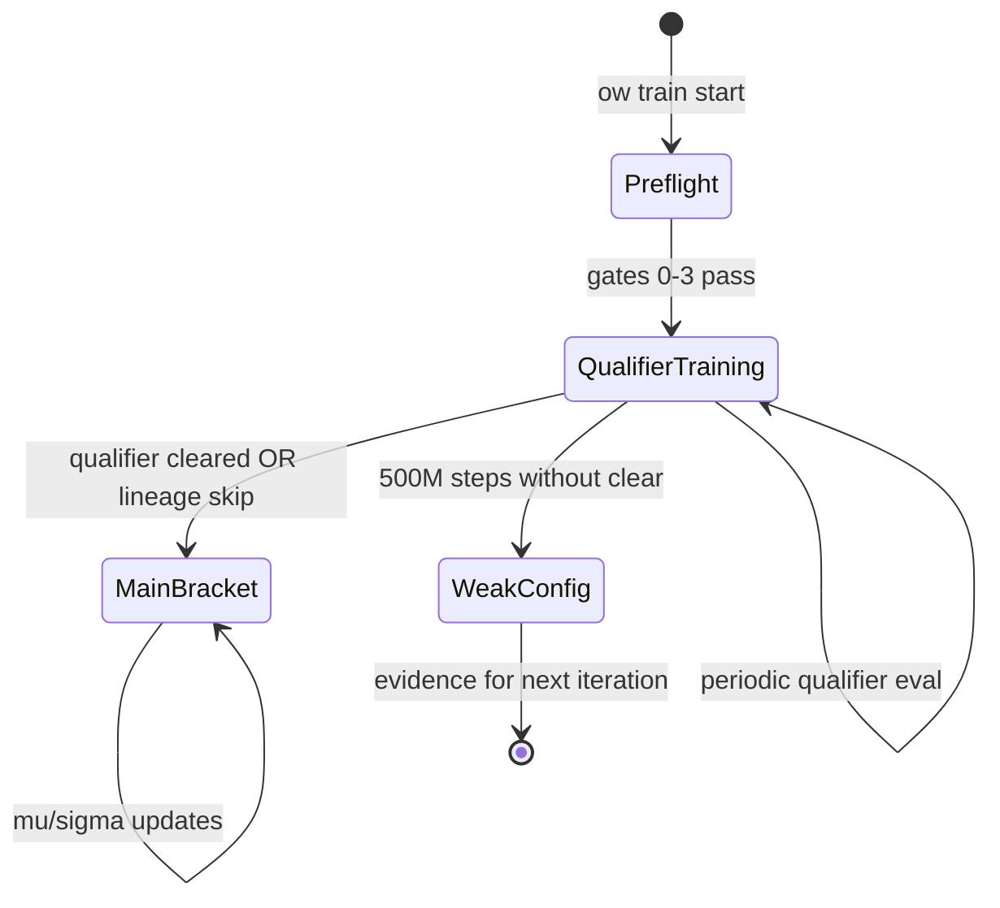
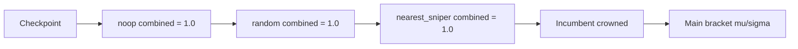

# feat: Kaggle bracket ranking and qualifier training flow

## Summary

Add a **qualifier phase** (noop → random → nearest_sniper at combined 1.0) and a **main tournament bracket** ranked by Kaggle-style μ/σ updates (TrueSkill-style, margin-independent). Training runs preflight gates 0–3, then longer training with periodic qualifier evals, bracket entry on qualifier clear / lineage skip / 500M env-step budget (weak_config if budget exhausted without clear). Self-play opponents sample from the main bracket.

Builds on unified tournament work (PR #186): Docker-first funnel, combined 2p+4p scoring, nearest_sniper bootstrap incumbent.

---

## Problem Frame

Kaggle Orbit Wars uses μ/σ rating updates after episodes — wins/loses shift μ, draws regress toward mean, update magnitude depends on surprise and σ, σ shrinks with information, **score margin does not affect updates**. Today Orbit Wars has unified held-out ladder proof (calibrated noop/random floors + incumbent R9) but no persistent bracket state, no training-time qualifier loop at 1.0, no lineage skip, no 500M-step weak_config classification, and self-play samples historical snapshots rather than bracket-ranked opponents.

---

## Requirements

### Ranking (main bracket)

- R1. **μ/σ per bracket entry.** Each qualified submission/checkpoint in the main bracket carries `mu`, `sigma`, and metadata (`agent_id`, `checkpoint_path`).
- R2. **Margin-independent updates.** Win/loss/draw outcomes update μ and σ; episode score margin must not affect update magnitude.
- R3. **Draw behavior.** Draw moves both players' μ toward the global mean; σ still decreases.
- R4. **Bracket persistence.** Bracket state serializes per campaign (`bracket/state.json`) and reloads across eval/training sessions.

### Qualifier vs main bracket

- R5. **Forced qualifier ladder.** Until an incumbent is crowned, checkpoints must achieve **combined 1.0** win rate vs noop, random, and nearest_sniper (scripted bootstrap incumbent) using unified 2p+4p scoring.
- R6. **Main bracket after qualifier clear.** Once qualifier gates clear (or lineage skip applies), checkpoint enters main bracket for μ/σ ranking — not qualifier re-runs unless disqualified.
- R7. **Incumbent crowned.** First checkpoint clearing all three qualifier opponents at 1.0 becomes crowned incumbent; subsequent challengers use promoted-incumbent Stage 2 semantics from unified ladder.

### Lineage skip

- R8. **Parent checkpoint metadata.** Checkpoints record `parent_checkpoint_path` (from `resume_checkpoint` or `from_promoted`).
- R9. **Skip qualifier when trained from incumbent.** If parent resolves to current crowned/promoted incumbent, challenger skips noop/random/nearest_sniper 1.0 gates and enters main bracket directly.

### Training config flow

- R10. **Preflight gates 0–3 gate longer training.** Documented operator contract; training profile `bracket_training` assumes gates passed before launch.
- R11. **Periodic qualifier eval.** During training, queue held-out qualifier rounds on configured interval using unified ladder in qualifier mode.
- R12. **500M env-step budget.** Track cumulative `total_env_steps`; if qualifiers not cleared by 500M steps, mark run `weak_config: true` in run manifest and metrics.
- R13. **Bracket entry triggers.** Enter main bracket when: (a) qualifier cleared, (b) lineage skip, or (c) 500M budget hit (with weak_config flag for (c) only).

### Self-play

- R14. **Bracket opponent source.** When enabled, self-play opponent sampling draws from main-bracket entries (weighted by rank or uniform among qualified), not ad-hoc pool only.

### Integration

- R15. **Docker-first submit-valid funnel unchanged.** Qualifier/bracket evals follow Docker → tournament order for async jobs.
- R16. **CLI primitives.** Bracket status/inspect via `ow eval bracket` subcommands under `src/cli/`.

---

## Key Technical Decisions

**KTD1 — New `bracket/` package under tournament artifacts.** `src/artifacts/tournament/bracket/` owns TrueSkill updates, state persistence, qualifier evaluation, lineage resolution, and self-play sampling. Unified ladder remains the match executor; bracket layer wraps verdict interpretation.

**KTD2 — Qualifier mode on unified ladder.** Add `qualifier_mode: bool` to ladder invocation: Stage 1 uses **1.0 floors** for noop and random; add **Stage 1b nearest_sniper** at 1.0 before main bracket entry. Reuse combined scoring from `unified/scoring.py`. Calibrated 0.76 floors remain for Gate 5 proof; qualifier mode is training-bracket specific (not replacing preflight calibration).

**KTD3 — Inline TrueSkill (no new dependency).** Implement simplified 1v1 μ/σ updates in `bracket/trueskill.py` matching Kaggle semantics (margin-independent). Default prior μ=25, σ=25/3; β=25/6; dynamics τ=0 for static bracket.

**KTD4 — Bracket state path.** `outputs/campaigns/<campaign>/bracket/state.json` with entries, `incumbent_crowned`, `incumbent_agent_id`, `phase` (`qualifier` | `main`).

**KTD5 — Lineage via checkpoint payload.** Extend `checkpoint_payload_builder` to persist `parent_checkpoint_path` from `resume_checkpoint` or `from_promoted`. `lineage.py` compares normalized paths against promoted manifest checkpoint.

**KTD6 — weak_config classification.** When `total_env_steps >= qualifier_max_env_steps` (default 500_000_000) and `qualifier_cleared` is false, set `weak_config: true` on run manifest and emit `bracket_training_phase=weak_config` metric once.

**KTD7 — Phased delivery.** This LFG ships foundational slice (U1–U5); U6–U8 deferred (full async qualifier worker wiring, bracket-ranked round-robin scheduling, calibration of 1.0 qualifier seed counts).

---

## High-Level Technical Design

### Training phase state machine

### Qualifier ladder (until incumbent crowned)

---

## Assumptions

- Preflight gates 0–3 are operator-enforced before `bracket_training` profile; no new gate YAML in this slice.
- 500M env steps is a fixed budget anchor (not recalibrated in this slice); documented as rule-of-thumb vs kashiwaba tutorial.
- Qualifier 1.0 uses same held-out seed sets as unified tournament calibration unless overridden in `BracketConfig`.
- Full bracket round-robin scheduling against all entries is deferred; initial main-bracket updates occur on pairwise eval results fed to `update_ratings`.

---

## Implementation Units

### U1. TrueSkill ranking module

**Goal:** Margin-independent μ/σ updates for win/loss/draw.

**Requirements:** R1, R2, R3

**Files:** `src/artifacts/tournament/bracket/trueskill.py`, `tests/test_bracket_trueskill.py`

**Approach:** Pure functions `update_win`, `update_draw`, `Rating(mu, sigma)` dataclass. Use standard TrueSkill 1v1 formulas with β=25/6.

**Test scenarios:**
- Win: higher-μ player beats lower-μ → smaller μ shift than upset win
- Draw: both μ move toward mean
- Margin in outcome dict ignored — same update with different score margins
- σ decreases for both players after any match

---

### U2. Bracket state persistence

**Goal:** Load/save bracket entries and phase per campaign.

**Requirements:** R1, R4, R6

**Dependencies:** U1

**Files:** `src/artifacts/tournament/bracket/state.py`, `tests/test_bracket_state.py`

**Approach:** `BracketState`, `BracketEntry`, `bracket_state_path(campaign, output_root)`, atomic JSON R/W.

**Test scenarios:**
- Round-trip save/load preserves μ/σ and qualifier_cleared flags
- Empty campaign creates default state in qualifier phase
- add_entry and update_entry mutate correctly

---

### U3. Qualifier ladder (1.0 floors)

**Goal:** Evaluate noop → random → nearest_sniper at combined 1.0 before main bracket.

**Requirements:** R5, R6, R7

**Dependencies:** U2

**Files:** `src/artifacts/tournament/bracket/qualifier.py`, `src/artifacts/tournament/unified/ladder.py` (qualifier_mode hook), `tests/test_bracket_qualifier.py`

**Approach:** `QualifierVerdict` from opponent score rows; `qualifier_floors()` returns 1.0 for all three; integrate optional `qualifier_mode` in ladder that adds nearest_sniper stage with 1.0 floor when not incumbent-crowned.

**Test scenarios:**
- All opponents at 1.0 → cleared
- Any opponent below 1.0 → not cleared with reason
- nearest_sniper stage skipped when incumbent already crowned

---

### U4. Lineage skip

**Goal:** Skip qualifier when trained from current incumbent.

**Requirements:** R8, R9

**Dependencies:** U2

**Files:** `src/artifacts/tournament/bracket/lineage.py`, `src/jax/train/checkpoint.py`, `tests/test_bracket_lineage.py`

**Approach:** Persist `parent_checkpoint_path`; `qualifier_skip_for_checkpoint(path, campaign, output_root)` resolves promoted incumbent path and compares.

**Test scenarios:**
- Parent matches incumbent → skip true
- Parent mismatch → skip false
- Missing parent → skip false

---

### U5. Training hooks (budget, weak_config, periodic eval)

**Goal:** Track 500M budget, classify weak_config, queue periodic qualifier jobs.

**Requirements:** R10, R11, R12, R13

**Dependencies:** U2, U3

**Files:** `src/config/schema.py`, `conf/artifacts/bracket_training.yaml`, `src/jax/train/bracket_training.py`, `src/jax/train/loop.py`, `tests/test_bracket_training_hooks.py`

**Approach:** `BracketTrainingConfig` with `enabled`, `qualifier_max_env_steps`, `qualifier_eval_interval_updates`. Helper `bracket_training_tick(cfg, update, total_env_steps, ...)` returns phase events. Queue `qualifier_eval` optional job kind when interval due.

**Test scenarios:**
- total_env_steps at budget without clear → weak_config true
- Below budget → weak_config false
- Interval triggers job queue once per period

---

### U6. Self-play bracket sampling (foundational)

**Goal:** Opponent paths from bracket state for self-play.

**Requirements:** R14

**Dependencies:** U2

**Files:** `src/artifacts/tournament/bracket/self_play.py`, `src/config/schema.py`, `tests/test_bracket_self_play.py`

**Approach:** `sample_bracket_checkpoints(state, rng, k)` returns up to k paths from main-phase entries; config flag `opponents.bracket_self_play.enabled`.

**Test scenarios:**
- Empty bracket → empty sample
- Main-phase entries → samples only qualified paths
- Qualifier-phase → empty sample (no main bracket yet)

---

### U7. CLI bracket inspect (deferred)

**Goal:** `ow eval bracket status|show` for agents.

**Requirements:** R16

**Deferred:** Follow-up after U1–U6 land.

---

### U8. Full bracket round-robin scheduler (deferred)

**Goal:** Schedule pairwise main-bracket matches and apply μ/σ updates automatically.

**Requirements:** R2, R6

**Deferred:** Initial slice updates ratings from explicit match outcomes; auto-scheduling is follow-up.

---

## Scope Boundaries

**In scope (this LFG foundational slice):** U1–U6

**Deferred to Follow-Up Work:** U7 CLI, U8 round-robin scheduler, qualifier seed-count calibration campaign, Gate 5 proof threshold changes for 1.0 qualifier

**Outside this product's identity:** Replacing Kaggle Docker validation; changing preflight Gates 2–4 thresholds

---

## Phased Delivery

| Phase | Units | Outcome |
|-------|-------|---------|
| **LFG slice** | U1–U6 | Ranking module, bracket state, qualifier 1.0, lineage skip, training budget hooks, bracket self-play sampling |
| **Follow-up** | U7–U8 | Agent CLI, automated bracket match scheduling |

---

## Sources & Research

- [Kaggle Orbit Wars competition](https://www.kaggle.com/competitions/orbit-wars) — μ/σ ranking semantics
- [kashiwaba tutorial](https://www.kaggle.com/code/kashiwaba/orbit-wars-reinforcement-learning-tutorial) — ~2000 updates anchor
- `docs/brainstorms/2026-06-03-gate5-unified-tournament-requirements.md` — unified ladder baseline
- `docs/plans/2026-06-03-001-feat-gate5-unified-tournament-plan.md` — shipped unified spec
- `src/artifacts/tournament/unified/` — ladder executor
