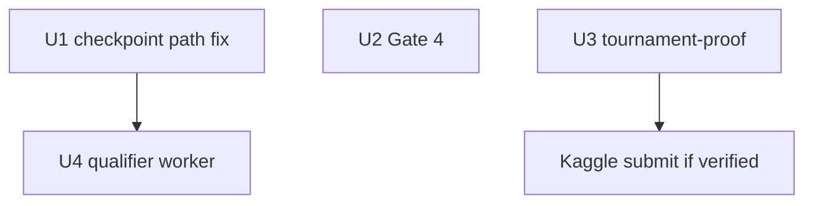

# feat: Remaining work closure

## Summary

Close operator verification left after PR #186 (unified Gate 5) and bracket foundational slice: run **Gate 4** (`curriculum_staged`), **Gate 5 tournament-proof** on the post-hygiene checkpoint, attempt **Kaggle submit** only when Docker + ladder VERIFIED, and fix **qualifier_eval** queuing under `artifacts=bracket_training` (async checkpoint path). Exercise `ow eval worker` on the existing `bracket_smoke` run.

## Problem Frame

| Gap | Evidence |
|-----|----------|
| Gate 4 not recorded with `--verbose --out` | Prior run used `tail` pipe; no `/tmp/lfg_curriculum_staged.json` |
| Gate 5 / submit | Plan `2026-06-03-002` operator steps pending on `preflight_beat_random` ckpt |
| `qualifier_eval` not queued at u50 | `bracket_smoke` run `20260603T173204Z-s42-45f37c67` has `checkpoint_eval` but no `qualifier_eval_*` job; `loop.py` probes `jax_ckpt_u{N}.pkl` while pipeline writes `jax_ckpt_{N:06d}.pkl` |
| Telemetry crash on earlier smoke | `KeyError` for bracket fields — resolved on current `main` via `metric_registry` entries |

Out of scope: recalibrating unified floors, new training campaigns, U7–U8 full bracket round-robin worker.

## Requirements

- **R1.** Gate 4: `ow benchmark gate run curriculum_staged --verbose --out /tmp/lfg_curriculum_staged.json` (no tail pipe; check terminals first).
- **R2.** Gate 5: `ow benchmark tournament-proof` on `outputs/campaigns/preflight_beat_random/runs/20260602T193448Z-s42-0422c38a/checkpoints/jax_ckpt_last.pkl` → `outputs/preflight/tournament_proof_unified_post_hygiene.json`.
- **R3.** If R2 `verdict` verified and `docker_validation_ok`: `ow eval submit --checkpoint <same> --validate-docker -m "post-hygiene unified bar"`.
- **R4.** Fix async checkpoint path resolution so `bracket_training_tick` receives a real `checkpoint_path` on interval ticks.
- **R5.** `ow eval worker --run outputs/campaigns/bracket_smoke/runs/20260603T173204Z-s42-45f37c67` processes `qualifier_eval` (queue job if missing after fix, for operator exercise).
- **R6.** `make test-fast` after code edits; PR branch `feat/remaining-work-closure` from `main`.

## Key Technical Decisions

**KTD1 — Checkpoint path alignment.** After async `submit_checkpoint`, resolve `saved_checkpoint_path` as `run_dir / f"jax_ckpt_{update:06d}.pkl"` (same as `CheckpointJob.numbered_path` in `src/artifacts/pipeline.py`), not `jax_ckpt_u{update}.pkl`.

**KTD2 — Thresholds unchanged.** All gate floors from `docs/benchmarks/preflight-calibration.json`; if noop 0.75 vs 0.76 fails, investigate variance and recalibrate via `ow benchmark calibrate-unified-tournament` — do not invent CLI overrides.

**KTD3 — Bracket telemetry.** `bracket_training_phase` / `weak_config` stay on update records; registry already defines them (default `record_kinds=("update",)`).

## Implementation Units

### U1. Checkpoint path fix (code)

**Files:** `src/jax/train/loop.py`, `tests/test_bracket_training_hooks.py` (or new integration test)

**Change:** Replace `jax_ckpt_u{update}.pkl` probe with zero-padded numbered path; optionally fall back to `jax_ckpt_last.pkl` when `update == total_updates` and numbered file missing.

**Test scenarios:**

| ID | Scenario | Expected |
|----|----------|----------|
| T1 | `bracket_training_tick` at interval with numbered ckpt on disk | `qualifier_eval_queued=True`, job JSON in queue |
| T2 | No ckpt file at tick | No qualifier job |

### U2. Operator Gate 4

**Files:** `/tmp/lfg_curriculum_staged.json` (ephemeral), optional commit of summary in PR body only

**Steps:** terminals check → `env -u JAX_COMPILATION_CACHE_DIR uv run ow benchmark gate run curriculum_staged --verbose --out /tmp/lfg_curriculum_staged.json`

### U3. Operator Gate 5 + submit

**Files:** `outputs/preflight/tournament_proof_unified_post_hygiene.json`, `outputs/kaggle_runner/` if submit attempted

**Steps:** tournament-proof → parse verdict → conditional submit per R3.

### U4. Qualifier worker exercise

**Files:** `outputs/campaigns/bracket_smoke/runs/20260603T173204Z-s42-45f37c67/queue/optional_jobs/`

**Steps:** After U1, enqueue `qualifier_eval` for u50 if absent (operator script or re-smoke); `uv run ow eval worker --run <path>`.

## Dependencies and sequencing

U2 and U3 can run in parallel with U1 after branch creation; GPU jobs must not overlap.

## Risks

| Risk | Mitigation |
|------|------------|
| Long Gate 4 GPU time | Single gate run; no tail pipe |
| Tournament variance below 0.76 | Document scores; recalibrate only with evidence |
| Kaggle auth missing | Record failure JSON; do not fake VERIFIED |

## Verification

- `make test-fast` green after U1
- Gate 4 JSON `verdict` recorded
- Tournament proof JSON committed under `outputs/preflight/` when produced
- PR `feat/remaining-work-closure` with operator outcomes in description
