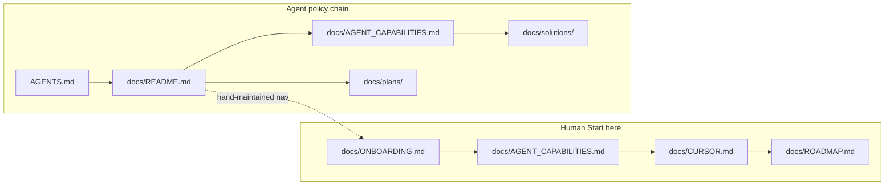

# Plan: Docs README and P0 navigation IA

## Summary

Add `docs/README.md` as the canonical doc-type and folder map, wire agents through one line in `AGENTS.md`, and fix stale navigation in `docs/ONBOARDING.md` using a explicit split between Understand-regenerated code tour and hand-maintained documentation links.

## Problem Frame

The `docs/` tree has eight top-level folders and many entry-point files, but no landing index. `docs/ONBOARDING.md` still links to removed files (`experiments.md`, `baseline_sweep.md`, `config_migration.md`). Agents discover `docs/solutions/` and `docs/plans/` only implicitly via `AGENTS.md` prose. The audit at `docs/brainstorms/2026-06-03-docs-folder-organization-audit.md` scoped P0 to index + agent chain + ONBOARDING fixes without R4 relocations or per-folder stubs.

## Requirements

### Navigation and index

- R1. `docs/README.md` exists and links all eight top-level folders (`architecture/`, `archive/`, `audits/`, `benchmarks/`, `brainstorms/`, `ideation/`, `plans/`, `solutions/`) with one-sentence purpose each (see origin A1).
- R2. `docs/README.md` states the doc-type lifecycle (ideation → brainstorm → plan → solution) in one place (see origin A5).
- R3. Human **Start here** path lists ONBOARDING → AGENT_CAPABILITIES → CURSOR → ROADMAP and does not promote retired stubs such as `docs/brain_dump.md` (see origin A6).
- R4. Agent policy chain is documented in `docs/README.md`: `AGENTS.md` → `docs/README.md` → `docs/AGENT_CAPABILITIES.md` → `docs/solutions/` → `docs/plans/` (see origin R3, F1).

### Agent entry

- R5. `AGENTS.md` includes one line pointing agents to `docs/README.md` as the doc-type map (see origin A7).

### ONBOARDING integrity

- R6. ONBOARDING regen policy is documented so hand-edited navigation is not silently lost on `/understand-onboard` (see origin Resolve before planning).
- R7. `docs/ONBOARDING.md` § Documentation and § “4. Documentation” prose contain zero broken relative links to missing `docs/*.md` files (see origin A3).
- R8. Live migration history points only to `docs/hydra_migration.md` (not `config_migration.md`).

## Key Technical Decisions

**KTD1 — Split ONBOARDING: code tour vs hand nav.** Keep Understand-generated architecture tour, guided tour, hotspots, and verification matrix in `docs/ONBOARDING.md`. Treat § Documentation and the short § “4. Documentation” layer blurb as **hand-maintained**: replace the stale four-row table with pointers to `docs/README.md`, `docs/architecture/README.md`, `docs/operator-runbook.md`, and `docs/hydra_migration.md`. Update § “Regenerating this guide” to state that full `/understand-onboard` refresh may overwrite graph-derived sections and that maintainers must re-apply hand-maintained blocks after regen (or skip full regen when only nav changed). (see origin: Resolve before planning)

**KTD2 — `docs/README.md` shape mirrors `docs/architecture/README.md`.** Use title, one-line scope, lifecycle table from the audit, folder index table, separate human vs agent chains, and a short “root evergreen docs” bullet list (operator-runbook, feature-encoding-v2, hydra_migration) without duplicating `docs/AGENT_CAPABILITIES.md` task prompts.

**KTD3 — `Issues.md` and phase-status files unchanged in P0.** R4 relocations and `docs/Issues.md` disposition stay deferred; README may mention `docs/Issues.md` as a manual snapshot without moving it (see origin A8, Outstanding questions).

**KTD4 — `agent_context.py` deferred.** Do not change `scripts/agent_context.py` in this pass; record follow-up to add `docs/README.md` to `build_context()["docs"]` after the file exists (see origin R3, F1 partial).

**KTD5 — Optional P1 benchmarks index out of scope.** `docs/benchmarks/README.md` (audit R5, A4) is follow-up, not P0.

## High-Level Technical Design

Hand-maintained ONBOARDING slices link into `docs/README.md`; the code tour remains Understand-sourced.

## Implementation Units

### U1. Create `docs/README.md`

**Goal:** Canonical map for doc types, eight folders, and dual navigation chains.

**Requirements:** R1, R2, R3, R4

**Dependencies:** None

**Files:** `docs/README.md` (create)

**Approach:** Copy lifecycle table and folder purposes from `docs/brainstorms/2026-06-03-docs-folder-organization-audit.md` (R1 table). Add **Start here** (human) and **Agent policy** (agent) subsections per audit R3. List root evergreen docs (`operator-runbook.md`, `feature-encoding-v2.md`, `hydra_migration.md`, `adding-observation-features.md`) without `brain_dump.md`. Link `docs/architecture/README.md` as the pattern for stage docs. Note that committed calibration JSON lives under `docs/benchmarks/` and thresholds must not be invented (pointer to `AGENTS.md` preflight section, not a duplicate of thresholds).

**Patterns to follow:** `docs/architecture/README.md` (index table + maintenance note)

**Test scenarios:**
- Happy path: every `docs/<folder>/` link in the eight-folder table resolves to an existing directory.
- Happy path: every `docs/*.md` link in Start here and root-evergreen lists exists on disk.
- Edge case: no link targets `docs/brain_dump.md` in Start here.

**Verification:** Manual link click or U3 test passes for README targets.

---

### U2. Add `AGENTS.md` doc-map pointer

**Goal:** Agents see `docs/README.md` immediately after opening `AGENTS.md`.

**Requirements:** R5

**Dependencies:** U1

**Files:** `AGENTS.md` (modify, intro paragraph near line 3)

**Approach:** Add one sentence after the existing onboarding sentence, e.g. doc-type map at `docs/README.md` before task-specific `docs/AGENT_CAPABILITIES.md`. Do not reorder the rest of the file.

**Patterns to follow:** Existing intro line listing `docs/ONBOARDING.md`, `docs/AGENT_CAPABILITIES.md`, `docs/CURSOR.md`

**Test scenarios:**
- Happy path: `AGENTS.md` contains exactly one new reference to `docs/README.md` in the opening guidance block.

**Verification:** `rg 'docs/README.md' AGENTS.md` returns the new line.

---

### U3. Fix ONBOARDING navigation and regen policy

**Goal:** Remove dead links; document what regen overwrites.

**Requirements:** R6, R7, R8

**Dependencies:** U1 (README must exist before pointers)

**Files:** `docs/ONBOARDING.md` (modify)

**Approach:**
- Replace § Documentation table (lines ~236–242) with live links: primary `docs/README.md`, plus `docs/architecture/README.md`, `docs/operator-runbook.md`, `docs/hydra_migration.md`.
- Update § “4. Documentation” (~70–72) to describe README + architecture index + operator runbook instead of experiment/sweep docs.
- Expand § “Regenerating this guide” with a **Hand-maintained sections** bullet: § Documentation and § 4 blurb; after `/understand-onboard`, verify those sections against `docs/README.md`.
- Optional: wrap hand-maintained blocks in HTML comments `<!-- hand-maintained:documentation -->` … `<!-- /hand-maintained -->` for grep-friendly audits (no behavior change in renderers).

**Patterns to follow:** Prior doc-drift fix in `docs/plans/2026-06-01-agent-native-operator-cli-plan.md` (R10); selective automation precedent in `AGENTS.md` `<!-- preflight-thresholds -->` markers

**Test scenarios:**
- Happy path: all relative `docs/…` links in ONBOARDING § Documentation resolve to files or directories.
- Error path: grep for `experiments.md`, `baseline_sweep.md`, `config_migration.md` in ONBOARDING returns no matches.
- Happy path: § Regenerating mentions hand-maintained documentation blocks.

**Verification:** U4 test or manual `test -f` loop over extracted links.

---

### U4. Add navigation link guard test

**Goal:** Prevent recurrence of dead ONBOARDING documentation links.

**Requirements:** R7

**Dependencies:** U3

**Files:** `tests/test_docs_navigation.py` (create)

**Approach:** Parse `docs/ONBOARDING.md` § Documentation (or all `` `docs/…` `` backtick paths in that file) and `docs/README.md` markdown links; assert `Path(repo_root / link).exists()` for file links and `.is_dir()` for folder links ending with `/`. Keep test CPU-fast (no JAX). Model after path-existence checks in `tests/test_agent_capability_map.py` style, not full site link crawler.

**Execution note:** Add the test in the same PR as U3 so CI fails if links regress.

**Test scenarios:**
- Happy path: test passes on clean tree after U1–U3.
- Failure path: introducing a fake `docs/missing.md` link in ONBOARDING fails the test.

**Verification:** `uv run pytest tests/test_docs_navigation.py -q` passes; included in `make test-fast`.

## Scope Boundaries

### In scope (P0)

- R1–R8 and U1–U4 above
- Traceability to audit acceptance A1, A3, A5, A6, A7

### Deferred for later (audit P1/P2)

- Audit A2 (grep-free discovery of capabilities/solutions/plans) — partially addressed by README chains; full “no grep” bar is P1 validation after stubs exist
- Stub READMEs in `docs/plans/`, `docs/brainstorms/`, `docs/solutions/` (audit A4 P1)
- `docs/benchmarks/README.md` listing committed calibration artifacts (audit R5, A4)
- `scripts/agent_context.py` adding `docs/README.md` to session JSON (audit R3 follow-up)
- R4 relocations: `brain_dump.md`, phase-status consolidation, `Issues.md` rename/archive (audit A8 P2)
- Auto-generate folder indexes from frontmatter (audit Outstanding questions)

### Out of scope

- Moving or deleting `docs/Issues.md` (decision deferred per KTD3)
- Changing `make agent-context` Makefile target behavior beyond documentation
- Rewriting `docs/AGENT_CAPABILITIES.md` or `docs/ROADMAP.md` structure

## Assumptions

- **Issues.md:** Remains in place; README describes it as a large manual snapshot until maintainers choose GitHub-only tracking (audit outstanding question).
- **Understand regen:** No repo-local template controls `/understand-onboard` output today; hand-maintained discipline plus U4 test is sufficient for P0 without plugin changes.
- **Headless planning:** User did not block on interactive scope confirmation; P0 matches audit P0 rollout items 1–2 only.

## Sources & Research

- Origin: `docs/brainstorms/2026-06-03-docs-folder-organization-audit.md` (R1–R5, A1–A8, F1–F2)
- Index pattern: `docs/architecture/README.md`
- Agent context today: `scripts/agent_context.py` `build_context()["docs"]` (no README pointer yet)
- Learnings: `docs/solutions/developer-experience/agent-native-operator-cli-phase1.md` (cold-start chain); `docs/plans/2026-06-01-agent-native-operator-cli-plan.md` (doc drift / selective AGENTS.md markers)
- Audit: `docs/audits/agent-native-architecture-2026-06-02.md` (capability discovery — strengthen cross-links, do not duplicate capabilities doc)
