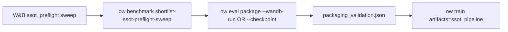

# feat: SSOT U1–U4 operator handoff

## Summary

Close remaining **U1–U4** gaps after foundation slice (#212): W&B sweep winner shortlist, `--wandb-run` packaging resolution, programmatic packaging gate before `artifacts=ssot_pipeline` long train, and explicit default `training_seed_set`. U5–U8 are out of scope.

Parent: [`2026-06-03-013-feat-ssot-training-pipeline-plan.md`](2026-06-03-013-feat-ssot-training-pipeline-plan.md).

## Problem Frame

Foundation landed compose recipes, seed partition, packaging CLI flags, and `ssot_pipeline` Hydra profile. Operators still hand-wire sweep winner → Docker packaging → long train manually; train does not enforce step-4 ordering.

## Requirements

| ID | Units |
|----|-------|
| R5–R6, R9–R11 | U1 shortlist + artifact fields |
| R7–R8, R11 | U3 `--wandb-run` |
| R12–R13 | U4 packaging gate (smoke bypass) |
| R14, R25, AE6 | U2 default training pool |

## Key Technical Decisions

**KTD1 — SSOT shortlist mirrors Planet Flow.** Reuse `ShortlistRunInput` / W&B fetch pattern; rank on `ssot_preflight_sweep_score` and Gates 2–3 summary metrics from `preflight-calibration.json`.

**KTD2 — W&B run resolution reuses artifact downloader.** `entity/project/run_id` → latest `checkpoint` artifact via `download_wandb_checkpoint_artifact`.

**KTD3 — Packaging gate is a JSON marker, not a registry.** `ow eval package --validate-docker` writes `outputs/ssot/packaging_validation.json`; train with `ssot_pipeline` + `require_packaging_validation=true` fails fast without it. Smokes set `require_packaging_validation=false`.

**KTD4 — Default training seeds.** `training_seed_set: [1..42]` in `conf/config.yaml` (disjoint from eval 43–46).

## High-Level Technical Design

## Implementation Units

### U1. SSOT preflight sweep shortlist

**Goal.** Deterministic winner JSON from finished W&B sweep runs.

**Files:** `src/jax/ssot_preflight_shortlist.py`, `src/cli/benchmark/ssot_preflight.py`, `src/cli/benchmark/parser.py`, `src/cli/benchmark/__init__.py`, `tests/test_ssot_preflight_shortlist.py`

**Verification.** Unit test ranks eligible runs; CLI `--help` documents sweep-id.

### U2. Default training seed pool

**Goal.** Explicit disjoint training pool in default config.

**Files:** `conf/config.yaml`, `tests/test_eval_seed_contamination.py` (assert default disjoint)

**Verification.** `make test-fast` green.

### U3. Packaging `--wandb-run` resolver

**Goal.** Resolve checkpoint from W&B run for packaging validation.

**Files:** `src/artifacts/tournament/resolve.py`, `src/cli/eval.py`, `tests/test_ssot_packaging_cli.py`, `tests/test_wandb_run_checkpoint_resolve.py`

**Verification.** Mocked W&B resolves path; package CLI passes checkpoint.

### U4. Packaging gate before long train

**Goal.** Block `ssot_pipeline` train without prior Docker packaging pass record.

**Files:** `src/ssot/packaging_validation.py`, `src/config/schema.py`, `conf/artifacts/ssot_pipeline.yaml`, `src/train.py`, `src/cli/eval.py`, `tests/test_ssot_packaging_gate.py`, `tests/test_ssot_pipeline_config.py`

**Verification.** Gate raises without marker; marker after package allows compose; `require_packaging_validation=false` bypasses.

## Deferred

- U5+ qualifier enablement, U6 calibration campaign, U8 teardown, automated W&B artifact CI integration test.

## Sources

- `docs/brainstorms/2026-06-03-training-pipeline-ssot-requirements.md`
- `docs/plans/2026-06-04-001-feat-ssot-lfg-foundation-slice-plan.md`
