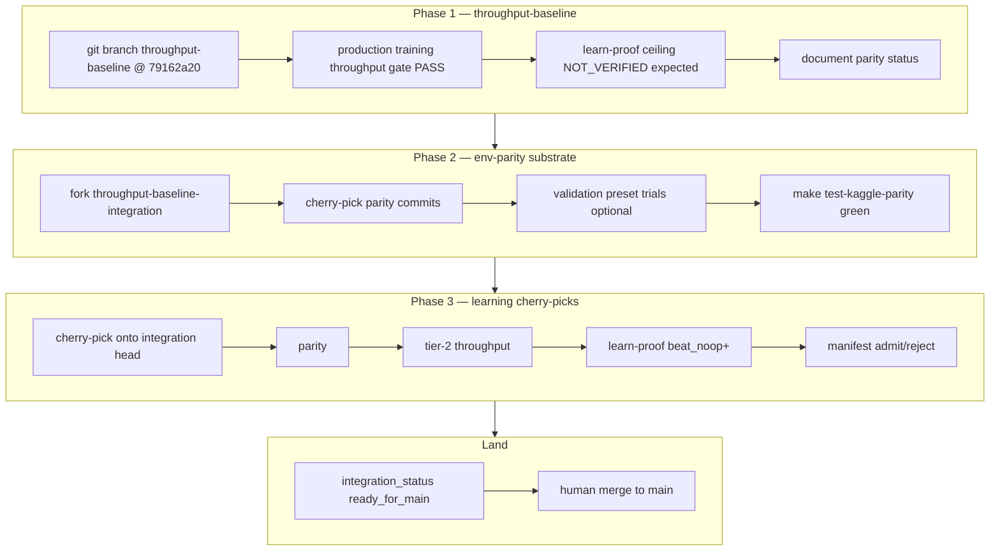

# Plan: Nuclear cherry-pick manifest integration

## Summary

Execute the **primary integration strategy** from the origin requirements: pin a **throughput-baseline** at pre-hygiene SHA `79162a20`, layer **Kaggle mechanics parity** on `throughput-baseline-integration`, then advance only manifest **`admit`** learning commits that pass **Kaggle mechanics parity**, the **production training throughput gate**, and the **learning proof ladder**. Ship a committed **`docs/benchmarks/cherry-pick-manifest.json`**, operator runbook recipes, and schema tests mirroring the ablation artifact pattern. Semantic rollout redesign (selected-action validation) stays **halted**; orthogonal branch work (stagger, multitask smoke) does not substitute for manifest gates.

## Problem Frame

Post–**within-turn launch dedup masks**, tier-2 throughput on `main` is ~75% below the documented anchor (`launch-hygiene-e2e-baseline.json`), while learner ablation arm B keeps learning at impractical volume (~2.4K `env_steps_per_sec`). Bare revert to `79162a20` restores throughput but fails `beat_noop`; blind forward on slow `main` or untracked cherry-picks both lack auditability. Session bisect added a **validation preset** regression window (`71c3e91` → `b11b9b0`, comet train-path) that must be resolved in Phase 2 before learning cherry-picks. (see origin: unified session context)

## Requirements

Traceability to origin R/F/AE IDs:

| Origin | Plan coverage |
|--------|----------------|
| R1–R2, F1, AE4 | U1 — anchor branch + baseline_gates |
| R4–R6 | U2 — manifest artifact + schema test |
| R3, R3a–R3b, F2, AE5 | U4 — env-parity substrate |
| R7–R10, F3, AE1–AE2 | U5 — learning candidate trials |
| R11–R14, F4, AE3 | U6 — landing + human merge |
| Success criteria (all) | U1–U6 verification sections |

## Key Technical Decisions

**KTD1 — Two throughput presets, one manifest.** **Production training throughput gate** authority for anchor proof and learning admits: `make test-launch-hygiene-e2e-throughput` vs `docs/benchmarks/launch-hygiene-e2e-baseline.json` (tier-2 primary: `task=shield_cheap`, `model=transformer_factorized`). **Validation preset** for Phase 2 env-parity bisect/triage: `uv run python scripts/issues_jax_30update_benchmark.py --preset validation`. Every `candidates[].throughput_e2e` records `preset` (`tier2_primary` \| `validation`) so numbers are not conflated (origin unified context, Q6).

**KTD2 — Phase order is strict.** No Phase 3 learning cherry-picks until `make test-kaggle-parity` is green on `throughput-baseline-integration` (R3a). Env-parity commits (`phase: env_parity`) may reconfirm tier-2 throughput only; validation preset trials localize comet-era regressions before parity admits.

**KTD3 — Learn-proof model split.** Phase 1 anchor ceiling recorded with `transformer_factorized_small` (ablation parity). Learning candidate admission uses tier-2 primary profile (`transformer_factorized`) for both throughput and learn-proof (origin Q3).

**KTD4 — Cherry-pick granularity.** Default single-commit trials; use manifest `commit_group` when PR #163 hygiene bundle or `co_landing_commits` (e.g. `ce6714b`) require atomic groups (origin Q2).

**KTD5 — Integration branch is long-lived.** `throughput-baseline-integration` advances on every `admit`; `integration_status: building` until R12; human merge only at `ready_for_main` (Q1 locked).

**KTD6 — Hygiene change guard.** Any candidate that removes or disables **within-turn launch dedup masks** requires fresh learner ablation per `docs/solutions/tooling-decisions/launch-hygiene-learner-ablation-gate.md` before manifest admission (R10, AE2).

## High-Level Technical Design

**Manifest JSON shape** (extends `launch-hygiene-ablation.json` discipline):

| Field | Purpose |
|-------|---------|
| `manifest_id`, `assessed_date`, `baseline_sha`, `baseline_branch` | Anchor identity |
| `baseline_gates.throughput_e2e`, `learn_proof`, `parity` | Phase 1 proof |
| `criterion` | Dual gate + parity definition |
| `candidates[]` | `sha`, `subject`, `phase`, `commit_group?`, `cherry_pick_order`, gate artifacts, `verdict`, `reject_reasons[]` |
| `integration_state.branch`, `ordered_shas[]`, `integration_status` | Live stack |
| `decision` | Operator summary |

## Scope Boundaries

**In scope**

- Branches `throughput-baseline`, `throughput-baseline-integration`
- `docs/benchmarks/cherry-pick-manifest.json` + schema test
- Operator runbook **Cherry-pick manifest** section
- Worktree/bisect workflows; no code changes to rollout redesign paths

**Deferred to follow-up work**

- Commit/recreate `docs/nomenclature-rfc.md` and `docs/ideation/2026-06-05-orbit-wars-continuation-directions.md` (session artifacts missing from git)
- Automated CI enforcement of manifest admission on every PR
- Makefile display-name aliases (nomenclature RFC phase 2)

**Explicitly out of scope**

- Semantic rollout redesign (selected-action validation) as active track
- Blind revert or hygiene removal without ablation
- Relaxing calibrated throughput or learn-proof thresholds
- Code mass rename (nomenclature RFC phase 4)

---

## Implementation Units

### U1. Phase 1 — throughput anchor branch and proof

**Goal:** Create `throughput-baseline` at `79162a2088160b8ed05c3e3a050e064c7f6c9556` and capture baseline_gates artifacts.

**Requirements:** R1, R2, F1, AE4; success criterion “anchor established”.

**Dependencies:** None.

**Files:**

- `docs/benchmarks/cherry-pick-manifest.json` (initial `baseline_gates` only — full schema in U2)
- `outputs/benchmarks/cherry-pick/` (gate JSON artifacts, gitignored paths referenced from manifest)
- `docs/benchmarks/launch-hygiene-e2e-baseline.json` (read-only reference)

**Approach:**

1. `git worktree add` at anchor SHA or branch `throughput-baseline` from first parent of PR #163 merge (see baseline JSON `merge_topology_notes`).
2. On canonical GPU host (RTX 5080 class per baseline JSON), run production training throughput gate with JAX cache disabled per AGENTS.md:
   - `env -u JAX_COMPILATION_CACHE_DIR ORBIT_WARS_PYTEST_JAX_CACHE=0 make test-launch-hygiene-e2e-throughput`
   - Or operator capture: `uv run ow benchmark training --preset primary ... --out outputs/benchmarks/cherry-pick/anchor_throughput.json`
3. Record learn-proof ceiling (expect NOT_VERIFIED `beat_noop`): `make preflight-learn-proof` with `transformer_factorized_small` or documented ablation-equivalent overrides.
4. Run `make test-kaggle-parity`; record pass/fail and failing tests if any (expected gaps motivate Phase 2).
5. Fork `throughput-baseline-integration` from anchor.

**Patterns to follow:** `docs/benchmarks/launch-hygiene-e2e-baseline.json` capture notes; learner ablation arm A in `launch-hygiene-ablation.json`.

**Test scenarios:**

- Covers AE4: anchor learn-proof NOT_VERIFIED does not block Phase 2 fork.
- Anchor throughput within ±10% of baseline JSON floor (8798.69 `env_steps_per_sec` at 10% band).

**Verification:** `throughput-baseline` exists remotely or locally; manifest `baseline_gates.throughput_e2e.verdict: PASS`; learn-proof artifact path recorded; parity status documented.

---

### U2. Manifest artifact and schema guard

**Goal:** Committed machine-readable manifest with schema test mirroring ablation artifact discipline.

**Requirements:** R4–R6; success criterion “audit trail”.

**Dependencies:** U1 (baseline_sha, baseline_gates).

**Files:**

- `docs/benchmarks/cherry-pick-manifest.json` (create)
- `tests/test_training_benchmark_gate.py` (add `test_committed_cherry_pick_manifest_artifact`)

**Approach:**

1. Initialize JSON with required top-level fields and empty `candidates[]`, `integration_state.integration_status: building`.
2. Pin `baseline_sha` to `79162a2088160b8ed05c3e3a050e064c7f6c9556` unless U1 documents alternate with rationale.
3. Add schema test: required fields, `verdict` enum (`admit` \| `reject` \| `pending`), `phase` enum (`env_parity` \| `learning`), repo-relative artifact paths, `baseline_sha` match.

**Patterns to follow:** `test_committed_launch_hygiene_ablation_artifact` in `tests/test_training_benchmark_gate.py`.

**Test scenarios:**

- Committed manifest parses; `baseline_sha` matches baseline JSON.
- Invalid `verdict` or missing `candidates[].phase` would fail test (negative case by inspection during test authoring).
- `throughput_e2e.preset` present when throughput block populated.

**Verification:** `make test-fast` passes new test; manifest committed with U1 baseline_gates populated.

---

### U3. Operator runbook — Cherry-pick manifest section

**Goal:** Operator-facing dual-gate recipes cross-linked from runbook.

**Requirements:** R3; success criterion “operator-runbook section links commands”.

**Dependencies:** U2 (manifest path stable).

**Files:**

- `docs/operator-runbook.md`

**Approach:**

Add **Cherry-pick manifest** section with:

- Links to origin requirements, manifest path, ablation JSON
- Phase 1 commands (tier-2 throughput, learn-proof, parity)
- Phase 2/3 gate order (parity → throughput → learn-proof)
- Worktree recipe: `git worktree add ../ow-cherry-pick-trial <sha>`
- JAX cache env vars
- Human-merge checklist for `ready_for_main`
- Nomenclature: **production training throughput gate**, **Kaggle mechanics parity**, **learning proof ladder**, **within-turn launch dedup masks**

**Test scenarios:**

- Test expectation: none — documentation-only.

**Verification:** Section exists; all referenced paths resolve in repo.

---

### U4. Phase 2 — env-parity substrate integration

**Goal:** Cherry-pick parity correctness commits until `make test-kaggle-parity` green on integration head.

**Requirements:** R3a–R3b, F2, AE5; success criterion “env-parity substrate”.

**Dependencies:** U1, U2, U3.

**Files:**

- `docs/benchmarks/cherry-pick-manifest.json` (`candidates[]` env_parity entries)
- `src/jax/env.py`, `src/jax/comet_generation.py`, related parity fixes (via cherry-pick, not redesign)
- `tests/test_jax_env_parity.py` (verification via `make test-kaggle-parity`)

**Approach:**

1. Build Phase 2 queue: topological walk merge-base(`79162a20`, `main`) → `main`, filter commits touching env/parity (`src/jax/env.py`, comet, planet generation, parity tests). Prioritize bisect window `71c3e91`…`b11b9b0` per `docs/solutions/workflow-issues/jax-validation-throughput-benchmark-and-bisect.md`.
2. For each candidate: worktree at integration head + cherry-pick; run `make test-kaggle-parity`.
3. Optional: validation preset benchmark before/after admit to record comet-era throughput (`preset: validation`, store JSON under `outputs/benchmarks/cherry-pick/`).
4. On green parity across integration head: mark last env_parity admits; block Phase 3 until green.

**Execution note:** Characterization-first — run parity test suite on anchor before first cherry-pick to list failing cases.

**Test scenarios:**

- Covers AE5: learning Phase 3 blocked until parity green.
- After final env_parity admit, `make test-kaggle-parity` passes on integration branch.
- Reject candidate that fixes parity but disables within-turn launch dedup masks without ablation (AE2 guard applies if such commit appears in queue).

**Verification:** Manifest lists ordered `phase: env_parity` admits; integration head parity PASS recorded in `baseline_gates` or latest candidate.

---

### U5. Phase 3 — learning cherry-pick dual-gate evaluation

**Goal:** Topological learning-improvement cherry-picks with full gate sequence on integration head.

**Requirements:** R7–R10, F3, AE1–AE2; success criteria “dual gate operational”, “learning recovered on anchor”.

**Dependencies:** U4 (parity green).

**Files:**

- `docs/benchmarks/cherry-pick-manifest.json`
- Post-baseline commits on rollout/PPO/opponents/curriculum (via cherry-pick)
- `docs/benchmarks/preflight-calibration.json` (thresholds, read-only)

**Approach:**

1. Queue learning-improvement commits (exclude semantic redesign-only commits per R7).
2. Per candidate on worktree/integration head, in order:
   - (1) `make test-kaggle-parity`
   - (2) `env -u JAX_COMPILATION_CACHE_DIR ORBIT_WARS_PYTEST_JAX_CACHE=0 make test-launch-hygiene-e2e-throughput`
   - (3) `make preflight-learn-proof` or `ow benchmark learn-proof` with tier-2 primary profile
3. Admit only if all pass; else `reject` with `reject_reasons` (`parity_fail`, `throughput_floor`, `learn_proof_beat_noop`, `hygiene_change_without_ablation`).
4. Advance `throughput-baseline-integration` only on `admit`; append `ordered_shas[]`.

**Patterns to follow:** Learner ablation tiebreaker rules in `docs/solutions/tooling-decisions/launch-hygiene-learner-ablation-gate.md`; never invent threshold relaxations.

**Test scenarios:**

- Covers AE1: rollout-only commit passing all gates → `verdict: admit`, `phase: learning`.
- Covers AE2: hygiene mask removal without ablation → `reject`, `hygiene_change_without_ablation`.
- Integration tip learn-proof VERIFIED through `beat_noop` before `ready_for_main`.

**Verification:** Every learning `admit` has parity PASS, tier-2 throughput within band, learn-proof artifacts linked; integration tip exceeds Phase 1 learn-proof ceiling.

---

### U6. Landing — ready_for_main and human merge

**Goal:** Close integration when R12 satisfied; human PR/merge with audit trail.

**Requirements:** R11–R14, F4, AE3; success criteria “posture clarity”, “parity non-negotiable”.

**Dependencies:** U5.

**Files:**

- `docs/benchmarks/cherry-pick-manifest.json` (`integration_status`, `decision`)
- `docs/operator-runbook.md` (merge checklist reference)

**Approach:**

1. Re-run full gate stack on integration tip (parity, tier-2 throughput, learn-proof `beat_noop` minimum).
2. Set `integration_status: ready_for_main`; update `decision` string with ordered admits summary.
3. Human operator opens PR `throughput-baseline-integration` → `main`; no agent auto-merge (A1 authority).
4. On merge: update manifest assessed_date; archive trial worktrees.

**Test scenarios:**

- Covers AE3: `ready_for_main` triggers human PR path; agents do not merge.

**Verification:** Manifest `integration_status: ready_for_main`; tip gates PASS; PR opened by human.

---

## Open Questions (execution-time)

- **Alternate anchor:** If U1 tier-2 gate fails on canonical host at `79162a20`, document alternate SHA in manifest header before proceeding (origin baseline anchor rule).
- **Queue exhaustion:** If no learning admits reach `beat_noop`, escalate per origin Q5 — human decision recorded in `decision`; do not resume semantic redesign.

## Risks and Mitigations

| Risk | Mitigation |
|------|------------|
| Conflating validation (~8k) and tier-2 (~9.8k) numbers | KTD1 `preset` field on every throughput artifact |
| Cherry-pick conflicts on hygiene bundle | `commit_group` + PR #163 topology notes |
| Orthogonal branch merges pollute integration | Only manifest `admit` SHAs on integration branch; stagger/SSOT fixes merge to `main` separately if scoped |
| GPU host variance | Same device class as baseline capture; no threshold relaxation |

## Sources and Research

- Origin: `docs/brainstorms/2026-06-05-nuclear-cherry-pick-manifest-requirements.md`
- Session context: transcripts `29f290d2-781a-474e-a1ef-4461f9159961`, `78f18bfc-6c86-4715-9b38-4a22e0f090ae`
- Benchmarks: `docs/benchmarks/launch-hygiene-e2e-baseline.json`, `docs/benchmarks/launch-hygiene-ablation.json`
- Bisect workflow: `docs/solutions/workflow-issues/jax-validation-throughput-benchmark-and-bisect.md`
- Nomenclature terms: production training throughput gate, within-turn launch dedup masks, Kaggle mechanics parity, learning proof ladder (see origin Sources)
