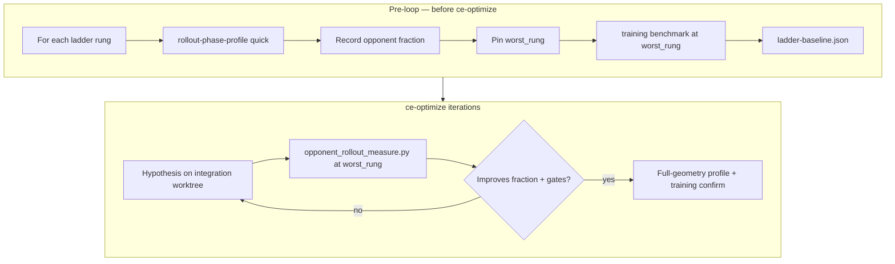

# feat: Opponent rollout ce-optimize loop (Approach A)

**Target repo:** `orbit_wars-integration` (canonical worktree for `optimize/opponent-rollout-throughput`; main delegates measurement via `--repo-root`)

## Summary

Land the **measurement and pre-loop infrastructure** for an opponent-focused `ce-optimize` loop: per-rung Hydra bundles, offline phase-profile harness, ladder baseline capture, and `opponent-rollout-throughput` spec. Hypothesis experiments (4p encode cache, opp_batch elision, etc.) run **after** Pre-loop proves the ladder and harness — not in this plan's first PR.

## Problem Frame

Rollout collect is dominated by opponent sampling and `encode_turn` refresh (~68% opponent share at quick `task=map_pool` profile). Prior `optimize/multitask-smoke-throughput` optimized the learner path with noop opponents. Admission stays `opponents=noop_only`; this plan makes **non-noop training paths measurable and optimizable** without changing the admission gate recipe.

Constraints carried from origin (see origin doc): offline phase profile only (no inline train telemetry); quick rank / full confirm; integration worktrees; mutable opponent hot path only.

## Requirements

| ID | Requirement | Plan coverage |
|----|-------------|---------------|
| R1–R5 | Measurement harness + shared overrides | U4, U5 |
| R6–R9 | Ablation ladder + worst_rung pinning | U2, U4 |
| R7 | Pre-loop baseline (fractions + throughput) | U4 |
| R10–R15 | ce-optimize scope + keep rules | U5; experiments deferred |
| R16 | Hypothesis seed themes | Post Pre-loop (out of scope here) |
| SC1 | Success criteria | Verification section |
| SC2–SC4 | Success criteria | Deferred — hypothesis loop / follow-up (out of scope here) |
| F1–F3 | Key flows | HTD + units |

## Key Technical Decisions

**KTD1 — Extend offline profiler for snapshot seeding (not defer rung 3).** `run_rollout_phase_profile` will seed at least one valid historical snapshot before the measured window when `curriculum` enables `historical` weight and `opponents.snapshot.pool_size > 0`, mirroring `add_historical_snapshot` in `src/jax/train/loop.py`. Rationale: `production_mix` rung is meaningless without valid `snapshot_valid_mask`; deferring rung 3 would pin `worst_rung` on a lie.

**KTD2 — Ladder routing via curriculum `stage_view`, not `opponents.mix` labels.** Each rung ships an explicit override bundle setting `curriculum.enabled=true` (except noop) with staged `opponent_families`, plus mode overrides where needed (`opponents.mode.opponent=noop` for rung 0). Profile names like `noop_only` are insufficient when `curriculum=off` (see origin R6, feasibility review).

**KTD3 — Port noop JAX path from main before Pre-loop.** Integration `collect.py` currently rejects `opponents.mode.opponent=noop`. Cherry-pick/port main's noop validation, `skip_opp_batch_refresh`, and `tests/test_rollout_noop_opponent.py` so rung 0 is a true noop fast path.

**KTD4 — New harness, not `multitask_smoke_measure.py`.** Primary metric is `rollout_phase_opponent_fraction` from phase-profile JSON (`docs/solutions/workflow-issues/jax-validation-throughput-benchmark-and-bisect.md` — multitask smoke is not authority for this loop). New `scripts/ce_optimize/opponent_rollout_measure.py` on integration.

**KTD5 — `scripted_heavy` as dedicated curriculum group.** Add `conf/curriculum/scripted_heavy.yaml` with a single stage weighting only scripted families (equal 0.25 each: random, nearest_sniper, turtle, opportunistic). Pair with `opponents.self_play.enabled=false`, `curriculum=scripted_heavy`, `opponents=base` (or minimal opponents profile). Exact weights adjustable in implementation if compose validation requires normalization.

**KTD6 — Pre-loop before ce-optimize Phase 0; baseline approval in Phase 1.** Operator runs ladder capture script once (F1); output `ladder-baseline.json` under `.context/compound-engineering/ce-optimize/opponent-rollout-throughput/`. `/ce-optimize` Phase 0 saves spec + harness only. Phase 1 (F2) runs harness at `worst_rung`, records baseline in `experiment-log.yaml`, and gates user approval before hypotheses (F3).

## High-Level Technical Design

### Measurement ladder (iteration vs confirmation)



### Ladder rung override bundles (authoritative for Pre-loop)

| Rung | Key overrides (append to admission base + `task=map_pool`) |
|------|-------------------------------------------------------------|
| `noop` | `opponents.mode.opponent=noop`, `curriculum=off`, `opponents.self_play.enabled=false` |
| `scripted_heavy` | `curriculum=scripted_heavy`, `opponents=base`, `opponents.self_play.enabled=false` |
| `self_play` | `curriculum=on` + inline stage override OR new `conf/curriculum/self_play_only_stage.yaml` with `latest: 1.0`, `opponents.self_play.enabled=true` |
| `production_mix` | `opponents=default`, `curriculum=default` (+ profiler snapshot seeding per KTD1) |

Admission base for profiling: `--preset admission` defaults from `ADMISSION_PROFILE_OVERRIDES` in `src/jax/rollout_phase_profile.py`, with `task=map_pool` via `--train-overrides`.

---

## Implementation Units

### U1. Port noop JAX opponent path to integration

**Goal:** Rung 0 exercises true noop fast path; degenerate gate `test_rollout_noop_opponent` runs on integration.

**Requirements:** R6 rung 0, R2, R10

**Dependencies:** None

**Files:**
- Modify: `src/jax/rollout/collect.py`, `src/jax/rollout/collect_timed.py`
- Modify: `src/opponents/jax_actions/sampling.py`, `src/opponents/constants.py` (if missing validators)
- Copy/adapt from main: `tests/test_rollout_noop_opponent.py`

**Approach:** Diff main vs integration opponent mode handling; port `validate_jax_training_opponent_mode`, `is_noop_jax_training_opponent_mode`, `skip_opp_batch_refresh`, and noop branches in sampling. Keep integration-only phase-timing paths intact.

**Patterns to follow:** Main `src/jax/rollout/collect.py` noop branches; `tests/test_rollout_noop_opponent.py` on main.

**Test scenarios:**
- Happy path: composed config with `opponents.mode.opponent=noop` + `curriculum=off` collects without neural policy sampling on opponent slots.
- Edge: 2p rollout with noop mode skips `opp_batch_cache` refresh (assert via existing noop test patterns).
- Integration: noop collect matches expected action shape / metrics keys.

**Verification:** `make test-fast` subset including ported noop test; manual compose `uv run ow train print_resolved_config=true opponents.mode.opponent=noop curriculum=off`.

---

### U2. Ladder Hydra bundles + composition tests

**Goal:** All four ladder rungs compose and produce distinct `stage_view.family_probs`.

**Requirements:** R6, R2, Pre-loop gate for `scripted_heavy`

**Dependencies:** U1 (noop rung)

**Files:**
- Create: `conf/curriculum/scripted_heavy.yaml`
- Create (if cleaner than inline): `conf/curriculum/self_play_only_stage.yaml`
- Modify: `tests/test_config_consolidation.py` or new `tests/test_opponent_ladder_compose.py`

**Approach:** Add `scripted_heavy` curriculum with single stage and only scripted `opponent_families`. Add test that composes each rung's override bundle (table in HTD) via `compose_hydra_train_config` and asserts:
- `noop`: `mode.opponent == noop`, families not all-latest when curriculum off uses explicit noop mode
- `scripted_heavy`: no `latest`/`historical` in stage families
- `self_play`: `latest` weight 1.0
- `production_mix`: `latest` + `historical` weights, snapshot pool_size > 0

**Test scenarios:**
- Happy path: each rung override list composes without validation error.
- Error path: `scripted_heavy` without `curriculum.enabled` fails or falls back — document expected behavior in test name.
- Integration: composed `stage_view` at update=5 differs across at least noop vs scripted_heavy vs self_play (snapshot mask may be false until U3).

**Verification:** `make test-domain-config` or targeted pytest on new compose test file.

---

### U3. Snapshot seeding in offline phase profiler

**Goal:** `production_mix` rung profiles historical opponent path, not latest-only fallback.

**Requirements:** R6 rung 3, origin Resolve Before Planning (production_mix seeding)

**Dependencies:** U2

**Files:**
- Modify: `src/jax/rollout_phase_profile.py`
- Modify: `tests/test_rollout_phase_profile.py`

**Approach:** After `init_historical_snapshot_pool`, when `cfg.curriculum.enabled` and historical family weight > 0, call `add_historical_snapshot` once before warmup completes (e.g. at end of iteration 1 or dedicated pre-warmup seed using current `train_state.params`). Mirror telemetry fields minimally — profiler does not need full train loop snapshot cadence.

Optional CLI flag `--seed-snapshots N` (default 1 when historical enabled) for operator control.

**Test scenarios:**
- Happy path: `opponents=default` + `curriculum=default` compose → after seeding helper, `snapshot_valid_mask` has at least one true slot in stage_view at measured update.
- Edge: `curriculum=off` / no historical weight → no seeding, no error.
- Regression: existing quick-geometry profile test still passes for noop admission preset.

**Verification:** `make test-jax-trace-hygiene` not required; `pytest tests/test_rollout_phase_profile.py -q`.

---

### U4. Measurement harness + Pre-loop ladder capture

**Goal:** Runnable Pre-loop producing `ladder-baseline.json`; harness emits ce-optimize primary metric + gates.

**Requirements:** R1–R5, R7, F1, SC1

**Dependencies:** U1, U2, U3

**Files:**
- Create: `scripts/ce_optimize/opponent_rollout_measure.py`
- Create: `scripts/ce_optimize/capture_opponent_ladder_baseline.py` (or subcommand on measure script)
- Create: `.context/compound-engineering/ce-optimize/opponent-rollout-throughput/` (gitignored scratch; documented in plan only)

**Approach:**

`opponent_rollout_measure.py`:
1. Run `TARGETED_TESTS` (noop test + ladder compose test).
2. Invoke `uv run ow benchmark rollout-phase-profile --preset admission --train-overrides task=map_pool <rung overrides> --updates 3 --warmup 2 --out <scratch>/last_profile.json` with cold-cache env.
3. Parse breakdown JSON for `rollout_phase_opponent_fraction` (median over measured window).
4. Emit single stdout JSON: gates + `rollout_phase_opponent_fraction_worst_rung` + diagnostics per R3.

`capture_opponent_ladder_baseline.py`:
1. Loop four rungs → profile each (3 repeats median).
2. Pin `worst_rung` per R8.
3. Run `ow benchmark training` at `worst_rung` with admission overrides + `--detailed-timing` (≥3 repeats) → median `env_steps_per_sec`.
4. Write `ladder-baseline.json` schema: `{rungs: [{label, overrides, opponent_fraction_median}], worst_rung, throughput: {env_steps_per_sec_median}}`.

**Patterns to follow:** `scripts/ce_optimize/multitask_smoke_measure.py` (pytest + subprocess + JSON stdout); `src/jax/rollout/phase_timing_report.py` breakdown extraction.

**Test scenarios:**
- Happy path: measure script exits 0 and JSON contains all gate keys on integration GPU/CPU smoke (may mark GPU gate skip on CPU-only CI).
- Edge: malformed profile JSON → `benchmark_passed=0` with error snippet.
- Integration: capture script writes ladder-baseline.json with four rungs and pinned worst_rung (dry-run with `--updates 1 --warmup 0` for fast CI optional).

**Verification:** Manual Pre-loop on GPU workstation; `make test-fast` for unit tests only (no full capture in default CI).

---

### U5. ce-optimize spec + operator wiring

**Goal:** Durable spec file for `/ce-optimize opponent-rollout-throughput`; immutable/mutable scope matches origin R10–R11.

**Requirements:** R1, R10–R14, F2–F3, SC4

**Dependencies:** U4

**Files:**
- Create: `.context/compound-engineering/ce-optimize/opponent-rollout-throughput/spec.yaml` (from ce-optimize schema template)
- Document in plan / optional `docs/tools/` pointer only if user requests — **omit** separate operator doc per minimal scope

**Approach:** Author `spec.yaml` with:
- `name: opponent-rollout-throughput`
- `metric.primary`: minimize `rollout_phase_opponent_fraction_worst_rung`
- `degenerate_gates`: `tests_passed`, `benchmark_passed`, `finite_phase_metrics`, etc.
- `measurement.command`: `uv run python scripts/ce_optimize/opponent_rollout_measure.py --rung <worst_rung_from_baseline>`
- `scope.mutable`: opponent paths per origin R10
- `scope.immutable`: harness, collect_timed, rollout_phase_profile, tests listed in R11
- `execution`: serial, max_concurrent 1, first-run stopping limits per R12
- `keep_rule` (R13): primary metric improves at `worst_rung` **and** full-geometry confirmation passes (R14)
- `confirmation` (R14): full-geometry `rollout-phase-profile` at `worst_rung` (no fraction regression vs pre-experiment baseline) + `ow benchmark training` at `worst_rung` (throughput vs `ladder-baseline.json`, 5% slack if fraction improved ≥10% relative)
- `forbidden_hypotheses` (R15): learner K-scan / `selected_validate` / admission recipe changes — out of scope unless new phase evidence
- `measurement.working_directory`: integration repo root

Branch: `optimize/opponent-rollout-throughput` created on integration when operator starts loop.

**Test scenarios:**
- Test expectation: none — YAML spec validation only; operator validates via ce-optimize Phase 0 CP-0.

**Verification:** `ce-optimize` Phase 0 reads spec and validates harness wiring; Phase 1 (F2) runs harness at `worst_rung` and gates user approval before hypotheses.

---

## Verification (end-to-end)

1. **U1–U3:** `make test-fast` + ladder compose test green on integration.
2. **U4 Pre-loop (operator, GPU):**
   ```bash
   cd orbit_wars-integration
   uv run python scripts/ce_optimize/capture_opponent_ladder_baseline.py \
     --out .context/compound-engineering/ce-optimize/opponent-rollout-throughput/ladder-baseline.json
   ```
3. **Harness smoke:**
   ```bash
   uv run python scripts/ce_optimize/opponent_rollout_measure.py \
     --rung <worst_rung_from_json> \
     --ladder-baseline .context/compound-engineering/ce-optimize/opponent-rollout-throughput/ladder-baseline.json
   ```
4. **ce-optimize Phase 0:** Save spec; validate harness command and scope gates (no baseline approval yet).
5. **ce-optimize Phase 1 (F2):** Run harness at `worst_rung`; record baseline in `experiment-log.yaml`; user approves proceeding to hypotheses.
6. **Out of scope for this plan:** First hypothesis experiment (F3 / U6+), full-geometry confirmation on keep (R14 at loop time), admission gate recalibration. SC2–SC4 satisfied only after hypothesis loop starts.

## Scope Boundaries

**In this plan**
- Pre-loop infrastructure, harness, spec, noop port, ladder profiles, snapshot seeding

**Deferred to Follow-Up Work**
- ce-optimize hypothesis experiments (4p encode cache, opp_batch elision, etc.) — after Pre-loop
- Tier-2 e2e baseline recalibration for opponent-heavy recipe
- Changing admission manifest to non-noop opponents

**From origin — unchanged**
- Learner K-scan / `selected_validate` track
- Inline `telemetry=rollout_phase_timing` on production train

## Risks & Dependencies

| Risk | Mitigation |
|------|------------|
| Quick fractions don't predict full-geometry wins | R14 confirmation on keep; escalate noise threshold if false positives |
| Integration/main noop drift | Port test + compose test; document cherry-pick source commit |
| Pre-loop GPU time (~4 rungs × profile) | Quick geometry only; stderr progress; no tail pipes |
| `max_hours: 1` too tight for first ce-optimize session | Operator extends in spec after Pre-loop timing measured |

## Sources & Research

- Origin: `docs/brainstorms/2026-06-06-opponent-rollout-ce-optimize-requirements.md`
- `docs/solutions/developer-experience/offline-rollout-phase-profile-decoupled-from-jit-collect.md`
- `docs/solutions/developer-experience/production-training-throughput-profiling.md`
- `docs/solutions/workflow-issues/jax-validation-throughput-benchmark-and-bisect.md`
- `docs/solutions/workflow-issues/cherry-pick-admission-gate-unified-learn-throughput.md`
- Integration: `src/jax/rollout_phase_profile.py`, `src/training/curriculum.py`, `src/jax/train/loop.py` (snapshot seeding reference)
