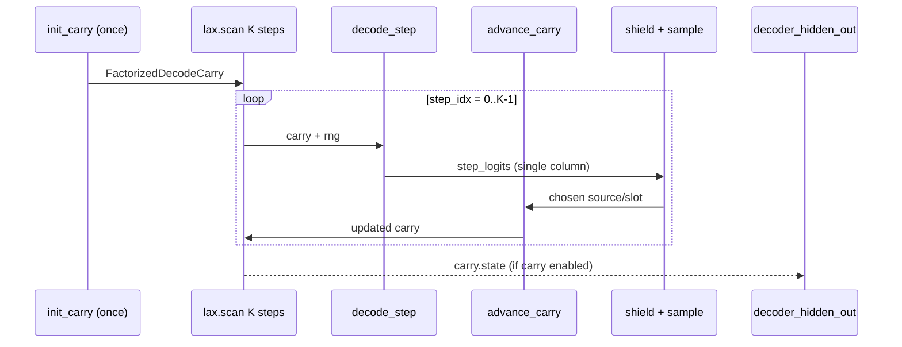

# refactor: O(K) incremental decode in action_sampling rollout scan

## Summary

Replace per–scan-iteration full `factorized_decode` (K inner GRU steps) in `_sample_shielded_factored_sequence_with_params` with persistent `FactorizedDecodeCarry` across the outer `lax.scan`, using `factorized_decode_init_carry` / `factorized_decode_step` / `factorized_decode_advance_carry`. Eliminates the post-scan redundant full decode for `decoder_hidden_out`. Behavior-preserving; ~2× decoder work reduction at `max_moves_k=2`.

## Problem Frame

Rollout sampling calls `factorized_decode` (full K-step `FactorizedTopKPointerDecoder.__call__`) inside each of K `lax.scan` iterations, using only column `step_idx` of the stacked logits. With `decoder_carry=true`, a third full decode runs after the scan solely to export `decoder_hidden`. Incremental APIs exist in `src/jax/policy.py` and parity tests in `tests/test_jax_policy_encoder.py`, but the hot path still uses full decode.

## Requirements

| ID | Requirement |
|----|-------------|
| R1 | Scan body runs exactly one `decode_step` + one `advance_carry` per sub-move |
| R2 | `FactorizedDecodeCarry` persists across scan iterations (prefix encoded in carry, not re-init per step) |
| R3 | `decoder_hidden_out` equals prior full-decode export when `decoder_carry=true` |
| R4 | Sampling outputs (`ShieldedSequenceSample` fields) unchanged for same RNG/config |
| R5 | `_factorized_decoder_hidden_from_teacher_sequence` helper satisfies existing jax test |

## Scope Boundaries

**In scope:** `src/jax/action_sampling.py` rollout scan in `_sample_shielded_factored_sequence_with_params`.

**Deferred:** `src/jax/factored_sequence_scan.py` replay scan (separate O(K²) path; follow-up).

**Outside scope:** Decoder module internals (`factorized_topk_pointer.py`), shield vmap, benchmark baseline recapture.

## High-Level Technical Design

## Key Technical Decisions

**KTD1 — Carry in scan tuple, not re-init.** Each scan iteration previously re-ran full decode from `init_carry` with teacher prefix columns in `source_sequence`/`slot_sequence`. Persisting carry across scan iterations is the actual O(K) win; swapping to `decode_step` without carry persistence would remain O(K²).

**KTD2 — No teacher forcing on sampling step.** Prefix is implicit in carry after `advance_carry` from prior steps. Current step uses `decode_step` without `teacher_source`/`teacher_target_slot`.

**KTD3 — Drop post-scan full decode.** `decoder_hidden_out = carry.state` after scan when `decoder_carry_enabled`.

## Implementation Units

### U1. Incremental decode in rollout scan

**Goal:** Wire O(K) decode in `_sample_shielded_factored_sequence_with_params`.

**Requirements:** R1, R2, R3, R4

**Dependencies:** None

**Files:**
- `src/jax/action_sampling.py`

**Approach:**
- Replace `factorized_decode` import with incremental APIs.
- Before `lax.scan`: `decoder_carry = factorized_decode_init_carry(encoder_out, decoder_hidden=decoder_hidden_in if carry_enabled else None)`.
- Scan carry tuple: replace `decoder_hidden_carry` with `decoder_carry` (`FactorizedDecodeCarry`).
- Scan body: `step_logits, decoder_carry = factorized_decode_step(...)`; read logits directly (no `[:, step_idx, :]`); after sampling, `decoder_carry = factorized_decode_advance_carry(..., source, target_slot)`.
- After scan: `decoder_hidden_out = decoder_carry.state if carry_enabled else None`; delete post-scan `factorized_decode` block.

**Patterns to follow:** `tests/test_jax_policy_encoder.py` `test_incremental_factorized_decode_matches_full_teacher_path`

**Test scenarios:**
- Existing `tests/test_factored_sequence_scan.py` rollout/replay parity tests pass unchanged
- `tests/test_jax_policy_encoder.py` jax tests pass

**Verification:** `uv run pytest tests/test_jax_policy_encoder.py tests/test_factored_sequence_scan.py -m jax -q`

### U2. Teacher-sequence carry helper

**Goal:** Implement `_factorized_decoder_hidden_from_teacher_sequence` for carry export parity test.

**Requirements:** R5

**Dependencies:** U1

**Files:**
- `src/jax/action_sampling.py`
- `tests/test_jax_policy_encoder.py` (existing test, no change expected)

**Approach:** Helper runs `init_carry` + loop `decode_step` with teachers + `advance_carry`; returns final `carry.state`.

**Test scenarios:**
- `test_teacher_carry_replay_matches_full_factorized_decode` passes

**Verification:** `uv run pytest tests/test_jax_policy_encoder.py::test_teacher_carry_replay_matches_full_factorized_decode -m jax -q`

## Risks & Dependencies

- **Risk:** Logits drift if carry not advanced with sampled (not teacher) indices — mitigated by parity tests.
- **Risk:** `decoder_hidden_in` only applied at scan init — matches prior semantics (scan never updated `decoder_hidden_carry`).

## Sources

- Performance analysis: `factorized_topk_pointer.py` ce-performance-oracle review (2026-06-08)
- `docs/plans/2026-06-04-009-feat-rollout-selected-action-validation-plan.md` (incremental decode as shipped primitive)
- `src/jax/factorized_sampler_benchmark.py` `_expected_apply_count` documents intended O(K) apply count
