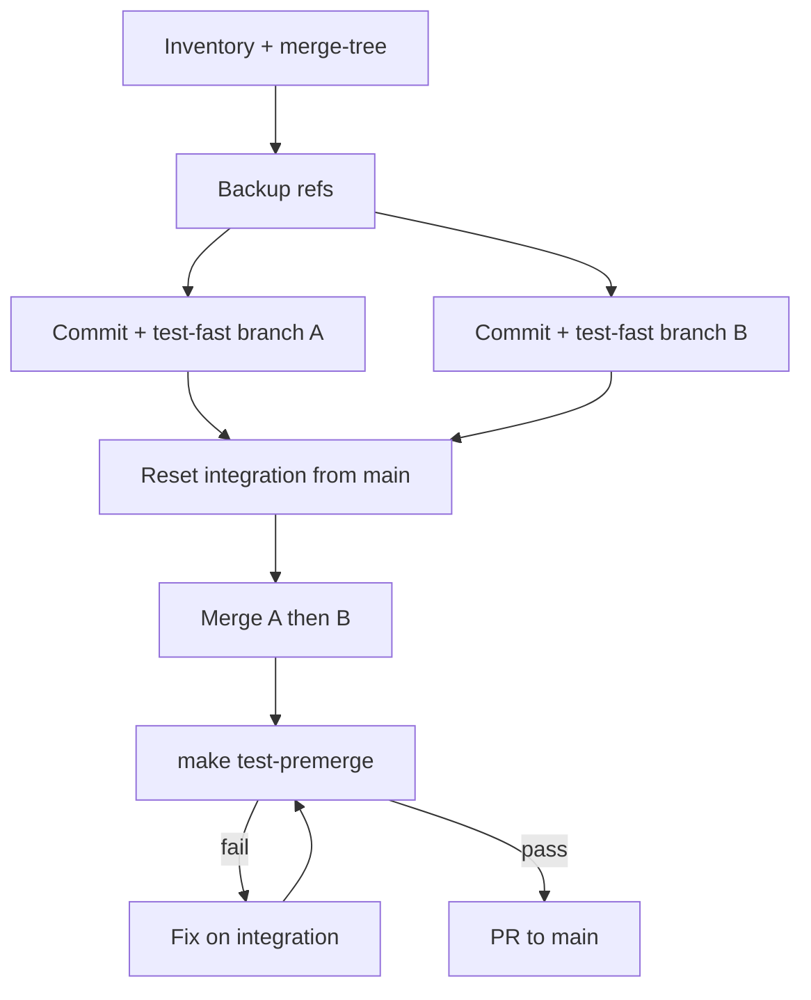

# Land parallel agent feature branches via integration branch and ordered merges

## Context

Three Cursor sessions left `feat/preflight-training-profiles` and `feat/planet-flow-policy` (worktree) ahead of `main`, each with uncommitted calibration/docs and five known overlapping code paths — but `git merge-tree` at post-commit SHAs reported additional conflict paths. A stale `merge-sim/planet-flow-preflight` branch existed from an earlier simulation. The goal was **CPU-complete** merge to `main` (green `make test-premerge`) before optional GPU learn-proof, without dropping either stream's intent (session history: merge orchestration sessions culminating in PR #173).

## Guidance

### 1. Inventory before touching branches

Record branch tips, dirty files per checkout (`git worktree list`), and authoritative conflict paths:

```bash
git merge-tree $(git merge-base feat/preflight-training-profiles feat/planet-flow-policy) \
  feat/preflight-training-profiles feat/planet-flow-policy | rg 'changed in both'
```

Do not rely on a static “five file” list — merge-tree output is the source of truth.

### 2. Backup refs before destructive steps

```bash
SHA=$(git stash create -u "pre-merge-backup")
if [ -n "$SHA" ]; then
  git update-ref "refs/backup/pre-merge-$(date +%s)" "$SHA"
fi
```

See also [git stash recovery after parallel cleanup](./git-stash-recovery-after-parallel-branch-cleanup.md) if work looks lost after reset.

### 3. Commit on each feature branch first (known SHAs)

- Stage all intended code on each branch; run `make test-fast` (or domain preflight targets) **before** recording SHAs for merge.
- Commit `docs/benchmarks/preflight-calibration.json` only when it matches that branch's `preflight-profiles.json`, or regenerate on the integration branch after merge.

### 4. Integration branch: hard-reset from `main`, then ordered merges

Reuse `merge-sim/planet-flow-preflight` (or a dedicated worktree) only after:

```bash
git fetch origin
git checkout merge-sim/planet-flow-preflight
git reset --hard origin/main   # or current main tip
```

Merge order:

1. `feat/preflight-training-profiles` (PPO profile source of truth)
2. `feat/planet-flow-policy` (Planet Flow proof paths)

**Conflict playbook:**

| Area | Resolution rule |
|------|-----------------|
| `docs/benchmarks/preflight-profiles.json` | Preflight branch wins |
| `docs/benchmarks/preflight-calibration.json` | Merge keys or `make preflight-calibrate` on integration after merge |
| `src/jax/preflight*.py`, `src/cli/benchmark/` | Keep profile wiring **and** planet-flow CLI subcommands (`planet_flow.py`, etc.) |
| `src/jax/rollout/metrics.py`, `src/jax/train/metrics.py` | Keep win-rate fixes; layer planet-flow metrics without reverting binary_win semantics |
| `AGENTS.md` | Merge both sides; dedupe manually |

### 5. Verify on integration only

```bash
make test-premerge
```

Fix failures on the integration branch — not by force-pushing partial fixes to `main`. Check the terminals folder before starting tests (parallel `test-daily` jobs contend on one GPU). With project hooks enabled, `beforeShellExecution` also blocks GPU-heavy shell when another agent terminal is active — see [`docs/solutions/developer-experience/cursor-before-shell-gpu-terminal-contention.md`](../developer-experience/cursor-before-shell-gpu-terminal-contention.md).

### 6. Land on `main`

Default: **one PR** from the green integration branch (PR #173 used this path). Optional two-PR split is for review size only — still requires a green integration sandbox first.

Post-merge code fixes discovered during integration (e.g. calibration profile wiring) are documented separately: [Planet Flow preflight calibration profile](../integration-issues/planet-flow-preflight-calibration-profile.md).

## Why This Matters

Merging both feature branches directly to `main` in parallel repeats conflict resolution twice and risks landing dirty trees or stale calibration JSON. An integration branch with hard-reset from current `main` gives a single conflict surface, a single `test-premerge` gate, and recoverable backup refs — which matches solo-agent parallel work where sessions do not share working memory.

**CPU-complete** (merged code + premerge green) is separable from **proof-complete** (GPU learn-proof / Planet Flow go/no-go). Orchestration should not block the merge on GPU proof unless the operator explicitly requires it.

## When to Apply

- Multiple agent-driven branches touch `preflight.py`, `preflight_calibration.py`, benchmark CLI, or shared metrics modules.
- A simulated merge branch exists but may lag feature tips — always hard-reset integration from `main` before re-merging.
- Brainstorm/plan docs are untracked on `main` — land them in docs-only follow-ups; they must not drive code conflict resolution.

## Examples

**Successful path (2026-06-02):**

```text
R4/R5: commit + test-fast on each feature branch
R7:    hard-reset merge-sim/planet-flow-preflight → main
R8:    merge preflight-training-profiles
R9:    merge planet-flow-policy (+ fix preflight_calibration export/profile on integration)
R10:   make test-premerge
R13:   PR merge-sim/planet-flow-preflight → main (#173)
```

**Operator reference diagram** (full playbook: this doc):



## Related

- Requirements source: this doc
- Post-merge integration fix: [planet-flow-preflight-calibration-profile.md](../integration-issues/planet-flow-preflight-calibration-profile.md)
- Planet Flow sweep/proof config: [planet-flow-sweep-gameable-objective.md](../logic-errors/planet-flow-sweep-gameable-objective.md)
- Stash recovery: [git-stash-recovery-after-parallel-branch-cleanup.md](./git-stash-recovery-after-parallel-branch-cleanup.md)
- Merged PR: [#173](https://github.com/jmduea/orbit_wars/pull/173)
