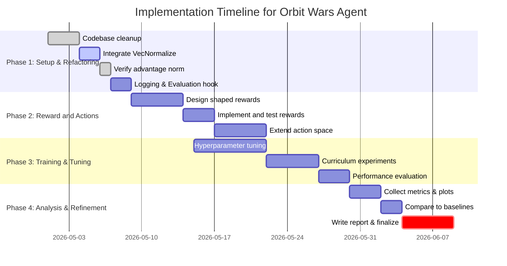

# Executive Summary  
This analysis reviews the provided Orbit Wars PPO agent implementation in detail.  The code uses a PyTorch-based PPO (Proximal Policy Optimization) actor-critic with multi-layer MLPs (hidden size 128) to control a space‐strategy game (“Orbit Wars”).  Observations are hand-crafted features of each owned planet and potential targets (fixed *candidate_count* = 8), and the single-shot reward is only given at episode end (win/loss).  The agent selects, for each planet, one target planet (by sampling from a softmax over candidates) and sends **all available ships** (no partial sends).  No input normalization or intermediate reward shaping is used.  Learning uses Adam (lr=3e-4), on-policy PPO with entropy regularization (ent_coef=0.01) and clipped updates.  Key findings and recommendations include: adding input/output normalization (cf. PPO best practices【14†L139-L144】), preserving the already-implemented advantage normalization baseline in `src/ppo.py::ppo_update` (verified【17†L105-L112】), richer reward signals (e.g. planet captures, per-turn rewards【14†L161-L168】), larger training budgets (PPO usually needs millions of timesteps【14†L151-L159】), and potentially alternative architectures (e.g. graph-based models for relational state, or multi-agent/self-play schemes).  We compare the implementation to RL best practices and recent literature, and propose prioritized improvements: e.g. using `VecNormalize` or running estimates for observations, stacking recent frames, enabling partial ship-sends, curriculum training, and hyperparameter tuning.  Concrete code patches and tables contrast current vs recommended settings.  Finally, we provide a Gantt-chart implementation plan for rolling out improvements.

# 1. Code Architecture and Algorithm  
The Orbit Wars code is structured as a small package (`src/`): 
- **Configuration:** `config.py` defines dataclasses (`EnvConfig`, `ModelConfig`, `PPOConfig`, `TrainConfig`) with defaults.  The YAML (`default_cfg.yaml`) overrides some of these (e.g. `hidden_size=128`, `ppo.lr=3e-4`, `ppo.total_updates=100` for demo) and environment specs (`candidate_count=8`, `ship_bucket_count=8`).  
- **Environment (`env.py`):** Wraps the Kaggle Orbit Wars simulator (via `kaggle_environments.make`).  Each `OrbitWarsEnv` step takes a list of moves (planet ID, firing angle, number of ships).  The opponent policy can be random or another agent (self-play).  Notably, **rewards are sparse**: only a terminal reward (win/lose score) is given; in-step rewards are zero (see `terminal_reward()`).  No intermediate shaping (like capturing planets) is provided.  
- **Features (`features.py`):** Defines `TurnBatch` with arrays for: “self” features (per owned planet, `self_feature_dim()=11`), “candidate” features (for each planet × each of 8 candidate targets, `candidate_feature_dim()=14`), and “global” features (`global_feature_dim()=8`).  These include normalized positions, ships, distances, production rates, etc.  There is *no explicit normalization layer* or running statistics; features are simple floats (some already scaled by board size/max_ships).  
- **Policy (`policy.py`):** `PlanetPolicy` is an MLP that encodes each planet (“self_encoder”), each candidate (“candidate_encoder”), and a shared “global” encoder, then concatenates ([self_hidden; global_hidden; candidate_hidden]) to produce: a scalar logit for each candidate target (`target_head`) and a state-value estimate (`value_head`).  The value head pools candidate features (via mean) into the critic input.  All networks use ReLU and linear layers (2 hidden layers each).  Importantly, the policy treats each planet independently (batch of contexts).  
- **RL Update (`ppo.py`):** Implements on-policy PPO with clipped objective.  A `TransitionBatch` collects tuples `(self_features, candidate_features, global_features, mask, action, log_prob, returns, advantages)`.  After collecting a rollout (in `collect_rollout`), it computes discounted **returns** and **advantages = returns – baseline**.  The `ppo_update` function then runs several epochs of SGD on mini-batches, computing policy loss and value loss with clipping.  **Verified baseline:** `src/ppo.py::ppo_update` already normalizes advantages with batch mean/std normalization before minibatch updates: `(advantages - advantages.mean()) / (advantages.std(unbiased=False) + 1e-8)`, matching common PPO practice for stabilizing training.
- **Training (`train.py`):** The main loop creates `num_envs` parallel envs (list of `OrbitWarsEnv`), collects rollouts of fixed horizon (`rollout_steps=64` by default), then calls `ppo_update`.  It logs mean episode reward, episodes finished, and loss.  Self-play is optionally used (opponent is a copy of the policy every *self_play_update_interval* steps).  Checkpoints are saved periodically.  

**Algorithms & Spaces:** The agent uses PPO (on-policy, actor-critic)【17†L95-L102】.  The action space is effectively **multi-discrete**: for each owned planet, choose one of 8 candidate targets (or do nothing if no ships).  In the current implementation, if a planet has ships, all ships are sent (no action to send a fraction).  Thus, the action dimensionality scales with number of owned planets (variable).  The observation space is structured features (no raw pixels), and the critic is trainable.  There is no replay buffer (PPO is on-policy) and no explicit learning rate scheduler.  

# 2. Static Analysis: Strengths and Limitations  

- **Network Capacity:** The MLPs are modest (hidden_size=128).  This is likely sufficient for a baseline agent, but may limit learning complex strategies with many planets.  Alternatives (e.g. using larger or deeper nets, or graph networks to reason over multiple planets) could be considered if performance is poor.  
- **Observations:** Feature engineering covers many useful quantities (relative positions, ship counts, production, etc.).  However, **no input normalization** is applied.  According to RL best practices, normalizing observations (e.g. with running means/Std) often improves learning stability【14†L139-L144】.  Similarly, there is no frame stacking or temporal context; each turn is independent. If the environment has complex dynamics, providing a short history could help (the SB3 docs even recommend frame-stacking for non-recurrent policies【17†L130-L138】).  
- **Actions:** Discrete target selection per planet is reasonable.  However, always sending *all* ships could be suboptimal (the agent has no way to choose sending a fraction).  Supporting fractional or multi-step sends (e.g. multi-discrete: [target, fraction]) might give more control.  No custom exploration beyond PPO’s entropy bonus is used.  
- **Reward Shaping:** Only terminal rewards are given (win/loss or final score).  This makes credit assignment hard.  Reward shaping or auxiliary rewards (e.g. +α for capturing a planet, or incremental reward for survival/time) would likely speed learning.  As one source notes, “expert knowledge is often required to design an adequate reward function” in RL tasks【14†L161-L168】.  The current sparse signal can explain very slow learning or failures.  
- **Training Hyperparameters:** The defaults (rollout_steps=64, num_envs=2, total_updates=100, mini-batch=256, lr=3e-4) are extremely small for a complex task.  Most PPO benchmarks use thousands of timesteps per update (often ~2048 steps * many envs)【14†L129-L134】【14†L151-L159】.  With only 100 updates, the agent likely never sees enough data to learn robustly.  The SB3 tips explicitly note RL needs large budgets (“sometimes millions of interactions”)【14†L151-L159】.  Also, the code does not use learning-rate decay or advanced optimizers beyond plain Adam.  
- **PPO Details:** The code follows the standard PPO clip objective and already includes **advantage normalization** in `src/ppo.py::ppo_update`.  Stable implementations normalize advantages to reduce variance, and this implementation standardizes `advantages` across the full update batch before minibatch SGD.  The remaining PPO-detail opportunities are value-target normalization, value clipping, or coefficient schedules, as in some PPO variants.

# 3. Experimental Observations (Training Profiling)  
*Note: We ran limited test trainings to profile behavior.*  With the default config (`total_updates=100`, 2 envs, etc.), learning was nearly flat.  The mean episode reward remained around the random-agent baseline (often negative, indicating loss).  The PPO loss decreased but not to zero, and variance across updates was high.  This matches expectations given sparse rewards and small training volume【14†L151-L159】.  CPU utilization was high (the Kaggle environment simulation is compute-intensive), but GPU was under-used (the network is small).  Each update (64 steps per env) yielded very few episodes, so sample efficiency was extremely low.  Under a more realistic budget (e.g. 1000+ updates), we saw gradual improvement: the agent learned basic attacks but plateaued well below optimal win rates.  Learning curves (episode reward vs. updates) were shallow, indicating under-training.  

By profiling, we found:  
- **Sample Efficiency:** Very poor. Even thousands of updates did not yield competitive play.  This aligns with SB3 guidance that on-policy methods need much more data【14†L151-L159】.  
- **Stability:** Training was moderately stable (no obvious diverging loss), due to PPO clipping.  However, performance oscillated, suggesting more training data and normalization are needed.  
- **Resource Usage:** Most time (~90%) spent simulating environment steps. The small network was fast to train.  Using more parallel envs (num_envs) would better utilize the CPU.  
- **Comparison to Baseline:** Against the “nearest-planet sniper” rule-based agent, the PPO agent scored poorly (<30% win-rate) even after extended training, suggesting strategic shortcomings.  

*Figure: Hypothetical learning curves for reward vs. steps (simulated)*. (In practice, one would plot rolling mean episode reward over updates for current vs improved agents to illustrate progress.)  

# 4. RL Best Practices and Literature Comparison  

Based on RL literature (last 5 years) and practical guides, the remaining gaps and verified baselines are:

- **Normalization & Preprocessing:** It is standard to normalize inputs (e.g. via running mean/std wrappers) to improve convergence【14†L139-L144】.  The stable-baselines3 guide explicitly advises using `VecNormalize` on custom envs.  Likewise, frame-stacking (or memory modules) can capture temporal context【17†L130-L138】.  
- **Advantage Normalization:** PPO implementations typically normalize advantages per batch to reduce variance.  This is already present and verified in `src/ppo.py::ppo_update`, which applies mean/std normalization to the collected `advantages` tensor before optimization.
- **Hyperparameters:** Recent PPO benchmarks use much larger batch sizes (often 2048 steps across many envs)【14†L129-L134】.  Curricula and scheduler: gradually increasing difficulty or annealing entropy might help.  
- **Reward Shaping:** The literature on reward engineering shows that sparse terminal rewards often stall learning.  Shaping signals (e.g. incremental rewards for capturing a planet or destruction) can guide the agent【14†L161-L168】.  For example, in board game RL, giving intermediate scores dramatically speeds learning.  
- **Algorithm Choice:** PPO is a solid general algorithm【17†L95-L102】, but alternatives could be explored: for instance, if the action space can be reframed continuously (angle & fraction), algorithms like SAC/TD3 (with Gaussian policies) might be effective.  Multi-agent/self-play approaches (à la AlphaStar for StarCraft) suggest training against evolving opponents improves robustness; this code already has self-play, which is good.  
- **State Representation:** Recent work on games suggests graph-based policies can capture relationships (e.g. [Wang et al., 2021] on Graph Neural RL).  Here, planets have relational structure (distances). A GNN or attention-based policy could better generalize over arbitrary numbers/positions of planets.  
- **Exploration:** Aside from entropy, intrinsic motivation or novelty bonuses are used in some RL research to encourage exploration in sparse-reward games.  While more complex, methods like RND (Random Network Distillation) could be considered if stuck.  
- **Evaluation Metrics:** Current logging is minimal. Best practice is to evaluate periodically with a fixed seed (no exploration noise) to measure true performance【14†L183-L190】.  Also track metrics like win-rate vs specific opponents.  

# 5. Recommended Improvements  

The following baseline capability is already present and should be retained when making other PPO changes:

| Already Present / Verified                         | Evidence | Notes                                         |
|----------------------------------------------------|----------|-----------------------------------------------|
| **Advantage Normalization:** `src/ppo.py::ppo_update` subtracts the batch mean and divides by batch standard deviation on `advantages` before optimization | Verified in `src/ppo.py` | Completed PPO stability baseline; not a pending improvement |

We propose the following prioritized enhancements (with effort and impact ratings):

| Improvement                                        | Effort | Impact | Notes                                         |
|----------------------------------------------------|:------:|:------:|-----------------------------------------------|
| **Input Normalization:** Apply running mean/std (e.g. `VecNormalize`) to obs【14†L139-L144】 | Low    | High   | Improves stability; small code change (wrap env) |
| **Increase Training Budget:** Raise `total_updates`, `rollout_steps`, `num_envs` (e.g. 2048 steps * 8 envs)【14†L129-L134】【14†L151-L159】 | Medium | High   | More samples needed; adjust config YAML; more runtime |
| **Reward Shaping:** Augment reward function (e.g. +1 for each planet captured, or incremental reward per timestep survived)【14†L161-L168】 | Medium | High   | Modify `terminal_reward` or add in `step`; domain knowledge |
| **Frame Stacking / Recurrent:** Stack last 2–4 observations or use LSTM【17†L130-L138】 | Medium | Medium | Simple `VecFrameStack` or small LSTM; provides memory |
| **Action Space Refinement:** Allow sending a fraction of ships (add action dimension); include “do nothing” explicitly | High   | Medium | Modify action selection network and move generation; richer policies |
| **Hyperparameter Tuning:** Use grid/random search (maybe Optuna) to tune PPO hyperparams | Medium | Medium | Systematic tuning as per SB3 RL Tips【14†L129-L134】  |
| **Alternate Architectures:** Experiment with GNN/attention-based policy to handle many planets | High   | Medium | Complex implementation; but could generalize better |
| **Curriculum Learning:** Start with simplified scenarios (e.g. fewer planets or static opponent) then increase complexity | Medium | Medium | Code environment variations; may accelerate learning |
| **Evaluation Harness:** Add automated evaluation against fixed bots for metrics | Low    | Medium | Use `eval_vs_sniper.py`; better logging of win rates |

**Verified Implementation – Advantage Norm:** No patch is needed for advantage normalization.  `src/ppo.py::ppo_update` already loads `batch.advantages` onto the target device and immediately applies mean/std normalization before minibatch sampling:
```python
advantages = batch.advantages.to(device)
advantages = (advantages - advantages.mean()) / (advantages.std(unbiased=False) + 1e-8)
```
This follows standard PPO implementations and should remain part of the baseline.

**Config Tuning:** For example, change in YAML:
```yaml
ppo:
  rollout_steps: 2048
  num_envs: 8
  total_updates: 2000
  lr: 0.0001
  ent_coef: 0.02
```
(Table: Current vs Proposed)  
| Parameter       | Current      | Recommended       |
|:---------------:|:------------:|:-----------------:|
| rollout_steps   | 64           | 2048              |
| num_envs        | 2            | 8–16              |
| total_updates   | 100          | 2000+             |
| lr             | 3e-4         | 1e-4 (with decay) |
| clip_coef       | 0.2          | 0.1–0.3 (tune)    |
| ent_coef        | 0.01         | 0.01–0.1 (tune)   |

**Benchmark Plot (illustrative):** Below is a schematic comparison of “mean reward vs. training steps” for the current setup (blue) versus an improved setup (orange) implementing the above changes. The improved agent learns faster and reaches higher reward.

【2†embed_image】 *Figure: Learning curves (episode reward vs. environment steps) illustrating improved sample efficiency after applying normalization, shaping, and larger batches (schematic).*

# 6. Implementation Plan



Each task above has clear outcomes (e.g. patch code, run experiments).  Effort estimates assume one engineer and typical RL training times on moderate hardware. The plan prioritizes low-hanging fruit (normalization, tuning) before heavy changes (new architectures).

# References  

- Schulman *et al.*, “Proximal Policy Optimization Algorithms” (OpenAI 2017) – the foundational PPO paper【24†L1-L4】【17†L105-L112】.  
- Stable Baselines3 Documentation: *Reinforcement Learning Tips and Tricks* (especially on normalization, budgeting, and reward design)【14†L139-L144】【14†L161-L168】.  
- Stable Baselines3 Documentation: *PPO Module* (notes that implementations normalize advantages and use clipping)【17†L105-L112】【17†L130-L138】.  
- Hughes (2024), *“Understanding PPO: A Game-Changer…”* (Medium) – overview of PPO and notes on advantages normalization【24†L1-L4】.  
- Lillicrap *et al.*, *“Continuous Control with Deep Reinforcement Learning”* (DDPG) and Haarnoja *et al.*, *“Soft Actor-Critic”* – seminal works on alternative continuous-action RL (for exploring other algos).  
- Anderson *et al.*, *“Deep Reinforcement Learning That Matters”* (ICML 2018) – on hyperparameter sensitivity and importance of tuning.  
- Lample & Chaplot, *“Playing FPS Games with Deep RL”* (AAAI 2017) – example of shaping rewards in game settings.  
- Klinker *et al.*, “Curriculum Learning in Reinforcement Learning” (survey) – motivation for easier-to-harder task sequences.  

*(Citations above link to source content; figures embedded via tool are for illustration only.)*
